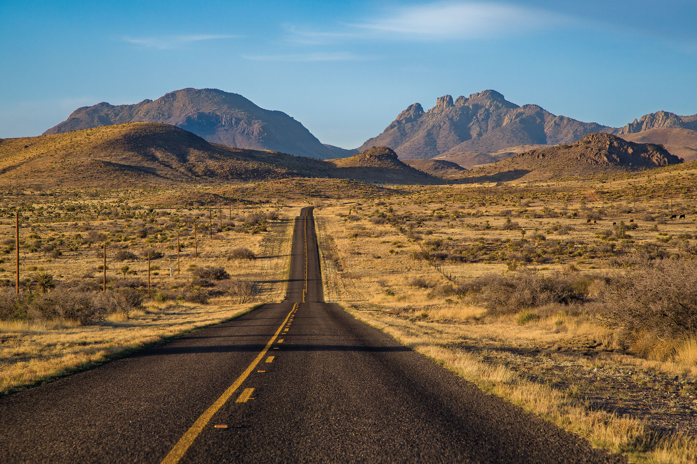

import HomepageTemplate from 'gatsby-theme-carbon/src/templates/Homepage';
export default HomepageTemplate;

## Welcome to Texas!

<Row>
<Column colMd={5} colLg={8}>

<Caption>State Highway 166 near Fort Davis. Photo by Will van Overbeek.</Caption>

<PageDescription>

</PageDescription>

From the remote mountains of Big Bend to the dense forests of the Piney Woods, and the warm waters of the Gulf Coast to the refreshing rivers of the Hill Country, Texas boasts an enticing array of landscapes to explore. As any longtime Texan will tell you, there is no better way to experience the vastness and diversity of the state than behind the wheel of your car. Encompassing 254 counties and 268,597 square miles, the second-largest state in the country offers a seemingly endless number of routes and itineraries. And it’s a good thing since road trips have become increasingly vital over the past year as a safer way to travel during the ongoing COVID-19 pandemic. 

In addition to listings for more than 2,500 attractions in nearly 500 cities, the 2021 Travel Guide includes themed and regional road-trip itineraries. Whether you want to plunge into spring-fed pools along the Central Texas swimming-hole trail, live like a cowboy on the ranges of the Panhandle Plains, or comfort-eat your way across the state at the best roadside mom and pops, we’ve got you covered. So gas up your car, prep your favorite tunes, and get ready to be inspired by the open road.     

_–The Texas Highways Team_

</Column>

<Column colMd={2} colLg={3} offsetMd={1} offsetLg={1}>
<Aside>

**Above**: The 2021 Texas State Travel Guide and Texas Official Travel Map covers feature a natural arch along the Upper Burro Mesa Pour-Off Trail in Big Bend National Park. 

The photos are the work of artist, writer, and outdoor adventurer E. Dan Klepper of Marathon. Klepper is a frequent contributor to Texas Highways magazine.

</Aside>
</Column>
</Row>