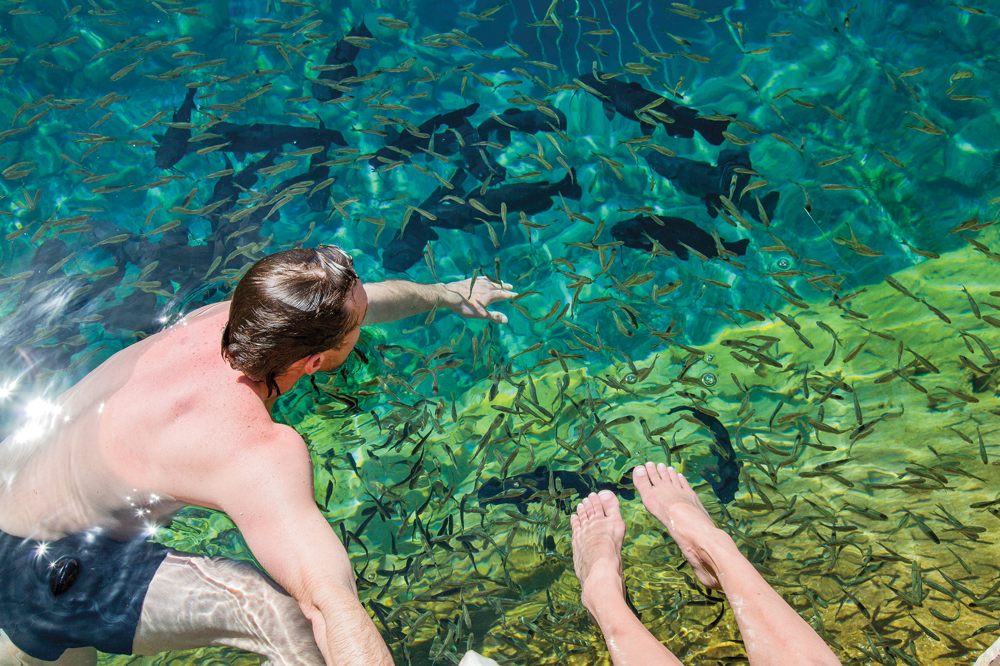

import HomepageTemplate from 'gatsby-theme-carbon/src/templates/Homepage';
export default HomepageTemplate;

## Welcome to Texas!

<Row>
<Column colMd={5} colLg={8}>

<Caption>Balmorhea State Park. Photo by Will van Overbeek.</Caption>

<PageDescription>

</PageDescription>

From the remote mountains of Big Bend to the dense forests of the Piney Woods, and the warm waters of the Gulf Coast to the refreshing rivers of the Hill Country, Texas boasts an enticing array of landscapes to explore. As any longtime Texan will tell you, there is no better way to experience the vastness and diversity of the state than behind the wheel of your car. Encompassing 254 counties and 268,597 square miles, the second-largest state in the country offers a seemingly endless number of routes and itineraries. Whether you want to explore the region’s rich history, experience its diverse cultural offerings, or dine at nationally acclaimed restaurants, the Lone Star State rewards every kind of traveler.  
 
In addition to listings for more than 2,400 attractions in nearly 500 cities, the 2022 Travel Guide includes themed and regional road-trip itineraries. Opportunities for adventure abound: plunge into spring-fed pools along the Central Texas swimming-hole trail, live like a cowboy on the ranges of the Panhandle Plains, or comfort-eat your way across the state at the best roadside mom and pops. So gas up your car, prep your favorite tunes, and get ready to be inspired by the open road.  

_–The Texas Highways Team_

</Column>

<Column colMd={2} colLg={3} offsetMd={1} offsetLg={1}>
<Aside>

**Above**: The 2022 Texas State Travel Guide and Texas Official Travel Map covers feature a stand-up paddleboarder traversing the Resaca de los Cuates in [Los Fresnos](http://losfresnoschamber.com).  

The photos are the work of Austin-based photographer Erich Schlegel. Schlegel is a frequent contributor to Texas Highways magazine, and his article on resacas can be found at [texashighways.com](https://texashighways.com/travel/the-lakes-less-paddled).

</Aside>
</Column>
</Row>