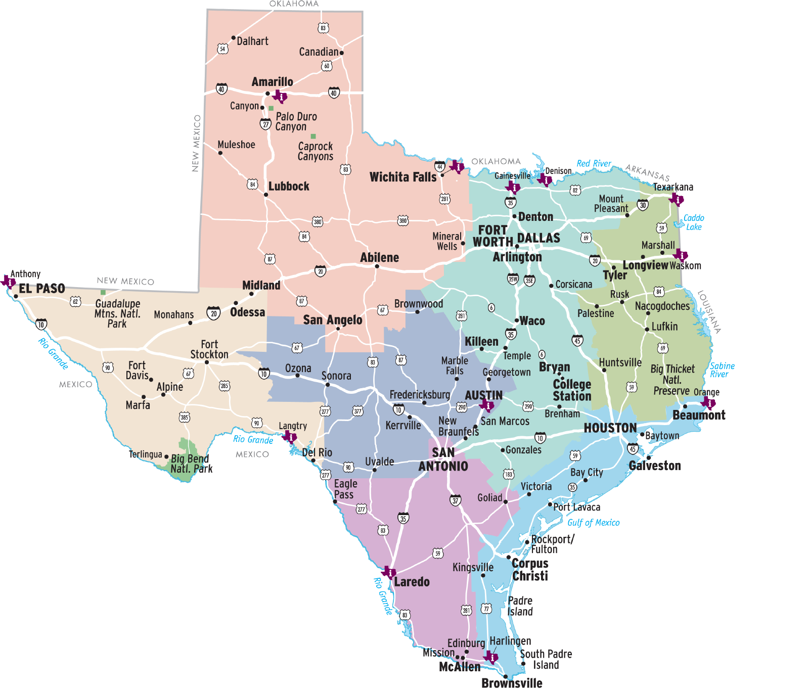

export const Title = () => (
  
    Texas:  A Quick Tour
  
);

<PageDescription>

Visit these outdoor destinations to enjoy the grand diversity of the state’s landscapes and habitats.

</PageDescription>

####

<AdGroup id={['ad32']}/>

####

<Row>
<Column colSm={6} colMd={8} colLg={12}>

    

</Column>
</Row>

<Row>

<Column colSm={6} colMd={4} colLg={6}>

<Accordion>
<AccordionItem title="Travel Information Centers">

The Texas Department of Transportation operates 12 travel information centers for the convenience of the traveling public. See [Travel Information](/travel-information/).

| City               | Location               | Phone Number |
|--------------------|------------------------|--------------|
| Amarillo           | I-40                   | 806-335-1441 |
| Anthony            | I-10                   | 915-886-3468 |
| Austin             | Capitol Visitor Center | 512-463-8586 |
| Denison            | US 69/75               | 903-463-2860 |
| Gainesville        | I-35                   | 940-665-2301 |
| Langtry            | US 90/Loop 25          | 432-291-3340 |
| Laredo             | I-35 at US 83          | 956-417-4728 |
| Orange             | I-10                   | 409-883-9416 |
| Texarkana          | I-30                   | 903-794-2114 |
| Valley (Harlingen) | US 77 at US 83         | 956-428-4477 |
| Waskom             | I-20                   | 903-687-2547 |
| Wichita Falls      | I-44/US 287, Exit 1C   | 940-723-7931 |

</AccordionItem>

</Accordion>

</Column>

<Column colSm={6} colMd={4} colLg={6}>

<Accordion>

<AccordionItem title="Traveling Across Texas">
  These examples of mileage across the state will help determine distances:

| Cities                            | Distance  |
|-----------------------------------|-----------|
| El Paso to Orange                 | 834 miles |
| Amarillo to Brownsville           | 765 miles |
| San Antonio to South Padre Island | 286 miles |
| Fort Worth to San Antonio         | 262 miles |
| Dallas to Houston                 | 238 miles |
| El Paso to Big Bend               | 329 miles |
| Houston to San Antonio            | 197 miles |
| Dallas to Texarkana               | 178 miles |
| Amarillo to Lubbock               | 119 miles |
| Austin to San Antonio             | 79 miles  |
| Dallas to Fort Worth              | 30 miles  |

</AccordionItem>

</Accordion>

</Column>

</Row>

<Row>

<Column colSm={6} colMd={4} colLg={8}>
    <Listing>
        <ListingHed color="purple" title="South Texas Plains"/>
        <ListingItem 
            title="Mission Trail"
            city="San Antonio">
            The Alamo and San Antonio Missions National Historical Park, a UNESCO World Heritage Site, are linked via about 10 miles of hike-and-bike trail along the San Antonio River. 
        </ListingItem>
        <ListingItem 
            title="Peaceful Oasis"
            city="McAllen">
            Quinta Mazatlan is one of nine World Birding Center locations in the Rio Grande Valley. Revel in the trilling of birds and follow the Forest Sculpture Trail to learn more about the animals of South Texas. 
        </ListingItem>
        <ListingItem 
            title="State Saga"
            city="GOLIAD">
            Explore the grounds and museum of Presidio La Bahia, a Spanish military compound that appears as it did in 1836 during the Texas Revolution.
        </ListingItem>
        <ListingItem 
            title="Structure Story"
            city="Roma">
            With many 19th-century buildings, the Roma Historic District, a national historic landmark, preserves architecture that reflects building techniques of the Lower Rio Grande. 
        </ListingItem>
    </Listing>
    <Listing>
        <ListingHed color="lightblue" title="Gulf Coast"/>
        <ListingItem 
            title="Sand and Surf"
            city="Corpus Christi">
            The 70 miles of undeveloped beach and habitat at Padre Island National Seashore provide spacious opportunities for camping, fishing, beachcombing, canoeing and kayaking, birding, and windsurfing. 
        </ListingItem>
        <ListingItem 
            title="Rare Bird"
            city="ROCKPORT-FULTON">
            Whooping cranes winter at the Aransas National Wildlife Refuge. The best viewing times are generally from December through February.
        </ListingItem>
        <ListingItem 
            title="Peaceful Place"
            city="Houston">
            Find tranquility by strolling through Hermann Park’s Japanese Garden with its teahouse and winding paths.    
        </ListingItem>
        <ListingItem 
            title="Sprawling Spread"
            city="KINGSVILLE">
            Captain Richard King’s legacy of ranching and conservation lives on at the state’s largest ranch, King Ranch, which offers daily ranch and nature tours.
        </ListingItem>
    </Listing>

</Column>

<Column colSm={6} colMd={4} colLg={4}>
    <AdGroup id={['ad09','ad37','ad90']}/>
</Column>

</Row>

<Row>
<Column colSm={6} colMd={4} colLg={8}>
    <Listing>
        <ListingHed color="green" title="Piney Woods"/>
        <ListingItem 
            title="SPLASH OF NATURE"
            city="KARNACK">
            Paddling can be one of the best ways to explore the bayous, sloughs, and ponds of Caddo Lake with its distinctive bald cypress trees draped in Spanish moss.  
        </ListingItem>
        <ListingItem 
            title="SIGNIFICANT SANCTUARY"
            city="KOUNTZE">
            Big Thicket National Preserve is treasured for its biodiversity and preservation of habitat that once covered more than 2 million acres.
        </ListingItem>
        <ListingItem 
            title="TEXAS HERO"
            city="HUNTSVILLE">
            A 67-foot-tall concrete and steel statue of Sam Houston, the first and third president of the Republic of Texas, presents a commanding presence along Interstate 45.
        </ListingItem>
        <ListingItem 
            title="FOREST FEATURE"
            city="CLEVELAND">
            The 129-mile primitive Lone Star Hiking Trail roams through the Sam Houston National Forest. Spring and fall are the best times to visit.
        </ListingItem>
    </Listing>
    <Listing>
        <ListingHed color="teal" title="PRAIRIES AND LAKES"/>
        <ListingItem 
            title="LOVELY LANDSCAPE"
            city="Dallas">
            The Dallas Arboretum and Botanical Garden has 66 acres of spectacular and colorful display gardens, along with amazing displays during its seasonal festivals.
            </ListingItem>
        <ListingItem 
            title="DINOSAUR DOMAIN"
            city="Glen Rose">
            Long ago, dinosaurs left their footprints in the bed of the Paluxy River at Dinosaur Valley State Park, a National Natural Landmark.
        </ListingItem>
        <ListingItem 
            title="Texas&rsquo; Birthplace"
            city="WASHINGTON">
            Sightsee and bird at Washington-on-the-Brazos State Historic Site, where history was made in 1936 when the Texas Declaration of Independence was signed there.
        </ListingItem>
        <ListingItem 
            title="COWTOWN HISTORY"
            city="Fort Worth">
            The former cattle shipping point known as the Fort Worth Stockyards National Historic District is home to historic buildings, restaurants, shops, and saloons.
        </ListingItem>
    </Listing>
</Column>

<Column colSm={6} colMd={4} colLg={4}>
    <AdGroup id={['ad04','ad23','ad33','ad36','ad61','ad74','ad78','ad79','ad81','ad92','ad34']}/>
</Column>

</Row>

<Row>
<Column colSm={6} colMd={4} colLg={8}>
    <AdGroup id={['ad35','ad93']}/>
</Column>
</Row>

<Row>
<Column colSm={6} colMd={4} colLg={8}>
    <Listing>
        <ListingHed color="blue" title="Hill Country"/>
        <ListingItem 
            title="WILD ABOUT FLOWERS"
            city="AUSTIN">
            The 284-acre Lady Bird Johnson Wildflower Center’s mix of cultivated gardens, arboretum, managed natural areas, and wildlands serves to conserve native plants.
        </ListingItem>
        <ListingItem 
            title="GOING BATTY"
            city="ROCKSPRINGS">
            From late spring to fall, one of the state’s largest colonies of Mexican free-tailed bats make their home at Devil’s Sinkhole State Natural Area, a National Natural Landmark.
        </ListingItem>
        <ListingItem 
            title="PRESERVED FORT"
            city="MENARD">
            Restored structures and ruins at Fort McKavett State Historic Site help convey stories of infantrymen, Buffalo Soldiers, women, and children who lived in early West Texas.
        </ListingItem>
        <ListingItem 
            title="Mystical Mound"
            city="FREDERICKSBURG">
            Driving along Ranch-to-Market Road 965, it’s hard to miss the giant granite dome rising from the ground at Enchanted Rock State Natural Area that makes you want to stop and climb it.
        </ListingItem>
    </Listing>
        <Listing>
        <ListingHed color="orange" title="Big Bend Country"/>
        <ListingItem 
            title="NEW HEIGHTS"
            city="PINE SPRINGS">
            Guadalupe Mountains National Park is home to four of Texas’ highest peaks (with an opportunity to climb to the state’s highest point), along with canyons, desert, spectacular night skies, and the world’s most extensive Permian fossil reef.
        </ListingItem>
        <ListingItem 
            title="Dark Skies"
            city="BIG BEND NATIONAL PARK">
            With more than 800,000 acres, the park is well known for hiking, rafting, and nature viewing, but its designation as an International Dark Sky Park also makes it one of the state’s best places to see the Milky Way.
        </ListingItem>
        <ListingItem 
            title="Scenic Sights"
            city="FORT DAVIS">
            A 75-mile route through the Davis Mountains provides two uninterupted hours of majestic scenery and wildlife if you can resist the temptation to stop at Fort Davis National Historic Site, Davis Mountains State Park, and the McDonald Observatory.     
        </ListingItem>
        <ListingItem 
            title="STONE STORIES"
            city="LANGTRY">
            Pictographs at various locations within Seminole Canyon State Park near Comstock present clues to the lives of early canyon dwellers.
        </ListingItem>
    </Listing>
</Column>

<Column colSm={12} colMd={4} colLg={4}>

</Column>
</Row>

<Row>
<Column colSm={6} colMd={4} colLg={8}>
    <Listing>
        <ListingHed color="red" title="Panhandle Plains"/>
        <ListingItem 
            title="MOTHER ROAD"
            city="INTERSTATE 40">
        Follow remnants of Route 66 from the U-Drop Inn in Shamrock to Cadillac Ranch in Amarillo and west to Adrian for a stop at the route’s midway point—1,139 miles to Los Angeles and Chicago.
        </ListingItem>
        <ListingItem 
            title="SCENIC WONDER"
            city="CANYON">
            The nation’s second-largest canyon, Palo Duro Canyon, is marked by colorful geologic layers. In spots, the layers have eroded, forming hoodoos, of which one of the most well known is the Lighthouse formation in Palo Duro Canyon State Park. 
        </ListingItem>
        <ListingItem 
            title="STORYBOOK CAPITAL"
            city="Abilene">
            The city is home to what may be the nation’s largest collection of storybook sculptures, including Seuss characters in Everman Park and other popular children’s book characters located around downtown.        </ListingItem>
        <ListingItem 
            title="BLOOMING MASTERPIECE"
            city="Mineral Wells">
            Max and Billie Clark’s private garden became Clark Gardens Botanical Park, which showcases native Texas and Texas-adaptable plants.
        </ListingItem>
    </Listing>

</Column>
</Row>