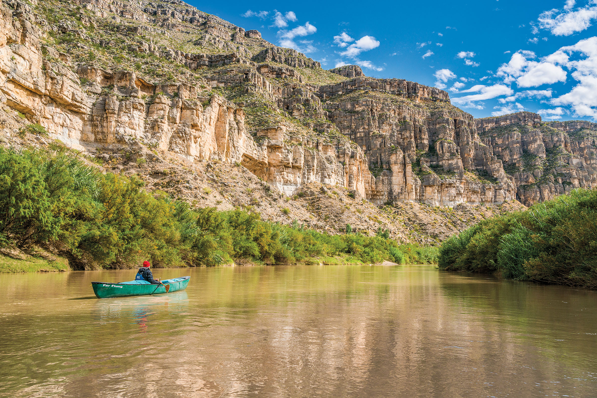
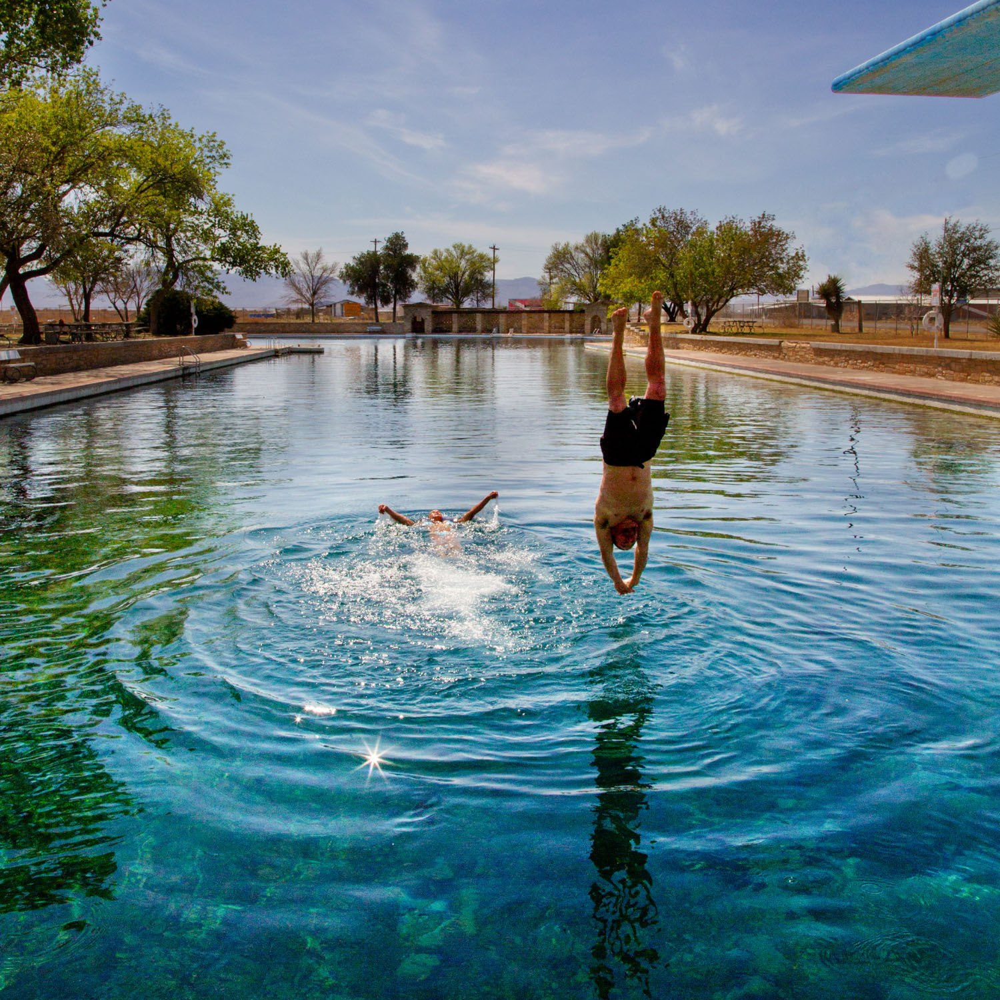

export const Title = () => (
  
    
    Big Bend Country
  
);

<PageDescription>

Adventure, scenic hikes, and wide-open spaces beckon visitors to landscapes little changed since the days of the Wild West

</PageDescription>

<Caption>The Rio Grande. Photo by Laurence P  arent.</Caption>

<Row>

<Column colSm={12} colMd={4} colLg={8}>

## **The Lower Canyons**
### Exploring the most secluded reaches of the mighty Rio Grande
**By Matt Joyce**

The bovine skull came into view as we rounded a bend on the Rio Grande, setting a scene like the desert backdrop of a Wile E. Coyote cartoon. With its muzzle down, horns up, and carcass stretched as flat as a carpet, the cow had apparently come to the dirt bank and lay down for its final rest. Only the effects of time and weather had disturbed it since.

Drifting past the desolate sight, I marveled at the glory and isolation of exploring one of Texas’ wildest places—the Lower Canyons of the Rio Grande. I was joined by photographer Laurence Parent and a party of nine others for an 83-mile paddling trip along the Texas-Mexico border. For seven days in November, we followed the river’s verdant strip through a chain of dramatic canyons bisecting the rocky slopes and arid flats of the Chihuahuan Desert. We didn’t see another soul for the entire trip, unless you count the bighorn sheep, canyon wrens, and peregrine falcons.

“This is a good trip for people who want a true wilderness experience,” said Greg Henington, who co-owns Far Flung Outdoor Center in Terlingua with his wife, Valynda Henington. “It’s remote, wild, and vast. A lot of people don’t even realize this is down here in the Lower 48. But this is not a trip for first-timers. You can get in trouble in a hurry.”

Only about 400 people run the Lower Canyons each year, according to Big Bend National Park. Although the Lower Canyons are downstream from the park boundary, the National Park Service requires backcountry permits for the trip because Congress has deemed this stretch of the Rio Grande a “Wild and Scenic River.” The 1978 designation calls for the park to work with local entities and landowners to protect the river environment for recreation.

It’s hard to imagine development springing up along this distant stretch of the Rio Grande, which runs northeast from the southern dip of the Big Bend. We saw few signs of humanity across the meandering miles—a shuttered Mexican fluorspar processing plant, a couple of rickety fishing cabins, ancient mortar holes in the bedrock, a ranch house, ranging cattle, and a shack perched on a cliff-side ledge with a pipe hanging down like a straw. Turns out the shack was once a pump house, built 80 years ago to suck river water hundreds of vertical feet to a makeshift factory that extracted wax from candelilla plants.

For a sense of the Lower Canyons’ isolation, consider that nobody surveyed this part of the Rio Grande until 1899—30 years after John Wesley Powell made his pioneering trip through the Grand Canyon of the Colorado River. A geologist named Robert T. Hill led the 1899 expedition. His detailed account, published in _The Century Magazine_, captures the highs and lows of a monthlong Rio Grande expedition from Presidio to Langtry. Traveling in three heavy wooden boats, the six-man party weathered the extremes of desert climate, unpredictable rapids, and exhaustion. But Hill emerged a convert, and he later was a vocal advocate of the establishment of Big Bend National Park.

The Far Flung guides were responsible for cooking—hearty dishes like New York strip steaks, chocolate cake, French toast, and Starbucks coffee—while I had the freedom of evening downtime to hike the surrounding canyons. At Silber Canyon, I soaked in hot springs of clear warm water that poured forth from a jumble of boulders before flowing into the muddy river. At Burro Bluff, I hiked to the top of a 900-foot limestone face, then toyed with vertigo on the ledge, eyeing the sliver of river far below. At San Francisco Creek, I followed a dry, rocky tributary far enough inland that I could no longer hear the flow of the Rio Grande. It was the purest silence I’ve ever experienced. In the shifting breeze, I imagined wind whistling across cactus spines and the snooze of a napping mountain lion.

On these hikes, I’d watch the sun wane as Parent clicked photo after photo, always hungry for that perfect shot. Raised in the Desert Southwest, Parent has hiked the Big Bend region more than anyone else I’ve met. But he knew moments like these were rare. “This is the third time I’ve been here,” he reasoned, “and every time, I think I’ll never be back.”

Hill commented that the solemnity and beauty of the landscape is almost overwhelming. 

“One is constantly surprised by new types of sculpture and scenery,” Hill said. “The sculpture is marked by queer, eccentric pinnacles projecting above the ragged skyline—spires, fingers, needles, natural bridges, and every conceivable form of peaked and curved rocks.”

Hill’s surprises are real. From my riverine perspective, I felt like I was floating through a gallery of grandiose landscape paintings, though not even Thomas Cole could mimic these vistas. Around each bend, beautiful new horizons unfolded. At the famed Bullis Fold, the river bisected an anticline, where rock striations lifted like falcon wings from either bank. At another point, the evening sun highlighted Cerro El Sombrero, a solitary butte that rose like a hat crown over an empty expanse known as Outlaw Flats.

Then there was the mesmerizing spectacle of whitewater crashing over boulders. We were always on alert for the roar of rapids, a sound both seductive and menacing. Our trip navigated 13 rapids, some mild like tube chutes and others akin to riding a bull. I paddled several of them in the canoe, capsizing in the chilly water only twice.

I was free to enjoy the scenery in large part because our trip was supported by three hardworking guides. The members of our party took turns paddling the solo canoe, while Henington and the guides rowed four rafts packed with passengers, tents, sleeping pads, tables, folding chairs, a toilet, ice chests, food, water, and kitchen gear. Along with Henington, the guides handled the logistics of our caravan: They picked campsites and loaded and unloaded the rafts or canoes.

It’s interesting how wilderness can alter your perspective. Near the end  of his journey 121 years ago, Hill was, understandably, ready to get back to civilization. “We no longer appreciated the noble surroundings,” he wrote. “We longed only to escape from the walls, upon which we now began to look as a prison.”

But for me, on a trip one-quarter the duration, the opposite was true. I remember breaking camp the fourth evening on a grassy bank near Palmas Canyon. After a couple of tough days of rain and near-freezing temperatures, the sky began to clear, and I set my gear out to dry in the desert air. In every direction, limestone bluffs hemmed the horizon, framing an open sky that darkened from marbled dusk to a sparkling Milky Way. In my daily life in Austin, walls stack up around me in a series of confinements—fences, high-rises, cubicles. But out on the Rio Grande, the walls of the Lower Canyons echo with liberation.

</Column>

<Column colSm={6} colMd={4} colLg={4}>
<AdGroup id={['ad94']}/>

  

<Caption>Balmorhea State Park. Photo by Will van Overbeek.</Caption>

### Big Bend Country Texas State Parks: Hidden gems

**Seminole Canyon State Park**

Offering rugged stone cliffs, deep canyons, and sweeping valleys, this state park near Del Rio helps tell Texas stories that date back thousands of years. Walk more than 10 miles of trails to enjoy stunning views of the Rio Grande. Take a guided tour to view and study some of the oldest rock art in all North America. The park also offers camping, biking, and birding, as well as a visitor center.

**Other hidden gems:**
- Fort Leaton State Historic Site 
- Hueco Tanks State Park &amp; State Historic Site

**More Big Bend Country State Parks:** 
- Balmorhea SP
- Barton Warnock Visitor Center
- Big Bend Ranch SP
- Davis Mountains SP
- Devils River SNA
- Franklin Mountains SP
- Indian Lodge
- Monahans Sandhills SP

For more information, directions, and amenities, get your [free mobile guide to all 80-plus state parks](https://texasstateparks.org/app).

</Column>

</Row>

<Row>
<Column colSm={6} colMd={6} colLg={8}>
<RegionListing title="Big Bend Country" color="orange" region="BIG BEND COUNTRY"/>
</Column>

<Column colSm={6} colMd={4} colLg={4}>
<AdGroup id={['ad94']}/>
</Column>

</Row>