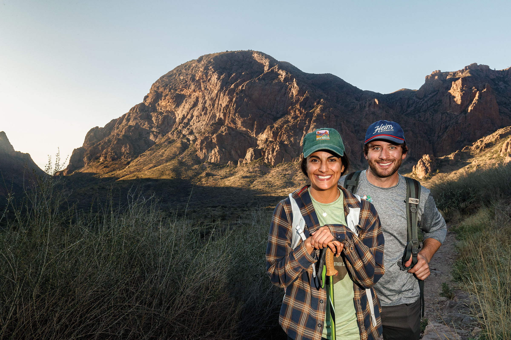
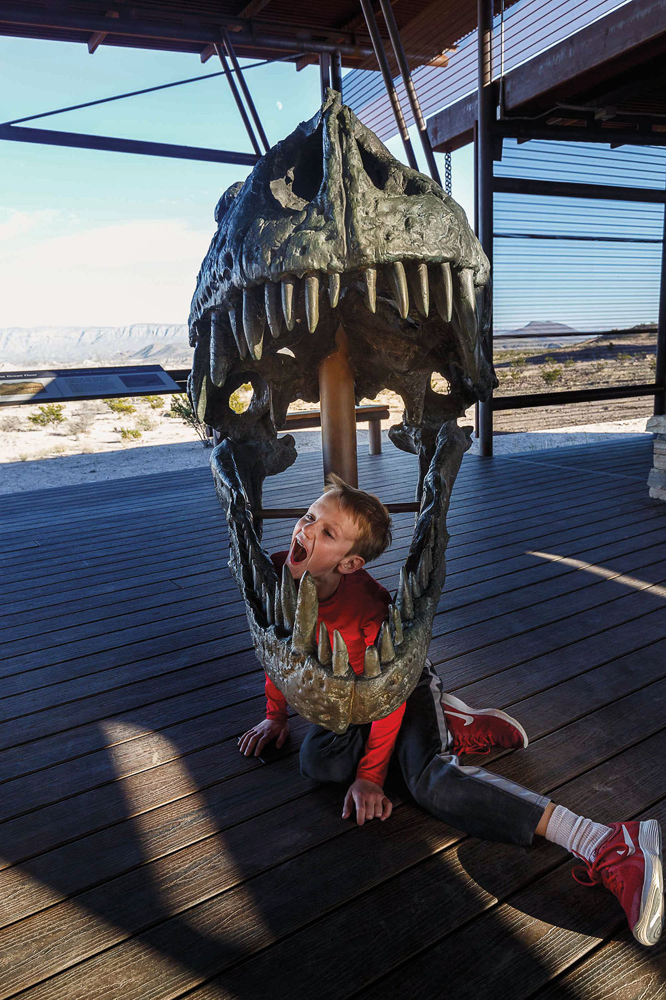
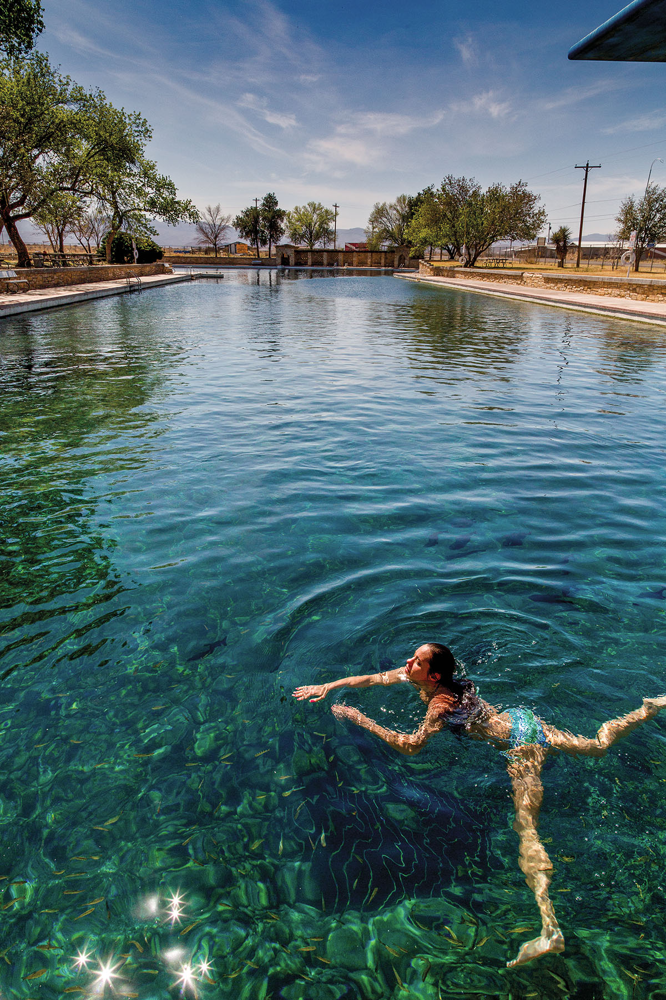

export const Title = () => (
  
    
    Big Bend Country
  
);

<PageDescription>

Adventure, scenic hikes, and wide-open spaces beckon visitors to landscapes little changed since the days of the Wild West

</PageDescription>

<Caption>A couple embarks on The Window Trail in Big Bend National Park. Photo by Sean Fitzgerald.</Caption>

<Row>

<Column colSm={12} colMd={4} colLg={8}>

## **Big Bend for Everyone**
### The remote landscapes of West Texas beckon visitors year-round
**By Matt Joyce**

Big Bend National Park can be intimidating. Countless photographs behold the region’s undeniable grandeur—its spectacular amalgam of desert, mountain, river, and sky. But the images also convey vast emptiness: 16th-century Spanish explorers dubbed this territory el despoblado, “the uninhabited.” And those scenic photos often overlook the granular details, where scorpions, thorns, snakes, sunburns, and blisters reside. So it’s understandable when the uninitiated knit their brows at the thought of Big Bend, weighing a vacation experience against fears of a survival exercise in the Chihuahuan Desert borderlands.

We’re here to tell you the characteristics that may sow trepidation about Big Bend—its isolation and wilderness—are the very qualities that make a visit to the national park worth a day’s drive across Texas. And that’s even if you’ve never put on a pair of hiking boots or pitched a tent; even if your preferred pastimes include drinking coffee on the porch and leisurely scenic drives.

#### Scenic Views 

One could easily while away a day in the Chisos Basin, watching the sun bathe the volcanic ridges that frame the valley in shifting shades of peach and potato until darkest space descends and the stars burst forth. There’s no other place in Texas like it. Capitalizing on the scene, each of the Chisos Mountains Lodge’s rooms has a porch or deck; and the lodge’s restaurant is surrounded on three sides by walls of windows. (The restaurant is currently closed for repairs; check [chisosmountainslodge.com](https://chisosmountainslodge.com) for updates.)

Several mountainous hikes embark from the basin, but walkers can find rewarding vistas with minimal effort on the Window View Trail—a 500-yard, American with Disabilities Act-accessible sidewalk loop that leads to an overlook perfect for photos. Point your camera west to capture the namesake window notch that opens to the desert floor, or to the east for a backdrop of the iconic lava dome called Casa Grande. 

The venture down from the mountains to explore the Ross Maxwell Scenic Drive is well worth the time. Maxwell was a geologist and Big Bend National Park’s first superintendent, holding the job from the park’s founding in 1944 until 1952. He laid out this route to highlight spectacular rock formations along the road’s 30 miles as it descends 1,500 feet from the base of the Chisos to the Rio Grande. With trailheads and overlooks every few miles, the route spans hundreds of millions of years of geologic history and thousands of years of human history.

“It’s just a little over an hour driving each way, but you can easily spend a day exploring,” says Tom VandenBerg, the park’s chief of interpretation and visitor services. 

If geology is your jam, don’t miss the Lower Burro Mesa Pouroff, a 1-mile round-trip hike that traces a majestic band of yellow volcanic ash as it swoops into a stunning box canyon and emerges on the other side like the silhouette of a falcon in flight.

Such desert landscapes resonate with beauty far greater than any human hand could create. But pretty scenery doesn’t translate into easy living. Only the toughest souls have thrived in these lands, and the Ross Maxwell Scenic Drive also sheds light on their experiences. At the Chimneys Trails stop, a desert hike leads to rock pillars marked with indigenous paintings and carvings from archaic times.

“It’s always been a challenging place,” VandenBerg says. “The Spanish found that out real quickly when they arrived in the 1500s. The ranchers and the miners who came after them had a very difficult time of it.”

Along the scenic drive, Big Bend’s ranching heritage is on display at the Sam Nail Ranch, where a 5-minute walk leads to adobe ruins among a grove of walnut and pecan trees—a peaceful oasis with benches to watch birds drawn by the working windmill. At the Homer Wilson Ranch, an easy hike descends to Blue Creek Canyon, where a well-preserved stone house recalls Wilson’s sheep and goat operation, which lasted until the park was formed.

Mesquite trees blanket the Rio Grande floodplain, and as the scenic drive winds toward the river, it reveals occasional glimpses of historic adobe ruins, abundant roadrunners, and the nearby Rio Grande. But the river’s grandeur and the proximity of Mexico aren’t fully apparent until the drive terminates at Santa Elena Canyon, a fitting  pièce de résistance. Here the Rio Grande cuts a sinewy 1,500-foot gash through a limestone block known on the American side as Mesa de Anguilla and on the Mexican side as Sierra Ponce.

For generations, the gravel and mud beach at the canyon’s mouth has been a popular spot for picnicking, wading, international rock-skipping, and contemplating the massive fault that ruptured this bedrock millions of years ago. It’s also the starting point for a 1.6-mile round-trip hike into the canyon.

As the trail ascends through rocky walls swimming with fossilized seashells, the canyon eventually closes the view forward as the trail ends, teasing hikers to the mysteries upstream. Looking back, however, offers a satisfying consolation: an expansive view of the park and the Ross Maxwell Scenic Drive’s twisting route through canyons, mesas, and mountains back to the Chisos.

</Column>

<Column colSm={6} colMd={4} colLg={4}>
<AdGroup id={['ad04']}/>
<AdGroup id={['ad02']}/>
</Column>

</Row>

<Row>
<Column colSm={6} colMd={3} colLg={4}>
<AdGroup id={['ad01']}/>
</Column>
<Column colSm={6} colMd={3} colLg={4}>
<AdGroup id={['ad03']}/>
</Column>
</Row>

<Row>

<Column colSm={12} colMd={4} colLg={8}>

<Caption>The Fossil Discovery Exhibit at Big Bend National Park encourages interaction. Photo by Sean Fitzgerald.</Caption>

#### Family Adventures 

It takes a certain degree of patience to relish an hourslong drive across the desert, even when navigating the magnificent scenery of West Texas. It’s fair to say most children get antsy. Not to worry: One of Big Bend National Park’s newest and most family-friendly stops—the Fossil Discovery Exhibit—is the first attraction visitors encounter when entering the park from the north at Persimmon Gap.

Opened in 2017, the exhibit not only enlightened the park’s interpretation of the fossil record contained in the surrounding hills, it also created an engaging place for kids to climb around among the creatures that have inhabited this area for the past 130 million years. Adults will find plenty to learn from the displays and fossils that chronicle the area’s transformation from a shallow ocean of marine life, to swampy forests with dinosaurs, to a volcanic mountainscape of mammals.

Shaded picnic tables offer a place to snack, and play hills embedded with replica fossils give kids a chance to burn some energy while getting a sense of the magnitude of dinosaur bones. A classic photo opportunity awaits with the life-size sculptures of Tyrannosaurus rex and deinosuchus heads, their open jaws inviting kids to stick their heads in. On a related note, in fall 2018 the park unveiled a 38-foot steel cutout of the huge alligator that ruled the swamps of Big Bend some 80 million years ago. It’s a marvel, no matter your age.

</Column>

<Column colSm={12} colMd={2} colLg={4}>

<Caption>Balmorhea State Park. Photo by Will van Overbeek.</Caption>

### Big Bend Country Texas State Parks: Hidden gems

**Seminole Canyon State Park**

Offering rugged stone cliffs, deep canyons, and sweeping valleys, this state park near Del Rio helps tell Texas stories that date back thousands of years. Walk more than 10 miles of trails to enjoy stunning views of the Rio Grande. Take a guided tour to view and study some of the oldest rock art in all North America. The park also offers camping, biking, and birding, as well as a visitor center.

**Other hidden gems:**
- Fort Leaton State Historic Site 
- Hueco Tanks State Park &amp; State Historic Site

**More Hill Country State Parks:** 
- Balmorhea SP
- Barton Warnock Visitor Center
- Big Bend Ranch SP
- Davis Mountains SP
- Devils River SNA
- Franklin Mountains SP
- Indian Lodge
- Monahans Sandhills SP

For more information, directions, and amenities, get your [free mobile guide to all 80-plus state parks](https://texasstateparks.org/app).

</Column>

</Row>

<Row>
<Column colSm={6} colMd={6} colLg={8}>
<RegionListing title="Big Bend Country" color="orange" region="BIG BEND COUNTRY"/>
</Column>

<Column colSm={6} colMd={4} colLg={4}>
<AdGroup id={['ad04']}/>
<AdGroup id={['ad01']}/>
<AdGroup id={['ad03']}/>
<AdGroup id={['ad02']}/>
</Column>

</Row>