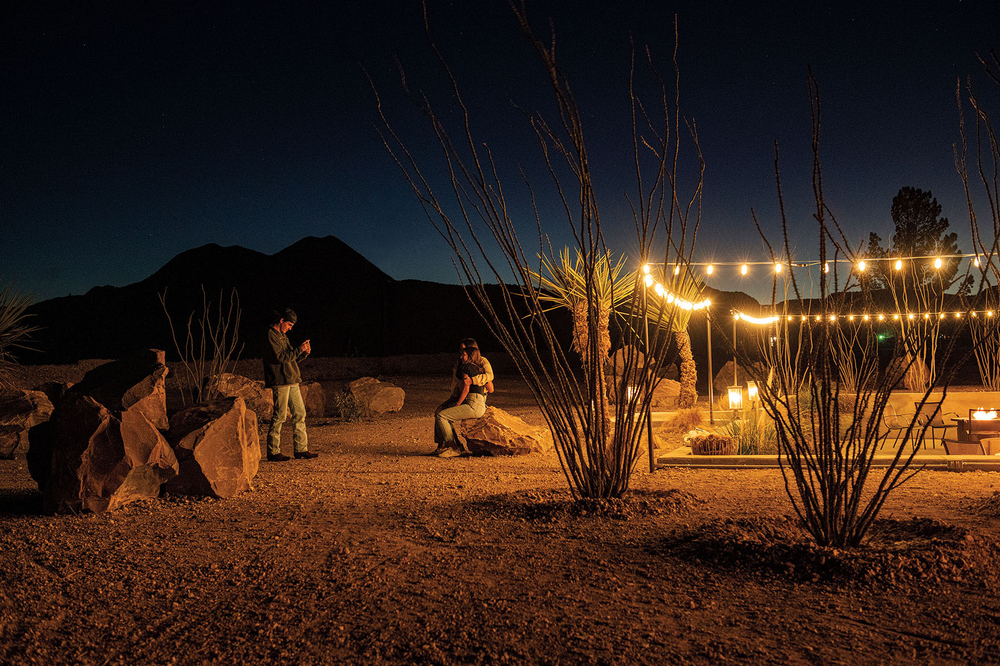
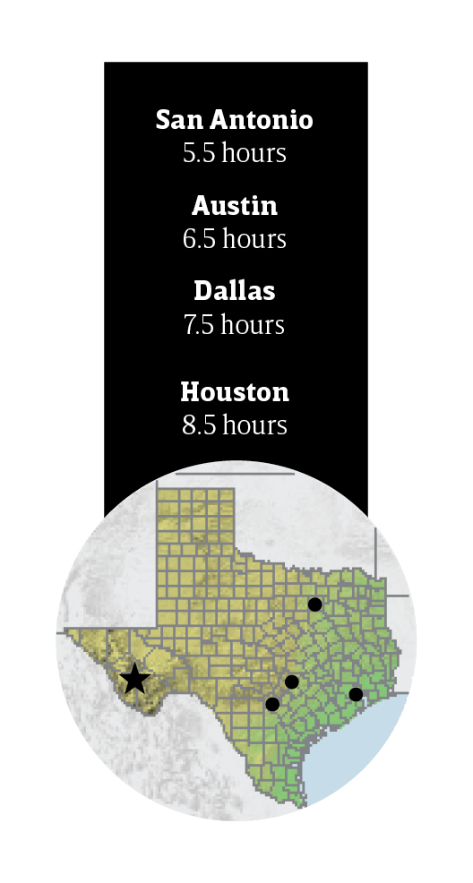
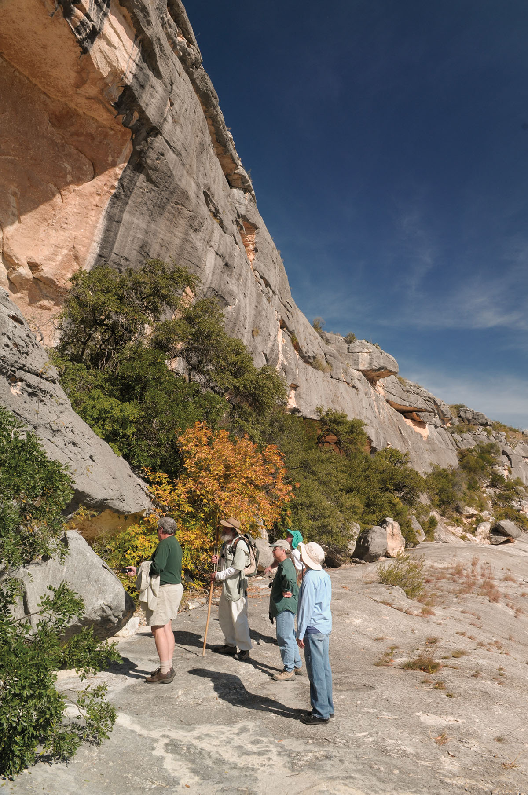

export const Title = () => (
  
    
    Big Bend Country
  
);

<PageDescription>

Adventure, scenic hikes, and wide-open spaces beckon visitors to landscapes little changed since the days of the Wild West

</PageDescription>

<Row>

<Column colSm={12} colMd={6} colLg={10}>

<Caption>Spicewood Restaurant Alpine. Photo by Theresa DiMenno</Caption>

## **Beat of a Different Drum**

</Column>
</Row>

<Row>

<Column colSm={12} colMd={6} colLg={8}>

### Find Big Bend heritage and desert mountain air in Alpine

**By Laurel Miller**

Alpine may not attract an international art crowd like nearby Marfa, but fans of West Texas know this scrappy Trans-Pecos railroad and ranching town merits a closer look. The local arts community, fueled in part by students and faculty at Sul Ross State University, supports an entertaining lineup of local galleries, music venues, and the distinctive Museum of the Big Bend. Set at the foot of the Davis Mountains, Alpine also serves as a base for outdoor enthusiasts who relish the high-desert climate and regional opportunities for hiking, biking, camping, horseback riding, and paddling. Accommodations range from the 95-year-old Holland Hotel to chain hotels and upscale vacation rentals. 

</Column>

<Column colSm={3} colMd={2} colLg={3}>

</Column>

</Row>

<Row>

<Column colSm={12} colMd={5} colLg={8}>

### Stay

#### Antelope Lodge

This 1950s motor hotel sits on the west end of town. The handcrafted stucco, stone, and red-clay cottages surround a garden courtyard. Starting at $85 per night, the rooms are decorated in a minimalist, Southwestern aesthetic, with colorful textiles and abundant light.

### Eat

#### Spicewood at Quarter Circle 7

Inspired by “cattlemen’s hospitality,” the restaurant and patio at the rustic-modern Hotel Parker boast panoramic views of the Twin Peaks mountains and surrounding desert. Try the fully loaded Hatch green chile burger with bacon aioli.

#### Judy’s Bread and Breakfast

A lively cross-section of Alpine locals and tourists congregate at this friendly eatery known for its pastries, such as gooey cinnamon rolls and iced doughnuts, and hefty portions of breakfast classics like biscuits and gravy. Lunch items include salads, sandwiches, and wraps.

### Drink

#### Harry’s Tinaja

The best dive bars wear their history on their walls, and Harry’s is no exception. With an Old West saloon vibe, the building’s interior, including the ceiling, is covered with memorabilia, taxidermy, dollar bills, and scribblings. Join the regulars at the bar or on the outdoor patio and sit down for a chat.

### See

#### Alleyway Murals

Grab a map from your hotel or ­visitalpinetx.com and take a mural tour. Local artists have depicted the landscape, industry, and culture of the Big Bend on buildings and a telephone pole or two. A separate “walking and windshield” tour explores historical and cultural sites.

### Do

#### Murphy Street
Several compact blocks paralleling the train tracks comprise this historical hub of Alpine’s Latino population. Originally known as Southside, it was established by the families of rail workers and includes original storefronts, some of them brightly restored. Browse the galleries, boutiques, and Petit Bijou café.

### Learn

#### Museum of the Big Bend

Located on the Sul Ross State University campus, this paean to West Texas covers topics from regional history and industry to early cartography and fine art. Art aficionados should bookmark Trappings of Texas, an annual Western art showcase. 

#### Chihuahuan Desert Nature Center

Twenty miles northwest of town near Fort Davis, this 507-acre nature center interprets the Trans-Pecos ecosystem with botanical gardens, hiking trails, and exhibits on local mining, wildlife, and geology. Don’t miss the cactus museum containing more than 200 varieties. 

### Viva Big Bend

This summer event, scheduled for July 27-30, was established a decade ago to support the Big Bend’s music industry, venues, and performers. More than 65 live performances are held at bars, pavilions, hotels, and clubs throughout Alpine, Marathon, Fort Davis, Marfa, and Terlingua. Consider this a musical road trip where you can hear talents like Dale Watson, Django Walker, Summer Dean, the Doodlin’ Hogwallops, and Two Tons of Steel. [vivabigbend.com](http://vivabigbend.com)

### RV Info

Lost Alaskan RV Park is 1.5 miles from downtown on a tidy property planted with pine trees. Escape the afternoon heat with a dip in the pool. Other amenities include laundry, barbecue grills, a dog park, a playground, tent sites, and rental cabins. 2401 SH 118; 
432-837-1136. [lostalaskan.com](http://lostalaskan.com)

</Column>

<Column colSm={12} colMd={3} colLg={3}>

<StatePark>

<Caption>Seminole Canyon State Park. Photo by Chase Fountain, TPWD</Caption>

##### Big Bend Country

### Celebrate 100 Years of Texas State Parks

Join in the celebration! The Texas State Parks system is turning 100 years old in 2023. Learn more and discover all the ways you can help celebrate at [texasstateparks.org/100years](https://texasstateparks.org/100years).

#### Seminole Canyon State Park & Historic Site

Thousands of years ago, early canyon dwellers left clues about their lives on the stone walls of Seminole Canyon. Their pictographs (rock paintings) tell stories that we try to understand today. Take a guided hike with a ranger to the Fate Bell Shelter, where a huge cliff overhang protects some of Texas’ most spectacular rock art. You’ll want to stay and enjoy hiking, biking, geocaching, and camping.

#### More Big Bend Country State Parks

**Balmorhea State Park**
 

**Big Bend Ranch State Park**
 

**Davis Mountains State Park**
 

**Devils River State Natural Area**
 

**Fort Leaton State Historic Site**
 

**Franklin Mountains State Park**
 

**Hueco Tanks State Park **
 

**and State Historic Site**
 

**Monahans Sandhills State Park**
 

</StatePark>

</Column>

</Row>

<Row>
<Column colSm={6} colMd={6} colLg={8}>
<RegionListing title="Big Bend Country" color="orange" region="BIG BEND COUNTRY"/>
</Column>

<Column colSm={6} colMd={4} colLg={4}>
<AdGroup id={['ad94']}/>
</Column>

</Row>