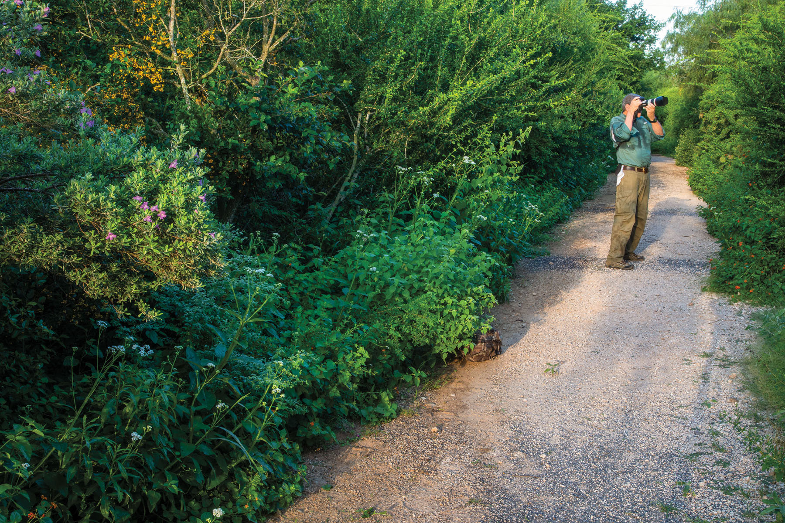
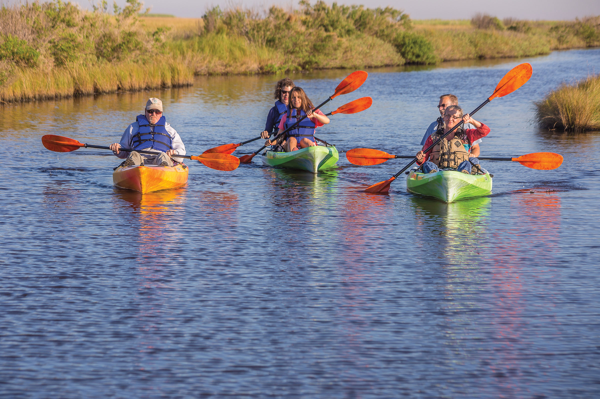

export const Title = () => (
  
    
    Gulf Coast
  
);

<PageDescription>

Beaches, art, history, and wildlife merge in a place where big-city sophistication meets seaside relaxation

</PageDescription>

<AdGroup id={['ad125','ad137','ad112','ad135']}/>

<Row>

<Column colSm={6} colMd={4} colLg={8}>

<Caption>Harlingen World Birding Center. Photo by Larry Ditto.</Caption>

## **Harlingen’s Tropical Treasures**
### Find nature, shopping, and sunshine in the “Capital of the Rio Grande Valley”
**By Daniel Blue Tyx**

The business loop of US 77 running through Harlingen is called Sunshine Strip, and the name couldn’t be more accurate. Harlingen boasts February highs of around 73 degrees and an average of only five days of rain for the entire month. For decades, Winter Texans from across the United States and Canada have made the city a winter home; the airport even has seasonal direct flights from Minneapolis and Denver.

But there is more to Harlingen than just sunshine and coastal breezes. Known as the “Capital of the Rio Grande Valley,” Harlingen is the heart of the Valley’s vibrant history and culture. A weekend in Harlingen is an invitation to experience a taste of everything the Valley offers: fresh-picked citrus, authentic Mexican and Tex-Mex cuisine, family-run boutiques, and buzzing nightspots that highlight the region’s transition from agricultural hub to urban dynamo.

It’s a border experience that’s distinctly Texan yet unlike anyplace else in the state.

For your first taste of Harlingen proper, follow the locals to the unassuming but scrumptious Las Vegas Café. The downtown restaurant is the go-to place for home-cooked Tex-Mex—as evidenced by the constantly packed parking lot. Fortunately, this is a place that knows how to feed a crowd. The attentive servers still call customers “sweetie,” and they’ll refill your beverage every few minutes and get your food out hot and fast over the sounds of conversation, laughter, and ranchera music.

Down the street, another local favorite is Lil Rita’s Grill House, which, contrary to its name, features Thai cuisine. Tucked away in an old house, the popular lunch spot is only open in the evening on Tuesdays, Wednesdays, and Fridays, when it’s always bustling. Tradition dictates that you pay your after-meal compliments to Rita Guerra, who cooks every dish in the house from scratch.

In the not-so-distant past, the Rio Grande Valley was primarily known for its agriculture—producing much of the nation’s citrus and vegetables, especially in winter. Agriculture is still important, but the land has been increasingly subsumed by urban development. To experience the Valley’s rural roots for yourself, you have to know where to look.

A great place to start is the Wild August Nursery & Flower Farm, where you’ll find fields of native wildflowers and pots of heirloom roses just southwest of downtown. Visitors can buy bouquets or potted plants, or when it’s allowed on special occasions, head out with shears in hand to cut their own flowers. On Saturday mornings (Friday mornings from June through October), a farmers market features local produce, handcrafted products, and breakfast goods that include warm cinnamon rolls and coffee.

A few miles down the road, Granny Clare’s Citrus at Rio Pride Orchards sells oranges and grapefruits right off the trees from late October to early March, depending on the year’s crop. Be sure to check out the tall white post with signs pointing in the direction of various destinations; the Rio Grande is only 4 miles off, but Winnipeg, Canada, is 1,705 miles away.

Inviting family-run antique shops and boutiques line downtown’s Jackson Street District, making it a great place for a leisurely afternoon stroll. 

“We have something for grandfathers, grandmothers, children, and grandchildren,” says Victoria Garza, who runs Jackson Street Antiques with her mother, Carmen, and sister, Mia. The shop, housed in a 1909 corner building that was once the town pharmacy, brims with glassware, antique and midcentury modern furniture, home décor, vintage clothing, toys, and a wide selection of vinyl records.

Along with about a dozen other antique shops, visitors will also find clothiers like Quelle Boutique!, which features brightly colored (and fair-trade) blouses and dresses from Latin America and Asia in addition to vintage threads. “We like anything quirky or unique,” owner Kelly Sanchez says, a statement that could apply to the entire Jackson Street District.

While treasure hunting, keep an eye out for about 20 downtown murals dramatically illustrating the city’s history and traditions. Worth a quick detour down A Street, the pointillistic Tropical Rio Grande Valley mural depicts elements of Valley culture from accordion music and parrots to the ubiquitous sunshine in thousands of tiny paint strokes. 

When all the shopping gets you hungry, handy downtown options include J & B’s Café, a classic small-town diner. Alternatively, take a quick walk west across the railroad tracks to the historic La Placita area. There, you’ll find Bandera Coffee Company, perfect for a late-afternoon coffee or espresso.

If you go across the tracks, don’t miss “The History of Mexico and Mankind,” a colossal mural comprised of ceramic panels that depict pre-Hispanic cultures and early Mexican history.

Saturday night is a perfect time to experience the finer side of Harlingen, starting with Colletti’s, an Italian restaurant housed in the historic 1927 Reese Hotel. The outside of the building still displays the original brick, but owner Jo Rae Wagner and son Todd Aune completely renovated the interior in 2009-10. Now, you can enjoy the famous lasagna or 12-inch manicotti inside the elegant scarlet-walled interior, or al fresco under the flickering lamps and palm trees in one of the hotel’s two courtyards.

The perfect spot for a nightcap is right across the street: The Point, an open-air bar with signature drinks, including the cucumber martini and margarita. 

Morning is the best time to catch sight of some of the Valley’s most famous residents—dozens of tropical and migratory bird species that can only be seen in the United States in South Texas. The place to start is Hugh Ramsey Nature Park, part of a network of nine World Birding Centers across the Valley. Although the park is within city limits, you’ll feel worlds away as you wander past an ancient grove of native Texas sabal palms and ponds teeming with kingfishers and roseate spoonbills.

The Retama Trail offers a quick introduction to the Valley’s unique flora and fauna, with excellent signage illustrating many of the species one might typically expect to see. A multitude of bird blinds also afford the chance to get up close and personal with rare birds like the green jay and hooded oriole.

On the other side of the park, the Ebony Trail winds past well-marked themed gardens, maintained by the Harlingen chapter of the Texas Master Naturalists. These include a butterfly meadow and medicinal plant garden.

Don’t miss the hummingbird garden near the entrance to the trail. Miniature bird blinds resembling school desks afford a front-row seat to the captivating sight of the tiny creatures’ rapidly pulsating wings as they hover to drink nectar from the feeders. It’s the perfect place to enjoy a few last minutes of sunshine, warmth, and relaxation before heading back to chillier winter climes.

</Column>

<Column colSm={6} colMd={4} colLg={4}>

<Caption>Sea Rim State Park. Photo by Will van Overbeek.</Caption>

### Gulf Coast Texas State Parks: Hidden gems

**Sea Rim State Park**

Immerse yourself in the unspoiled beauty of these coastal wetlands, where gulf meets marsh, about 100 miles east of Houston. Walk, camp, fish, or paddle through tranquil marshes, channels, and lakes. Enjoy more than 5 miles of shoreline along the Gulf of Mexico, including beach camping and a cabin available by reservation. Watch for local wildlife, including native alligators, as well as bird species such as roseate spoonbills, egrets, herons, and meadowlarks.

**Other hidden gems:** 
- Goose Island State Park
- Resaca de la Palma State Park
- Sheldon Lake State Park & EnvironmentalLearning Center 

**More Gulf Coast State Parks** 
- Brazos Bend SP
- Galveston Island SP
- Lake Corpus Christi SP
- Mustang Island SP
- Resaca de la Palma SP

For more information, directions, and amenities, get your [free mobile guide to all 80-plus state parks](https://texasstateparks.org/app).

</Column>

</Row>

<AdGroup id={['ad125','ad137','ad112','ad135']}/>

<Row>
<Column colSm={12} colMd={4} colLg={8}>
<RegionListing title="Gulf Coast" color="lightblue" region="GULF COAST" ads={['ad118', 'ad102', 'ad130', 'ad107']}/>
</Column>
<Column colSm={6} colMd={4} colLg={4}>
</Column>
</Row>

<!--

<FeatureCard
  title="Search all cities and listings in the Gulf Coast"
  actionIcon="arrowRight"
  href="/things-to-do-in-texas?region=gulf-coast"
  color="dark">

</FeatureCard>
<Caption>Nasa Level 9 Tour at Johnson Space Center. Photo by Will van Overbeek.</Caption>

-->