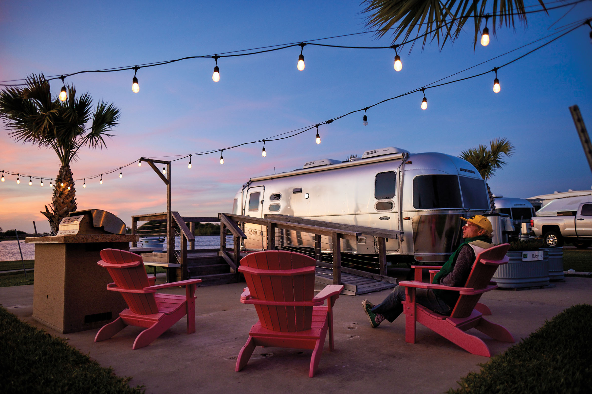
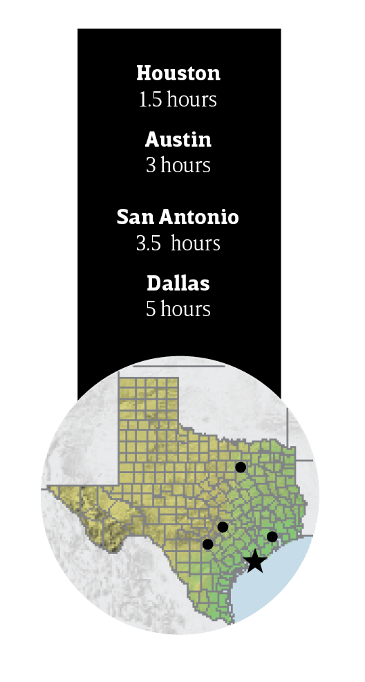
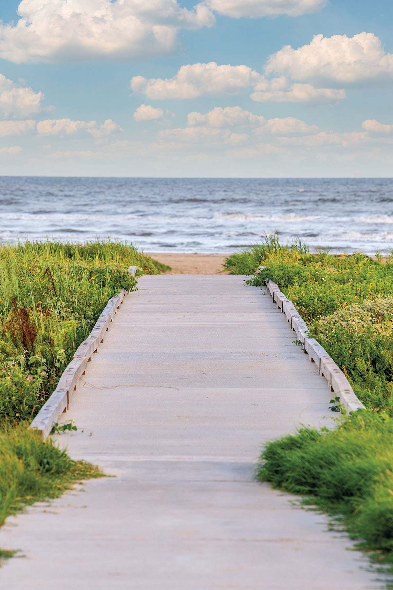

export const Title = () => (
  
    
    Gulf Coast
  
);

<PageDescription>

Beaches, art, history, and wildlife merge in a place where big-city sophistication meets seaside relaxation

</PageDescription>

<AdGroup id={['ad15', 'ad04', 'ad18']}/>

<Row>

<Column colSm={12} colMd={6} colLg={10}>

<Caption>Matagorda Bay Nature Park. Photo by Nathan Lindstrom</Caption>

## **Coastal Quiet**

</Column>
</Row>

<Row>

<Column colSm={12} colMd={6} colLg={8}>

### Matagorda attracts a reserved, nature-loving set
**By John Nova Lomax**

Founded in 1827, Matagorda is one of Texas’ oldest Anglo-settled towns. In the days of the Texas Republic and for decades thereafter, Matagorda was a bustling port and the seat of Matagorda County. The rise of Galveston and Houston lured trade away, and a series of destructive hurricanes in Matagorda prompted officials to build a new courthouse in Bay City in 1896. Today, Matagorda is home to fewer than 1,000 people year-round, and its relative isolation and miles of unspoiled beaches appeal to a more low-key crowd than, say, those who flock to South Padre Island. Fishing is king here—cast in the surf or wade in the bay; charter a boat or drive your own. During fall through spring bird migrations, well over 200 winged species live in or pass through town. The serenity of the coast helps visitors tune into the natural beauty around them.

</Column>

<Column colSm={3} colMd={2} colLg={3}>

</Column>

</Row>

<Row>

<Column colSm={12} colMd={5} colLg={8}>

### Stay

#### Stanley-Fisher House

Built in 1832 by Samuel Rhoads Fisher, the first secretary of the Texas Navy, this building stands as one of the few remnants of the town’s heyday. Current owners Rik and Peggy Stanley converted it into a bed-and-breakfast in 2004. Nightly rates start at $124 in the main house.

### Shop

#### Harbor Bait and Tackle

This spot on the docks is a treasure trove of up-to-the-minute information on fishing conditions. Managers Kelly and Mark Holland—Mark is a charter captain—can hook you up with whatever you need, including beer, bait, and a spacious deck to unwind on when the sun goes down.

#### Stanley’s General Stores

Opened in 1964, this one-stop shop sells groceries, beach toys, fishing tackle, and all the essentials you might have left at home. Stanley’s is also home to the Gorda Grill, which dishes out hot breakfasts, fried oysters, and shrimp that were in the Gulf just hours before.

### See 

#### Matagorda Bay Nature Park

Operated by the Lower Colorado River Authority, this park offers kayak rentals, guided adventure tours, and fishing. Two Airstream trailers come with a bathroom with shower, a fully equipped kitchenette, and a Yeti LoadOut Bucket for the length of your stay. Rates start at $247.50 a night.

#### Matagorda Beaches

Matagorda County boasts 55 miles of unspoiled beaches. The beaches to the northeast of the Colorado River are accessible by car, while those to the southwest are accessible by boat only. 

To reach the drivable beach, purchase a $10 permit at Stanley’s General Stores and look for a beach access sign three-quarters of a mile north of Farm-to-Market Road 2031’s end at Jetty Park. The beach access road takes you to a small parking lot where you can decide to park or drive onto the beach. The sand is very soft—locals strongly advise using a four-wheel drive vehicle.

### Eat

#### Cassady’s Coffee Bar & Cafe

Texas-chic Cassady’s offers an array of coffee concoctions, including the butterscotch latte, the snickerdoodle latte, and the caramel and dark chocolate Mata-Getdown-Gorda drink. Baked 
goods, breakfast sandwiches, and breakfast tacos are also available.

#### Coastal Que BBQ and More

House specialties include pork belly tacos garnished with sesame slaw, cotija cheese, and pickled onions; and the Frito Gorda, a variation on the humble Frito pie with brisket, beans, sausage, sour cream, and cheese. Heads-up: The joint is open May through October

#### Pluggers Pub

The laid-back atmosphere, ice-cold beer, and specialty shots draw a crowd of regulars to this top-notch dive. If you are seeking a fishing guide, consider this your Tatooine cantina—a Han Solo of 
Matagorda’s waters will likely be swapping fish tales on the premises.

#### Waterfront Restaurant 

An elder statesman on Matagorda’s dining scene, the Waterfront Restaurant stands out with its mango-colored exterior and dishes like stuffed flounder, soft-shell crab, and steak done just right.

### Camping and RV Info

All Matagorda County beaches offer free camping so long as you don’t take up residence in the same spot for more than 72 hours at a time. 

On the edge of Matagorda and the Colorado River, Pelican Point RV and Boat Slips offers a place to park your rig, lay your head, and stash your craft. Gated access, a lighted fishing pier, fish-cleaning station, and on-water boat fueling are available around-the-clock. 498 St. Mary St., Matagorda. 979-319-6660

</Column>

<Column colSm={12} colMd={3} colLg={3}>

<StatePark>

<Caption>Goose Island State Park. Photo by Chase Fountain, TPWD</Caption>

##### Gulf coast

### Celebrate 100 Years of Texas State Parks

Join in the celebration! The Texas State Parks system is turning 100 years old in 2023. Learn more and discover all the ways you can help celebrate at [texasstateparks.org/100years](https://texasstateparks.org/100years).

#### Galveston Island State Park

A Texas favorite for a half-century, Galveston Island State Park visitors enjoy the best of the Gulf Coast, beachside and bayside. The park looks better than ever, recently reopened after a hurricane-inspired remodel. Relax on the beach, splash in the waves, or fish the surf. Love to birdwatch? More than 300 species have been recorded in the park. Explore by land or by sea on hiking and paddling trails.

#### More Gulf Coast State Parks

**Brazos Bend State Park**
 

**Goose Island State Park **
 

**Lake Corpus Christi State Park**
 

**Mustang Island State Park**
 

**Resaca De La Palma State Park **
 

**Sea Rim State Park**
 

**Sheldon Lake State Park & Environmental Learning Center**
 

</StatePark>

</Column>

</Row>

<AdGroup id={['ad15', 'ad04', 'ad18']}/>

<Row>
<Column colSm={12} colMd={4} colLg={8}>
<RegionListing title="Gulf Coast" color="lightblue" region="GULF COAST" ads={['ad55', 'ad79']}/>
</Column>
<Column colSm={6} colMd={4} colLg={4}>
</Column>
</Row>

<!--

<FeatureCard
  title="Search all cities and listings in the Gulf Coast"
  actionIcon="arrowRight"
  href="/things-to-do-in-texas?region=gulf-coast"
  color="dark">

</FeatureCard>
<Caption>Nasa Level 9 Tour at Johnson Space Center. Photo by Will van Overbeek.</Caption>

-->