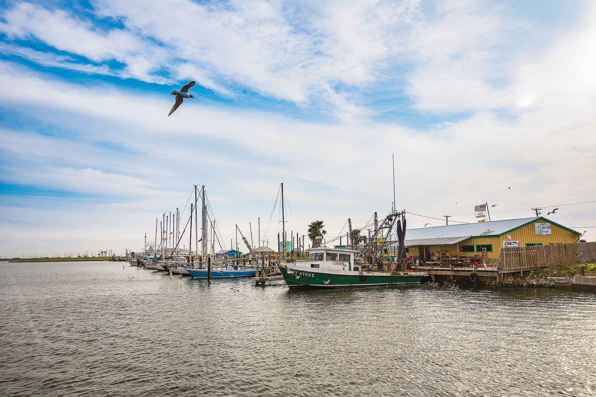
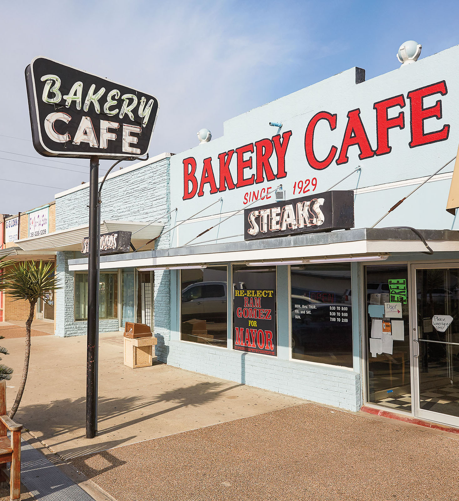
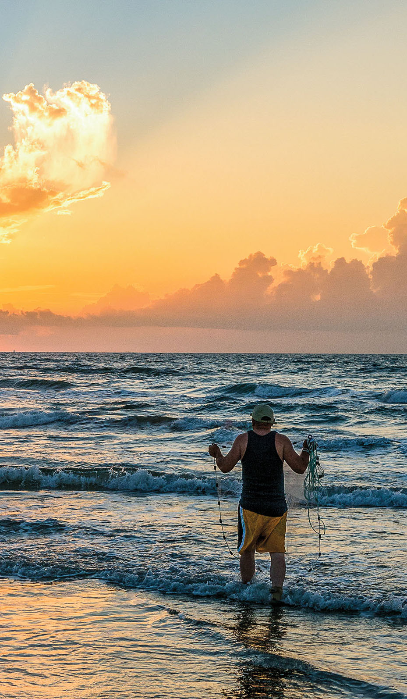

export const Title = () => (
  
    
    Gulf Coast
  
);

<PageDescription>

Beaches, art, history, and wildlife merge in a place where big-city sophistication meets seaside relaxation

</PageDescription>

<Caption>Redfish Bay in Aransas Pass. Photo by Nathan Lindstrom.</Caption>

<Row>

<Column colSm={6} colMd={4} colLg={8}>

## **Return to Relaxation**
### Aransas Pass offers a briny paradise along the Gulf Coast 
**By John Lumpkin**

Could there be a better way to experience a town composed of at least 70% salt water than to get to the water as fast as you can? With 41 square miles of Redfish Bay inside its city limits, Aransas Pass offers a self-described “Saltwater Heaven” building on its revival after Hurricane Harvey’s destruction in 2017.

Though it lacks miles of Gulf beaches found a ferry ride away in Port Aransas, Aransas Pass’ protected location behind two barrier islands provides the convenience of mainland boat launches; the serenity of paddling on Lighthouse Lakes; and encounters with bottlenose dolphins and coastal waterfowl like roseate spoonbills, American oystercatchers, and the rarer reddish egret. It features five locations on the Great Texas Coastal Birding Trail, including a pocket park across from the city library that is Texas’ largest dedicated hummingbird stopover.

Also on an Aransas Pass to-do list: dining alfresco on locally caught seafood, a tour of a military history museum, and a visit to the Seaman’s Memorial in Harbor Park—a remembrance of area residents lost at sea.

Accommodations in the city are limited to midlevel chain hotels like Fairfield and Microtel, but RV parks and rental cottages are available, upscale lodging is minutes away in Rockport, and both are easier on the pocketbook than a Port Aransas condo or beach house.

But, first things first. Redfish Bay is waiting.

Step inside the headquarters of Slowride Guide Services, a vintage two-story frame house near downtown, where owner Dean Thomas organizes your half- or full-day itinerary aboard his 22-foot Dargel Skout. He offers several options for a pleasant morning on the water, such as sailing past the historic 1857 Lydia Ann Lighthouse, studying wildlife in Redfish Bay’s network of estuaries, and casting from the skiff’s bow for redfish and speckled trout in the bay’s target-rich flats. His fees: $400 (half-day) and $550 (full-day); his delightful commentary: no extra charge.

Thomas deftly slides the Dargel out of San Patricio County’s marina, heading under the State Highway 361 causeway past repaired docks and up Aransas Channel. Today’s first sightings include a blue heron amid more common white egrets, framed by low-rising black mangrove, and an osprey with a fish in its bill.

White pelicans dominate the shoreline as the Dargel turns portside into Lydia Ann Channel, where dolphins suddenly surface. Here, Lydia Ann Lighthouse remains close and yet so far. H-E-B grocery magnate Charles Butt restored it to 24-hour operation, but there’s no public access. Thomas guides the skiff into the lighthouse’s “driveway,” as he calls it, a dead-end slough for close-up viewing.

Harbor Island’s Quarantine Shoreline is next. Brown pelicans claim this historical strand, so named for being an enforced waystation for 19th-century immigrants to be certified free of diseases like cholera. “If you hike around there,” notes Thomas of relics that visitors find, “you can still see remnants.”

If you reel in legal-size speckled trout or redfish, Thomas will fillet it on shore and point you toward Mickey’s Bar & Grill, a weathered open-air heap by the San Patricio marina that grills, blackens, or fries your catch for $12.95 per half pound, plus two sides (though this service has not been available during the COVID-19 pandemic). Without a catch to cook? Order peel-your-own shrimp, fried oyster po’boys drizzled with chipotle aioli, or a moist flounder sandwich with a side of hand-cut fries.

Downtown’s Rialto Theater schedules weekend stage productions. Opened in 1937 as a movie theater, the Rialto shuttered in 1991 until new owners rescued it in 2004 and converted it to a nonprofit arts venue in 2008. For après-theater dining, consider nearby Hook & Ladder Brewpub, which opened in May 2018. Owners Jarel MaGie and Kathryn Foley honor craft beer and first responders—displaying local fire and police memorabilia—and offer wine and bar foods like pizzas, nachos, and sliders, plus live music on Fridays and Saturdays. 

Pick the first Saturday of the month to tour a military history museum at McCampbell-Porter Airport, and eat a pancake breakfast supplied by members of the Commemorative Air Force, the museum’s operator. Try the flight simulator and view exhibits honoring World War II’s Women Airforce Service Pilots (WASPs), including the 38 who died during the war in noncombat missions, and the “Aztec Eagles,” a Mexican squadron that fought alongside the Allies in the South Pacific.

“I use my educational background to take people down a memory lane that is fast disappearing,” says Robert Perry, honorary CAF “colonel” and self-described Marines brat.

<Caption>Bakery Cafe in Aransas Pass. Photo by Nathan Lindstrom.</Caption>

</Column>

<Column colSm={6} colMd={4} colLg={4}>

<AdGroup id={['ad09']}/>

<Caption>Mustang Island State Park. Photo by Will van Overbeek.</Caption>

### Gulf Coast Texas State Parks: Hidden gems

**Sea Rim State Park**

Immerse yourself in the unspoiled beauty of these coastal wetlands, where gulf meets marsh, about 100 miles east of Houston. Walk, camp, fish, or paddle through tranquil marshes, channels, and lakes. Enjoy more than 5 miles of shoreline along the Gulf of Mexico, including beach camping and a cabin available by reservation. Watch for local wildlife, including native alligators, as well as bird species such as roseate spoonbills, egrets, herons, and meadowlarks.

**Other hidden gems:** 
- Goose Island State Park
- Resaca de la Palma State Park
- Sheldon Lake State Park & EnvironmentalLearning Center 

**More Gulf Coast State Parks** 
- Brazos Bend SP
- Galveston Island SP
- Lake Corpus Christi SP
- Mustang Island SP
- Resaca de la Palma SP

For more information, directions, and amenities, get your [free mobile guide to all 80-plus state parks](https://texasstateparks.org/app).

</Column>

</Row>

<Row>
<Column colSm={6} colMd={4} colLg={6}>
<AdGroup id={['ad10','ad17','ad19']}/>
</Column>
<Column colSm={6} colMd={3} colLg={4}>
</Column>
</Row>

<Row>
<Column colSm={12} colMd={6} colLg={8}>

The afternoon agenda starts with lunch at an Aransas Pass institution, Bakery Cafe (circa 1929), now owned by Aransas Pass Mayor Ramiro Gomez. Daily specials often include turkey and dressing, chicken fried steak, fish and shrimp, and pork cutlets. Their everyday never-frozen hamburgers won’t disappoint either. Word spreads fast if Ramiro’s wife, Orsalinda “Orfa” Gomez, bakes a carrot cake or longtime cook Cruz Hernandez whips up bread pudding drizzled with pecan sauce.

Next, peruse the shops and galleries repopulating Aransas Pass’ historic district post-Harvey. “We are providing a place for Coastal Bend artists and artisans looking for a home,” says Dinah Bowman, owner of soon-to-open Azul, noting the closure of other galleries since Harvey. Nearby, H. Lancaster Co.’s showroom features handmade furniture focused on coastal or rustic themes, often  with salvage such as washed-up logs or barn doors incorporated.

Haven’t had enough Saltwater Heaven? Rent a kayak and explore the Texas Parks & Wildlife Department’s first designated paddling trail, Lighthouse Lakes, in waters shallower than a skiff can manage. Slowride guide Thomas’ eco-tours may include beaching the kayak and hiking Redfish Bay’s islands. “It’s the simplicity and places you can get to that nobody else can,” Thomas says. “You fish, you hang out, you fix your meal, you lay back and look up at the sky. It’s like nowhere else,” he says.

Start your final afternoon at Conn Brown Harbor. Chuck West, Aransas Pass’ harbor master, oversees Conn Brown’s public boat launches, parks, and picnic grounds north of the SH 361 causeway. The harbor includes a final stop on your sojourn: the Seaman’s Memorial Tower, with its stained-glass alcove and tablets engraved with the names of area fatalities at sea.

It is “a place for private thoughts,” West says, “and it serves as a place for solace.”

</Column>

<Column colSm={6} colMd={4} colLg={4}>
<AdGroup id={['ad06','ad20']}/>
</Column>

</Row>

<Row>
<Column colSm={12} colMd={4} colLg={8}>
<RegionListing title="Gulf Coast" color="lightblue" region="GULF COAST" ads={['ad10','ad17','ad19','ad05','ad14','ad16','ad07','ad21','ad22','ad08','ad11','ad12']}/>
</Column>
<Column colSm={6} colMd={4} colLg={4}>
<AdGroup id={['ad09','ad06','ad20']}/>
<AdGroup id={['ad13','ad15','ad18']}/>
</Column>
</Row>

<!--

<FeatureCard
  title="Search all cities and listings in the Gulf Coast"
  actionIcon="arrowRight"
  href="/things-to-do-in-texas?region=gulf-coast"
  color="dark">

</FeatureCard>
<Caption>Nasa Level 9 Tour at Johnson Space Center. Photo by Will van Overbeek.</Caption>

-->