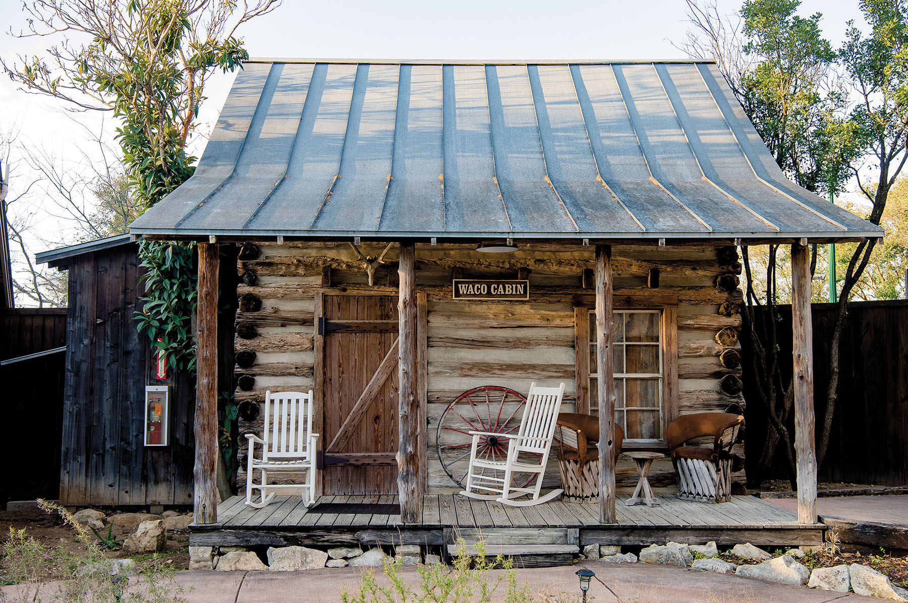
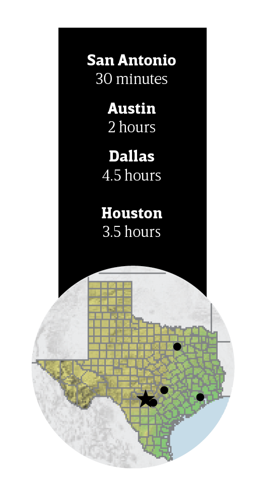
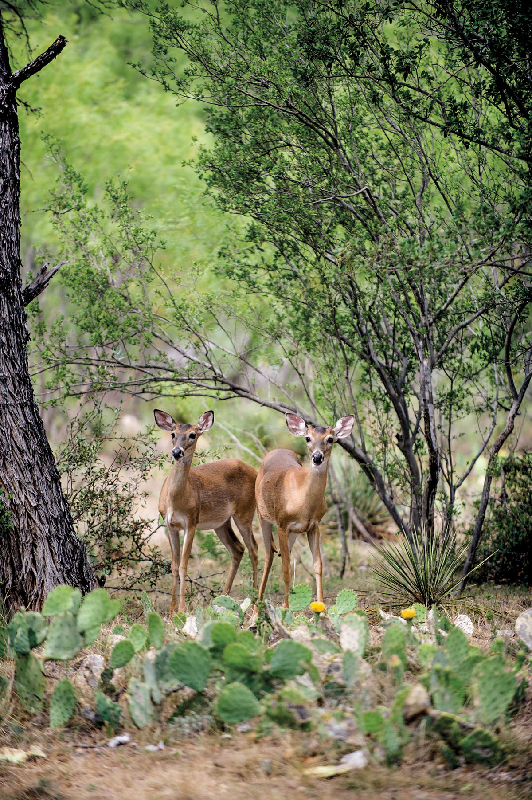

export const Title = () => (
  
    
    Hill Country
  
);

<PageDescription>

A bucolic landscape rich with cultural and natural attractions reflects Texas’ rural heritage

</PageDescription>

<AdGroup id={['ad17']}/>

<Row>

<Column colSm={12} colMd={6} colLg={10}>

<Caption>The Waco Cabin at The Kendall in Boerne. Photo by Tiffany Hofeldt</Caption>

## **A Creek Runs Through It**

</Column>
</Row>

<Row>

<Column colSm={12} colMd={6} colLg={8}>

### Hill Country charm and Texas-German heritage fuel a fulfilling getaway

**By Jacqueline Knox**

The German immigrants who settled in the Boerne area in 1850 knew a pristine townsite when they saw one. The colonists built farms near the bank of Cibolo Creek, the spring-fed stream that anchors the town of Boerne to this day. Named for German political writer Karl Ludwig Börne, the town evolved into a health resort in the late 19th century after multiple sanitariums opened. The town’s relatively high and dry Hill Country environs were thought to be beneficial to people with chronic illnesses. The railroad and agriculture also bolstered Boerne’s economy, and the town’s proximity to San Antonio has contributed to both a growing population and a steady stream of tourists. Boerne’s German heritage is alive and well in the town’s annual festivals, restaurants, and restored historic buildings lining Main Street.

</Column>

<Column colSm={3} colMd={2} colLg={3}>

</Column>

</Row>

<Row>

<Column colSm={12} colMd={5} colLg={8}>

### Stay

#### The Kendall

Built as a home in 1859, The Kendall’s lodging tradition began in the late 1800s when the Reed family boarded travelers. Now, The Kendall features 34 rooms, cottages, and suites—starting at $150/night—including a restored chapel. Hotel restaurant Peggy’s on the Green is a 
destination for refined comfort food.

### Shop

#### Flashback Funtiques

Located on Main Street, this store specializes in nostalgia, such as Big Boy statues, pinball machines, and jukeboxes. Owner Billy Howard hunts for vintage items at flea markets, car shows, and even attics, meaning you never know what treasures you’ll find. With its neon lights and roadside relics, the store is hard to miss.

### See

#### Cibolo Center for Conservation

Previously named the Cibolo Nature Center, this peaceful reserve has more than 6 miles of trails along the cypress-lined banks of Cibolo Creek. Make sure to visit the nearby Herff Farm, which has community gardens, yoga classes, and a Saturday farmers market.

#### Cascade Caverns

Venture below ground at Boerne’s oldest attraction to see the beauty of this living limestone cave where formations are still growing. Guided tours explore the high ceilings of the Cathedral Room and the bones of a prehistoric saber-toothed tiger and an American bison.

### Eat

#### Mary’s Tacos

There’s always a line at this family-owned haven for breakfast tacos. Try the “Sean”—eggs, bacon, potatoes, beans, and cheese—or the “Poncho”—brisket sauteed with jalapeños, tomatoes, and onions. Both come wrapped in homemade flour tortillas. Mary’s also serves lunch until 1:30 p.m., including barbacoa by the pound.

#### Cibolo Creek Brewing Company

This local brewery creates both classic and adventurous beers, including the Boerne Blonde and Creekside IPA. Owned by two local families, Cibolo Creek is a popular place to grab a pint, order a burger, and kick it outside. During the spring and summer, catch live music on the patio.

#### The Dienger Trading Co.

The Dienger Trading Co.’s 1884 building has housed a grocery store, restaurant, public library, and offices over the decades. Now back to its roots in food, the bistro and bakery right off Boerne’s Main Plaza offers breakfast and lunch on weekdays, and brunch on weekends. There’s also a shop carrying clothing, décor, and gifts.

#### The Dodging Duck Brewhaus
Named for the ubiquitous ducks on Cibolo Creek, this craft brewery serves sausages, giant pretzels, and beers that pay homage to the town’s German heritage. Sit on the patio and enjoy a laugh while cars stop in the street to let the “dodging ducks” pass by.

### Old World Melodies

The Boerne Village Band bills itself as the oldest continuously running German band in the world outside of Germany itself. Organized in 1860, the band persevered through the Civil War and World Wars I and II, and sometimes featured multiple generations of musicians from the same families. More recently, the German government has donated sheet music and instruments to the band in appreciation of its commitment to German music, while the Texas House of Representatives recognized the band in 1991 with a resolution honoring it for “keeping alive German music as part of our heritage.” Now in its 163rd year, the Boerne Village Band performs a summer concert series on the town plaza and also plays events, including the Kendall County Fair. [boernevillageband.com](http://boernevillageband.com)

### RV Info

Top of the Hill RV Resort & Cabins, roughly 7 miles north of downtown Boerne, offers cabins and RV camping, showers, kitchens, a swimming pool, a fitness room, laundry facilities, and a general store. 12 Green Cedar Road. 830-537-3666; [topofthehillrvresort.com](http://topofthehillrvresort.com)

</Column>

<Column colSm={12} colMd={3} colLg={3}>

<StatePark>

<Caption>South Llano River State Park in Junction. Photo by Chase Fountain, TPWD</Caption>

##### Hill Country

### Celebrate 100 Years of Texas State Parks

Join in the celebration! The Texas State Parks system is turning 100 years old in 2023. Learn more and discover all the ways you can help celebrate at [texasstateparks.org/100years](https://texasstateparks.org/100years).

#### South Llano River State Park

Bring your hiking boots, water toys, camping gear, and a sense of adventure. This scenic park provides a refuge for wildlife and people on the southwestern edge of the Hill Country. Tubers float 2 miles of river frontage (with multiple put-in and take-out points). Keep your eyes peeled for any of the 250 recorded bird species by day; at night, you’ll savor spectacular star-filled skies—it’s a certified International Dark Sky Park.

#### More Hill Country State Parks

**Blanco State Park**
 

**Colorado Bend State Park**
 

**Devil’s Sinkhole State Natural Area**
 

**Enchanted Rock State Natural Area**
 

**Garner State Park**
 

**Government Canyon State Natural Area**
 

**Guadalupe River State Park**
 

**Hill Country State Natural Area**
 

**Kickapoo Cavern State Park**
 

**Inks Lake State Park**
 

**Lake Brownwood State Park**
 

**Longhorn Cavern State Park**
 

**Lost Maples State Natural Area**
 

**Lyndon B. Johnson State Park & Historic Site**
 

**McKinney Falls State Park**
 

**Old Tunnel State Park**
 

**Pedernales Falls State Park**
 

</StatePark>

</Column>

</Row>

<Row>
<Column colSm={6} colMd={4} colLg={8}>
<RegionListing title="Hill Country" color="blue" region="HILL COUNTRY" ads={['ad44', 'ad77', 'ad94']}/>
</Column>

<Column colSm={6} colMd={4} colLg={4}>

</Column>

</Row>