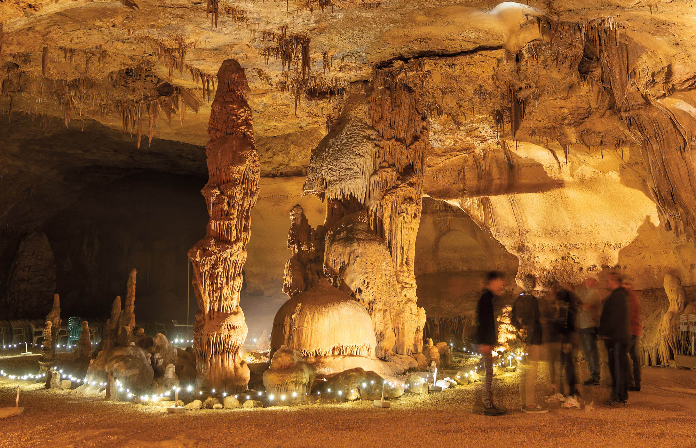
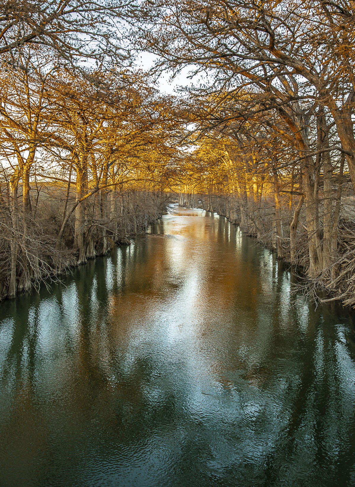
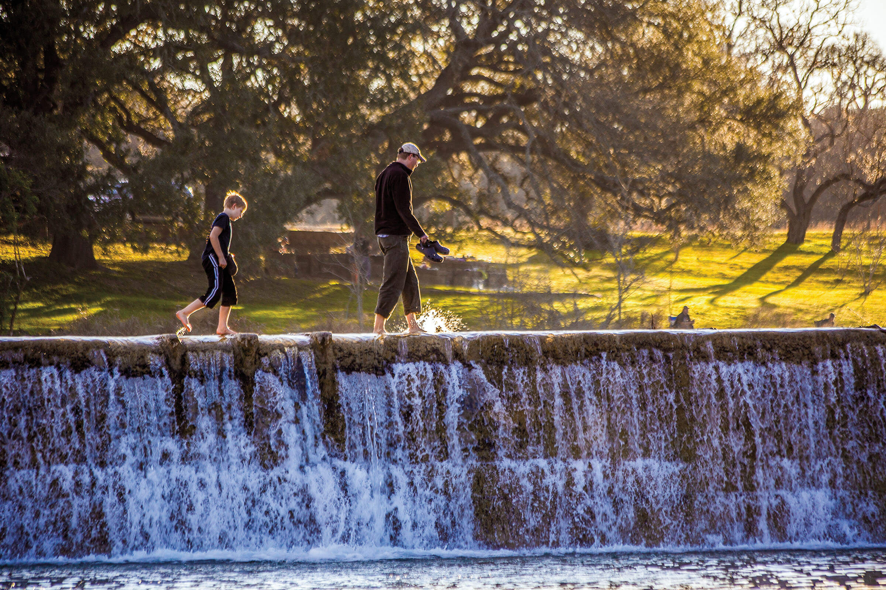

export const Title = () => (
  
    
    Hill Country
  
);

<PageDescription>

A bucolic landscape rich with cultural and natural attractions reflects Texas’ rural heritage

</PageDescription>

<Caption>The Cave Without a Name in Kendall County. Photo by Kenny Braun.</Caption>

<Row>

<Column colSm={6} colMd={4} colLg={8}>

## **A Haven in the Hills**
### Find Hill Country heritage in Kendall County
**By Joe Nick Patoski**

<AdGroup id={['ad32']}/>

Kendall County—about 50 miles northwest of San Antonio—is growing fast, thanks to urban sprawl. Luckily, it’s still maintained its idyllic Hill Country charm and unspoiled views. It might be tempting to roll other destinations, like Fredericksburg, New Braunfels, and Bandera, into a three-day weekend in the area. But sticking to Kendall County, which encompasses hamlets like Sisterdale, Waring, and Kendalia, offers more than enough to fill an itinerary. This rural county provides a more relaxing and less crowded trip, with historic dance halls, abundant live music, and the requisite Guadalupe River.

A weekend on the wild side of Kendall County starts south of the Johnson City-Stonewall-Fredericksburg tourist strip. The Walnut Canyon Cabins, run by Rhonda and Carl Rubadue, offer panoramic views. Nearby, Block Creek Guest House provides wildlife and nature sights from a historic cottage located within the Block Creek Natural Area. The private wildlife preserve was created by Sharron and Larry Jay for wildlife photography workshops, which are scheduled throughout the year.

Less than 5 miles from either lodging sits Old Tunnel State Park, best known for its 3 million Mexican free-tailed bats that hang out from May through October. Dedicated in 2012, the state park—the smallest in Texas—was built around and above the old Fredericksburg and Northern Railroad tunnel, which was abandoned in 1942. These days, around dusk, the bats emerge from the tunnel to feast on moths and wasps, creating a stunning sight. Directly above the tunnel is a designated viewing area, where seats are $5 per person. 

Myrna Langford, a Texas Parks & Wildlife volunteer, enjoys watching the emergence from the top. “I like seeing the precise ribbon formations of bats winding into the sky,” she says. She also recommends taking the trail down toward the tunnel to see the diversity of the tree canopy and birds.

Around the corner from Old Tunnel State Park is Alamo Springs Café, a funky neighborhood restaurant renowned for its half-pound hamburgers, onion rings, and the plate of the day (steak on Friday, enchiladas on Saturday, and chicken-fried steak on Sunday). Owner Brian O’Neill greets customers from behind the counter, setting the tone for the casual atmosphere. Need a beer? Grab one out of the cooler and let your waitress know how many you’ve had. Want a frozen mug for that beer? Open up the vintage refrigerator in the corner, look in the freezer compartment, and help yourself. The café hosts live music Thursdays-Sundays.

A classic Hill Country drive, with wildflowers still in bloom, is a must-do. The landscape along this route remains mostly undeveloped ranch country. Picturesque wedding and event centers have staved off encroachment from San Antonio’s suburbs for now. On Farm-to-Market Road 473, about 8 miles south of Old Tunnel, three ramshackle buildings make up The Cartoon Saloon. What looks like a Western movie set is the private studio of artist JP Rankin, known as “The Cartoon Cowboy.” The saloon serves as a photo-op for passersby.

Back on FM 473, a right on North River Bend Road leads to James Kiehl River Bend Park, one of the few access points to swim or float on this stretch of the Guadalupe. About 5 miles away, on Waring Welfare Road, is the small settlement of Waring. There you’ll find the reinvented Church at Waring—an old church that has been restored into a small special event center with occasional concerts and religious services, and the Waring General Store, which opens for steak night on Wednesdays.

Following Zoeller Lane from Waring, through farm fields, leads back to FM 473. The 22-mile drive to Kendalia stretches through the hilliest part of the county on a very narrow, shoulderless road that is extremely popular with weekend bikers and motorists. At the historic Kendalia General Store, stock up on sandwiches, drinks, and snacks for the road. Kendalia Halle, a relic on FM 3351 dating to 1903, still functions like it always has with Saturday dances most months of the year. (The hall suspended events during the COVID-19 pandemic, so it’s best to call ahead.)

</Column>

<Column colSm={6} colMd={4} colLg={4}>
<AdGroup id={['ad23']}/>
<AdGroup id={['ad33']}/>
<AdGroup id={['ad29']}/>
</Column>

</Row>

<Row>
<Column colSm={6} colMd={3} colLg={4}>
<AdGroup id={['ad27']}/>
</Column>
<Column colSm={6} colMd={3} colLg={4}>
</Column>
</Row>

<Row>

<Column colSm={12} colMd={6} colLg={8}>

<Caption>The Guadalupe River flows through James Kiehl Park in Comfort. Photo by Kenny Braun.</Caption>

Floating the river is practically mandatory in this part of the state. Bergheim Campground, 7 miles south of Kendalia on FM 3351, rents tubes, kayaks, and paddles for a three- to four-hour float down the cypress-lined Guadalupe River, ending at the bridge at Edge Falls Road. A shuttle ensures you return to the campground safely.

Nicolaus Zink, a German freethinker, founded Sisterdale in 1847. These days, the historic farming community provides a chance to mingle with locals, bikers, cyclists, and other travelers at the Sisterdale Line, a bar in a repurposed old general store. The other center of action is at the south end of town in the old cotton gin. It’s now home to Sister Creek Winery and Vineyards, a laid-back operation open for tastings and tours.

Dinner at an authentic barbecue joint is always something to look forward to, and Black Board Bar B Q takes it to the next level. There awaits half-pound servings of Angus or wagyu brisket, chicken, and links of wild boar sausage and boudin accompanied by sides like Asian slaw and mac and cheese. Be sure to order the house specialty Luckenbach Lollipops–fried quail legs and thighs. There’s also live music, typically singer-songwriter or country, all over the county, often starting as early as 6:30 p.m. on weekends at venues like Sisterdale Line, the Church at Waring, The Roundup (south of Kendalia), Kendalia Halle, and Alamo Springs Café.

The Cave Without a Name in Boerne hosts cool and crystalline entertainment. At this privately owned cave, an hourlong tour shows off an array of dazzling stalactites and stalagmites. Be warned: The only way in and out is by walking down and up 126 steps. What makes this cave stand out are the Saturday evening classical and new-age concerts held inside its Throne Room.

Because the temperatures in the cave remain a constant 66 degrees year-round, it’s the perfect place to linger and commit the pristine Hill Country views to memory. The crowds and the traffic await on the other side of the Kendall County line.

</Column>

<Column colSm={12} colMd={2} colLg={4}>

<Caption>Blanco State Park. Photo by Will van Overbeek.</Caption>

### Hill Country Texas State Parks: Hidden gems

**Lyndon B. Johnson State Park & Historic Site**

Situated along the Pedernales River, across from the former president’s ranch and birthplace, this day-use park is especially famous for its spring wildflowers. It also offers fishing, picnicking, and wildlife viewing, as well as part of the Official Texas State Longhorn Herd. Visit the Sauer-Beckmann Living History Farm to see how ranches in this area operated in the early 20th century. A swimming pool is available from June through mid-August. 

**Other hidden gems:** 
- Longhorn Cavern State Park
- South Llano River SP
- Devil’s Sinkhole State Natural Area

**More Hill Country State Parks:** 
- Blanco SP
- Colorado Bend SP
- Enchanted Rock SNA
- Garner SP
- Government Canyon SNA
- Guadalupe River SP
- Hill Country SNA
- Kickapoo Cavern SP
- Inks Lake SP
- Lake Brownwood SP
- Lost Maples SNA
- McKinney Falls SP
- Old Tunnel SP
- Pedernales Falls SP

For more information, directions, and amenities, get your [free mobile guide to all 80-plus state parks](https://texasstateparks.org/app).

</Column>

</Row>

<Row>
<Column colSm={6} colMd={4} colLg={8}>
<RegionListing title="Hill Country" color="blue" region="HILL COUNTRY" ads={['ad27','ad25','ad26','ad31','ad24','ad30']}/>
</Column>

<Column colSm={6} colMd={4} colLg={4}>
<AdGroup id={['ad32','ad23','ad33','ad29','ad27','ad25','ad26','ad31','ad24','ad30','ad28']}/>
</Column>

</Row>