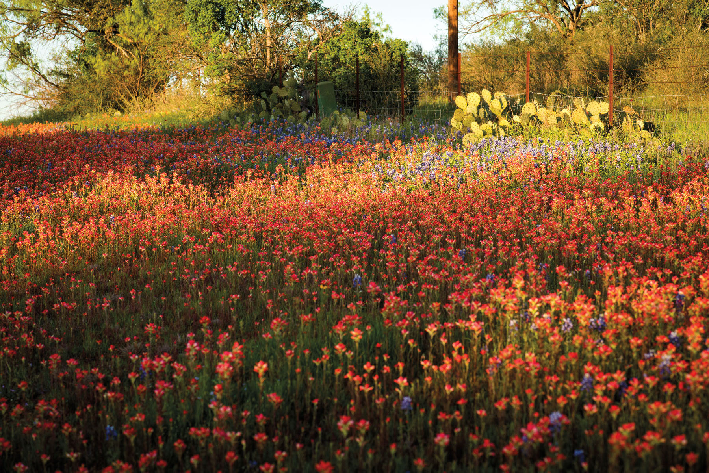
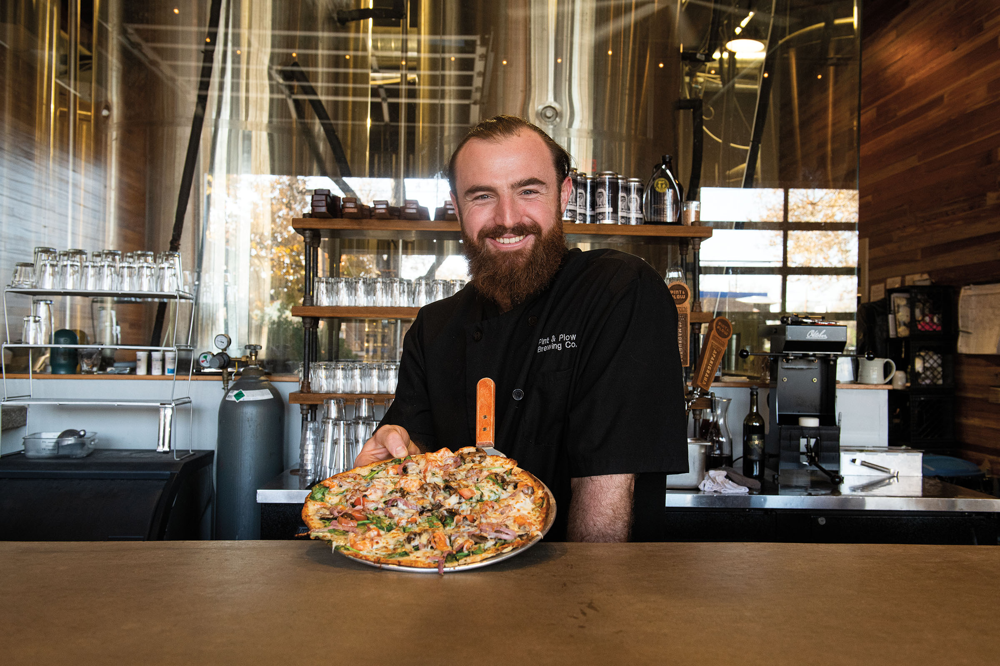

export const Title = () => (
  
    
    Hill Country
  
);

<PageDescription>

A bucolic landscape rich with cultural and natural attractions reflects Texas’ rural heritage

</PageDescription>

<Caption>Wildflowers in Kerrville. Photo by Theresa DiMenno.</Caption>

<AdGroup id={['ad99', 'ad131']}/>

<Row>

<Column colSm={6} colMd={4} colLg={8}>

## **All in Bloom**
### Come for the wildflowers; stay for the food, music, and culture
**By Kimya Kavehkar**

Spring crowds in search of the Hill Country’s famous wildflowers may not immediately think of Kerrville, located 30 minutes southwest of the tourist hub of Fredericksburg and an hour northwest of San Antonio. But rewards await travelers who find their way to this respite along the peaceful banks of the Guadalupe River.

Farmer Justin Graham, who operates the Kerrville Farmers Market, likens his little city to “a flower that hasn’t opened yet.” There’s a lot to discover in this budding town, from its active arts community and picturesque walking trails to its flourishing dining scene.

Kerrville is home to several comfy options for overnight stays. Those who prefer traditional hotels might want to book a room at the Y.O. Ranch Hotel or Inn of the Hills. For something slightly out-of-the-box (or more accurately, inside of a box), River Trail Cottages offers cabins and vintage trailers. 

The farmers market, an event most towns reserve for weekend mornings, is Kerrville’s Friday night block party. Vendors sell traditional items like produce, soaps, and jams and jellies. Yet the market also serves as a hangout where locals socialize over free beer from Pint & Plow Brewing Company. (Those in the know bring their own glasses, but you can also buy a cup at the entrance for $5.) The festive atmosphere, set against the backdrop of the historic A.C. Schreiner House, attracts “farmers, producers, and 5 p.m. happy hour folks,” says Graham, who also runs Zanzenberg Farm with his wife, Katye Graham.

The farmers market crowd slowly drifts down the street to Pint & Plow to enjoy more brews and dine on pizza, sandwiches, and salads. While the roasted beet sandwich might sound like a vegetarian option, its crisp slices of bacon belie its name, and the addition of creamy goat cheese adds incredible flavor. Pint & Plow offers flights of its beers, which range from a lager to a brown porter, but the River Shandy—a beer cocktail comprised of Tchoupitoulas American IPA, lemonade, and mint—is the perfect closer to a spring evening.

<Caption>Pint & Plow Brewing Co. Photo by Theresa DimMenno</Caption>

In the morning, PAX Coffee & Goods gets you going for a day of exploring with a selection of espresso drinks, teas, and bagels. Less than a mile away, Riverside Nature Center provides a helpful primer on the native wildflowers you might find in the area. Its nature path is chock-full of information on more than 200 species of wildflowers, grasses, and ferns—plus it makes for peaceful wandering with a pollinator garden and quiet places to sit and reflect. The nature center is also one of the entry points to the River Trail, a hike-and-bike path that runs about 6 miles along the Guadalupe River. The trail connects to a few other parks in the city like kid-friendly Louise Hays Park.

Bridget Symm became interested in growing organic food when she learned about her son’s severe food allergies. The interest grew into action, and now Bridget’s Basket is not only a garden where you can pick your own fresh vegetables but also a vineyard, event venue, market, and café. The restaurant serves simple, wholesome dishes like a harvest bowl of seasonal veggies, greens, and grains; silky soups; and chalkboard specials like pulled pork tacos. The market offers a selection of wine, eggs, lotions, candles, and other assorted goods.

The Museum of Western Art is a shrine to the culture of cowboys and the American West. It honors the genre with 300 sculptures, 500 paintings, saddles, wagons, and a children’s exhibition. The research library provides depth and context to what’s on display. 

For jewelry-lovers, Kerrville is synonymous with James Avery. The pioneering jeweler, who died in 2018 at age 96, built his business from the ground up in the Hill Country town starting in the 1950s. There are now more than 80 James Avery stores across the South, but Kerrville holds its headquarters and flagship location. In the back of the store, a mini-museum displays Avery’s sketches, tools, photos, and information about designing and crafting jewelry.

From there, head downtown to the sophisticated, yet unfussy, Grape Juice. The restaurant—as its name indicates—excels at wine. The menu divides its wine selections into “fun” and “familiar,” with options from all over the world, and its shop encourages guests to buy a bottle of their favorite to-go. Fans laud Grape Juice for its Brussels sprouts appetizer, a plate of roasted sprouts tossed with bacon, feta, and a sweet soy drizzle. Game meats like venison and antelope appear in comfort-food dishes like chili and nachos.

Just outside of Kerrville, a replica of Stonehenge—the mysterious prehistoric landmark monument in England—stands at the Hill Country Arts Foundation in Ingram. Simply named Stonehenge II, the roadside attraction was built by Hunt locals Al Shepperd and Doug Hill at 90 percent of the height and 60 percent of the width of the original circle. Adding to the artistic eccentricity are two replica Easter Island statues. While you’re there, catch a show at the foundation’s Smith-Ritch Point Theatre—the 2022 lineup includes _Matilda: The Musical_. 

The Kerrville area has always been celebrated for its natural beauty and rural charm, but it continues to blossom with vibrant cultural offerings.
</Column>

<Column colSm={6} colMd={4} colLg={4}>

<AdGroup id={['ad119','ad100']}/>

<Caption>Blanco State Park. Photo by Will van Overbeek.</Caption>

### Hill Country Texas State Parks: Hidden gems

**Lyndon B. Johnson State Park & Historic Site**

Situated along the Pedernales River, across from the former president’s ranch and birthplace, this day-use park is especially famous for its spring wildflowers. It also offers fishing, picnicking, and wildlife viewing, as well as part of the Official Texas State Longhorn Herd. Visit the Sauer-Beckmann Living History Farm to see how ranches in this area operated in the early 20th century. A swimming pool is available from June through mid-August. 

**Other hidden gems:** 
- Longhorn Cavern State Park
- South Llano River SP
- Devil’s Sinkhole State Natural Area

**More Hill Country State Parks:** 
- Blanco SP
- Colorado Bend SP
- Enchanted Rock SNA
- Garner SP
- Government Canyon SNA
- Guadalupe River SP
- Hill Country SNA
- Kickapoo Cavern SP
- Inks Lake SP
- Lake Brownwood SP
- Lost Maples SNA
- McKinney Falls SP
- Old Tunnel SP
- Pedernales Falls SP

For more information, directions, and amenities, get your [free mobile guide to all 80-plus state parks](https://texasstateparks.org/app).

</Column>

</Row>

<AdGroup id={['ad99', 'ad131']}/>

<Row>
<Column colSm={6} colMd={4} colLg={8}>
<RegionListing title="Hill Country" color="blue" region="HILL COUNTRY" ads={['ad113', 'ad115', 'ad95']}/>
</Column>

<Column colSm={6} colMd={4} colLg={4}>
<AdGroup id={['a119','ad100']}/>
</Column>

</Row>