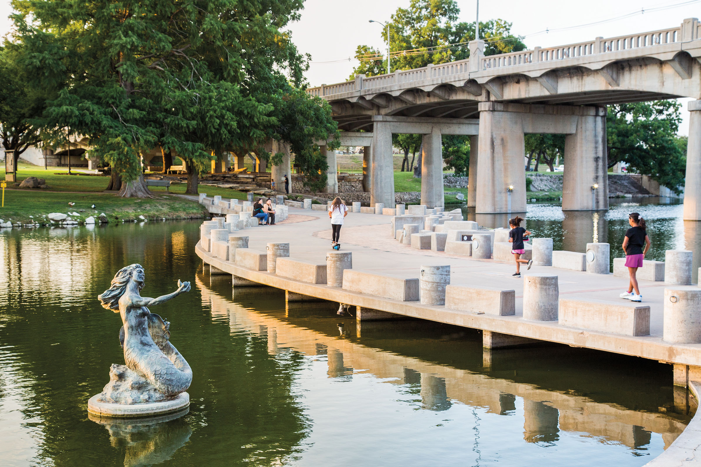
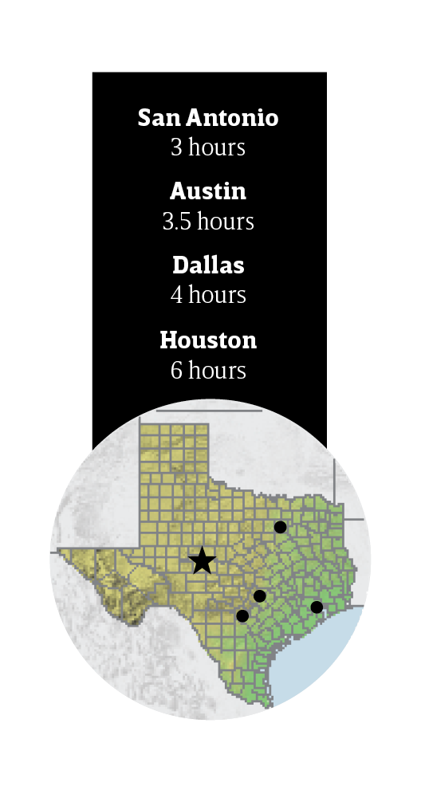
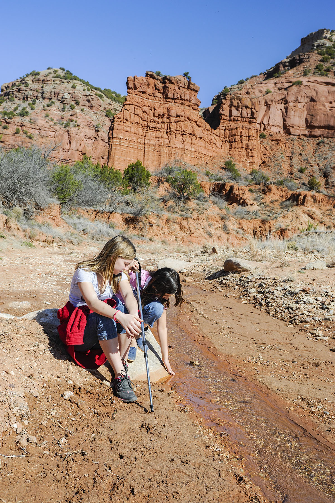

export const Title = () => (
  
    
    Panhandle Plains
  
);

<PageDescription>

Big skies, sweeping sunsets, and breathtaking vistas characterize this region, where something new is always on the horizon

</PageDescription>

<Row>

<Column colSm={12} colMd={6} colLg={10}>

<Caption>The Pearl of the Conchos mermaid statue sits in the water along the River Walk in San Angelo. Photo by Tom McCarthy Jr.</Caption>

## **Paint the Town**

</Column>
</Row>

<Row>

<Column colSm={12} colMd={6} colLg={8}>

### This former Wild West outpost brushes against its artistic side

**By Kimya Kavehkar**

The frontier era of San Angelo was infamous for its gambling halls, saloons filled with whiskey, and thriving bordellos. Today, San Angelo is a kinder, gentler town with plenty of family-friendly diversions. Its brand has transitioned from one of the wildest towns of West Texas to a haven for creatives. There is a free 24-hour art gallery downtown, a weeklong fall painting festival, artist studios and workshops at the Chicken Farm Art Center, and the San Angelo Museum of Fine Arts. With the Concho River as a backdrop, San Angelo is the perfect canvas on which to create your ideal weekend retreat.

</Column>

<Column colSm={3} colMd={2} colLg={3}>

</Column>

</Row>

<Row>

<Column colSm={12} colMd={5} colLg={8}>

### See

#### International Waterlily Collection

From April to October, water lilies of various types bloom at Civic League Park, which serves as the home of the Texas Dawn variety, designated as the state’s official water lily in 2011.

#### River Walk

A stroll here shows off San Angelo’s greatest natural treasure, the Concho River. You can rent a paddleboat, play a game of putt-putt golf, and take in views of the city. A mermaid statue rising from the river honors the freshwater pearls found in the Concho.

#### Fort Concho

The U.S. Army built Fort Concho in 1867—three years before the establishment of San Angelo—to protect frontier settlements in the area and beyond. Today, visitors can walk through barracks, the hospital, and officers’ quarters.

#### Pop Art Museum

This open-air downtown museum features colorful paintings and statues that serve as an homage to the pop art movement. Walk through the former bowling alley—free and open 24 hours a day—to view the works by local artists.

#### San Angelo State Park

Nothing can prepare you for the majestic sight of roaming bison. Visitors can view the beasts—as well as Longhorns from the state’s official herd—up close. The park also offers campsites with electricity, water, grills, and picnic tables.

### Eat

#### Zero One Ale House

Kick back with a cold one brewed in-house at this casual downtown restaurant. Pair the ridiculously cheesy cheddar blanket burger with a pint of the popular Intermission Amber, bearing notes of caramel and tropical fruit.

#### The Latest Scoop

This family-owned downtown ice cream parlor serves sweet treats including frappés, hot chocolate, and smoothies. Try a scoop of sea salt butter pecan or blueberry-lavender ice cream in a homemade waffle cone.

#### Una at the Silo

Located in the artistic complex known as the Chicken Farm Art Center, this restaurant has on-site lodging and a menu that includes standout dishes like the chargrilled tenderloin and pomegranate duck breast.

### En Plein Air

While EnPleinAirTEXAS is only celebrating its ninth year in San Angelo, the tradition that inspired the festival has been in Texas for a century. Texas Artists Camp, a group founded in the area in 1921, once hosted some of the largest en plein air gatherings in the Southwest. The term is French for “in the open air” and refers to a movement started by impressionists who would paint outdoors. The San Angelo celebration, which happens annually in October, invites artists to put brush to board in nature and visitors to watch. The weeklong series of events culminates in an exhibit and sale at Fort Concho. [enpleinairtexas.com](http://enpleinairtexas.com)

### RV Info

Park your RV at San Angelo State Park, located on the south shore of O.C. Fisher Reservoir alongside the Concho River. With prices ranging from $10 to $50 per night, campsites come with electricity, water hookups, outdoor grills, and restrooms nearby. 362 S. FM 2288, 325-949-4757; [tpwd.texas.gov](https://tpwd.texas.gov/state-parks/san-angelo). 

KOA Holiday’s 10-acre campgrounds include electricity, restrooms, cable, Wi-Fi, a dog park, and a pool. 6699 Knickerbocker Road, 325-949-3242; [koa.com/campgrounds/san-angelo](http://koa.com/campgrounds/san-angelo).

</Column>

<Column colSm={12} colMd={3} colLg={3}>

<StatePark>

<Caption>Caprock Canyons State Park and Trail in Quitaque. Photo by Chase Fountain, TPWD</Caption>

##### Panhandle Plains

### Celebrate 100 Years of Texas State Parks

Join in the celebration! The Texas State Parks system is turning 100 years old in 2023. Learn more and discover all the ways you can help celebrate at [texasstateparks.org/100years](https://texasstateparks.org/100years).

#### Caprock Canyons State Park & Trailway

Hike, bike, or ride horses along 90-plus miles of trails. Camp, geocache, or go for a scenic drive. Boat, fish, or swim in the 120-acre Lake Theo. View wild animals in their native habitats, including bison, pronghorn, and Mexican free-tailed bats. Watch for as many as 175 species of birds. Choose from a variety of campsites to spend the night (or reserve a room at the spacious Lake Theo Lodge) and rest up for your next day of adventure.

#### More Panhandle Plains State Parks

**Abilene State Park**
 

**Big Spring State Park**
 

**Copper Breaks State Park**
 

**Fort Richardson State Park, SHS & Trailway**
 

**Lake Arrowhead State Park**
 

**Lake Colorado City State Park**
 

**Palo Duro Canyon State Park**
 

**Possum Kingdom State Park**
 

**San Angelo State Park**
 

</StatePark>

</Column>

</Row>

<Row>
<Column colSm={12} colMd={4} colLg={8}>
<RegionListing title="Panhandle Plains" color="red" region="PANHANDLE PLAINS" ads={['ad63']}/>
</Column>

<Column colSm={6} colMd={4} colLg={4}>

</Column>

</Row>