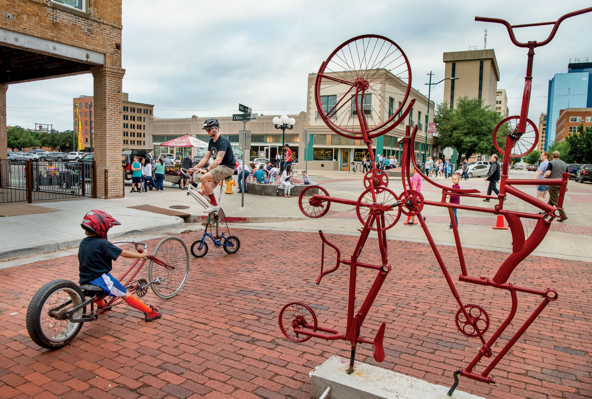

export const Title = () => (
  
    
    Panhandle Plains
  
);

<PageDescription>

Big skies, sweeping sunsets, and breathtaking vistas characterize this region, where something new is always on the horizon

</PageDescription>

<Caption>Downtown Wichita Falls. Photo by Aichael Amador.</Caption>

<AdGroup id={['ad128']}/>

<Row>

<Column colSm={12} colMd={4} colLg={8}>

## **Riding Red River**
### Wichita Falls heats up during the summer with a signature cycling event
**By Alex Temblador**

A Texas legend tells the story of a Comanche woman who was testing the depths of the Red River and called to her companions on the bank, “Wee-Chi-Tah!” meaning “waist deep.” With time, her assessment was adopted into the name of a town that grew nearby—Wichita Falls. Located a 30-minute drive from the Red River border with Oklahoma, Wichita Falls is a close-knit community of approximately 105,000 people accustomed to traveling around Texas—not Texas traveling to them.

Growing up in Wichita Falls, I noticed my hometown didn’t attract many visitors. Downtown was full of empty aging buildings. Locals were content with driving more than two hours to Dallas for entertainment or one hour north to Oklahoma to hike the Wichita Mountains and stop at the Comanche Red River Hotel Casino on the way home.

But there were a few events that brought tourists to the city, especially during the hottest months of the year: the Texas-Oklahoma Fair, an annual tradition dating back to the 1920s; the Texas Ranch Roundup, North America’s first ranch rodeo (events feature working ranch hands rather than rodeo cowboys); and the Hotter’N Hell Hundred, one of the oldest, largest, and sweatiest cycling events in the nation, which welcomes 13,000 visitors every August.

In the last few years, there have been new restaurants popping up around town—and they aren’t shutting down within a year. Shops, boutiques, festivals, markets, live music venues, a brewery, and events have sprung up, too—like the After Hours Artwalk, a monthly celebration on first Thursday evenings March through October when visitors can explore downtown’s art studios, galleries, restaurants, and shops to meet local artists.

Now, it seems Wichita Falls has everything a larger city offers but with the added appeal of small-town charm and comfort. 

Begin a trip to Wichita Falls with North Texas barbecue at The Branding Iron, a 47-year-old institution with a rustic vibe and a cafeteria line. Then, head downtown to visit the city’s noteworthy and quirky attractions. At the Museum of North Texas History, you’ll learn about the Wichita Falls Motor Company—created in 1911—which built heavy-duty “Wichita” trucks and was Texas’ most successful motor vehicle manufacturer until it shuttered in 1932. Explore Heritage Hall, a Western exhibit with a 500-hat collection, including one signed by race car driver Lloyd Ruby. Take pictures of the World’s Littlest Skyscraper, a 40-foot-tall building built as a scam during the oil boom. 

After dark, downtown comes alive with eateries, bars, and entertainment. Find a Texas-size steak dinner at McBride’s Land & Cattle Co., an old-time restaurant with a western theme, then catch a theatrical performance at the Backdoor Theatre. If you time your trip just right, concerts, comedy shows, or rodeos at the Wichita Falls Multi-Purpose Event Center or Kay Yeager Coliseum are great late-night fun—especially chased with a beer and a band at the Iron Horse Pub, or a craft cocktail and pub snacks at the Highlander Public House.

The next day, after coffee at 8th Street Coffee House, explore downtown Wichita Falls, home to a Saturday morning farmers market and boutiques such as Ramble & Company, which sells trendy Wichita Falls-themed souvenirs, and Alley Cat Vintage Mercantile. Art lovers should head to 9th Street Studios or the Wichita Falls Arts Association Gallery. 

When hunger hits, make your way to P2-The Deuce, a drive-in bar where waitresses serve food and drinks straight to your car. The Red Draw—tomato juice and ice-cold beer—is the unofficial beverage of Wichita Falls.

Then make your way to see the city’s picturesque namesake falls in the 178-acre Lucy Park. The original falls washed away in a flood in the 1880s, but in 1987, the city constructed a 54-foot-tall multilevel cascade on the Wichita River. A scenic walk along the trail leads to a wonderful photo op, as well as picnic tables, an 18-hole disc golf course, sand volleyball, playgrounds, and a swinging bridge across the river. Don’t miss the River Bend Nature Center, a 15-acre 
family-friendly education center inside Lucy Park featuring forest tours and a butterfly conservatory housed in a stunning 7,000-square-foot glass structure.

The west side of Wichita Falls, dominated by the mall and restaurants, makes a good evening destination. Samurai of Tokyo lures locals to watch chefs cook up their hibachi-style dinner. Fill up on yakitori skewers or chicken karaage, a Japanese spin on fried chicken. Afterward, end the night Texas-style with drinks at Whiskeyta Club and two-stepping at Lone Star Bar.

On your last day in town, rise early for a cycling adventure on the 18-mile Circle Trail. The trail, which wends along the Wichita River and Holliday Creek to Lake Wichita, will eventually encircle the city on a continuous 25-mile loop once construction is completed in the next few years. A hike to the Dirt Hill at Lake Wichita Park offers stunning lake views, or you can watch people fly radio-
controlled planes on the only model airplane landing strip in the Texas park system. For those looking for more of a challenge, the Wee-Chi-Tah 13-mile mountain biking trail includes twists, steep ramps, hills, and swinging bridges.

For your last stop, refuel at Sevi’s Burritos, a favorite hole-in-the-wall restaurant. Its nearly foot-long burritos made with handmade tortillas wrap up a fine weekend in a small Texas city worth falling for.

</Column>

<Column colSm={6} colMd={4} colLg={4}>
<AdGroup id={['ad106']}/>

<Caption>Big Spring State Park. Photo by Will van Overbeek.</Caption>

### Panhandle Plains Texas State Parks: Hidden gems

**Caprock Canyons State Park &amp; Trailway**

Hike, bike, or ride horses along 90-plus miles of trails. Camp, geocache, or go for a scenic drive. Boat, fish, or swim in the 120-acre Lake Theo. View wild animals in their native habitats, including bison, pronghorn, and Mexican free-tailed bats. Watch for as many as 175 species of birds. Choose from a variety of campsites to spend the night (or reserve a room at the spacious Lake Theo Lodge) and rest up for your next day of adventure.

**Other hidden gems:**
- Copper Breaks State Park
- Lake Colorado City State Park

**More Panhandle Plains State Parks:** 
- Abilene SP
- Big Spring SP
- Fort Richardson SP, SHS & Trailway
- Lake Arrowhead SP
- Palo Duro Canyon SP
- Possum Kingdom SP
- San Angelo SP

</Column>

</Row>

<AdGroup id={['ad128']}/>

<Row>
<Column colSm={12} colMd={4} colLg={8}>
<RegionListing title="Panhandle Plains" color="red" region="PANHANDLE PLAINS" ads={['ad96','ad121','ad114','ad116','ad103']}/>
</Column>

<Column colSm={6} colMd={4} colLg={4}>
<AdGroup id={['ad106']}/>
</Column>

</Row>