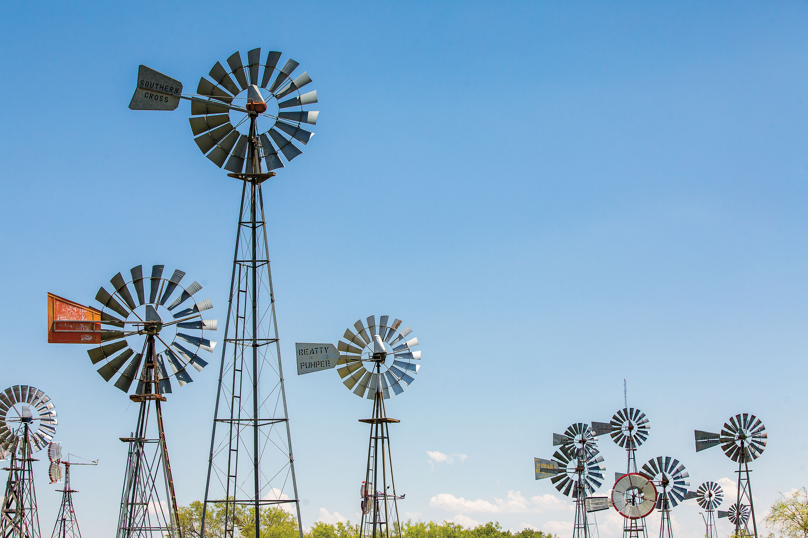
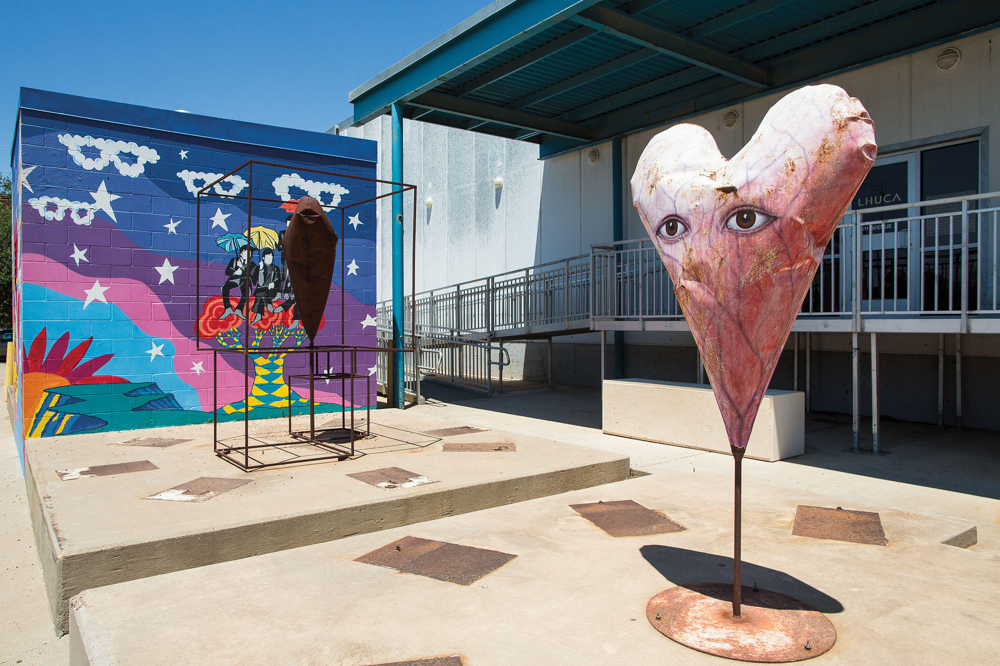
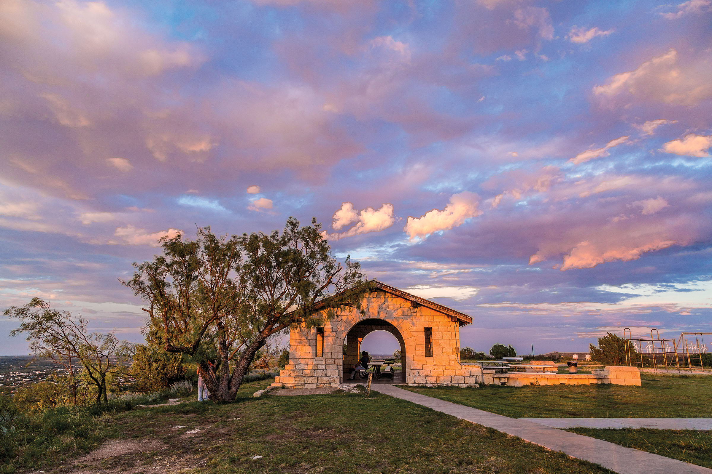

export const Title = () => (
  
    
    Panhandle Plains
  
);

<PageDescription>

Big skies, sweeping sunsets, and breathtaking vistas characterize this region, where something new is always on the horizon

</PageDescription>

<Caption>A variety of windmills fill the sky at the American Windmill Museum in Lubbock. Photo by Tom McCarthy Jr.</Caption>

<Row>

<Column colSm={12} colMd={4} colLg={8}>

## **Creative Hub**
### Lubbock’s art scene flourishes from deep High Plains roots
**By Clayton Maxwell**

Lubbock may not be the first city that comes to mind when considering the arts in Texas, but maybe it should be. The High Plains town that nurtured many of Texas’ most exalted musicians—Buddy Holly, Waylon Jennings, Joe Ely, Terry Allen, and Jimmie Dale Gilmore to name a few—must have some creative fairy dust blowing through its Caprock winds. The visual arts are now finding fertile soil here, too. Just walk through the galleries and workshops of the Lubbock Cultural District, and you’ll get a whiff of the artistic freedom inspired by the city’s wide-open spaces and 265 days of sunshine a year—a freedom that also comes from a cost-of-living low enough that artists don’t sweat the rent. Like the wildly spinning wind turbines you pass on the drive into town, the “Hub City” is generating energy worthy of attention. If you are one of those travelers who buzzes through Lubbock on your way to New Mexico or Colorado, consider staying for the weekend to see what you’re missing.

<Caption>Colorful murals adorn the sides of buildings alongside public art pieces in Lubbock’s Cultural District.</Caption>

For a whopping taste of the art buzz in Lubbock, head over to the First Friday Art Trail, a monthly crescendo of creativity in the Lubbock Cultural District. Charles Adams Studio Project—a nonprofit that supports local artists with workshops, studio space, and an artist-in-residence program—is central to the action. In the gallery of CASP’s founder, Charles Adams, works such as the sweeping landscapes by contemporary photographer Ashton Thornhill are proof that, as Adams explains, you can capture the Texas countryside without always “cowboying it up.” If your visit doesn’t coincide with the first Friday of the month, you can still head over to the Cultural District’s Two Docs Brewing Co. and admire the surrounding architecture and whimsical murals. It will be much quieter than it is during FFAT, but you can still soak up some of the art vibe.

You can’t come to the hometown of Buddy Holly and Joe Ely and not see any live music. When the much-anticipated 2,200-seat Buddy Holly Hall of Performing Arts and Sciences opens this year, the high-tech $154 million facility will rival any theater in the country. In the meantime, spend a little time on musical sacred ground on Buddy Holly Avenue in the Depot Entertainment District. The divey Blue Light Live—where Lubbock native Amanda Shires and her husband, Jason Isbell, played often before they hit it big—is home to Lubbock’s best Red Dirt bands—like Flatland Cavalry—catch them if you can. Also on Buddy Holly Avenue, the historic art deco Cactus Theater brings in big Texas talent like Patty Griffin and Kelly Willis.

Lubbock makes it easy to get artsy. Sign up for an affordable printmaking class with the capable staff at the Helen DeVitt Jones Print Studio, one of CASP’s facilities, and walk away with work worthy of hanging on your wall. Check the CASP website (casp-arts.org) for upcoming classes or arrange your own group lesson. Nearby, the Louise Hopkins Underwood Center for the Arts is a community art hub that—like CASP—is leading Lubbock’s artistic renaissance. Visit its galleries and check the events calendar; with clay workshops, sound meditations, and contra dances, LHUCA helps you get your own creative juices flowing. 

</Column>

<Column colSm={6} colMd={4} colLg={4}>
<AdGroup id={['ad37']}/>
<AdGroup id={['ad36']}/>
<AdGroup id={['ad45']}/>
</Column>

</Row>

<Row>
<Column colSm={6} colMd={3} colLg={4}>
<AdGroup id={['ad39','ad42','ad44']}/>
</Column>
</Row>

<Row>

<Column colSm={12} colMd={4} colLg={8}>

“If you want to make art in Lubbock, you can do it,” says Chad Plunket, director of CASP, affirming the city’s can-do artistic spirit. “It’s an affordable town. And so if you have an idea, well, do it. There are other people who’ll help you. I think that LHUCA and CASP are just examples of that. We now sort of own a whole downtown city block that’s dedicated to the arts. I do think that’s unique to Lubbock and the West Texas hard-work mentality—things can happen here.”

The revamp of the historic Pioneer Pocket Hotel along the red-brick streets of downtown has brought a much-needed lodging option to Lubbock. Rather than snooze in a generic chain hotel, you can now unwind in a room with a little soul. When you stay at the Pioneer, a redevelopment project that includes residential apartments and retail, you are a short elevator ride away from the building’s ground floor and two of Lubbock’s finest hangouts: The Brewery LBK, a light-filled brewpub with affable staff and tasty craft beer; and The West Table Kitchen and Bar, an upscale eatery helmed by skilled local chef Cameron West. (West’s grandfather, Dirk West, just happens to have been both a former Lubbock mayor and the cartoonist who devised Raider Red, the red-bearded, gun-toting mascot of Texas Tech University.)

A visit to La Diosa Cellars, a bistro in Lubbock’s Depot Entertainment District, is like a visit to the home of an eccentric aunt—Frida Kahlo homage décor, bright walls, and fanciful lamps. This aunt entertains with tasty Spanish tapas and wines from across the globe. Who knew you could find *albóndigas* (Spanish meatballs) and paella in the High Plains of Texas? The owner, Sylvia McPherson, is the wife of Texas winemaker Kim McPherson, whose tasting room is just down the street in the historic Coca-Cola Bottling Plant. After your feast, take a stroll to McPherson Cellars to sample wines born of local terroir and further your gastronomic glee.

Pay homage to the rock ’n’ roll trailblazer who died far too young at the Buddy Holly Center and J.I. Allison House, now located together on Crickets Avenue (in case you aren’t up on your Holly trivia, his band was named the Crickets). You can hang out in the house where Holly and his bandmate Allison sat in his bedroom and wrote “That’ll Be the Day.” You can see the actual pair of iconic black specs that Holly was wearing when he died in a plane crash in 1959 as well as his 1958 Fender Stratocaster. Tours may be closed due to COVID-19, so call in advance.

Be sure to stop by Holly’s gravesite in the City of Lubbock Cemetery on the edge of town. You can’t miss it—an etching of the Stratocaster graces his modest marble headstone by the cemetery’s main road. Just look for the guitar picks and other mementos placed by fans who have journeyed here from across the globe.

Wind down from your creative undertakings over a tasty margarita or cold michelada at Cocina de La Sirena, an inventive Latin-inspired restaurant tucked away in a courtyard in a strip mall. One taste of braised short-rib sliders on housemade cemita rolls with smoked blue cheese and onion jam, and you’ll say, “Toto, we’re not in Tex-Mex anymore.”

A quiet Sunday morning in Lubbock is an ideal time go for a stroll through Texas Tech’s public art collection, named one of the top 10 in the U.S. by *Public Art Review*. Meander through 100 works by notable Texas and international artists like the great sculptor James Surls, whose *Complete Fragment* sculpture was installed in early 2019. And because art and music collide often in Lubbock, check out musician Terry Allen’s bronze sculpture *Read Reader*, known to locals as “Bookman.” With the ArtTrek app to guide you, a stroll on the Texas Tech campus can lead you to the best art you’ve seen all year without even stepping foot in a museum. 

</Column>

<Column colSm={12} colMd={4} colLg={4}>

<Caption>Big Spring State Park. Photo by Will van Overbeek.</Caption>

### Panhandle Plains Texas State Parks: Hidden gems

**Caprock Canyons State Park &amp; Trailway**

Hike, bike, or ride horses along 90-plus miles of trails. Camp, geocache, or go for a scenic drive. Boat, fish, or swim in the 120-acre Lake Theo. View wild animals in their native habitats, including bison, pronghorn, and Mexican free-tailed bats. Watch for as many as 175 species of birds. Choose from a variety of campsites to spend the night (or reserve a room at the spacious Lake Theo Lodge) and rest up for your next day of adventure.

**Other hidden gems:**
- Copper Breaks State Park
- Lake Colorado City State Park

**More Panhandle Plains State Parks:** 
- Abilene SP
- Big Spring SP
- Fort Richardson SP, SHS & Trailway
- Lake Arrowhead SP
- Palo Duro Canyon SP
- Possum Kingdom SP
- San Angelo SP

<AdGroup id={['ad41']}/>

</Column>

</Row>

<Row>
<Column colSm={12} colMd={4} colLg={8}>
<RegionListing title="Panhandle Plains" color="red" region="PANHANDLE PLAINS" ads={['ad39','ad42','ad44']}/>
</Column>

<Column colSm={6} colMd={4} colLg={4}>
<AdGroup id={['ad37','ad36','ad45','ad41','ad39']}/>
<AdGroup id={['ad42','ad44','ad40','ad38','ad43']}/>
</Column>

</Row>