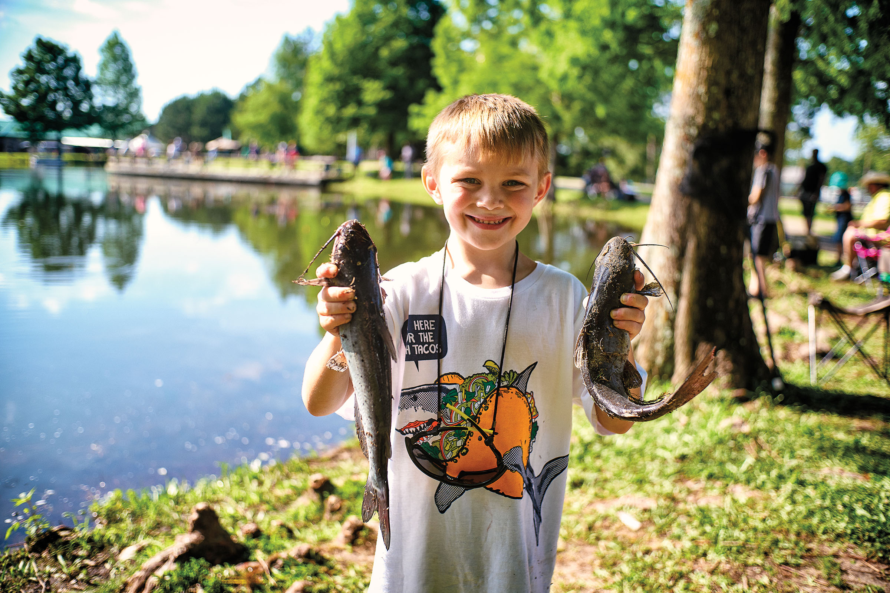
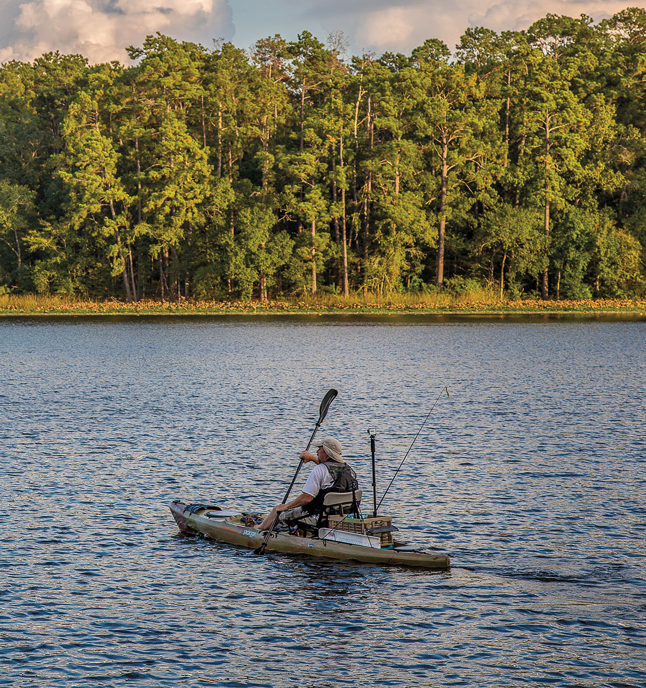
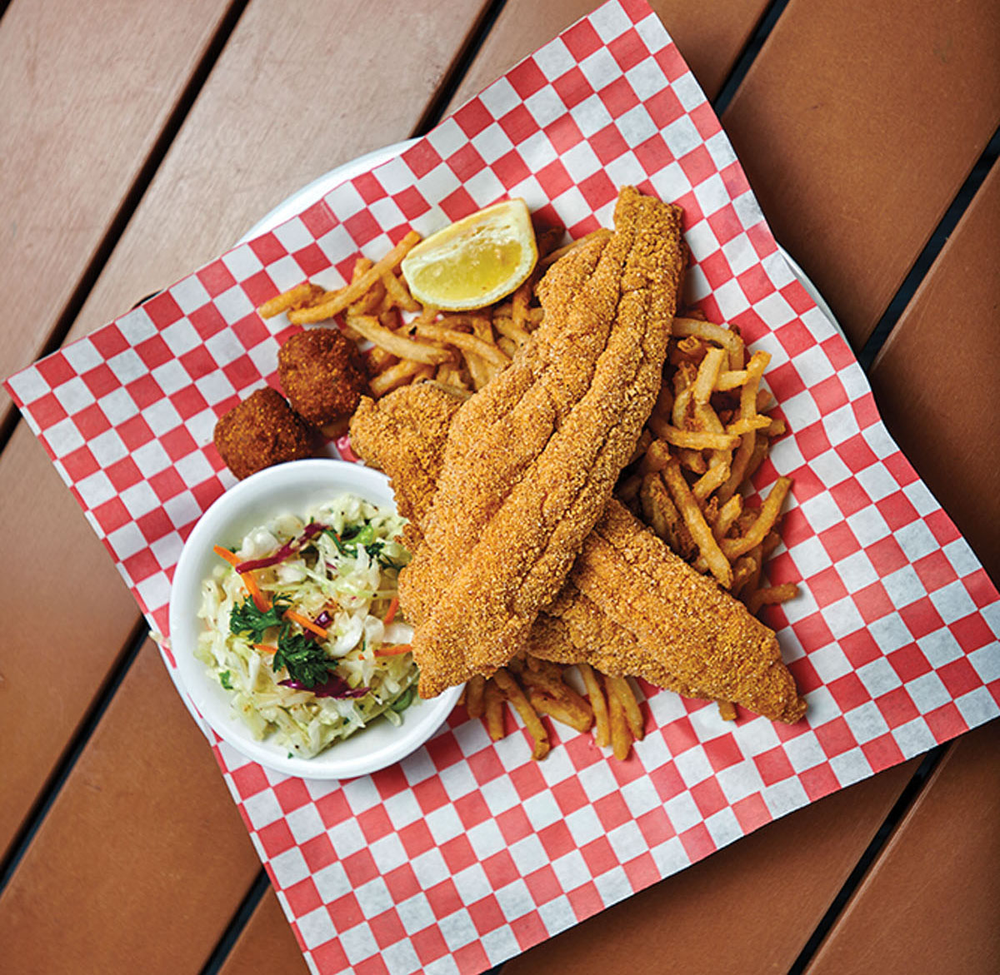

export const Title = () => (
  
    
    Piney Woods
  
);

<PageDescription>

History and nature attract visitors to this region cloaked in majestic forests and beaming with Southern charm

</PageDescription>

<Caption>Texas Freshwater Fisheries Center. Photo by Dave Shafer.</Caption>

<Row>

<Column colSm={12} colMd={4} colLg={8}>

## **New Trips in Old Areas**
### The Post Oak Savannah region of East Texas is famous for its fishing, railroad history, and foliage
**By Dan Oko**

The southern span of the Post Oak Savannah region in East Texas evolved out of ancient woodlands of oak and hickory that once stretched from Canada to Central America. These timbers bridge the state’s Blackland Prairie ecoregion and the Piney Woods, where long ago dark forest paths captured the hearts and minds of explorers. Portions of the Camino Real, a route that connected Mexico City to the Red River, ran through the territory before the birth of Texas. Today, the names of many towns refer to faraway destinations, such as Athens, Palestine, and Corsicana, and ranching and development have replaced much of the forest. Still, travelers today can find bucolic stands of old growth (with fall foliage), alluring small towns, and a shot at catching a trophy fish.

The Railroad Heritage Center in Palestine—run by the nonprofit Texas State Railroad Society—houses a remarkable 17-by-37-foot model train display featuring scenes decorated with realistic details and whimsical additions like miniature dinosaurs. Originally built by the late Paul Domis of Dallas, this display alone makes the center worth a stop. Other exhibits illustrate the importance of railroads in Texas’ history and America’s westward expansion.

The Redlands Hotel in Palestine, built in 1914 to house train passengers before being transformed into office space for the International and Great Northern Railway, has charm to spare. Thanks to owner Jean Mollard, the historic exterior and lobby have been restored to an approximation of their former glory, boasting smart industrial architecture with chic Victorian touches. Today, the spacious, modern rooms are popular among riders on the Texas State Railroad, which has its western terminus nearby. The hotel’s Queen St. Grille offers fine dining. Train enthusiasts will want to check out the second-floor gallery devoted to Palestine’s railroad heritage.

The Pint and Barrel Drafthouse in Palestine’s Old Town is a family-friendly gastropub that offers a well-curated tap selection and toothsome bar food like smothered fries, pulled-pork sandwiches, and seasonal soups. Just across the way, Oxbow Bakery (open Thurs-Sat, 10 a.m.-3 p.m.) draws travelers from across the country for its pies. Fans of collectible heirlooms and farmhouse décor can find everything from hand-hewn dining tables to taxidermy mounts and crockery. Ye Olde Auction House on Main Street, the Old Magnolia Mercantile, and the booths at Old Town Vintage & More in downtown Palestine are also worth exploring.

After you’ve filled your trunk with newfound treasures, head 30 miles northwest to Athens, the self-proclaimed birthplace of the hamburger. True or not, the Ole West Bean and Burger in downtown Athens is a local institution for good reason—service with a smile and a menu featuring comfort food and loaded burgers. There’s not only a salad bar but also an ice-cream bar for travelers with a sweet tooth. Boathouse Bar and Grill at Lake Athens Marina offers seafood in an alfresco setting.

</Column>

<Column colSm={12} colMd={4} colLg={4}>

<AdGroup id={['ad46']}/>

<Caption>Huntsville State Park. Photo by Will van Overbeek.</Caption>

</Column>
</Row>

<Row>
<Column colSm={6} colMd={3} colLg={4}>
<AdGroup id={['ad47']}/>
</Column>
<Column colSm={6} colMd={3} colLg={4}>
<AdGroup id={['ad53']}/>
</Column>
</Row>

<Row>

<Column colSm={12} colMd={4} colLg={8}>

<Caption>Catfish plate at The Boathouse Bar & Grill, Post Oak Savannah. Photo by Dave Shafer.</Caption>

The Texas Freshwater Fisheries Center on Lake Athens has exhibits featuring assorted aquatic environments and an alligator enclosure. Other attractions include the Texas Freshwater Fishing Hall of Fame, which offers plaques and videos dedicated to the many anglers, writers, and business people who have made the Lone Star State a world-class destination for fishing. Athens is also where the Texas Parks and Wildlife Toyota ShareLunker Program—dedicated to growing bigger largemouth bass in Texas—is headquartered. A gallery offers taxidermy models of some of the largest fish ever pulled from Texas lakes and rivers. There’s also a chance to see the “lunker bunker” where bass are bred, and a tram tour of the production ponds covering 37 acres. Afterward, try your luck at the center’s pond, where trout, catfish, and bluegill are stocked. Rods, tackle, and bait are provided with the price of admission.

The peaceful 104-acre East Texas Arboretum and Botanical Society in northwest Athens offers a glimpse of the remnant native forests of the Post Oak Savannah. Follow the trails across a small suspension bridge, skirting a bog where you may spot wildlife like birds, snakes, and other reptiles. There’s also a cultivated area featuring butterfly and botanical gardens, and the restored white clapboard Wofford House built in 1852. Then check into the historic century house on the hill at Tara Vineyard & Winery, just 5 miles northwest. The impressive Victorian-style home dates to the 1880s. The wraparound porch looks out on rolling hills roped by vines worthy of Tuscany. The Cellar Door at Tara Winery specializes in beef and seafood dishes that can be paired with the vineyard’s vintages, from cool, sweet whites to the top-selling Carriage House red.

Just 20 minutes from Athens, Purtis Creek State Park—with its shaded campsites and a 355-acre lake—has been popular with nature lovers since it opened in 1988. If you didn’t bring your own boat, take advantage of the new TPWD Paddle EZ program and rent a stand-up paddleboard or kayak from the self-service kiosk. The lake has stellar catch-and-release bass fishing and limited motorized traffic, so it’s a peaceful place to explore. Nearby woodlands were popular hunting grounds for the Wichita and Caddo tribes, and modern-day hikers and bikers will find about 6 miles of trail to explore. It’s the perfect place to park after a long weekend in the post oaks.

</Column>

<Column colSm={12} colMd={4} colLg={4}>

### Piney Woods Texas State Parks: Hidden gems

**Daingerfield State Park**

Walk the trails beneath 100-foot pines. Dive into the pristine water. Paddle, fish, camp, and rest your head in a rental cabin. These are some of the many ways to admire the abundant natural beauty in this area of East Texas. Visit in spring to see colorful wildflowers and blooming dogwoods in shades of blue, pink, and yellow. Visit in fall to see sweetgums, oaks, and maple trees in breathtaking shades of gold, red, and orange.

**Other hidden gems:** 
– Atlanta SP
– Lake Bob Sandlin State Park 
– Mission Tejas State Park

**More Gulf Coast State Parks** 
- Caddo Lake SP
- Huntsville SP
- Lake Livingston SP
- Martin Creek Lake SP
- Martin Dies Jr. SP
- Tyler SP
- Village Creek SP

For more information, directions, and amenities, get your [free mobile guide to all 80-plus state parks](https://texasstateparks.org/app).

<AdGroup id={['ad54','ad55','ad56']}/>

</Column>

</Row>

<Row>
<Column colSm={12} colMd={4} colLg={8}>
<RegionListing title="Piney Woods" color="green" region="PINEY WOODS" ads={['ad47','ad53','ad56','ad52','ad48','ad50','ad51']}/>
</Column>

<Column colSm={6} colMd={4} colLg={4}>
<AdGroup id={['ad46','ad54','ad55','ad47','ad53','ad56','ad52','ad48','ad50','ad51']}/>
<AdGroup id={['ad56','ad52','ad48','ad50','ad51','ad49','ad57','ad49','ad57']}/>
</Column>

</Row>

<!-- 
<FeatureCard
  title="Search all cities and listings in the Piney Woods"
  actionIcon="arrowRight"
  href="/things-to-do-in-texas?region=piney-woods"
  color="dark">

</FeatureCard>
<Caption>Big Thicket National Preserve, 10 Mile Bayou. Photo by Will van Overbeek.</Caption>
-->