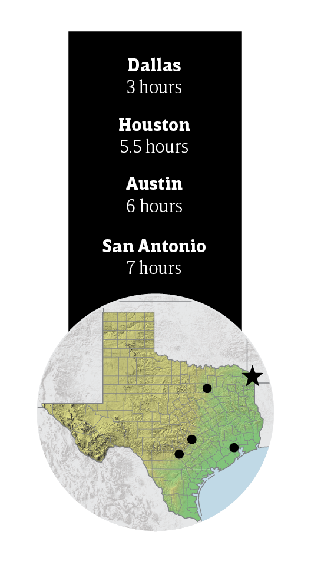

export const Title = () => (
  
    
    Piney Woods
  
);

<PageDescription>

A mix of cultures under the influence of the Deep South merge in wondrous forestland

</PageDescription>

<AdGroup id={['ad34']}/>

<Row>

<Column colSm={12} colMd={6} colLg={10}>

<Caption>Mural depicting piano player and composer Scott Joplin in Texarkana. Photo by Tiffany Hofeldt</Caption>

## **The State Line Two-Step**

</Column>
</Row>

<Row>

<Column colSm={12} colMd={6} colLg={8}>

### Get two places for one on a visit to the Northeast Texas crossroads of Texarkana
**By Paul McDonnold**

There’s only one post office in the United States where you’re likely to step across the state border while dropping off mail. The 1933 State Line Post Office and Federal Courthouse symbolizes Texarkana’s distinctive position straddling the border of northeast Texas and southwest Arkansas. Texarkana—the name also pays tribute to Louisiana—was born in 1873 at the junction of two expanding railroads. There’s plenty to see on both sides of State Line Avenue, the historic main street that traces the border through downtown. The Historic 1894 building, a former grocery store, features a 12,000-square-foot art gallery. And the restoration of the 1925 Hotel Grim, now an eight-story apartment building, is nearing completion. Surrounded by Piney Woods scenery and featuring local attractions dedicated to famous sons including musician Scott Joplin and businessman H. Ross Perot, Texarkana feels at once far-flung and at the center of everything.

</Column>

<Column colSm={3} colMd={2} colLg={3}>

</Column>

</Row>

<Row>

<Column colSm={12} colMd={5} colLg={8}>

### Stay

#### Nettles Nest Country Inn

This cozy cabin ($120/night) sits on 16 acres inhabited by foxes, bobcats, and other denizens of the forest. Along with a kitchenette, amenities include a DVD collection; a lighted outdoor pavilion with gas and charcoal grills; and loaner mountain bikes, kayaks, and a paddleboat.

### See

#### Spring Lake Park

In October, this 145-acre city park hosts an annual free screening of _The Town That Dreaded Sundown_ (check the city website for date updates, [ci.texarkana.tx.us](http://ci.texarkana.tx.us)). The 1976 horror film dramatizes a series of unsolved local murders that occurred in 1946, today remembered as the “Texarkana Moonlight Murders.” The park, open daily, has trails, sports fields, a splash pad, picnic tables, a disc golf course, and fishing on Spring Lake.

#### Ace of Clubs House

Inspired, legend says, by a winning poker hand, James Draughon, a pioneer and early mayor of Texarkana, built this Italianate two-story brick mansion in 1885 in the shape of a club from a deck of cards. Featuring a spiral staircase and octagonal rooms, the house is now a museum filled with the period furniture and personal belongings of the Moore family, who last owned the house.

#### Perot Leadership Museum

“Sell it. You can’t eat it,” reads the sign on a small wood-sided building located within the Texarkana College Library. This replica 1930s cotton brokerage is part of an exhibit about the life of H. Ross Perot. The son of a cotton broker, the late Texarkana native was a pioneering entrepreneur in computer technology. A mural traces the billionaire’s life from Texarkana to his failed but influential campaign bids for president in 1992 and 1996.

#### Four States Auto Museum 

Browse memorabilia like vintage gas pumps with glass windows that show the gasoline inside and a rotating collection of rolling stock that traces automobile evolution with examples such as a Ford Model T and a Smokey and the Bandit-
style 1979 Trans Am. In October, owners of vintage cars and hot rods arrive to compete in the Fall Car Show.

### Eat

#### Old Tyme Burger Shoppe

Old Tyme is a fitting name for this eatery—they keep it traditional here. But “Burger Shoppe” is a bit misleading: The menu also offers favorites like homestyle plate lunches and dinners, chicken-fried steak, chef’s salad, and chili with cornbread. Old Tyme also serves breakfast—think pancakes, bacon, eggs, and the like.

#### Naaman’s BBQ 

You might think this local joint took a risk in 2019 by vacating its repurposed gas station in Texas to move to Arkansas. But Naaman’s new digs are literally just across the street. There’s now more space for customers to enjoy the award-winning ’cue. Beef brisket and pork ribs are popular, along with twice-baked potatoes, mac and cheese, and cheesy corn.

### Ragtime Review

Scott Joplin (1868-1917), the “King of Ragtime,” got his start in Texarkana. Self-guided tour maps—available at the Texarkana Chamber of Commerce (819 N. State Line Ave.)—follow his steps around town. The Texarkana Museum of Regional History has an exhibit with a piano on which he is believed to have learned to play. [texarkanamuseum.org](http://texarkanamuseum.org)

### Camping and RV Info

Shady Pines RV Park offers 48 RV spaces with hook-ups, bathroom and laundry facilities, a kitchen, a meeting room, and a private fishing lake. 10010 W. 7th St.; 903-832-1268; shadypinesrv.com/rv-park. At Wright Patman Lake, the Corps of Engineers maintains six campgrounds among the lakeside pine forest. recreation.gov/camping/gateways/509

</Column>

<Column colSm={12} colMd={3} colLg={3}>

<StatePark>

<Caption>Mission Tejas. Photo by Chase Fountain, TPWD</Caption>

##### Piney Woods

### Celebrate 100 Years of Texas State Parks

Join in the celebration! The Texas State Parks system is turning 100 years old in 2023. Learn more and discover all the ways you can help celebrate at [texasstateparks.org/100years](https://texasstateparks.org/100years).

#### Mission Tejas State Park

Long before the Texas Revolution, thousands of settlers traveled “El Camino Real” from Mexico to Louisiana. You can see the remnants of this trail at Mission Tejas State Park. In addition to camping, hiking, fishing, and picnics, the park boasts two more glimpses into Texas history: a representation of Mission San Francisco de los Tejas (built by the Civilian Conservation Corps) and the Rice Family Home, a log cabin built in the early 1800s.

#### More Piney Woods State Parks

**Atlanta State Park **
 

**Caddo Lake State Park**
 

**Daingerfield State Park**
 

**Huntsville State Park**
 

**Lake Bob Sandlin State Park**
 

**Lake Livingston State Park**
 

**Martin Creek Lake State Park**
 

**Martin Dies Jr. State Park**
 

**Tyler State Park**
 

**Village Creek State Park**
 

</StatePark>

</Column>

</Row>

<Row>
<Column colSm={12} colMd={4} colLg={8}>
<RegionListing title="Piney Woods" color="green" region="PINEY WOODS" ads={['ad81', 'ad86', 'ad93']}/>
</Column>

<Column colSm={6} colMd={4} colLg={4}>
<AdGroup id={['ad36']}/>
</Column>

</Row>

<!-- 
<FeatureCard
  title="Search all cities and listings in the Piney Woods"
  actionIcon="arrowRight"
  href="/things-to-do-in-texas?region=piney-woods"
  color="dark">

</FeatureCard>
<Caption>Big Thicket National Preserve, 10 Mile Bayou. Photo by Will van Overbeek.</Caption>
-->