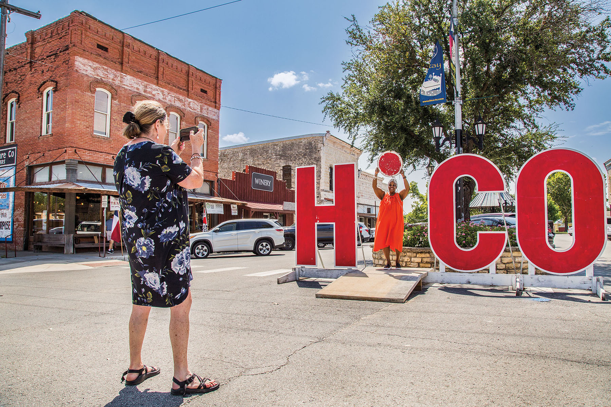
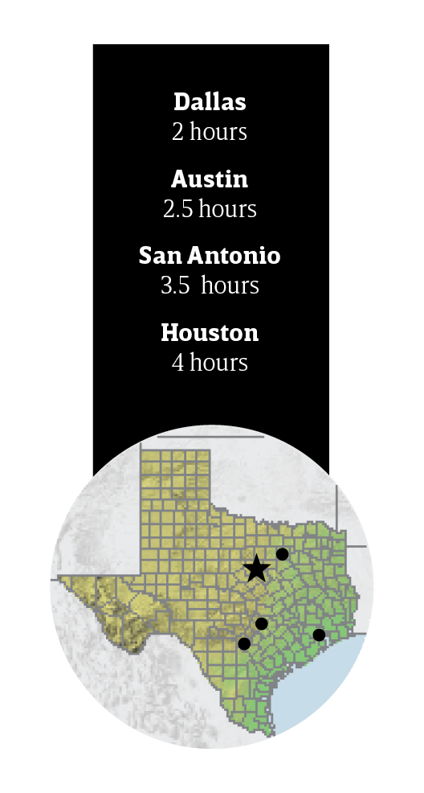
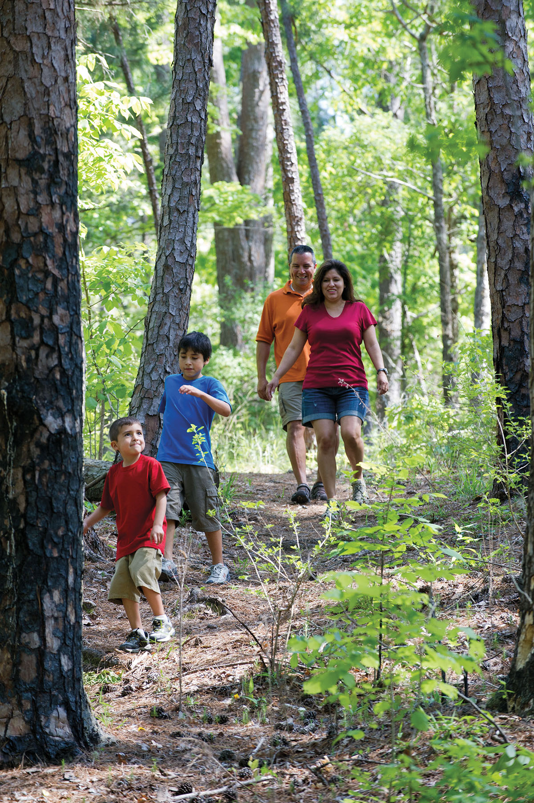

export const Title = () => (
  
    
    Prairies and Lakes
  
);

<PageDescription>

From fast-moving rides to slow-moving experiences, the heartland of Texas offers something for everyone

</PageDescription>

<AdGroup id={['ad26', 'ad27', 'ad31']}/>

<Row>

<Column colSm={12} colMd={6} colLg={10}>

<Caption>Mural depicting piano player and composer Scott Joplin in Texarkana. Photo by Tom McCarthy Jr.</Caption>

## **Walk It Out**

</Column>
</Row>

<Row>

<Column colSm={12} colMd={6} colLg={8}>

### Pedestrian-friendly Hico has plenty of diversions to explore on foot
**By June Naylor**

For a town of around 1,500, Hico packs a wallop, drawing in city dwellers who enjoy small town charm paired with urban amenities. Sitting at the tip-top of the Hill Country, where US 281 crosses State Highway 6, Hico (HYE-coe) first earned its stop-worthy reputation from the towering meringue pies at the Koffee Kup Family Restaurant. These days, there’s far more than dessert to keep travelers amused for a full weekend (though Wiseman House Chocolates is still around to satisfy a sweet tooth). Everything’s in walking distance, from the limestone-studded Bosque River on the south end of downtown to the statue of Billy the Kid—the outlaw said to have lived out his life here in anonymity—at the north end of downtown. The only time a car is needed is to head 20 miles south to Hamilton to check out art, music, and eats in the seat of Hamilton County.

</Column>

<Column colSm={3} colMd={2} colLg={3}>

</Column>

</Row>

<Row>

<Column colSm={12} colMd={5} colLg={8}>

### Stay

#### Midland Hotel & Chop House

The handsome brick building anchoring one downtown corner is an 1896 landmark offering 14 rooms (starting at $149 a night) with historical beauty and modern comforts, as well as an exceptional restaurant (see sidebar below).

### Shop

#### Hico Mercantile

The grand 1895 opera house is now home to an assemblage of fresh boutiques where one can purchase a range of items, including a Dolly Parton prayer candle, wooden candlesticks, and framed vintage botanical prints.

#### Hill Country Dwellings

A side hustle of sisters and designers Jane and Cindy Schumacher, this shop shines with earthy sophistication in its selection of textiles, handmade wooden biscuit cutters, locally crafted pottery, and art.

### See 

#### City Park
Wander south along Elm Street, which ends at this shady, welcoming retreat on the Bosque River. Enormous pecan trees provide shelter from the sun, and plentiful tables near the clear water supply a bucolic backdrop for picnicking.

#### Ramsey Collection

Book an appointment to see a stunning private collection of American and European art from the 16th to early 20th centuries. The former bank building on the Hamilton County Courthouse square houses hundreds of works by the likes of Edgar Degas and Diego Rivera.

### Eat

#### The Grain Drafthouse & Eatery

Look for the old grain silos, relocated from a nearby farm, to find Hamilton’s new live music venue. Listen to headliners like Gary P. Nunn and local acts while eating fried cheese curds and sipping a ranch water.

#### 2nd Street Bakeshop & Coffee Co.

A refurbished Victorian home makes morning coffee and afternoon tea special events. Few things are more comforting than settling into a corner here with a seasonal honey-lavender latte, a lemon-blueberry scone, and a good book.

#### Eis

The sandwich and ice cream shop offers a delicious smoked chicken salad sandwich along with a selection of locally sourced sodas, wines, and beer. Pair with locally made cheeses and smokehouse meats to complete a riverside picnic.

### All a Board

It’s more than chef Eric Hunter’s menu that inspires return visits to the Chop House, found within the Midland Hotel. It’s the inspired craftsmanship he employs with every item. He makes the cavatelli pasta from semolina fresh each morning. He prepares smoked brisket and queso as well as molasses-cured salmon. The charcuterie presentation involves meats he cured, grainy mustard he made from scratch, vegetables and fruits he pickled, and even a wooden board he milled, cut, stained, and finished. You taste the passion in every bite.

### RV Info

Bosque River RV Park has 21 spaces to pull your RV into. Hook up to the complimentary Wi-Fi or enjoy the park’s volleyball court and hike-and-bike trail. 500 Elm St. 254-796-4620, ext. 2; [hico-tx.com/visitors/rv-park](http://hico-tx.com/visitors/rv-park)

</Column>

<Column colSm={12} colMd={3} colLg={3}>

<StatePark>

<Caption>Lake Ray Roberts State Park. Photo by Chase Fountain, TPWD</Caption>

##### Prairies and Lakes

### Celebrate 100 Years of Texas State Parks

Join in the celebration! The Texas State Parks system is turning 100 years old in 2023. Learn more and discover all the ways you can help celebrate at [texasstateparks.org/100years](https://texasstateparks.org/100years).

#### Fort Boggy State Park

Halfway between Dallas and Houston on I-45, quiet Fort Boggy offers a peaceful getaway. Hike or bike on 3 miles of trails or swim, paddle, or fish in 15-acre Sullivan Lake. (Pro tip: You don’t need a fishing license in a state park.) Maximize your zen time by upgrading to a cabin (some of the newest in the Texas State Parks system) with multiple beds, climate control, and a screened-in porch.

#### More Prairies and Lakes State Parks

**Bastrop State Park**
 

**Bonham State Park**
 

**Buescher State Park**
 

**Cedar Hill State Park**
 

**Cleburne State Park**
 

**Cooper Lake State Park**
 

**Dinosaur Valley State Park**
 

**Eisenhower State Park**
 

**Fairfield Lake State Park**
 

**Fort Parker State Park**
 

**Lake Mineral Wells **
 

**State Park & Trailway**
 

**Lake Somerville State Park & Trailway**
 

**Lake Tawakoni State Park**
 

**Lake Whitney State Park**
 

**Lockhart State Park**
 

**Meridian State Park**
 

**Mother Neff State Park**
 

**Palmetto State Park**
 

**Purtis Creek State Park**
 

**Ray Roberts Lake State Park**
 

**Stephen F. Austin State Park**
 

</StatePark>

</Column>

</Row>

<AdGroup id={['ad27', 'ad31', 'ad03', 'ad10', 'ad23', 'ad28', 'ad06', 'ad09']}/>

<Row>
<Column colSm={12} colMd={4} colLg={8}>
<RegionListing title="Prairies and Lakes" color="teal" region="PRAIRIES AND LAKES" ads={['ad68', 'ad51', 'ad85', 'ad95', 'ad82', 'ad103','ad80']}/>
</Column>

<Column colSm={12} colMd={4} colLg={4}>

</Column>

</Row>

<!--
<FeatureCard
  title="Search all cities and listings in the Piney Woods"
  actionIcon="arrowRight"
  href="/things-to-do-in-texas?region=piney-woods"
  color="dark">

</FeatureCard>
<Caption>Big Thicket National Preserve, 10 Mile Bayou. Photo by Will van Overbeek.</Caption>
-->