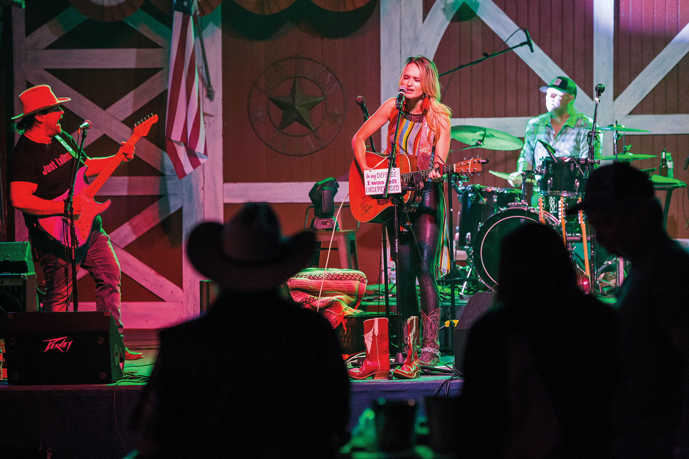
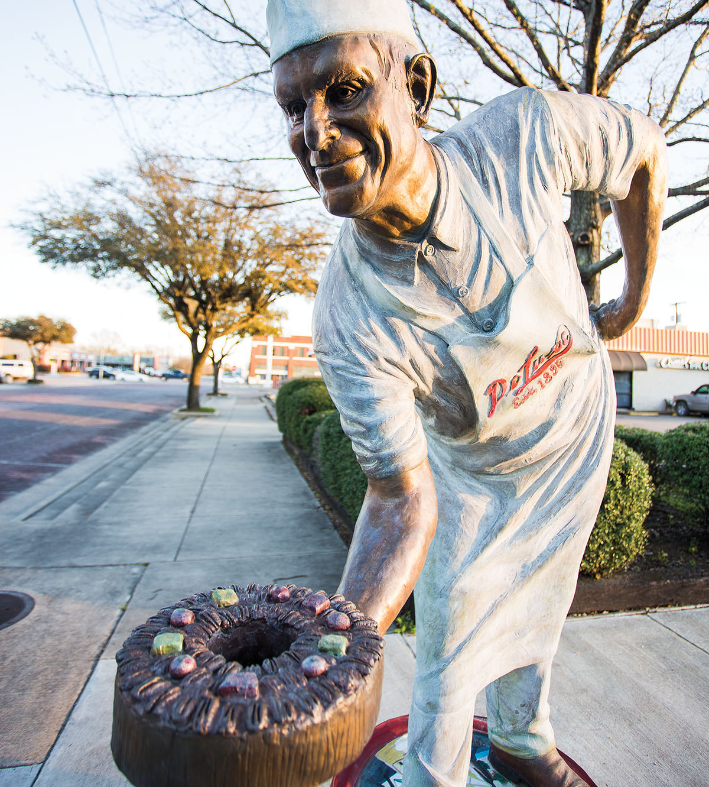

export const Title = () => (
  
    
    Prairies and Lakes
  
);

<PageDescription>

From fast-moving rides to slow-moving experiences, the heartland of Texas offers something for everyone

</PageDescription>

<Caption>Bri Bagwell performing at the Oil Derrick Saloon inside the Corsicana Opry. Photo by Tom McCarthy Jr.</Caption>

<Row>

<Column colSm={12} colMd={4} colLg={8}>

## **Corsicana**
### The Northeast Texas town is a hub for art, film, and television
**By Matt Adams**

Corsicana has gotten a lot of attention lately due to the hit Netflix docuseries _Cheer_, which follows the top-tier Navarro College cheerleading squad. _Cheer_ portrays the town as quaint and sleepy, but for those who know Corsicana outside of the small screen, the biggest draw is the town’s burgeoning art scene.

It’s not the first boom Corsicana’s experienced. Around the turn of the 20th century, drillers excavating a water well in the area inadvertently struck oil, instantly changing the modest agricultural hub’s fortunes. Corsicana quickly became one of the wealthiest and most cosmopolitan small cities in the state.

Over the decades, the town experienced ebbs and flows. But in the late 1980s the once-vibrant downtown stagnated, and its ornate, cornice-crowned buildings sat mostly deserted.

Then, about four or five years ago, Corsicana experienced something of a renaissance. Artists, craftspeople, chefs, and filmmakers migrated there from Dallas, Austin, New York, and Los Angeles, and swept the dust off the place.

Instead of conjuring mineral wealth from Corsicana’s soil, these new wild­catters found creative inspiration. Without losing sight of its past, Corsicana is striding into a new and exciting future.

About 20 minutes west of town off State Highway 31, Purdon Groves occupies a 21-acre patch of prairie and forest. The site features an option for lodging: The canvas bell tent is sizable and outfitted with electricity, a comfy bed, and heating and air conditioning, with a shared bathhouse just steps away.

Owners Houston and Sherry Clark hold private farm tours for guests in groups of six or fewer to come see their land and livestock, including a drove of kunekune, a heritage breed of small domestic pigs. Guests can tour the hydroponic growing operation that provides some of the produce used at the site’s Chef’s Table Experiences. 

These intimate outdoor dinners are held under a sprawling old oak tree and feature delicacies prepared by chef Tanner Purdum, formerly of the James Beard Award-winning restaurant Shaya in New Orleans. As an added treat, the Clarks often invite artist friends to discuss their work while you dine.

Treasures abound at Peace, Love, Retro, a funky vintage shop on Beaton Street that reflects the wave of eclectic people, places, and ideas that have taken root in Corsicana. Here you’ll find vintage denim and concert T-shirts, vinyl records, midcentury home décor, and classic toys, games, and comics. Whether you’ve been searching for an original-­print Star Wars theatrical poster or a Jack Daniels barrel coffee table, chances are you’ll find it here.

For 79 years, the Old Mexican Inn Restaurant and Cantina has been a staple in the community, serving Tex-Mex favorites and top-notch margaritas. The housemade salsa and “orange dip” are customary before the entrees hit the table. Both appetizers are legendary around these parts, especially the orange dip, a secret recipe concocted of mayonnaise and paprika, originally created as a salad dressing.

The Warehouse Living Arts Center is a gallery and performance space that has long been an important hub of artistic expression in Corsicana. Founded in the 1970s, it’s one of a handful of venues—along with the Palace Theatre, the Corsicana Opry, and Outside the Lines Creative Studios—where visitors can enjoy theatrical productions, stand-up comedy, or live music. The Warehouse’s lineup features a mix of modern and classic shows like the musical Gypsy.

<Caption>A statue honoring Collin Street Bakery and its famous DeLuxe Fruitcake stands on Main Street in Corsicana. Photo by Tom McCarthy Jr.</Caption>

</Column>

<Column colSm={12} colMd={4} colLg={4}>

<AdGroup id={['ad61']}/>
<AdGroup id={['ad74']}/>

### Prairies and Lakes Texas State Parks: Hidden gems

**Eisenhower State Park**

Nestled on Lake Texoma north of Dallas, this is the kind of place you go to catch a few fish or watch a spectacular sunset. Walk or bike more than 4 miles of trails. Ride all-terrain vehicles or dirt bikes through beautiful backcountry woodlands (with required permit). Relax or swim at a pristine beach inside a cove surrounded by towering limestone cliffs. Sleep under the stars or reserve “Ike’s Cabin,” which has bunk beds and sleeps up to five people.

**Other hidden gems:**
- Fort Boggy State Park
- Lockhart State Park

**More Gulf Coast State Parks**
- Bastrop State Park
- Bonham State Park
- Buescher State Park
- Cedar Hill State Park
- Cleburne State Park
- Cooper Lake State Park
- Dinosaur Valley State Park
- Fairfield Lake State Park
- Fort Parker State Park
- Lake Mineral Wells State Park & Trailway
- Lake Somerville State Park & Trailway
- Lake Tawakoni State Park 
- Lake Whitney State Park
- Meridian State Park
- Mother Neff State Park
- Palmetto State Park
- Purtis Creek State Park
- Ray Roberts Lake State Park
- Stephen F. Austin State Park

For more information, directions, and amenities, get your [free mobile guide to all 80-plus state parks](https://texasstateparks.org/app).

</Column>

</Row>

<Row>
  <Column colSm={6} colMd={3} colLg={4}>
    <AdGroup id={['ad63','ad69','ad65','ad86']}/>
  </Column>
</Row>

<Row>
<Column colSm={12} colMd={6} colLg={8}>

No visit to Corsicana is complete without a stop at the world-famous Collin Street Bakery. While the pastry shop is best known for its fruitcakes, it also serves coffee and breakfast items like sausage rolls and biscuits. Many of its pastries are available to order online. 

Collin Street made headlines in 2015 for less-than-sweet news about an accountant who was caught embezzling millions from the bakery. The sensational story turned the eyes of Hollywood to Corsicana. The production of Fruitcake, a film starring Will Ferrell, was planned to begin in 2020 before the pandemic postponed it indefinitely. 

In recent years, several independent movies and television shows have been shot in Corsicana. The man leading that charge is Corsicana Police Chief Robert Johnson, who fell into acting about a decade ago and has since become a producer and writer in his spare time. He even made an appearance on _Cheer_.

Kyle Hobratschk, a visual artist and one of the primary architects of Corsicana’s artistic rebirth, founded 100 West, a residence for visiting artists and writers, in 2012. Set in the 19th-century Odd Fellows lodge, 100 West holds seasonal open houses where world-class artists show off the pieces they’ve created in Corsicana. In the past year, Hobratschk has hosted Noel Camardo, a photographer from Brooklyn; Michelle Weinberg, a multidisciplinary artist who splits time between New York and Miami, and whose work Tropic Episodes recently graced Miami International Airport; and Rachel Wolfson Smith from Austin, who creates large-scale graphite drawings. All three lived and worked out of 100 West temporarily, using the bohemian atmosphere to unlock new ideas and push their creative boundaries.

Weinberg’s residency at 100 West was her third time in Texas. She says the experience might have convinced her to stay a while and buy her own studio space in Corsicana.

“It’s not competitive or pre­programmed,” she says of the local art community. “I found it to be very open and welcoming.”

Along with its sister restaurant next door, the Across the Street Diner, the Across the Street Bistro is owned and operated by chef Andreas Kotsifos and is one of the finest dining experiences in Corsicana. It bills itself as a Mediterranean bistro (Kotsifos hails from Crete), but its fillets and prime rib rival those found at top Texas steakhouses. The restaurant boasts an extensive wine list, and the chocolate cake is well worth the calories.

Tucker Town Restaurant, about 6 miles southeast of town on State Highway 287, offers sustenance for the ride home. Tucker Town’s motto is “The best BBQ this side of anywhere,” and after sampling the brisket, fried okra, and mac and cheese, you just might agree. A wood shack with a counter and some picnic tables is all that comprises the restaurant—they’re currently building indoor seating—but the food proves more impressive.

While Netflix fans will eventually lose interest in Corsicana and its championship cheer squad, the town will continue to not just endure, but thrive. You might still rub shoulders with roughnecks, ranchers, and farmers at the local coffee shop, but it will be right next to painters, sculptors, and performers. All those influences create a culture that’s tough to replicate and hard to forget. 

</Column>

<Column colSm={12} colMd={4} colLg={4}>

<AdGroup id={['ad78']}/>
<AdGroup id={['ad79']}/>
<AdGroup id={['ad81']}/>

</Column>

</Row>

<Row>
<Column colSm={12} colMd={4} colLg={8}>
<RegionListing title="Prairies and Lakes" color="teal" region="PRAIRIES AND LAKES" ads={['ad66','ad67','ad68','ad71','ad85','ad58','ad59','ad60','ad62','ad64','ad63','ad69','ad65','ad86']}/>
</Column>

<Column colSm={12} colMd={4} colLg={4}>

<AdGroup id={['ad77','ad75','ad76','ad83','ad61','ad74','ad78']}/>
<AdGroup id={['ad70','ad82','ad84','ad72','ad80','ad79','ad81']}/>

</Column>

</Row>

<!--
<FeatureCard
  title="Search all cities and listings in the Piney Woods"
  actionIcon="arrowRight"
  href="/things-to-do-in-texas?region=piney-woods"
  color="dark">

</FeatureCard>
<Caption>Big Thicket National Preserve, 10 Mile Bayou. Photo by Will van Overbeek.</Caption>
-->