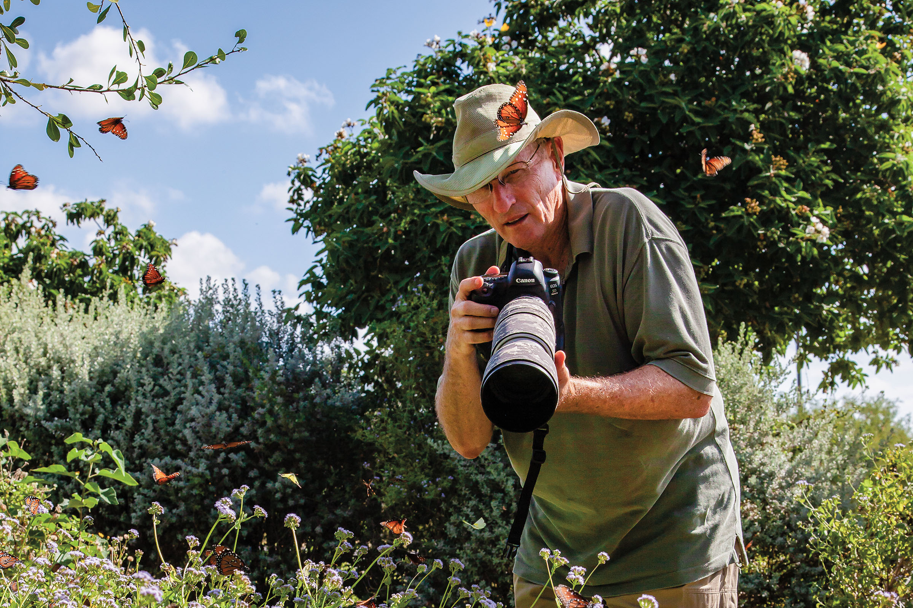

export const Title = () => (
  
    
    South Texas Plains
  
);

<PageDescription>

Abundant nature-viewing and vibrant cultural opportunities proliferate from the brush country to the Lower Rio Grande Valley

</PageDescription>

<Caption>Queens and Southern dogfaces swarm around a photographer, Paul Denman, as he strolls around one of the Valley’s butterfly gardens. Photo by Larry Ditto.</Caption>

<Row>

<Column colSm={12} colMd={4} colLg={8}>

## **Chasing butterflies**
### Retreat to the Rio Grande Valley for natural wonders and border culture
**By Daniel Blue Tyx**

The Rio Grande Valley contains a greater diversity of butterflies than anywhere else in the country—more than 300 species and counting, or roughly 40 percent of the butterflies in North America. All of those butterflies—condensed within a region that’s easy to traverse over a weekend—make a fall tour of the Valley a must-do on any Texas bucket list.

The weather in tropical South Texas is inviting year-round, but the very best time to see butterflies is October and November. That’s when monarchs are stopping over to rest and refuel at the halfway point of their transcontinental journey. If you time your trip just right, you might even glimpse the once-in-a-lifetime sight of hundreds of monarchs clinging to the branches of a single tree. But whether you catch the monarchs or not, you’ll soon find yourself strolling through sun-drenched gardens as hundreds of butterflies of every possible hue alight all around you. If you’re lucky—as I was during my own recent butterfly trail expedition—one might even land right on you.

Just up the road from the National Butterfly Center in Mission, The Bryan House bed-and-breakfast makes a terrific place to land. Owner Ariel King is a Texas master naturalist, and the grounds are a butterfly hot spot featured on eco-tours of the region.

The house itself was home to former U.S. Secretary of State William Jennings Bryan, a Nebraskan who began wintering in the Valley in 1909 because the warmer climate was beneficial for his wife’s arthritis. King has painstakingly restored the farmhouse to its former glory, complete with nods to both Bryan and butterflies in the form of campaign paraphernalia, butterfly-patterned pillows, and a library generously stocked with biographies and field guides. Before you retire to bed, consider driving a few blocks to The Loretto at Mission, where you can enjoy a sumptuous dinner of fish tacos in homemade flour tortillas with a creamy Sriracha-lime sauce.

Compared to birders, who hit the trails at the crack of dawn, butterfliers have it easy: Sun-loving butterflies don’t really become active until at least 9 a.m. That leaves plenty of time for savoring a requested breakfast of waffles and tacos delivered piping hot to the dining area or your room at the B&B.

</Column>

<Column colSm={6} colMd={4} colLg={4}>

<AdGroup id={['ad90']}/>
<AdGroup id={['ad92']}/>

</Column>

</Row>

<Row>
<Column colSm={6} colMd={3} colLg={4}>
<AdGroup id={['ad87']}/>
</Column>
<Column colSm={6} colMd={3} colLg={4}>
<AdGroup id={['ad88']}/>
</Column>
</Row>

<Row>
<Column colSm={12} colMd={6} colLg={8}>

Fueled for the day, head for the National Butterfly Center, which the North American Butterfly Association established in 2003 to further its mission of butterfly habitat conservation. The helpful staff in the visitor center can supply you with maps, field guides, and a butterfly checklist. From there, it’s off to explore the center’s 100 acres of butterfly gardens, woodland trails, and bird- and butterfly-viewing areas. The sheer number of butterflies alone is cause for wonder, but what makes the experience truly incredible is the kaleidoscope of colors. Some of the more brilliant winged residents include enormous blue-and-purple pipevine swallowtails; electric-green malachites; and the zebra heliconian, whose black-and-white stripes really do resemble its namesake’s.

For true butterfly enthusiasts, though, the flamboyant showstoppers are just part of the appeal. The center’s executive director, Marianna Treviño Wright, refers to the homeliest of specimens as “little brown jobbers,” or LBJs. “There are lots of butterflies here that are really special and rare,” she says, “but to someone who doesn’t know butterflies really well, it’s like, ‘Oh, I just saw another LBJ.’”

Make a pit stop at La Estación Bakery in Mission, which offers a full menu of Mexican breakfast and lunch classics. Be sure to try the signature café lechero—coffee with milk prepared with a flourish right at your table—and an extra-large pan dulce.

About 20 miles east, the small city of Weslaco contains no fewer than three parks with well-developed butterfly gardens. Their close proximity to one another makes for an ideal destination.

Near the entrance of the Valley Nature Center in Weslaco, a sunny garden attracts notable species, including the rare tropical Erato heliconian. Behind the visitor center, an extensive network of trails is dotted with butterfly feeding stations. There you’ll find logs slathered with a mixture known as “butterfly brew,” made with ripe bananas, brown sugar, and dark beer. The beer continues the fermentation process to create a pungent, protein-rich food source the insects can’t resist.

The 15-acre urban nature sanctuary Frontera Audubon is another butterfly hot spot in town, while just outside the Weslaco city limits awaits Estero Llano Grande State Park. This 231-acre park is home to a unique spectacle: a colony of Western pygmy blues, the smallest butterfly in North America. Estero Llano Grande also happens to be the place where a shimmering Mexican bluewing alighted on my shirtsleeve, an unforgettable experience that a fellow onlooker informed me is also an ancient sign of good luck.

Situated just down the road from Estero Llano Grande, Nana’s Taquería beckons with lonches, a variation on the taco that employs fried Mexican bolillo bread in place of the traditional tortilla. Come for the delectable street-food-inspired fare, but stay to enjoy live mariachi music and the signature chamoy (a sweet and spicy condiment) margaritas on the spacious open-air patio.

The beach is a little more than an hour away from Mission, but it’s well worth the drive—even more so if your arrival happens to coincide with the monarchs pausing at South Padre Island on their journey from Canada to central Mexico.

Among the Valley’s network of ecotourism destinations is the South Padre Island Birding and Nature Center, situated on the Laguna Madre side of the island’s main thoroughfare. Usually in late October, the center hosts a Halloween weekend event called HalloWings, scheduled to coincide with the arrival of migrating monarchs. The exact date of this spectacle is impossible to predict, of course, since the monarchs’ departure depends on factors such as a cold front arriving to give them a little extra push in their southerly journey.

My trip, which I’d planned for the second week of November, happened to come a week too late. Still, park naturalist Javier Gonzalez showed me a video he’d taken of a single evergreen tenaza tree pulsating with the incredible sight of hundreds of butterfly royalty. “For one or two days,” Gonzalez said, “our gardens are filled with monarchs. Then they’ll just keep going.”

All the more reason, I thought, to hit the butterfly trail again next year. 

</Column>

<Column colSm={12} colMd={2} colLg={4}>

<Caption>Breakfast at The Loretto in Mission. Photo by Larry Ditto.</Caption>

### South Texas Plains Texas State Parks: Hidden gems

**Lake Casa Blanca International State Park**

¡Bienvenidos! Swim, fish, boat, picnic, and walk the trails at this lakeside park in Laredo, fewer than 10 miles from the border between Texas and Tamaulipas, Mexico. Enjoy playgrounds and fields for team sports, as well as several pavilions and a recreation hall available by reservation. All campsites include water and electricity. 

**Other hidden gems:** 
- Choke Canyon State Park
- Bentsen-Rio Grande 
- Valley State Park 
- Falcon State Park
- More South Texas 
- Plains State Parks:
- Estero Llano Grande SP
- Goliad SP and SHS

For more information, directions, and amenities, get your [free mobile guide to all 80-plus state parks](https://texasstateparks.org/app).

</Column>
</Row>

<Row>
<Column colSm={6} colMd={3} colLg={4}>
<AdGroup id={['ad89']}/>
</Column>
</Row>

<Row>
<Column colSm={12} colMd={4} colLg={8}>
<RegionListing title="South Texas Plains" color="purple" region="SOUTH TEXAS PLAINS"/>
</Column>

<Column colSm={6} colMd={4} colLg={4}>
  <AdGroup id={['ad89','ad91']}/>
  <AdGroup id={['ad87','ad88']}/>
  <AdGroup id={['ad90','ad92']}/>
</Column>

</Row>

<!-- 
<FeatureCard
  title="Search all cities and listings in the South Texas Plains"
  actionIcon="arrowRight"
  href="/things-to-do-in-texas?region=south-texas-plains"
  color="dark">

</FeatureCard>
<Caption>The San Antonio River Walk. Photo by Will van Overbeek.</Caption> -->