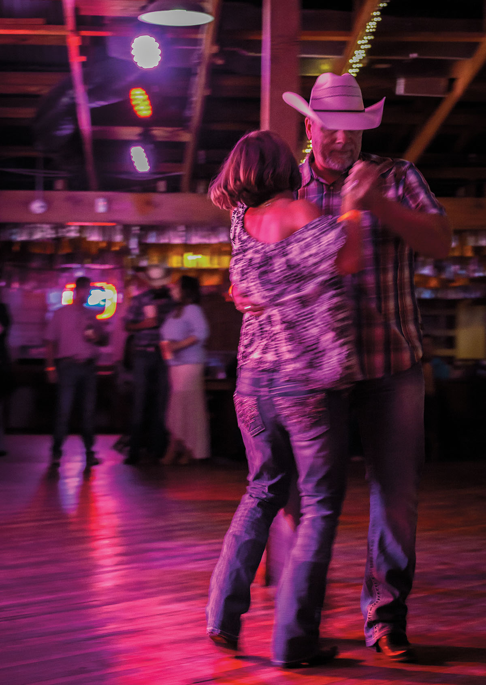

export const Title = () => (
  
    
    South Texas Plains
  
);

<PageDescription>

Abundant nature-viewing and vibrant cultural opportunities proliferate from the brush country to the Lower Rio Grande Valley

</PageDescription>

<AdGroup id={['ad105']}/>

<Row>

<Column colSm={12} colMd={4} colLg={8}>

<Caption>Dancing at Schroeder Hall. Photo by Eric Pohl.</Caption>

## **Mission: Goliad**
### Comfort food, country dancing, and camping revive this revolutionary town
**By Wes Ferguson**

</Column>
</Row>

<Row>
<Column colSm={12} colMd={4} colLg={8}>

Remember Goliad? It’s one of the oldest towns in Texas, originating in 1749 as a Spanish colonial mission and presidio where the San Antonio River flows through gently rolling coastal plains a little more than 45 miles inland from San Antonio Bay.

People still come to Goliad to pay their respects to the hundreds of Texian rebels who surrendered in battle during the Texas Revolution in 1836 and were executed on Palm Sunday, a day of infamy rivaled only by the fall of the Alamo. But Goliad is far from stuck in the past. Visitors who venture off the main highways will find a bustling downtown around an idyllic courthouse square with more restaurants, nightlife options, and shopping than one might expect for a town of about 2,000 people.

“Remember Goliad!” became a rallying cry of the Texas Revolution. More than 180 years later, a weekend in Goliad is not so easy to forget, either.

Goliad boasts a couple of motels and places to camp, but only one of the town’s lodging options routinely appears on lists of the state’s most unusual getaways: the officers’ quarters at Presidio La Bahía, the historic fort the Spanish built on a hill above the southern bank of the San Antonio River.

You can’t miss the presidio. Facing US 183, the fort’s old stone walls form a defensive bulwark against drivers heading north toward Austin or south toward Refugio. The presidio’s walls are marked by time, and they protect a chapel made of the same stone. Local Catholics have celebrated Mass at this chapel nearly every Sunday since 1779.

An engaging museum also lies within the presidio walls. Operated by the Catholic Diocese of Victoria (as is the presidio itself), the museum tells a more complex-than-expected story of early Texas, including the surrender and massacre of Col. James Fannin’s men in 1836. The museum also displays plenty of artifacts from cannon balls to pottery of Native American, Mexican, and English origins, along with a cracked 1796-era church bell in the chapel.

When the last visitor leaves and the museum locks up for the day, overnight guests have free reign of the wide, grassy lawn behind the presidio’s walls. Folks have been known to bring a Frisbee or catch a sunset next to a cannon.

The quarters are equipped with a full kitchen, but it’s easier to stroll eight minutes to La Bahía Restaurant, a Tex-Mex and Southern-food institution since 1946. The restaurant closed temporarily when the original owners, Neurania and Esmel Rubio, retired. But Julio Dorantes Sr., a close family friend and former cook at the restaurant, partnered with the Rubios’ heirs to reopen the place about seven years ago. Dorantes runs the kitchen, and his son, Julio Jr., manages the front of the restaurant. “He wanted to make sure it all tastes the same,” the younger Julio says. 

Traditional Tex-Mex plates like chalupas and carne guisada share menu space with steaks, hamburgers, and fried fare—all recipes from Neurania Rubio, known in the community as Mrs. Ronnie. “People see fried chicken on the menu, and they’re like, ‘That doesn’t sound like it should be allowed in a Mexican restaurant,’ but they just cooked what they ate at home,” Julio says. “Those are her recipes, from enchiladas to chicken-fried steak.”

If not too slowed down by plates of comfort food, consider a drive to Schroeder, a German settlement that is home to the second-oldest dance hall in Texas. Opened in 1890, Schroeder Dance Hall hosts dinners and country dances on Friday and Saturday nights in a big barnlike structure with a smooth oak dance floor.

After a night of do-si-doing, retreat to the presidio, where the guestbook in the officer’s quarters is filled with stories recounting bumps in the night and supposed encounters with ghosts. The only other visitor on a recent stay, however, was a calico cat seeking a scratch behind her ears.

The next morning, following a bring-your-own breakfast in the officer’s quarters and a cup of coffee enjoyed from a presidio lookout, head 1.6 miles north to Goliad’s main square. The centerpiece is the Goliad County Courthouse, a gorgeous 1894 Second Empire-style spectacle of blue Muldoon sandstone with red stone trim and slate roofs.

Among the square’s most charming touches are the many sprawling live oak trees. When widening its streets, the town simply paved around several of them. Then there’s the Hanging Tree on the courthouse’s north lawn, an old oak where frontier justice was meted out for nearly a quarter century in the 1800s.
Hanging Tree Antiques sits just across the courthouse on the same block as the Water Well Café, the former location of the Empresario Restaurant. Around the block, Blue Quail Deli draws raves for its paninis.

A shopper’s jaunt around the square turns up more secondhand stores with a plethora of antiques and oddities, like This That & Whatever. For folks interested in the area’s post-Texas Revolution history and ranching heritage, the Market House Museum has amassed an assortment of artifacts in a red wooden structure, which was built in the mid-1800s for vendors to sell their meat and produce and later served as a firehouse until 1964.

On July 4, 1976, a cattle drive through Goliad commemorating the region’s ranching history infamously broke into a stampede through the town square, with 100 Longhorns charging at holiday onlookers as they ran for safety. Now, visitors are stampeding to the square for its nightspots. Nearby, Rudy’s on the Run serves Tex-Mex, Southern fare, and hamburgers. The Commercial Street Bar is a fine watering hole with live music and draft beers and wine.

Situated between the presidio and the square is Goliad State Park and Historic Site, with hike-and-bike trails, fishing, and Mission Espíritu Santo, another Spanish Colonial-era mission restored by the Civilian Conservation Corps in the 1930s. Visitors can ring the church bell or contemplate the mysterious skull-and-crossbones stone inlay marking the “door of death” once used during funerals. The park also offers a paddling trail, which meanders 6.6 miles through quiet pools and riffles on the San Antonio River.

Goliad was originally known as La Bahía, a name borrowed from the presidio. In 1829, the Mexican government renamed the settlement Goliad, a phonetic anagram of Hidalgo, to honor the father of the Mexican Revolution, priest Miguel Hidalgo.

Today in Goliad, old vaqueros belly up to chicken-fried steaks next to out-of-towners nursing craft beers. Folks in blue jeans and cowboy boots swing to country-and-western tunes in a dance hall named for German settlers, and an ancient Spanish presidio looms from a hill above the highway. As for the Hanging Tree, thankfully it hasn’t been in use since 1870.

</Column>

<Column colSm={6} colMd={4} colLg={4}>

### South Texas Plains Texas State Parks: Hidden gems

**Lake Casa Blanca International State Park**

¡Bienvenidos! Swim, fish, boat, picnic, and walk the trails at this lakeside park in Laredo, fewer than 10 miles from the border between Texas and Tamaulipas, Mexico. Enjoy playgrounds and fields for team sports, as well as several pavilions and a recreation hall available by reservation. All campsites include water and electricity. 

**Other hidden gems:** 
- Choke Canyon State Park
- Bentsen-Rio Grande 
- Valley State Park 
- Falcon State Park
- More South Texas 
- Plains State Parks:
- Estero Llano Grande SP
- Goliad SP and SHS

For more information, directions, and amenities, get your [free mobile guide to all 80-plus state parks](https://texasstateparks.org/app).

</Column>

</Row>

<Row>
<Column colSm={12} colMd={4} colLg={8}>
<RegionListing title="South Texas Plains" color="purple" region="SOUTH TEXAS PLAINS"/>
</Column>

<Column colSm={6} colMd={4} colLg={4}>
</Column>

</Row>

<!-- 
<FeatureCard
  title="Search all cities and listings in the South Texas Plains"
  actionIcon="arrowRight"
  href="/things-to-do-in-texas?region=south-texas-plains"
  color="dark">

</FeatureCard>
<Caption>The San Antonio River Walk. Photo by Will van Overbeek.</Caption> -->