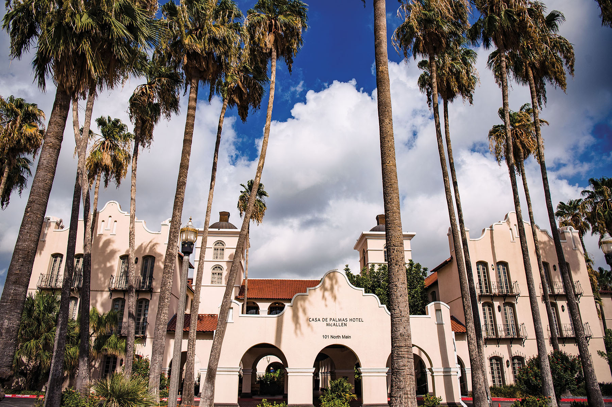
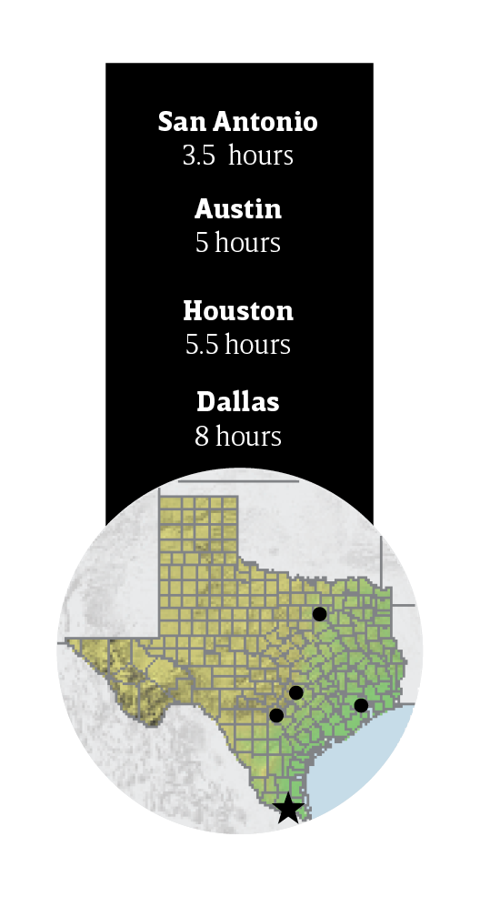
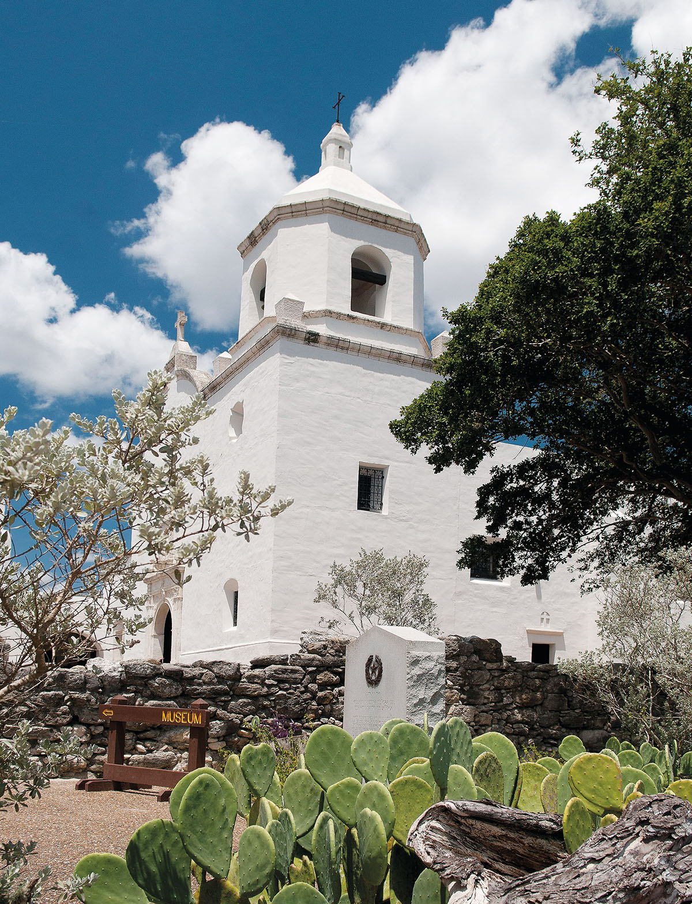

export const Title = () => (
  
    
    South Texas Plains
  
);

<PageDescription>

Abundant nature-viewing and vibrant cultural opportunities proliferate from the brush country to the Lower Rio Grande Valley

</PageDescription>

<Row>

<Column colSm={12} colMd={6} colLg={10}>

<Caption>Casa De Palmas. Photo by Tiffany Hofeldt</Caption>

## **The Bounty of the Valley**

</Column>
</Row>

<Row>

<Column colSm={12} colMd={6} colLg={8}>

### McAllen shines with South Texas culture  

**By Aaron Nelsen**

Once known as the “City of Palms,” ­McAllen has reinvented itself time and time again. The town is named for John McAllen, an Irish settler and businessman who donated land to a new railroad in 1904. From its early days as a ranching and farming economy, the city has become an important hub for international trade on the Mexican border. The arrival of factories in the 1980s turbo-charged trade. Today, McAllen anchors a sprawling Rio Grande Valley metro area that encompasses the cities of Edinburg, Mission, and Pharr, along with several international bridges that import and export everything from auto parts to vegetables. It’s celebrated for world-class citrus and produce.  McAllen’s mild winters draw Winter Texans from the north, and the city’s retail shopping districts lure visitors from south of the border. It’s also known for its diverse birdlife, and it’s the host of a number of popular festivals, including MXLAN, a 5-day summer festival of arts, music, and food that celebrates Latino culture. 

</Column>

<Column colSm={3} colMd={2} colLg={3}>

</Column>

</Row>

<Row>

<AdGroup id={['ad29']}/>

</Row>

<Row>

<Column colSm={12} colMd={5} colLg={8}>

### Stay

#### Casa de Palmas

This historic hotel (starting at $125/night) in the heart of downtown represents one of the best examples of Spanish architecture in McAllen. The hotel offers all the amenities of contemporary travel, including a restaurant, and proximity to the city’s nightlife scene. But the hotel’s hacienda-style courtyard and pool set it apart from the rest of the city.

### Shop

#### Earth Born

With its mild winters, the Rio Grande Valley boasts some of Texas’ best fresh produce. Earth Born Market is a family-­owned farm in McAllen that grows the valley’s signature lemons, limes, tangerines, and grapefruit. During the harvest from October to April, visitors can pick organic citrus (call first to check availability). Earth Born’s two McAllen shops offer cold-pressed juices from the farm’s fruit.

### See 

#### National Butterfly Center

This restored river­front habitat in nearby Mission harbors 240 species of butterfly. The 100-acre preserve is also an ideal setting to view birds, including the ringed kingfisher, the largest kingfisher in North America. Exhibits in the visitor center explore butterfly biology and behavior from life cycle to migration and diets.

#### Cine El Rey

Built in 1947, the downtown McAllen theater celebrates its 76th anniversary this year, hosting free movie nights, live comedy, concerts, and Mexican wrestling. Cine El Rey shut down for 20 months during the COVID-19 pandemic, forcing its owners to pare back its offerings, from six days a week to between two and four events per month.

#### Museum of South Texas History

This Edinburg museum’s permanent exhibit spans local history at the 1910 Jail building. The building has also served as Edinburg city hall, a firehouse, and a police station. The museum tells the story of Abram Ortiz, the only person to be executed in the jail, and _Borderlands—An Illustrated History_ by José Cisneros, featuring artwork by the late El Paso artist.

#### Quinta Mazatlan

The historic residence in central McAllen was built in 1935 as an adobe Spanish Revival hacienda. It is now one of nine World Birding Centers in the Valley. A system of trails weaves through 15 acres of Tamaulipan thornscrub forest where plain chachalacas, green jays, and clay-colored thrushes flit among the tangle of branches. It also offers natural history tours.

### Eat 

#### Salomé on Main 

McAllen chef Larry Delgado and his wife, Jessica Delgado, bring the cuisine of interior Mexico to the Texas border. In their third local restaurant—opened in 2019 just blocks from his other restaurants, House Wine & Bistro and Salt—the Delgados embrace Central Mexican influences with a menu that emphasizes poblano peppers, mole sauces, and masa ground from six varieties of Mexican corn. 

#### Riverside Club

The Riverside Club features live music every Sunday in the restaurant, or in the dance hall, where Winter Texans scoot across the floor to rollicking country tunes. The restaurant slings a mean pork tenderloin sandwich, and best of all, this family-owned club offers Rio Grande sightseeing tours on its Riverside Dreamer, a pontoon boat.

### RV Info

Located less than a half-mile from Bentsen-Rio Grande Valley State Park, Bentsen Palm Village RV Resort in Mission provides a range of RV sites with full hook-ups, including free cable TV. Amenities include a full-service clubhouse, pickleball courts, and a woodworking shop. Guests have free access to the state park, and its biking, kayaking, and canoeing options. Weekly pontoon boat tours and pontoon boat rentals are also available. [­bentsenpalm.com](http://­bentsenpalm.com/active-adult/rv-resort)

</Column>

<Column colSm={12} colMd={3} colLg={3}>

<StatePark>

<Caption>Goliad State Park and Historic Site. Photo by Chase Fountain, TPWD</Caption>

##### South Texas Plains

### Celebrate 100 Years of Texas State Parks

Join in the celebration! The Texas State Parks system is turning 100 years old in 2023. Learn more and discover all the ways you can help celebrate at [texasstateparks.org/100years](https://texasstateparks.org/100years).

#### Goliad State Park and Historic Site

Native Americans, Spanish explorers and missionaries, Texian soldiers, and early settlers walked this land. Follow in their footsteps and peek into Texas’ past at a park that combines history and recreation. The whitewashed walls of Mission Espíritu Santo tower over the park, restored by the Civilian Conservation Corps in the 1930s. Tour the colorful chapel/exhibits; learn about the mission’s ranching heritage; and enjoy hiking, biking, fishing, and camping.

#### More South Texas Plains State Parks
**Bentsen-Rio Grande Valley State Park**
 

**Choke Canyon State Park**
 

**Estero Llano Grande State Park**
 

**Falcon State Park **
 

**Lake Casa Blanca International State Park**
 

</StatePark>

</Column>

</Row>

<Row>
<Column colSm={12} colMd={4} colLg={8}>
<RegionListing title="South Texas Plains" color="purple" region="SOUTH TEXAS PLAINS"/>
</Column>

<Column colSm={6} colMd={4} colLg={4}>
</Column>

</Row>

<!-- 
<FeatureCard
  title="Search all cities and listings in the South Texas Plains"
  actionIcon="arrowRight"
  href="/things-to-do-in-texas?region=south-texas-plains"
  color="dark">

</FeatureCard>
<Caption>The San Antonio River Walk. Photo by Will van Overbeek.</Caption> -->