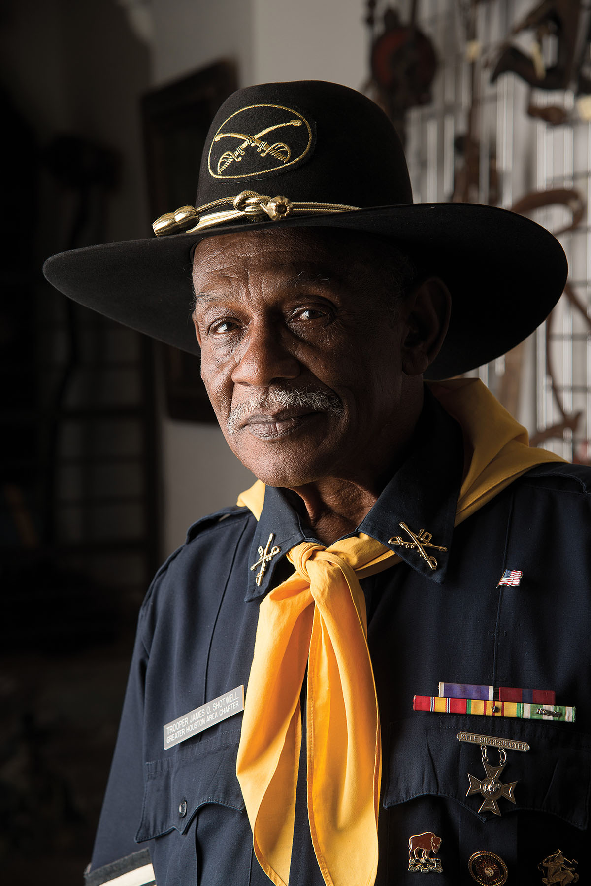
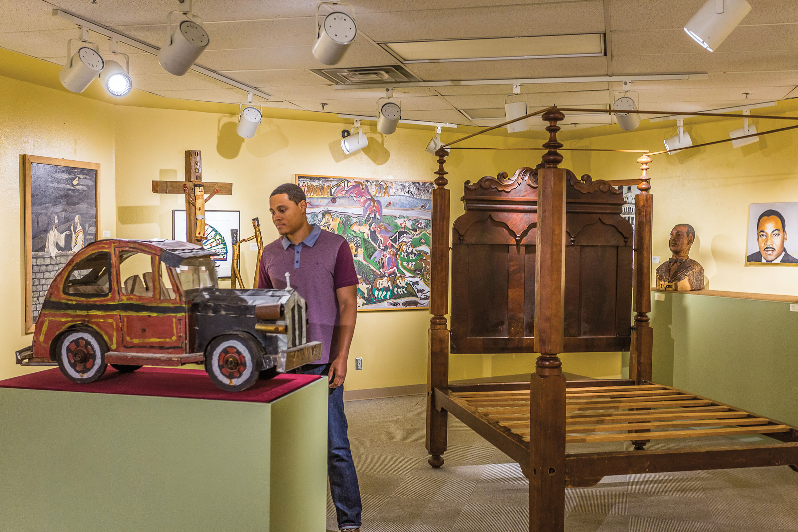

<PageDescription>

Four places that honor and commemorate  the Black experience in Texas

</PageDescription>

**By Michael Hurd**

<Row>
<Column colSm={6} colMd={4} colLg={8}>

African American history in Texas began on a wintry November day in 1528 when a Moor servant, Estevanico, waded ashore on Galveston Island with two Spanish conquistadors and nearly 80 passengers from the post-storm Gulf of Mexico. In doing so, Estevanico became the first documented African-born person to explore what would become Texas.

In the almost five centuries since, Black Texans have been integral to the development of the state, creating an enduring and inspirational heritage that has gained increasing documentation. Their stories—in print, images, exhibitions, and historical markers—have helped inform fellow Texans and visitors about a proud legacy that has sometimes been overlooked and extends far beyond slavery. 

However, to the delight of curious tourists, an ever-expanding array of museums and cultural districts offer myriad options for closer examinations of the Black experience in the Lone Star State. 

A trip along Interstate 45 between Galveston and Dallas will take you to four destinations you should explore in order to learn about African American history in Texas.

### Galveston
Interstate 45 begins its northward path here in the birthplace of African American history in Texas. Galveston is an isle of “firsts,” as both the landing spot for the first Black Texan—Estevanico—and the site where the news of the Emancipation Proclamation arrived in Texas on June 19, 1865. At the corner of 22nd and Strand, a marker commemorates the spot where Union Gen. Gordon Granger is said to have read General Order No. 3, officially announcing the end of slavery in Texas. The event established the foundation for Juneteenth, a state holiday that is also celebrated worldwide. Many people make a pilgrimage to the city for its annual festivities.

Almost one-fifth of Galveston’s population is African American, and the city is filled with markers and sites, including 14 historic Black churches. The churches are not only spiritual centers but also gathering places relied on by generations of Black residents for guidance, leadership, recording family histories, and maintaining local African American culture. Avenue L Baptist Church and Reedy Chapel are the most prominent edifices. Avenue L, formed by enslaved people in 1840, was the first African American Baptist church in Texas, while Reedy was the first African Methodist Episcopal church in the state. Its congregation first convened in 1848. Reedy’s 18-foot-tall, Gothic-style pipe organ was built of ash wood with carved walnut trim in 1872. With 800 pipes and 15 independent stops, it’s one of only two of its kind in the U.S. 

At Jack Johnson Park, the park’s namesake, a prominent boxer from the early 1900s, is celebrated with a 6-foot-tall bronze statue. The Galveston native was the first Black heavyweight champion. 

_Avenue L Baptist Church, 2612 Ave. L. Reedy Chapel, 2015 Broadway Ave. Jack Johnson Park, 2601 Ave. M._

</Column>

<Column colSm={6} colMd={4} colLg={4}>

<Caption>Trooper James Shotwell is a U.S. Marine veteran and member of the Greater Houston Chapter of the 9th & 10th Horse Cavalry Association, a group dedicated to preserving the history of the Buffalo Soldiers. Photo by James Fraher.</Caption>

<AdGroup id={['ad09']}/>

</Column>
</Row>

<Row>
<Column colSm={6} colMd={4} colLg={8}>

### Buffalo Soldiers National Museum, Houston

Travel up I-45 to Houston to see the Buffalo Soldiers National Museum, which opened in 2001. 

For more than 30 years, retired Army captain and Vietnam veteran Paul Matthews traveled the world as a pharmaceutical representative and often made stops at European military bases. These helped build his interest in Buffalo Soldiers, which he first learned about as an ROTC cadet at Prairie View A&M University. He’d acquire a photo here, a uniform there, adding to an overflowing collection in his home. He eventually turned his collection of artifacts into a museum.

Black people have served in every American war, beginning with Crispus Attucks during the Revolutionary War. However, the Buffalo Soldiers were the first Black professional soldiers in a peacetime army. Following the Civil War, Congress formed the four all-Black units: the 24th and 25th infantries and the 9th and 10th cavalries. Those units fought primarily in the Indian Wars. They were given the nickname “Buffalo Soldiers” by Plains Indians who revered the men for their fierce fighting ability, their spirit, and the woolly texture of their hair—all traits attributed to the buffalo. Buffalo Soldiers received at least 18 medals of honor.

Housed in a 23,000-square-foot former armory in the historically African American Third Ward neighborhood, the museum is one of the largest repositories of African American military artifacts in the world. Here you can discover items from all branches of the U.S. armed services dating from 1770, including photos, rifles, muskets, cannonballs, medals, patches, paintings, letters, appliances, and even a chamber pot.

“I thank the Lord every day I rise for giving me the opportunity to collect and curate African American military memorabilia and have visitors from around the world witness the contributions of the Black men and women who fought, bled, and died in defense of America,” Matthews says. “These soldiers did what they did not necessarily for themselves, but for those that came behind them. We take our mantra from the motto of the 10th U.S. Cavalry: ‘Ready & Forward.’” 

_3816 Caroline St._

</Column>

<Column colSm={6} colMd={4} colLg={4}>
<AdGroup id={['ad61','ad74','ad78']}/>
<AdGroup id={['ad70','ad84','ad72','ad80']}/>
</Column>

</Row>

<Row>
<Column colSm={12} colMd={6} colLg={8}>

### Black Cowboy Museum, Rosenberg

From Houston, head 40 miles southwest on Interstate 69 to Rosenberg, where you can meet the “real” Lone Ranger, the originator of rodeo “bulldogging,” and  “Deadwood Dick” at the Black Cowboy Museum.

Historians estimate one in four cowboys during the pioneer era—from 1865 to 1895—were Black, and the majority of them began their roping and cattle herding days while enslaved. The Lone Ranger character from comic books, the 1930s radio series, and the 1950s television show is thought to have been modeled after Bass Reeves, the first Black deputy U.S. Marshal west of the Mississippi. The bulldogging originator was Bill Pickett, of Taylor, who was born after emancipation. Bulldogging, or steer wrestling, is a technique in which, while chasing a wayward cow, a cowboy leaps from his horse onto the cow, grasping its horns and twisting its head, taking it to the ground—Pickett’s original technique was to bite the cow’s upper lip to subdue the animal. Nat Love, a masterful wrangler and sharpshooter, earned the nickname Deadwood Dick in 1876 after winning a cowboy competition in Deadwood, South Dakota.

Museum curator and founder Larry Callies grew up in El Campo, just west of Rosenberg, in a family of cowboys, but he hadn’t heard of these cultural and historical figures. His first awareness came in the 1990s when he discovered an antique photo of Black cowboys while cleaning the barn at a local guest ranch. Now, he cheerfully greets visitors, leads tours, and talks about the history of Black cowboys.

“I couldn’t believe it,” Callies said in a 2019 _New York Times_ interview. “Cowboys who looked just like me. And I never knew they existed. That they were part of America.”

Inspired, Callies began to dig into the history and collect artifacts, including family mementos: His cousin Tex Williams became the first Black Texas High School Rodeo Association state champion in 1967. Williams’ championship belt buckle and other gear are displayed in the museum, which Callies opened in 2017. Other items in the three-room facility include framed news clips; photos; weathered brown saddles with lariats and canteens; Winchesters and other rifles; posters from Black cowboy movies, one of which is _Harlem on the Prairie_, 1937; branding irons; and an impressive display of lawmen badges, one of which is inscribed with “Slave Patrol Police.” 

_1104 Third St._

</Column>

<Column colSm={12} colMd={2} colLg={4}>

>&ldquo;I couldn’t believe it. Cowboys who looked just like me. And I never knew they existed. That they were part of America.&rdquo;

</Column>

</Row>

<Row>
<Column colSm={12} colMd={4} colLg={8}>

<AdGroup id={['ad69','ad65','ad86']}/>

<Caption>African American Museum in Dallas. Photo by Will van Overbeek.</Caption>

### African American Museum, Dallas 

Head back to I-45 and drive a few hours to Dallas, where the African American Museum sits in the shadow of Big Tex near the entrance to Fair Park, home to the annual State Fair of Texas. The museum, a cultural anchor in the predominantly Black neighborhood, holds one of the largest collections of African American folk art in the nation. Its four vaulted galleries present Black history through dynamic exhibits and displays. 

The museum began at Bishop College, a historically Black institution in Dallas that closed in 1988. Harry Robinson Jr., a librarian and museum director at the college, had established the Southwest Research Center and Museum of African American Life and Culture there, which later became the African American Museum and moved to Fair Park in 1993.

“The museum is a source of pride to the community,” Robinson said in a 2006 interview with The HistoryMakers, an archive of oral history videos focusing on prominent African Americans. “It’s a meeting place for the community. It’s our foremost educational institution when you talk about African American heritage.”

In 2018, it was the first stop west of the Mississippi River for the groundbreaking _Slavery at Jefferson’s Monticello: Paradox of Liberty_ exhibit, which presents the viewpoints of six enslaved families who lived at the plantation of the third U.S. president, who once said slavery was an “abominable crime.” 
In addition to its folk art collections, the facility has a research library; historical, political, and community archives; and a photo archive from *Sepia* magazine, the Fort Worth-based photojournalism publication that existed from 1947 to the 1990s as the African American equivalent of _Life_. The museum also shows archaeological specimens—photographs, documents, broken headstones, shards of earthenware, and decorative pottery—from Freedmantown, a once-prominent North Dallas area that originated after emancipation. 

*3536 Grand Ave.*

<AdGroup id={['ad22','ad16','ad68','ad71','ad59','ad60','ad62','ad64']}/>

</Column>

<Column colSm={6} colMd={4} colLg={4}>
<AdGroup id={['ad15']}/>
</Column>
</Row>