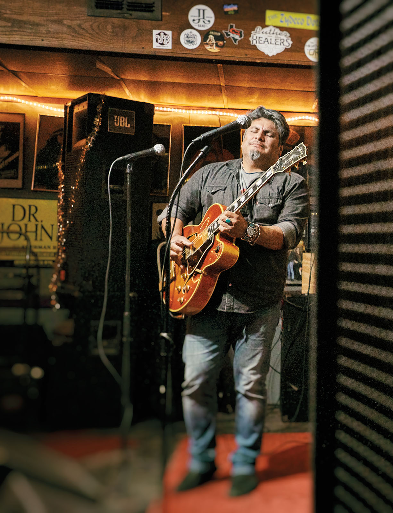
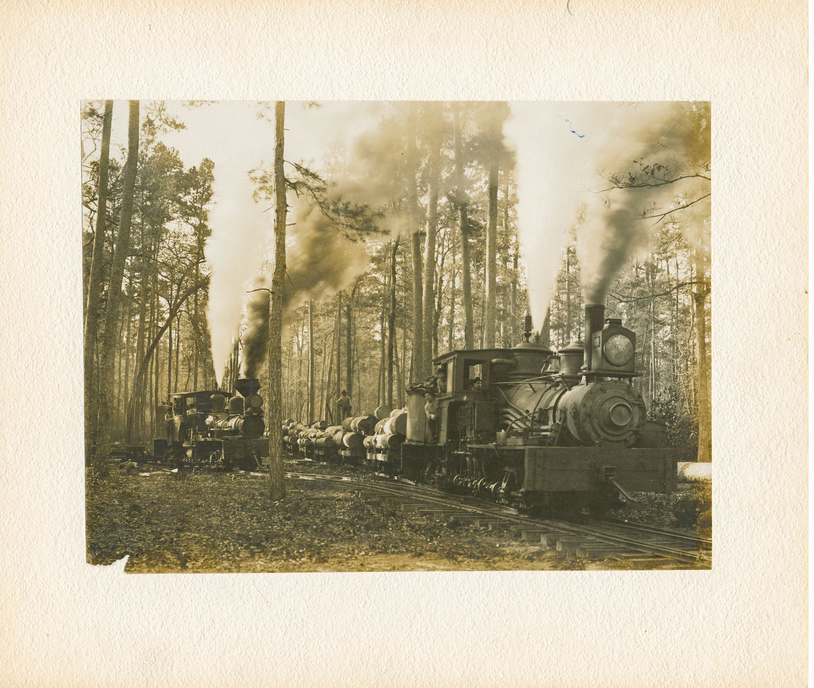
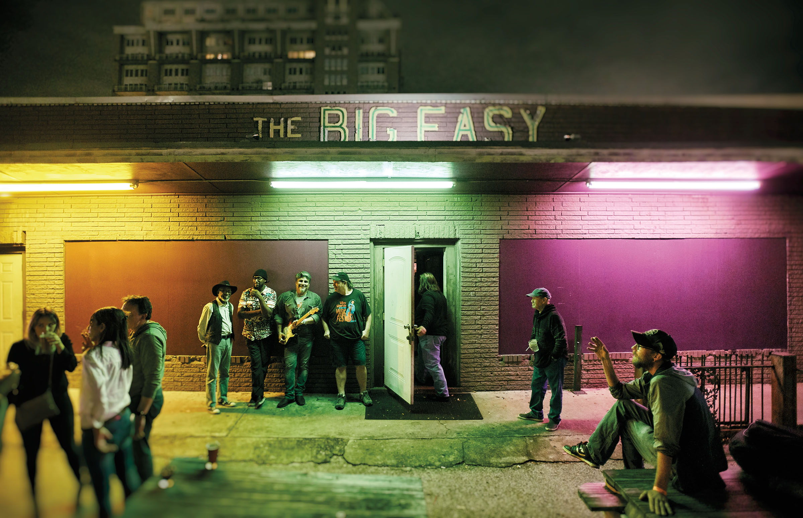
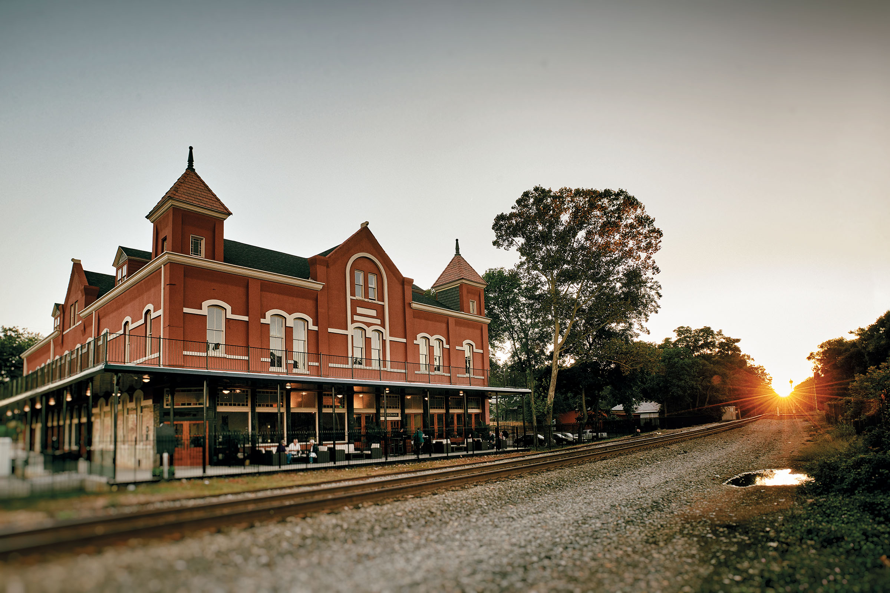

<PageDescription>

The Boogie Woogie Highway traverses the origins of rock ’n’ roll

</PageDescription>

**By Michael Corcoran**

<Row>

<Column colSm={12} colMd={5} colLg={6}>

The heavy left hand mimicked the rumble of steam locomotives on iron rails, while the right played melodic cross-rhythms that whistled up and down the tracks. A national craze during World War II, the hard-driving piano style known as boogie woogie set the stage for the musical revolution of rock ’n’ roll. And its roots can be traced to the logging camps of East Texas, where former slaves played music for respite from their toils, accentuating the piano’s rhythmic properties to get people dancing.

Defined by a walking bass line—a repeating sequence of notes that propels the rhythm forward—boogie woogie is the music of movement, perfect for a road trip through the Piney Woods where the style originated. Musicologist John Tennison has dubbed a 360-mile stretch of US 59 between El Campo and Texarkana the “Boogie Woogie Highway.”

“It was African Americans who originated boogie woogie, and they were in the Piney Woods of East Texas in association with the railroad and lumber camps,” says Tennison, a Texarkana native who now lives in San Antonio. “Highway 59 is the most reasonable approximation of the railroad corridor, but it was the railroad completed in 1873—from Texarkana to Houston—that the itinerant musicians would have used.”

Tennison became interested in boogie woogie’s Northeast Texas origins as a teenager. He interviewed local musicians and historians, and he combed through oral histories and other resources to explore how African Americans developed the piano style. Boogie woogie came about in the 1870s during the East Texas timber bonanza of the late 1800s and early 1900s. Coinciding with the end of the Civil War, logging companies employed freed slaves in jobs like felling trees and building new railroad lines to move the timber to mills and markets.

Life in the lumber camp was filled with the clatter of rhythmic hammering and the chuff of steam engines. Tennison notes that boogie woogie’s classic eight-beats-per-measure bass line mimics two rotations of a steam engine driver wheel. Untutored ivory-smiths rode the rails from camp to camp to play in barrelhouses, which the lumber companies built to keep their workers from straying into town—and maybe never coming back. These makeshift juke joints hosted parties sometimes called “booga roogas” with liquor, dice games, and dancing. In 1929, Alabama pianoman Clarence Smith gave the style 
its name with his hit song “Pine Top’s Boogie Woogie.”

Tennison presented his research to the Marshall City Council in 2010 to make the claim that the Harrison County seat, as headquarters of the Texas and Pacific Railway, could rightfully be considered “the birthplace of boogie woogie.” In the first half of the 20th century, music historians had pegged East Texas as the original home of the rhythmic style.

Within the region, Tennison said, three key factors overlapped to the highest degree in Marshall—Harrison County’s large African American population, the Piney Woods timber industry, and Marshall’s status as a railroad trade hub. The city of around 24,000 has taken the motto to heart; in September 2018, Tennison joined Marshall officials in unveiling a state historical marker designating the city boogie woogie’s birthplace.

<AdGroup id={['ad53','ad47']}/>

</Column>

<Column colSm={12} colMd={4} colLg={6}>

<Caption>Blues night at The Big Easy in Houston. Photo by Dave Shafer.</Caption>

<Caption>East Texas logging train circa 1900. Photo courtesy East Texas Research Center, R.W. Steen Library, Stephen F. Austin State University, Nacogdoches.</Caption>

</Column>

</Row>

<Row>

<Column colSm={12} colMd={6} colLg={8}>

### Houston

Houston’s George Thomas Jr. took boogie woogie from the backwoods to urban centers in the 1910s. His composition “The Fives” helped shape boogie woogie into its own style in the 1920s, according to Peter J. Silvester’s essential boogie woogie history, *A Left Hand Like God*. 

Though Houston’s early blues landmarks have mostly been torn down, the music is still alive on Kirby Drive, not far from Rice University, at The Big Easy Social & Pleasure Club, which sometimes draws piano players to its Wednesday night blues jam. Sundays belong to zydeco, which often incorporates boogie woogie’s walking bass line. 

<Caption>The Big Easy in Houston. Photo by Dave Shafer.</Caption>

### Diboll and Lufkin

Lumber and railroads, as dependent on each other as hands on a piano, were instrumental in the creation of this new forceful style of blues. Built in 2003 to house the archives of lumber magnate Arthur Temple, The History Center in Diboll explores both industries with exhibits of historic photographs, audio recordings, and artifacts. 

The center also keeps a thick file on local African American piano thumper W.J. “Professor” Jackson, who died in 1972 at age 102. Jackson also played the trumpet in circus bands, which is how he met Harry James, a boy from Beaumont whom he taught to play jazz trumpet. James went on to become one of the superstars of Big Band, with his 1939 single “Back Beat Boogie” presaging rock ’n’ roll.    

Just 14 miles north on US 59, Lufkin’s Texas Forestry Museum houses vintage equipment—including a high-wheeled cart and a sawmill steam engine—that helps portray how timber was logged, transported, and milled during the late 19th and early 20th centuries. 

</Column>
</Row>

<Row>
<Column colSm={12} colMd={5} colLg={6}>
<AdGroup id={['ad21','ad51','ad50']}/>
</Column>
</Row>

<Row>
<Column colSm={12} colMd={6} colLg={8}>

### Rusk

For a ride on a living, snorting locomotive, you’ll want to veer northwest on US 69 to Rusk, home of the Texas 
State Railroad. The tourist railroad runs steam and diesel locomotives, leading elegant passenger cars on 50-mile round trips to Palestine. The journey is both spiritual and educational, with forested scenery. 

Prison inmates built these tracks more than 100 years ago. As the train clacks along, listen to the vintage locomotive rumble over the tracks: Can you hear the rhythm that inspired boogie woogie and the well-known tune “The Boogie Woogie Bugle Boy of Company B”? The 1941 smash by the Andrews Sisters turned left-hand fever into an epidemic.

<Caption>The Ginocchio in Marshall. Photo by Dave Shafer.</Caption>

### Marshall
Back on US 59, the Boogie Woogie Highway heads north to Marshall, where it reaches its anchor on North Washington Street. There stands the historical marker chronicling Marshall as the hub of boogie woogie, with the still-busy 1912 Texas and Pacific Railway Depot in the background and the restored 1896 Ginocchio Restaurant and Hotel in the foreground. 

Though the Ginocchio’s top two floors are no longer a hotel, the restaurant has been a big draw since opening in late 2017. With plates of steak and seafood, diners can watch the trains pass and sip on glasses of house-brewed Boogie Woogie Golden Ale.
 
### Jefferson and Texarkana

From Marshall to Texarkana, US 59 runs roughly parallel to the Texas and 
Pacific Railway, a corridor where prominent boogie woogie bass lines were developed, according to Tennison. “The Jefferson” bass line bears the influence of New Orleans, the origin point for steamboats that ferried people and goods to Jefferson on Big Cypress Bayou. 

US 59 ends its Texas run at Texarkana, once home of the old Swampoodle district, where the pounding strains of boogie woogie emanated from rowdy juke joints and sporting houses. No trace remains of Swampoodle—named for Swampoodle Creek—but the notorious era, from the 1880s to around 1910, lives on in the Swampoodle bass line, an eight-beat line that’s instantly recognizable as a foundation of boogie woogie.   

You can hear the hypnotic drive of boogie woogie in the music of masters like Stevie Ray Vaughan and Marshall native Omar Sharriff, who spread Texas blues to the world. It all traces back to the forest clearings from Cass to Bowie counties, where the clatter of steaming locomotives provided musical themes and polyrhythmic inspiration. It was here that the left hand made its mark in a right-handed world and led to the creation of what we call rock ’n’ roll.

</Column>

<Column colSm={12} colMd={2} colLg={4}>

### Essentials: The Boogie Woogie Highway

Be sure to call ahead, as some sites have closed temporarily or reduced their hours as a result of the coronavirus pandemic.

#### Big Easy Social & Pleasure Club

5731 Kirby Drive, Houston. 713-523-9999; 
https://thebigeasyblues.com/

#### The History Center

102 N. Temple Drive, Diboll. 936-829-3543; 
https://thehistorycenteronline.com

#### Texas Forestry Museum

1905 Atkinson Drive, Lufkin. 936-632-9535; 
https://treetexas.com

#### Texas State Railroad Rusk Depot

535 Park Road 76, Rusk. 855-632-7729; 
https://texasstaterailroad.net

#### The Ginocchio

707 N. Washington Ave., Marshall. 903-927-1400; 
https://theginocchio.com

#### Texas and Pacific Railway Depot

800 N. Washington Ave., Marshall. 
https://facebook.com/pg/marshall.depot

#### Museum of Regional History

219 N. State Line Ave., Texarkana. 903-793-4831; 
https://texarkanamuseum.org

<AdGroup id={['ad75']}/>

</Column>

</Row>

<Row>
<Column colSm={12} colMd={5} colLg={6}>

</Column>
</Row>