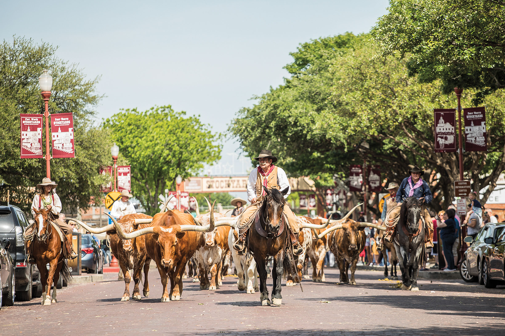
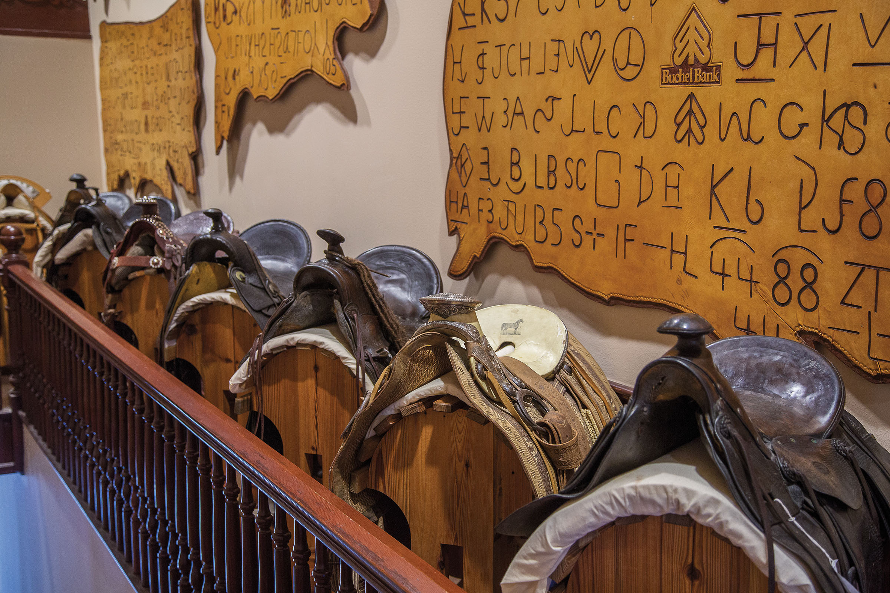

export const Title = () => (
  
    From Cattle Drives  to Road Trips
  
);

<Caption>Longhorn cattle drives take place twice daily on Exchange Avenue in the Fort Worth Stockyards National Historic District. Photo by Kenny Braun.</Caption>

<PageDescription>

Explore Texas’ cowboy roots on the Chisholm Trail  and other cattle-driving routes

</PageDescription>

**By June Naylor**

<Row>

<Column colSm={12} colMd={4} colLg={8}>

The legendary Longhorn bears a mighty weight of Texas heritage on its back, thanks to the cattle drive era of 150 years ago. In the post-Civil War years, hardy cowboys rounded up some 6 to 10 million of the durable cattle in South Texas and drove the beasts northward, roughly a thousand miles, to markets in Kansas. 

Of all the cattle drive routes originating in Texas’ lower frontier, the Chisholm Trail has garnered the most fame. The period has been rhapsodized in novels, songs, and movies—most notably *Lonesome Dove*, written by Texan Larry McMurtry—but the work was back-breaking. The days were long and either broiling hot or freezing cold, and the financial rewards less than significant. A few enterprising trail bosses got rich along the way. More than a few died trying.

Eventually, big land purchases introduced the ranching era, and miles of barbed wire fencing signified the end of cattle drives. But you can still follow the Chisholm Trail to find its history and the birth of Texas’ cattle industry. From Kingsville in South Texas to the state’s northern border at the Red River, sites along the way tell the story of this influential era.

### Kingsville

Founded in 1853 in the romantic-sounding Wild Horse Desert, the King Ranch today unfurls over 825,000 acres of Texas’ flat and breezy coastal plains, populated by mesquite tree groves and livestock. Riverboat captain Richard King’s spread began with domesticated Longhorn originally raised to drive to market. King registered the ranch’s now-famous Running W brand, and though he died in 1885, his early cattle-breeding efforts foreshadowed the ranch’s development in 1920 of the Santa Gertrudis, the first officially recognized new breed of beef cattle in America.

The story is told on ranch tours, giving visitors a look at the cattle, a resident Longhorn herd, the ranch quarter horses, beautiful historic buildings and homes, and a horse cemetery. 

In the town of Kingsville, the King Ranch Museum is home to an extraordinary 1940s photographic essay on King Ranch daily life, as well as vintage guns, flags, vehicles, and saddles, all housed in a 1907 ice house. Three blocks south, the King Ranch Saddle Shop stocks a dizzying array of fine leather goods (jackets, wallets, belts, and travel gear), clothing, knives, tableware and glassware, home décor, and other items for the fancy ranch life.

</Column>

<Column colSm={12} colMd={4} colLg={4}>

<AdGroup id={['ad90']}/>

>“Of all the cattle drives originating from Texas’ lower frontier, the Chisholm Trail has 
garnered the most fame.”

</Column>
</Row>

<Row>

<Column colSm={6} colMd={4} colLg={8}>

### San Antonio

Northwest from Kingsville, it’s roughly two and a half hours to San Antonio through mostly empty, grassy prairie. The route along US 281 passes through the towns of Alice and George West for a gentle countryside drive, but you can speed along I-37 for a slightly faster trip. 

Perhaps the most visually relevant symbol of the Chisholm Trail era rises alongside San Antonio’s famed River Walk, where a stunning trail drive sculpture—Coming Home to the Briscoe, by artist T.D. Kelsey—marks one entrance to the Briscoe Western Art Museum. Inside the renovated 1930s library building, find the museum’s wealth of paintings, bronzes, and artifacts that provide perspective on Texas’ frontier history. 

Also in San Antonio, the Witte Museum is home to the Kleberg South Texas Heritage Center, a repository of portraits, biographies, and artifacts bringing to life the story of the Texans who drove livestock up the famous trails and also those who built the cattle industry. 

After the history lessons, rest up at the Menger Hotel, founded next door to the Alamo in 1859, just before the drives began. Known as the site where countless cattle deals were brokered, the Menger was a favorite of Captain King’s—and the place where he died in 1885. Its period architecture, artwork, and reproduction furnishings wrap visitors in the era’s spirit, with big doses of luxury, too.

### Austin

It’s an 80-mile drive northward on Interstate 35 from San Antonio to Austin, the Texas capital. Plan to spend a few hours moseying through the third floor of the Bullock Texas State History Museum, a storehouse of history. This upper floor displays ranching artifacts and history. An exhibit called *Campfire Stories: Cattle Folk* details the kind of life and work endured by cowboys and ranchers, with special attention to the unglamorous reality of the period—not the Hollywood version. 

A short walk from the museum, the Texas Capitol Complex is home to the Texas Cowboy Monument, a 1925 bronze by sculptor Constance Whitney Warren, surrounded by native Texas plants. Full of action and grace, the agile cowboy atop a rearing horse pays homage to these range heroes. 

Also nearby, the Harry Ransom Center at the University of Texas houses a memorable collection of paintings and drawings by Texas artist Frank Reaugh that illustrate Texas Longhorns and their environs as the artist saw them from the 1880s to 1930s. Finally, take a load off downtown at the Driskill Hotel, founded in 1886 by cattleman Jesse Driskill, whose life-size portrait overlooks the ornate lobby. It’s easy to picture deals of the day going down at the opulent Driskill Bar.

<Caption>Chisholm Trail Heritage Museum in Cuero. Photo by Will van Overbeek.</Caption>

</Column>

<Column colSm={6} colMd={4} colLg={4}>
<AdGroup id={['ad92','ad23','ad33']}/>
</Column>

</Row>

<Row>

<Column colSm={12} colMd={6} colLg={8}>

### Round Rock to Fort Worth

Continuing up I-35, pause in Round Rock on the northern outskirts of Austin. That’s where you’ll find an old cattle crossing at Chisholm Trail Crossing Park on scenic Brushy Creek. The park’s centerpiece is the renowned circular limestone rock (for which the town is named) and a collection of bronze sculptures depicting Longhorns and pioneers.

In Waco, stretch your legs with a walk across the magnificent Waco Suspension Bridge, an 1870 landmark that made a once-treacherous crossing of the wide Brazos River far less hazardous. The 475-foot-long bridge sits just a few feet from a bronze marvel—Branding the Brazos is an enormous cattle drive sculpture by artist Robert Summers, depicting 25 Longhorns and three cowboys driving their herd along the Chisholm Trail to this very crossing. 

Ninety miles north of Waco, the Fort Worth Stockyards, a national historic district, captures the era’s character on several blocks of well-worn brick streets. Millions of cattle were driven through this quarter of “Cowtown” between 1866 and 1890. Eventually the district became home to meatpacking houses, as well. 

Cowboys celebrated time off the trail in saloons, a diversion that is recreated at places like the White Elephant, Niles City, and Booger Red’s. For a perfect Texas rib-eye or plate of calf fries, dine at the 70-year-old Cattlemen’s Steak House. For a gorgeous pair of custom cowboy boots, M.L. Leddy’s is a landmark Western wear shop opened in 1941. And for a night of country music and two-steppin’, there’s no better option than the world’s largest honky-tonk, Billy Bob’s Texas. 

The best visual souvenir of all is the twice-daily cattle drive along Exchange Avenue, when cowboys outfitted in 19th-century garb push a friendly bunch of Longhorns called the Fort Worth Herd along the brick street for your photographing pleasure.

### Spanish Fort

From Fort Worth, it’s slightly more than 100 miles to a ghost town just this side of the Red River. Note how the landscape eases from level prairie to hilly topography punctuated here and there by farmhouses, lonely thickets of trees, and a few pump jacks as you veer northwest through the towns of Bowie and Nocona. 

Spanish Fort, where early Spanish settlers fought with the Taovaya tribe from the 1750s to ’70s, later became a watering hole for Chisholm Trail drovers. The abandoned saloon, hotels, doctors’ offices, and original Justin boot store buildings remain, waiting for someone to breathe life into them again. 

The relics make good photo opportunities, as do finely crafted 1880s headstones in a tiny cemetery shaded by ancient oaks. In the middle of the former town square, a historic white Chisholm Trail marker makes a lonely statement. Nearby, a handsome granite historical marker dated 1936 reads, “Let the grandeur of the pioneer be discerned in the safety he has secured, in the good he has accomplished, in the civilization he has established.” 

With spectacular views of the terrain and nearby Red River, it’s a fitting end to a legacy-filled road trip.

<AdGroup id={['ad85','ad26']}/>

</Column>

<Column colSm={12} colMd={2} colLg={4}>

### Historic Cattle Trail Road Trips

#### The Western Trail

Follow this historic path starting in Bandera, home to a host of dude ranches offering chuckwagon feasts and horseback rides along the Medina River. Northward in Albany, visit the beautiful ruins of Fort Griffin, a frontier Army post, and the Official State of Texas Longhorn Herd. At Doan’s Crossing on the Red River, a marker bears cattle brands of the day near an adobe building that supplied cattle drovers from the 1880s onward.

#### The Shawnee Trail

The earliest and easternmost path, it follows today’s Interstate 35 route from Austin through Waco and Waxahachie, where you can stop for photos of the exquisite sandstone Ellis County Courthouse. In downtown Dallas, view Pioneer Plaza’s powerful bronze of Longhorns driven by cowboys. Just north in Frisco’s Central Park, see bronze works that include a mural and statues, all depicting Longhorns and drovers.

#### The Goodnight-Loving Trail

The inspiration for *Lonesome Dove*, this westernmost trail provides stops today at restored Fort Belknap and Fort Concho historic sites. Slow down in Pecos for smoked brisket and pulled pork at Pody’s BBQ, then head on to Red Bluff Dam, 60 miles east of Guadalupe Mountains National Park, marking the site where the trail crossed the Pecos River into New Mexico.

</Column>

</Row>