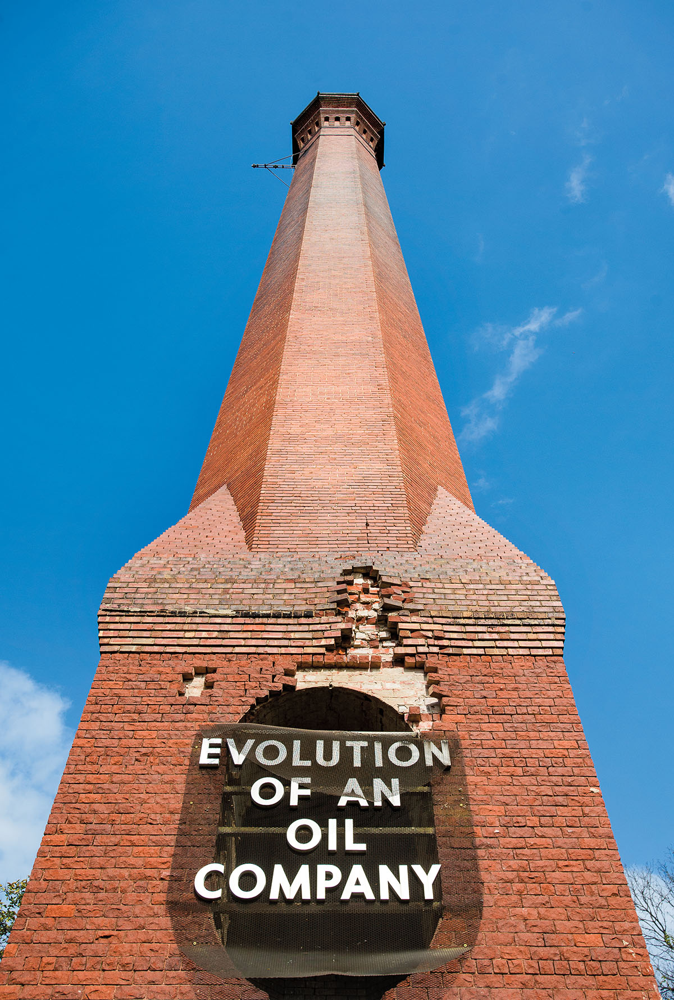
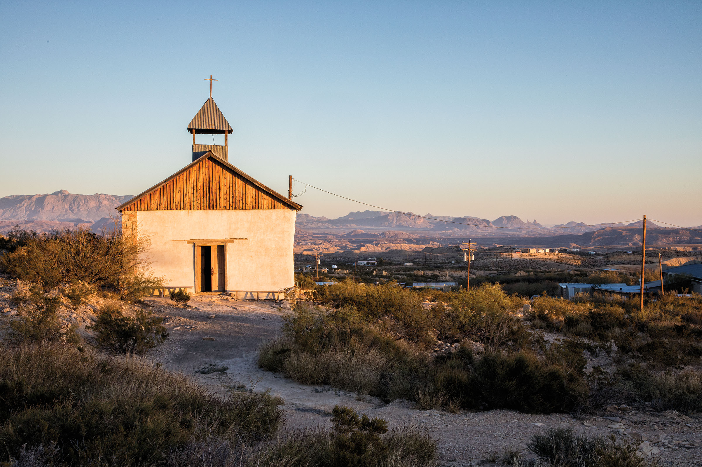

<PageDescription>

A ghost town road trip through North Central Texas

</PageDescription>

**By Scott Bedgood**

<Row>
<Column colSm={6} colMd={4} colLg={8}>

The history of Texas is marked by booms and busts. The booms brought droves of people from all over the world. The busts caused those same people to abandon the towns they had built, creating hundreds of ghost towns around the Lone Star State. 

As a visitor to a ghost town, you’re touring the dashed dreams of idealistic founders of the past, not unlike visitors to Italy taking photos of Roman ruins.

The difference between the ghost towns of Texas and the ruins of the Roman Forum is that ghost towns do not represent crushed dreams of an ancient unknowable people; many of the towns’ former residents—or their children—are still alive today. In the broadest terms of history, these dreams died very recently.

“They are places where we can touch the past, feel the dreams of the former occupants, touch where life was interrupted,” says Gary Speck, the author of several books on ghost towns. “They are a tangible piece of our past, and a lesson for our future.”  

Every part of the state has towns like these, so you can style your own ghost town road trip depending on where you want to drive. Remember when you are visiting a ghost town to be respectful of private property and of those who may still live there. 

On my visit to ghost towns in North Central Texas, I learned histories I wouldn’t have ever known and felt more connected to the booms and busts of this great state than ever.

<InlineNotification>

**Resources for Ghost Town Trips:**
Gary Speck, a ghost town researcher, has written several books on the topic, including *Dust in the Wind: A Guide to American Ghost Towns* and *Ghost Towns: Yesterday and Today*.

</InlineNotification>

### Thurber

I set out early from East Dallas to Thurber, known as one of Texas’ premier ghost towns. Thurber, which Speck considers a “true ghost town” (see definitions on next page), is in Erath County directly off Interstate 20 and is one of the most visible and accessible ghost towns in the state, with its own freeway exit and a 128-foot-tall brick smokestack rising above the highway. 

Towns thrive and then die for a variety of reasons, but one of the driving factors is the discovery of a profitable natural resource. In the case of Thurber, it was coal. Thurber sits atop one of the largest bituminous coal deposits in the state of Texas, and at the turn of the 20th century, thousands of people from all over the world descended upon Thurber to work in its thriving coal mine. It became one of the most diverse places in the state, with African American, Italian, Polish, Mexican, Irish, and Russian settlers.

Times were good for the owners of the coal mine, and after the miners won a lengthy labor dispute, their lives improved, too. Money flooded the town. Modern innovations such as electricity and refrigeration were installed in buildings. Coal was king, and Thurber was its kingdom. 

In addition to coal, the town made a name for itself through manufacture of heavy red bricks that were used to pave roads for cars and carriages. The bricks can still be seen in places like the Fort Worth Stockyards. 

And then, in 1917, the Ranger oil field was established only 16 miles from Thurber. The discovery of oil, along with trains transitioning to oil power instead of coal, spelled doom for Thurber’s coal industry. By 1927, after more labor disputes, all the union miners abandoned the coal mine. Thurber declined from a town that was the envy of the state to a ghost town in little more than three decades. 

Now all that’s left standing is the giant smokestack with “1908” emblazoned on its side and the former water treatment facility building behind it, which has fallen into disrepair. On the south side of I-20, an old miner’s house has been restored to its coal-boom-era appearance. Next door is St. Barbara’s Catholic Church, which was restored by the Thurber Historical Association in 1993. Though it does not hold regular services, it hosts weddings, funerals, and an annual Christmas program. 

The smokestack shows only a few signs of wear after more than 112 years—it’s ­obvious the people of Thurber built it with the idea that it would sustain them for decades. On the south side of the smokestack is a sign detailing a brief history of the Texas Pacific Coal and Oil Company. The Smokestack Restaurant in the old general store is a great spot to enjoy a meal after you tour the ruins.

</Column>

<Column colSm={6} colMd={4} colLg={4}>

<Caption>This 1908 smokestack marks the ghost town of Thurber in Erath County. Photo by Michael Aamador.</Caption>

<AdGroup id={['ad61','ad74','ad78','ad79','ad81']}/>

### Ghost towns are often perceived as completely empty and inactive. 

To clear up that misconception, researcher and author Gary Speck places ghost towns in these five categories:

**Barren site** – often just a sign marks the location of the former town

**Rubble and ruins** – just small indications of former buildings but nothing standing

**True ghost town** – abandoned with standing buildings

**Semi-ghost town** – small number of residents, town barely viable

**Historic community** – may be quite lively, but still much less population/business than during the peak years/boom days

</Column>

</Row>

<Caption>St. Agnes Church in Terlingua. Photo by Brandon Jakobeit.</Caption>

<Row>
<Column colSm={12} colMd={4} colLg={8}>

### Indian Gap

Indian Gap in Hamilton County, now a semi-ghost town by Speck’s categorization, was established in the 1870s. Settlers observed Comanches using this low-­lying place between the hills as a thoroughfare, hence the name. “After World War II, much of the community moved to the larger cities, and Indian Gap slowly lost most of the businesses in the area,” says Patricia Smith, a former president of the Indian Gap Cemetery Association.

I had heard that the town was marked by a large abandoned schoolhouse (the school closed in the 1950s), a general store formerly owned by Smith’s great-grandparents, and several old vehicles. The general store and antique vehicles were easy to find, but the schoolhouse proved elusive. 

I decided to drive toward Indian Gap Baptist Church, which still holds services for the residents who live in the area, and before I reached the church, the remains of the schoolhouse caught my eye. It had been demolished in 2019 after the Indian Gap Cemetery Association deemed it unsafe. All that remained were two columns that used to hold up its facade. 

It was disappointing, but Indian Gap still housed some interesting buildings, and I learned a valuable lesson: Change is constant, even in a ghost town. 

### College Mound

My final stop was College Mound, just outside Terrell in Kaufman County. Some people still live in the College Mound area, and the descendants of former residents return to the town frequently enough for varying events that it still has a vibrant community.

The town was established in 1840, only four years after Texas won independence from Mexico. Settlers moved into the area from out of state thanks to the promise of being given hundreds of acres to farm. Eventually, a man came through promising to establish a college in town, and the name was changed from Beck’s Mound to College Mound. The college never materialized, but the name stuck, according to Debbie Bozeman-Zook, a former president of the College Mound Cemetery Association. 

The town’s population held steady until the mid-20th century but dwindled as many gave up on the farming lifestyle and moved to nearby Terrell or other towns. The cemetery behind the Methodist church, which still holds regular services, is maintained by the association. Just off I-20, it houses the graves of several generations of residents who lived in the town in the 19th and early 20th centuries. 

The town’s annual Decoration Day event, held for more than 130 years, brings family members spread across the state and country to College Mound to clean and decorate the gravestones on the fourth Sunday of April. It’s a sort of family reunion for the scattered descendants of College Mound’s former residents, and visitors are always welcome to participate in the annual tradition.

“College Mound’s motto is always ‘You are a stranger here but once,’” says Bozeman-­Zook. “You can bring food or don’t bring food, there will be enough!”

</Column>

<Column colSm={6} colMd={4} colLg={4}>

### Other Popular Ghost Towns

Terlingua, right outside Big Bend National Park, is one of the Texas’ most well-known ghost towns. The town is famous for its two annual chili cookoffs, and many tourists stay in or near the town before heading into the park. The Starlight Theatre is a restaurant now, but it was once the premier entertainment destination for the cinnabar miners who brought the town a bit of prosperity in the early 1900s. 

Indianola is on Matagorda Bay on the Gulf Coast near Victoria. It was once a thriving port with 5,000 residents, but it fell to Union troops during the Civil War, then was partially destroyed by a hurricane in 1875 and fully destroyed by another in 1886. Gravesites, statues, and other remnants of the town remain. 

Lobo is way out west in Culberson County and is owned by three Germans from Frankfurt—yes, they bought the entire town in 2001. The abandoned buildings, many emblazoned with the town name, are a favorite of photographers who find themselves in far-out Texas.

<AdGroup id={['ad20']}/>

</Column>

</Row>