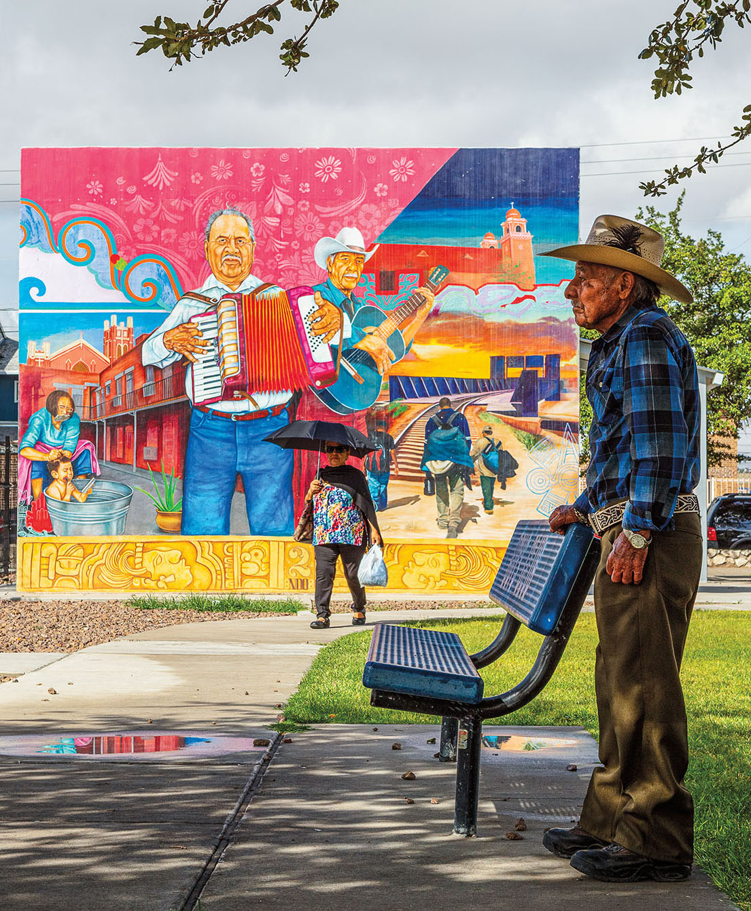
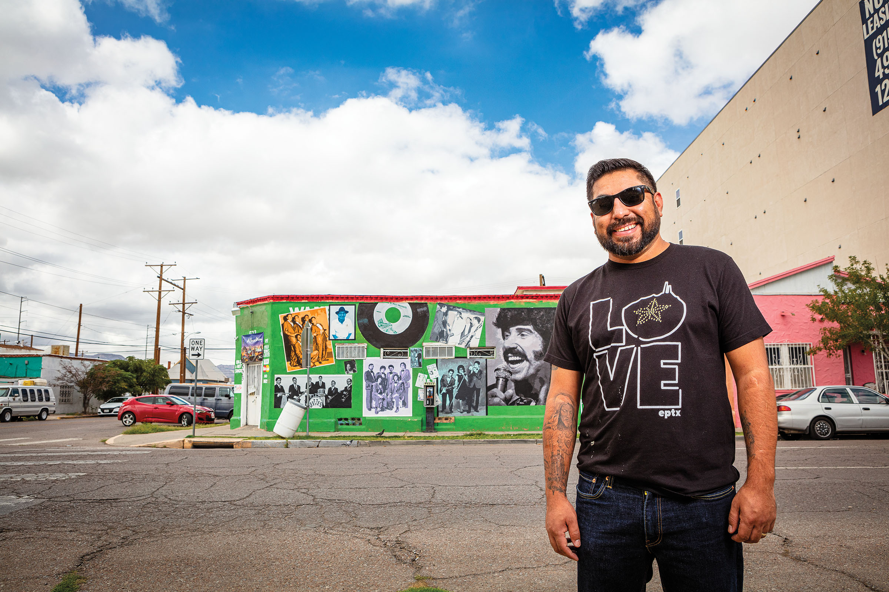

<PageDescription>

Artist Jesus “Cimi” Alvarado teaches Chicano culture through artworks on the streets of El Segundo Barrio

</PageDescription>

**By Michael Hurd**

<Row>

<Column colSm={12} colMd={3} colLg={4}>

It’s sprinkling rain and the surrounding desert smells of wet dirt as Jesus “Cimi” Alvarado, a muralist, takes his phone out of his pocket. He taps the phone and points the camera at a mural he painted on the side of El Mandadito de Waneks, a locally owned corner store at Campbell Street and Fourth Avenue in El Paso. The mural, titled *Barrio Soul*, has a background shade of green that almost matches the color of prickly pear cactuses found in this part of Texas. Featured on it are enlarged black-and-white photographs of the late El Paso radio personality Steve Crosno and local musical acts from the 1950s through ’70s, including the Nite Dreamers and the El Paso Drifters. These bands play oldies you can still hear floating from windows of homes and slow-moving cars on a Sunday afternoon.

Alvarado is standing in El Segundo Barrio, a working-class neighborhood whose southern border is outlined by the part of the Rio Grande separating El Paso from Juárez; Texas from Chihuahua; and the United States from Mexico. Historically, El Segundo Barrio has been one of the first stops for many Mexican citizens arriving in the U.S. and is known as another Ellis Island. Walk around and you’re more likely to hear Spanish than English.

As Alvarado steadies his phone, the mural suddenly comes alive. Thanks to the Augment El Paso app, which debuted in 2015, *Barrio Soul* becomes an interactive experience where you can hear the music of each of those artists and read their short biographies. Because the stories behind the dozens of murals that inhabit El Segundo Barrio aren’t readily available—they’re oral history, not written record—part of bringing the murals to life through the app requires searching for people who lived that history and can convey it. “We don’t have these archived,” Alvarado says of the photographs he uses as models, “so we have to go find these viejitos and be like, ‘Hey, we want to talk to you.’”

</Column>

<Column colSm={12} colMd={5} colLg={8}>

<Caption>El Corrido del Segundo Barrio. Photo by Christ Chavez.</Caption>

</Column>

</Row>

<Row>

<Column colSm={12} colMd={6} colLg={8}>

Viejitos is a loving term for older people. They are the grandparents who walk through El Segundo Barrio during the day. Sometimes, they walk their gentle steps while holding the hands of their grandchildren. Sometimes, viejitos see Alvarado working on a mural, and they stop to reminisce. They point at the mural and tell their grandchildren about how they grew up. How El Segundo Barrio, for better or worse, is changing. How new apartment buildings have replaced the old houses that once stood there. How a few decades ago, gangs on every other block would have made it difficult to even stand there, in the heart of El Segundo Barrio, and admire one of the many colorful murals that say something about this place. Viejitos help bring to life all of these murals, which collectively tell the story of the area’s deep ties to Chicano culture.

While walking between a few of the eight murals he’s painted in different parts of El Segundo Barrio, Alvarado points at one of the other murals that has been there for decades. “That’s by Felipe Adame,” he says. Adame is a celebrated muralist who passed away in 2017 and whose work adorns many walls of the barrio. “He’s one of the guys that, now as an adult, you go back and realize what they were doing, or trying to do—the same thing that we’re doing now. They were case workers or social workers who were working with gang members and doing the murals.”

Alvarado was born in Juárez and raised in El Paso. Keeping El Segundo Barrio’s history alive is important to him. In high school, as he learned more about Chicano and Indigenous history, young Jesus became Cimi, a Mayan word representing that culture’s concept of “continuous growth.” It was also there, at Bowie High School, that Alvarado met Gaspar Enríquez, an art teacher and artist whose work is displayed in the Smithsonian’s National Portrait Gallery, among other places. “It inspired me,” Alvarado says of his mentor’s art, “because it was like, whoa, he’s painting us. He’s painting who we are. And he’s not ashamed of doing it.”

In the past two decades, Alvarado has painted several murals across Texas. They depict figures and symbols that reflect Mexican and Mexican American identity: Emiliano Zapata, Cesar Chavez, Indigenous iconography, and the international bridges that, in a border town like El Paso, many people cross daily.

In Dallas, Alvarado’s murals color the walls of the Oak Cliff neighborhood, another historic Mexican barrio in Texas. In Marfa, Alvarado and his team painted a mural in 2018 that retold a part of that city’s lesser-known history. The untitled mural features an adobe building that for almost 60 years served as Marfa’s segregated school for students of Mexican descent. Alvarado has also painted murals in Mexico City, Los Angeles, and of course, El Paso.

“I wanted to teach history,” Alvarado says, “and then I ended up doing muralism. I’m still trying to, I guess, do the same thing.”

</Column>
</Row>

<Caption>Alvarado in front of El Mandadito de Waneks. Photo by Christ Chavez.</Caption>

<Row>
<Column colSm={12} colMd={6} colLg={8}>

Back in El Paso, Alvarado is standing in front of one of his other murals, *El Corrido del Segundo Barrio*, located at 801 S. Florence St., near the Boys & Girls Club. “They’re from el barrio,” he says of the two musicians—one holding an accordion, the other a guitar—at the center of the mural. “They go from little bar to little bar or restaurant, and they play.”

In the lower left-hand corner, the mural shows a mother bathing her son in a metal tub in the middle of a tenement courtyard. Alvarado then points to the lower right-hand side. There are three people carrying backpacks who are about to cross a bridge during sunset. “They are migrating through the río,” Alvarado explains, incorporating Spanish words and phrases into his conversation, as he often does. “It’s how a lot of our people, our families, got here.”

Walk around El Paso’s Segundo Barrio and it’s impossible not to notice that it’s changing—gentrifying. But a constant are the murals that artists like Alvarado and others before him have painted. Some have been there for decades. Others are relatively new. Each of them continues the muralist tradition of telling stories of the past within a changing present. Documenting these narratives, through viejitos or other sources, is crucial to keeping this history alive in the app-driven, digital era.

“I see it as an obligation to teach our youth about who we are and the stories that happen,” Alvarado says, “especially in this community.”

</Column>

<Column colSm={12} colMd={2} colLg={4}>

>“I wanted to teach history,” Alvarado says, “and then I ended up doing muralism. I’m still trying to, I guess, do the same thing.”

</Column>

</Row>

<Row>
<Column colSm={6} colMd={6} colLg={8}>
    <AdGroup id={['ad01']}/>
</Column>
</Row>