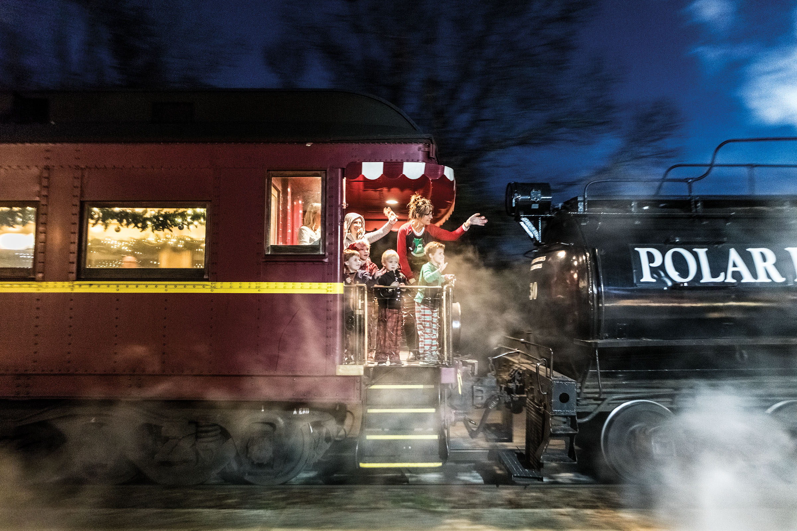
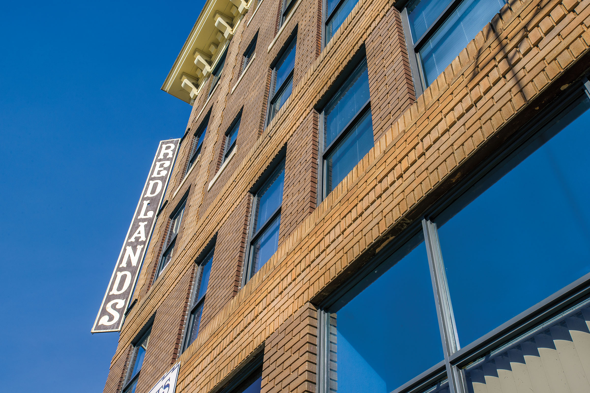
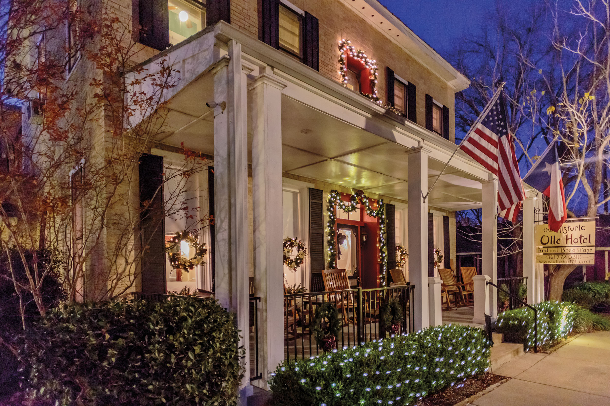

<PageDescription>

Sleep amid history in Kingsland, Slaton, Flatonia, Palestine, and Alpine

</PageDescription>

**By Matt Joyce**

<Caption>The Texas State Railroad’s Polar Express train ride in Palestine. Photo by Kenny Braun.</Caption>

<Row>
<Column colSm={6} colMd={4} colLg={8}>

There was a time when traveling across Texas meant taking the train. Whether boarding a steam locomotive or the electric interurban, passengers who could afford a ticket enjoyed unheard-of advantages in speed and comfort over horse-drawn coaches and the earliest automobiles.

The service members, scattered family, and traveling salesmen who relied on trains needed places to eat and sleep, leading to a proliferation of railroad hotels in the early 20th century. While most of these hotels have been destroyed or repurposed, a handful across the state, mostly in small towns, preserve the spirit of the railroad era, when a growing nation was still rooted in local character.

“I think people come here to capture what they feel might be happening in a little town, what they’ve lost in the big cities,” says Jean Mollard, owner of The Redlands Hotel, which opened in 1915 in Palestine, steps from the International-Great Northern Railroad. “Visitors seem to appreciate getting up close and personal with the historical aspects of the building, and even the town.”

Railroads hit their peak in Texas in the 1930s, and train travel flourished until the mid-1900s, when the state began paving rural roads and building the interstate highway system. Though Amtrak still operates three routes in Texas, train travel long ago became an afterthought to cars and airplanes.

Thousands of miles of railroads still crisscross Texas, however, and not far from the rumbling rails, these five historic railroad hotels keep their lights on, shining like locomotive headlamps down nostalgic tracks of the past.

<AdGroup id={['ad32']}/>

</Column>
</Row>

<Row>
<Column colSm={6} colMd={4} colLg={8}>

### Olle Hotel

*Flatonia, est. 1915*

Like countless small towns, Flatonia was built specifically to serve one of the new railroads stitching their way across Texas during the late 19th century. But unlike most of those towns, more than a century later Flatonia has an original railroad hotel that keeps the coffee hot.

The Olle Hotel’s two-story brick building was constructed as a residence in 1901 and converted into a hotel in 1915. In 1926 the Olle family bought the property, and for 40 years the watchful Agnes Olle (commonly known as “Mrs. Olle”) ran the hotel as a boardinghouse for “drummers,” traveling salesmen who rode the rails hawking the latest in gadgetry.

Renovation projects in the 1990s and 2000s retained the Olle’s historical features like transom windows and longleaf pine flooring while outfitting the 12 rooms with their own bathrooms and TVs. 

Regular passenger service stopped in Flatonia in 1949, but trains still pass through multiple times a day. Along the tracks, the historic Tower No. 3 recalls bygone track-switching technology, and the Central Texas Rail History Center exhibits train models and local rail history.

[Olle Hotel](https://ollehotel.com), 218 S. Market Ave. 
Rates start at $114.
361-772-0310

### Slaton Harvey House

*Slaton, est. 1912*

In the Panhandle town of Slaton, the 1912 Slaton Harvey House welcomes visitors as a bed-and-breakfast and event venue harkening to the town’s railroad origins and the days when entrepreneur Fred Harvey’s “eating houses” and hotels served passengers along the Atcheson, Topeka and Santa Fe Railway.

Slaton’s Harvey House was a restaurant where passengers would debark for a sit-down meal before the train rolled on. The Fred Harvey Company famously staffed its establishments with “Harvey Girls,” unmarried women recruited from the Midwest and East Coast for jobs out West.

“When people got off the train, they had 20 minutes to eat,” says Jessica Kelly, the former B&B operations manager. “The conductor would telegraph food orders from their last stop, so the meals would be ready when they got here. The Harvey Girls had to be fast and efficient.”

The restored dining hall no longer has its original U-shaped counter, but the yellow stucco walls, decorative wooden paneling, and stained-glass windows reflect the original design. 

Upstairs, the apartments where the Harvey Girls once resided have been renovated into spacious guest rooms with modern amenities but retain some original features, such as tiled floors in the bathrooms and antique furnishings.

The Slaton Railroad Heritage Association maintains the building as a museum with artifacts and vintage photos. “Harvey House luxury was intended to inspire people to move west, which was the railroad’s goal,” Kelly says.

[Slaton Harvey House](https://slatonharveyhouse.com), 400 Railroad Ave. 
Rates start at $125.
806-828-5900

</Column>

<Column colSm={6} colMd={4} colLg={4}>

<AdGroup id={['ad92','ad04']}/>

</Column>

</Row>

<Row>

<Column colSm={6} colMd={4} colLg={6}>

<Caption>The Redlands Hotel in Palestine. Photo by Kevin Stillman.</Caption>

</Column>

<Column colSm={6} colMd={4} colLg={6}>

<Caption>Olle Hotel in Flatonia. Photo by Will van Overbeek.</Caption>

</Column>

</Row>

<Row>
<Column colSm={12} colMd={4} colLg={8}>

### The Antlers Inn

*Kingsland, est. 1901*

The Austin and Northwestern Railroad opened the Antlers Hotel on a bank of the Colorado River in 1901. The Antlers catered to tourists seeking a riverside resort in Kingsland, while also renting rooms to railroad passengers traveling between Austin and Llano.

The rivers still draw visitors to the Antlers, although it now sits on Lake LBJ, which was formed in 1951 and teems with motorboats and shoreline development. While the surroundings have changed, the hotel—today called the Antlers Inn—retains a peaceful, timeless feeling, ringed by broad porches and looking out over 5 shady acres that lead to a lakeside park.

A mid-1990s restoration preserved the historical atmosphere of the Victorian rooms outfitted with antique furnishings and various artifacts of the inn’s railroad history. The lobby still displays its original chalkboard train bulletin, and in the Kingsland Coffee shop—a former dining hall—a 1910 photograph captures the Antlers’ staff in front of the hotel with small pecan trees that today tower over the building.

The Antlers also offers lodging in several restored cabooses and cottages that once served the railroad. The train theme continues at the Grand Central Café, which is set in a Queen Anne home.  

[The Antlers Inn](https://theantlers.com), 1001 King Court. 
Rates start at $90.
800-383-0007

### Holland Hotel

*Alpine, est. 1908, expanded 1928*

Unusual in Texas today, The Holland Hotel in Alpine not only grew up along the railroad tracks but still sits within a stone’s throw of an active passenger depot. The bay windows of the Century Bar look upon Holland Avenue and the railroad tracks that bisect the town. Every once in a while, you’ll see passengers from the nearby Amtrak depot scurry by, seizing a moment to stretch their legs before jumping back on the train to chug across West Texas.

The Southern Pacific Railroad was Alpine’s lifeline to the world when rancher John Holland built the Holland Hotel in 1908 to serve the cattle business and booming mercury mining industry. In 1928, his son, Clay Holland, hired influential El Paso architects Trost & Trost to design a renovation and expansion that created the hotel as we know it.

It’s not hard to imagine big-wheel cattlemen smoking stogies and sloshing scotch in the Holland’s expansive lobby, which was restored in the 1980s to its Spanish stylings of stucco walls, wooden crossbeams, and glass chandeliers. During the railroad days, the Holland catered to ranching businessmen, while on the other side of the tracks near the cattle shipping pens, the Hotel Ritchey served blue-collar cowboys, says David Keller, a local historian and archeologist. 

“Alpine wouldn’t have existed if it hadn’t been for the Southern Pacific Railway,” says Keller, who wrote Images of America: Alpine. “Any hotel from that early on, before cars supplanted railroads, was essentially a railroad hotel. Those structures are an integral part of the town’s history; they give a sense of the town’s character.”

[Holland Hotel](https://thehollandhoteltexas.com), 209 W. Holland Ave. 
Rates start at $135 for a standard room.
432-837-2800

### The Redlands Hotel

Palestine, est. 1915

The Redlands Hotel has been through a lot in its 105 years, but you’d hardly know it when looking at its classical brown-brick facade in downtown Palestine. Built to serve railroad business, The Redlands opened in 1915, signaling Palestine’s transformation from “rustic and uncouth” into “a modern city abreast of the times,” according to a program from the hotel’s grand opening.

The five-story, 86-room hotel boasted electricity and running water and even hosted the St. Louis Browns baseball team for spring training in 1916 and ’17. But such glamour couldn’t overcome the economic turmoil of World War I. After a remodel in 1919, the building transformed into the local headquarters of 
International-Great Northern Railway Co., a function it would serve until 1957.

Fast-forward to 1976, the year Jean Mollard bought the dilapidated building with her husband and brother, who have since passed away, and embarked on a project to give The Redlands a new multipurpose life. Forty-two years later, Mollard runs the renovated Redlands as a hotel with 20 suites for overnight and extended stays and retail space on the ground floor, including the Queen St. Grille.

“It wasn’t a plan; it was a journey,” Mollard says. “We loved old buildings for what they were, and we would put up with the things that were wrong with them. It all comes together when you respect the history.”

[The Redlands Hotel](https://theredlandshotel.com), 400 N. Queen St. at the corner with Oak Street. Rates start at $139.
800-550-5445

</Column>

<Column colSm={6} colMd={4} colLg={4}>
<AdGroup id={['ad45']}/>
</Column>

</Row>

<Row>

<Column colSm={3} colMd={3} colLg={5}>
<AdGroup id={['ad03']}/>
</Column>

</Row>