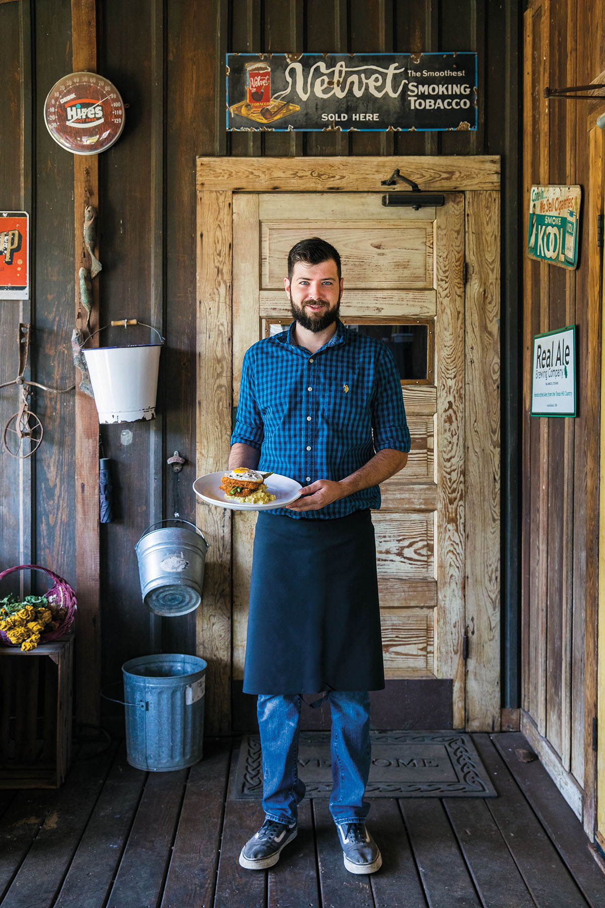
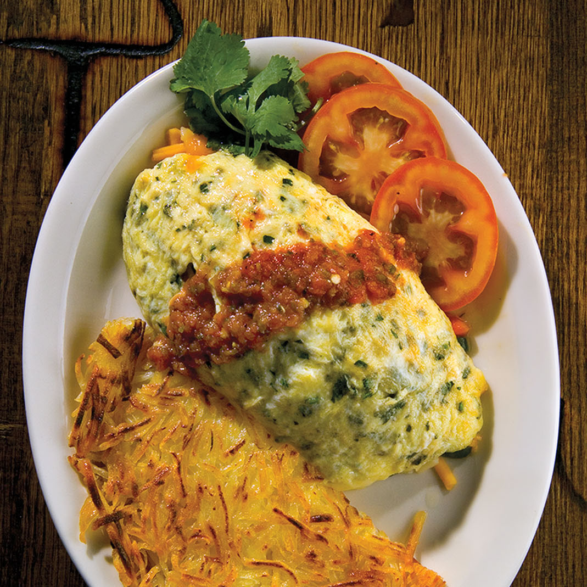
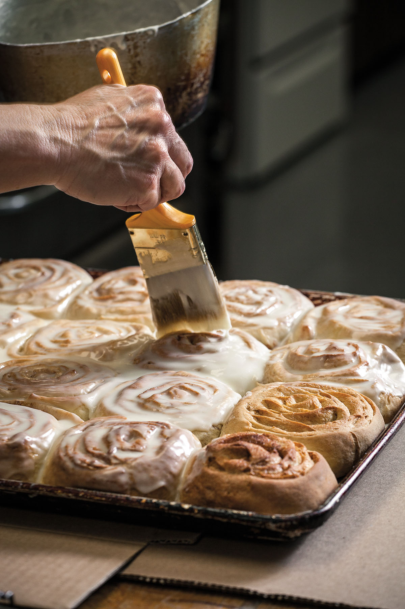

<PageDescription>

Chow down on home-cooked meals at these mom and pop restaurants

</PageDescription>

<Row>
<Column colSm={6} colMd={4} colLg={8}>

Texas is vast, and the decisions are wide open when hunger strikes on those long hauls across the state. Sure, you could pull up to the nearest drive-thru window (again), but there’s nothing boldest or grandest about a bag of fast food—especially when exceptional mom-and-pop restaurants are dishing up affordable comfort a little farther down the road. Whether you’re hankering for a taste of home or the meal less traveled, sometimes you just need to get out of the car and into a diner booth.

### Youngblood’s Cafe, Amarillo

Co-owner Tim Youngblood came to Amarillo in 1965 at age 14 after growing up in Durango, Colorado. He left to study at the Culinary Institute of America in New York and then returned to Amarillo where he eventually opened his restaurant. Youngblood’s has been in its downtown area location since 2013 and is famous for its Texas home cookin’, which means huevos rancheros and made-to-order omelets with your choice of filling, topped with green chile sauce.

*—Cynthia J. Drake* 

**620 SW 16th Ave. 806-342-9411; [youngbloodscafe.com](https://youngbloodscafe.com)**

### Dutchman’s Hidden Valley, Hamilton

Once you make your way past the old-fashioned dime-store candy shop up front, you’ll find a deli wonderland in the back where sandwiches are made on homemade bread with meats and cheeses that are sometimes cured and smoked on-site. One favorite is the Spicy Dutchman sandwich, featuring jalapeño-­and-cheese beef summer sausage, pepper jack cheese, and chipotle-ranch dressing on toasted jalapeño bread. Or order the Wurst Plate, a sausage sampler with German potato salad, slices of house-smoked Gruyère, and bread. “We’ve become part of [our customers’] vacations and part of their history,” says owner Kara Chorenziak, whose 
family has owned the restaurant since 1983. “Often­times, their parents or 
grandparents brought them, so now they’re bringing their kids and grandkids.”
*—C.J.D.*

** 3408 N. US 281. 254-386-3018; [dutchmans-hiddenvalley.com](http://dutchmans-hiddenvalley.com)**

### Stringer’s Lufkin Bar-B-Que, Lufkin

It’s not often that carbs steal the show at a barbecue restaurant, but Stringer’s is famous for just that. Its fried yeast rolls compel even vegetarians to settle into a cozy booth in the restaurant’s wood-­paneled interior to savor a hot, crisp roll with honey. Carnivores devour these rolls as a side to brisket, chopped beef, ribs, smoked chicken, and other selections from the time-tested menu, provided by the same family for more than 65 years. And dessert beckons with golden goodness—apple, peach, and raisin fried pies

*—Jennifer Babisak*

**203 S. Chestnut St. 936-634-4744; [lufkinbbq.com](http://lufkinbbq.com)**

### Crossvine Market, Waelder

The sausage at Crossvine tastes like it has a story. The recipe comes from African American preacher Rev. Barnes, who started selling it at this same location in the 1920s. When Rudy and Deanna Orona were getting ready to reopen the grocery store/diner in 2012 (it had been called Eureste’s Grocery for 35 years), the original sausage recipe was passed down by a Barnes family friend. “We get people driving from Houston and San Antonio for that sausage, which we make right here,” says Rudy, who also sells a lot of cheeseburgers, brisket, and ribs. The locals, meanwhile, love being able to pick up a quart of milk without having to drive 20 miles to Gonzales. “The grocery store is for the community,” Rudy says of the front half of the building. The picnic tables in the back are for anyone on I-10 with a rumblin’ tummy.

*—Michael Corcoran*

**419 W. US 90. 830-788-7154**

### Welfare Cafe, Welfare

The minuscule community of Welfare, deep in the lower Hill Country, boasts a café that serves more upscale fare than one might expect. Sprawling within a former general store, owner-chef Gaby McCormick’s restaurant, with its squeaky wood floors and produce boxes-turned-wine racks beneath the old post office windows, oozes guileless charm. Since opening 20 years ago, McCormick has delivered her passion for fresh, seasonal food in the form of modern German dishes. Her kartoffelpuffer—potato cakes served with spiced applesauce, cream, and bacon—and artichoke schnitzel are testaments, while her bacon-wrapped quail and pan-seared grouper with pineapple pico reveal her refined palate. Take time to wander the grounds and meet the chickens and goats roaming the property, which is now a popular spot for weddings.

*—June Naylor*

**223 Waring Welfare Road. 830-537-3700; [welfaretexas.com](http://welfaretexas.com)**

</Column>

<Column colSm={12} colMd={4} colLg={4}>

<Caption>Zac Rangel holding “Chicken Fredericksburg,” a dish that harmonizes jalapeños, peaches, and pecans, at Welfare Cafe. Photo by Wynn Myers.</Caption>

<AdGroup id={['ad04']}/>

<Caption>Youngblood’s Cafe serves its eggs and hash browns with a side of Texas twang. Photo by J. Griffis Smith.</Caption>

<AdGroup id={['ad37']}/>

</Column>

</Row>

<Row>
<Column colSm={6} colMd={4} colLg={8}>

### Miss Hattie’s Restaurant and Cathouse Lounge | San Angelo

Housed in a historic 1884 bank—one of the first permanent buildings in downtown San Angelo—Miss Hattie’s has a scintillating history: its now-covered underground tunnel once led to a bordello operated by a madam known as (you guessed it) Miss Hattie. San Angelo’s first female mayor, Brenda Gunter, owns the restaurant, which is known for its mesquite-smoked rib-eye with cilantro-­horseradish sauce and its bacon-­wrapped jalapeño appetizer. Operating a restaurant is “the best way in the world, particularly as mayor, to know what people are thinking,” Gunter says.

*—C.J.D. *

**26 E. Concho Ave. 325-653-0570; [misshattiesrestaurant.com](http://misshattiesrestaurant.com)**

### Cueva De Leon, Fort Davis

Whether carb-loading for cycling the Davis Mountains or simply satisfying a craving for some fresh-made Mexican food, head to Cueva De Leon, the 45-year-old cornerstone of Fort Davis eateries. Owner Lorina Wells opened the restaurant in 1976 in a backstreet café. In 1982 she built the current location downtown. “The recipes I started using were from my mom,” Wells says. “She taught me how to make stuff like enchilada sauce, and the rest I just learned by tasting and improving.” Her signature plate features chiles rellenos, large savory chili peppers that are roasted, peeled, and stuffed by hand, then dipped and fried in a crispy batter. “We’ve been doing them the same way for over 40 years,” Wells says. “It’s still our most popular dish.”

*—E. Dan Klepper *

**611 N. State St. 432-426-3801**

### Espresso Y Poco Mas, Terlingua

When native Texan Mimi Webb Miller moved to Terlingua from California, she missed having a good cup of espresso. Locals and visitors craved a place to hang out, too. So she opened an open-air café (in addition to guesthouses) that provided both, as well as breakfast and lunch. It’s an ever-evolving labor of love for Webb Miller and general manager/cook Noemi Aviles, who makes from-scratch pastries, breakfast burritos, salsa, and sandwiches like meatloaf and rotisserie chicken salad. They’re all served with views of the rugged Chisos Mountains under the shade of olive trees.

*—Melissa Gaskill*

**45 Milagro Way. 432-371-3044; [laposadamilagro.com](http://laposadamilagro.com)**

</Column>

<Column colSm={6} colMd={4} colLg={4}>

<Caption>Adding icing to fresh-baked cinnamon rolls at Dutchman’s Hidden Valley in Hamilton. Photo by Eric W. Pohl.</Caption>

<AdGroup id={['ad41', 'ad06']}/>

</Column>

</Row>

<Row>
<Column colSm={6} colMd={4} colLg={6}>
<AdGroup id={['ad42','ad67','ad44','ad03']}/>
</Column>
</Row>

<Row>
<Column colSm={6} colMd={4} colLg={8}>

### Rao’s Bakery, Beaumont

If you’re hunting for a towering slice of Italian cream cake with a spiced chai latte, possibly with a side of local gossip, look no further than the original Rao’s location in Beaumont’s Oaks Historic District. Open since 1941, this friendly little shop with long, glass-fronted cases holding exquisitely crafted cakes, tarts, and pastries buzzes with the happy chatter of young and old, fueled by the gregarious energy of owner Jake Tortorice, who’s often spotted hopping from table to table. With five stores in the region, Rao’s is also the primo spot for a lunchtime muffuletta, egg-and-olive sandwich, and Italian soda—all testaments to the family’s Sicilian roots.

*—J.N.*

**2596 Calder Ave. 409-832-4342; [raosbakery.com](http://raosbakery.com)**

### Nana’s Taquería, Weslaco

When Roxanna and Alfredo Treviño opened Nana’s Taquería down the road from Estero Llano Grande State Park, it was just the two of them working out of the back of their house with a banner tied to a chain-link fence that advertised lonches—a variation on the taco, with bite-size bread rolls in place of the tortilla. Several years later, the delectable lonches are the same, but the formerly modest home has been transformed by Alfredo, a civil engineer, and daughter Roxy, an architecture student, into a “little piece of Mexico in the Rio Grande Valley,” Roxanna says. There’s ornate tile, vaulted ceilings, colorful murals, and a delightful outdoor patio where you can sometimes hear live Spanish music.

*—Daniel Blue Tyx*

**1802 S. International Blvd. 956-447-2798; [nanastaqueria.com](http://nanastaqueria.com)**

<AdGroup id={['ad12']}/>

</Column>

<Column colSm={6} colMd={4} colLg={4}>
<AdGroup id={['ad40','ad75','ad28']}/>
</Column>

</Row>