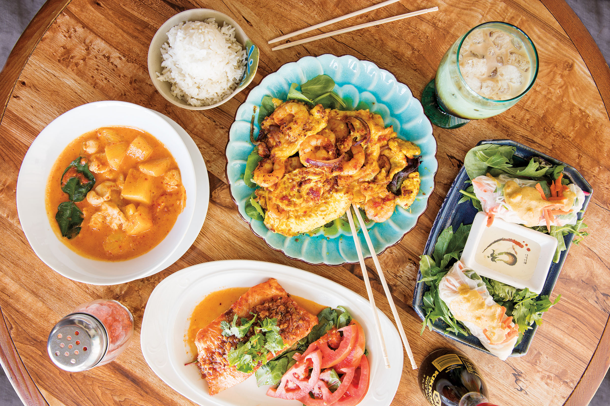
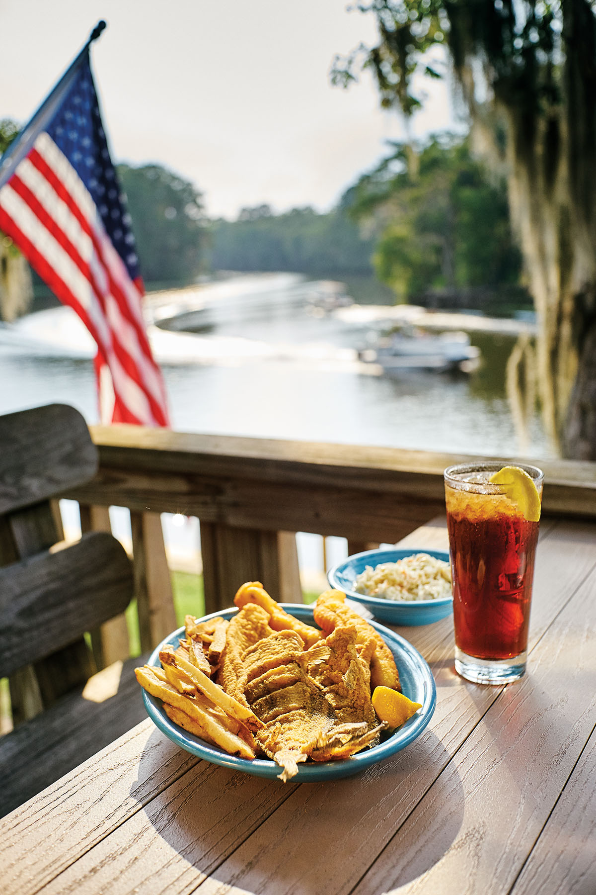
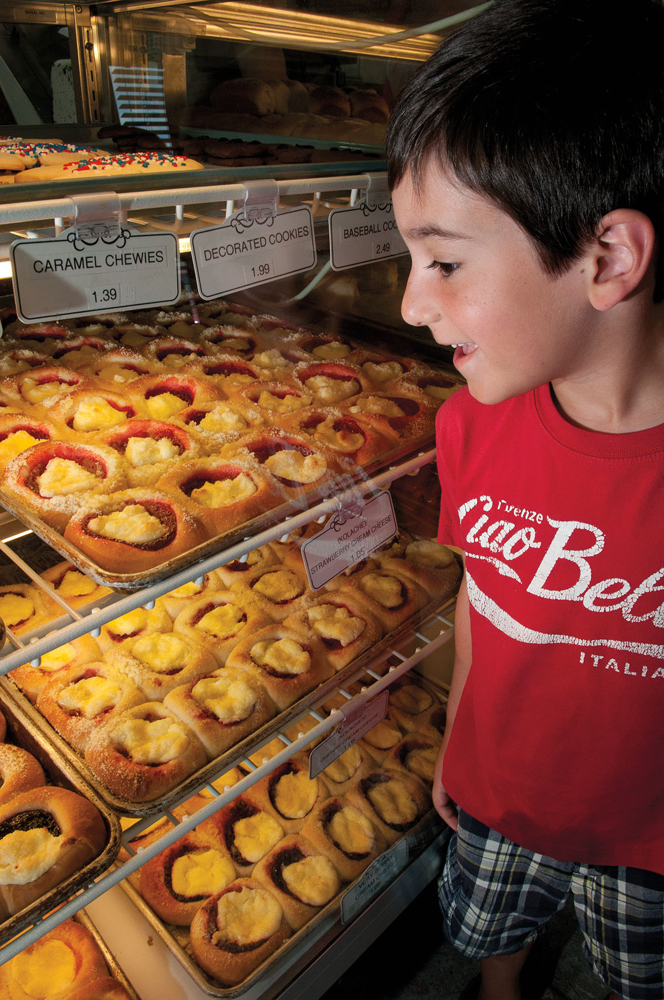

<PageDescription>

Chow down on home-cooked meals at these mom and pop restaurants

</PageDescription>

<Row>
<Column colSm={6} colMd={4} colLg={8}>

Texas is vast, and the decisions are wide open when hunger strikes on those long hauls across the state. Sure, you could pull up to the nearest drive-thru window (again), but there’s nothing boldest or grandest about a bag of fast food—especially when exceptional mom and pop restaurants are dishing up affordable comfort a little farther down the road. Whether you’re hankering for a taste of home or the meal less traveled, sometimes you just need to get out of the car and into a diner booth.

</Column>
</Row>

<AdGroup id={['ad138']}/>

<Row>
<Column colSm={6} colMd={4} colLg={8}>

### Del Norte Tacos | Godley

More than just another taqueria, this eatery dishes out breakfast, lunch, and dinner with a heaping serving of creativity. Take, for instance, the blackened shrimp tacos with spiced crema and cilantro slaw; the stacked enchiladas topped with ranchero sauce and a fried egg; the smoked chile relleno stuffed with brisket; and the grilled ahi tuna torta topped with spicy slaw, pickled onion, and guacamole (a once-in-a-while special). Owner and chef Chris Garcia, whose family’s Rio Grande Valley roots inform his flavor profiles, earned his stripes cooking at high-end Houston restaurants before opening this place near Fort Worth in 2008.

*—June Naylor* 

**101 N. State Highway 171. 817-389-2451; [delnortetacos.com](http://delnortetacos.com)**

### Marfa Burrito | Marfa

Finding a restaurant in Marfa that’s consistently open can be a challenge. But even for off-season West Texas adventurers, there’s always Marfa Burrito. Just a hop, skip, and a jump up the road from trendy lodging El Cosmico is the little white house where diners enter the kitchen and rattle off their orders to cook and owner Ramona Tejada (en español, if you’d like). Plop down at a table on the patio or in the small dining room, gaze at the photos on the wall of Tejada with her fans Matthew McConaughey and Mark Ruffalo, and tear into the tastiest dang breakfast burrito you’ve ever had in your life—like the Primo, made with fried potato, cheese, and beans in a handmade flour tortilla. Cash only.

*—Kimya Kavehkar*

** 515 S. Highland Ave. 325-514-8675

### Neal’s Dining Room | Concan

Where better to enjoy comfort food than perched on a cliff overlooking the Frio River? Tom and Vida Thrift Neal established their riverside restaurant in 1926. Today, their great-grandson Chase Roosa runs the seasonal business, and old family photos give the space a homey feel. The menu includes the original chicken-fried steak and fried chicken recipes, along with sides like lima beans and corn on the cob. In summer, the best seats are at the picnic tables on the open-air patio, with views of rolling hills and rollicking tubers.

*—Heather Brand*

**20720 SH 127. 830-232-5813; [nealsdiningroom.com](http://nealsdiningroom.com)**

<Caption>Lil Rita’s Grill House. Photo by Kenny Braun.</Caption>

### Lil Rita’s Grill House | Harlingen

When Sirikul Guerra, better known as Rita, started this restaurant with her husband, Hector, in 1998, Thai cuisine was largely unknown in the region, and smoked brisket was the featured menu item. But Rita’s signature pad thai and pad wen sun noodle dishes quickly gained a loyal following. Today, Valley residents head to Lil Rita’s for their fix of flavorful curries, aromatic soups, and Rita’s off-menu extra spicy cashew chicken or shrimp. Lil Rita’s remains something of a mystery to the uninitiated. The incongruous name—nothing is grilled or barbecued—is part of the mystique. Due to Rita’s busy schedule in her other vocation as full-time mom, the restaurant opens only between 11 a.m. and 1 p.m. on weekdays, as well as on Friday nights, when it’s particularly packed. Rita cooks every dish herself, so regulars know to expect longer waits during busy times. They also know it will be worth it, as evidenced by the stream of customers who stop by the order window next to the kitchen to thank her in person for a meal well-prepared.

*—Daniel Blue Tyx*

**410 E. Tyler Ave. 956-425-6242; **

### Woody’s Bar & Grill | Mineral Wells

You can’t miss Woody’s Bar & Grill. The old Quonset hut exterior features an image of the famous woodpecker above the door (it’s telling that this version of the bird appears to be smoking a stogie) and a fading red sign laying claim to the “best hamburger in Texas.” A dive of the first order, this joint with pool and shuffle­board serves as many as 350 burgers daily from its well-seasoned griddle. Order an ice-cold beer and a bowl of pickled jalapeños, carrots, and onion to eat with your oversized bag of Fritos, dig into a big bacon cheeseburger with a toasty bun, and listen to some Pat Green and Kid Rock on the jukebox. Just remember, it’s a bar—so expect varying amounts of smoke.

*—J.N.*

**6105 US 180 East. 940-325-9817**

</Column>

<Column colSm={12} colMd={4} colLg={4}>

<Caption>Tail-on fried catfish with hush puppies, coleslaw, and sweet tea at River Bend in Karnack. Photo by Dave Shafer.</Caption>

</Column>

</Row>

<Row>
<Column colSm={6} colMd={4} colLg={8}>

### Royers Round Top Café | Round Top

It’s smart to arrive for a late lunch or early supper if you want one of 40 seats inside this famously funky joint plastered with posters, T-shirts, and colorful, hand-painted signs in the renowned antiquing town with a population of 90. When Bud Royer opened his place in 1987, he became known for making the best pies anywhere—you understand its following once you’ve tasted the chocolate chip-pretzel-coconut-caramel concoction called Texas Trash, or the Junkberry, mixing apples and peaches with strawberries, blackberries, blueberries, and raspberries. Then he set about bringing in crowds for grilled pimento cheese sandwiches with tomato soup at lunch, and shrimp-stuffed grilled quail and grilled rack of lamb in the evening. Bud’s taken a back seat to let his family run the show now; patrons are still lining up for an hour or more.

*—J.N.*

**105 Main St. 979-249-3611; [royersroundtopcafe.com](http://royersroundtopcafe.com)**

### RiverBend | Karnack

OK, so maybe it’s not a roadside joint—more like an end-of-the-road joint. But this Southern-style eatery on the banks of Big Cypress Bayou still manages to lure its share of customers off the main route through Jefferson and Marshall. Tie your boat to the dock and pull up a chair on the screened-in deck for a Caddo Lake view shrouded in Spanish moss, and do your best to choose from a menu ranging from hand-cut rib-eyes to shrimp and frog legs with baskets of piping-hot jalapeño hush puppies. The catfish fillets, which come blackened or fried, are plenty popular, but true aficionados insist on the whole cat, which is caught fresh and fried to a crisp. “To me, if you can deal with the bones—which I can—the whole catfish are hands-down better,” says Debbi Wisdom, who co-owns RiverBend with her husband, Johnny. “It’s all about Caddo. It’s so pretty overlooking the water, not to mention all the wildlife, and each season looks different. It’s very calming out here—unless you’re trying to run a restaurant.” Still hungry? Don’t worry, you won’t be. But RiverBend’s more famous neighbor—Big Pines Lodge, a restaurant with roots in the 1930s—is just a mile or two up the bayou.

*—Wes Ferguson*

**211 Private Road 2422. 903-679-9000**

### Czech Stop | West

The drive on Interstate 35 between Dallas and Austin can be mind-numbing, but even weary travelers snap to attention when they see the 353 exit sign for West. In this tiny town between Hillsboro and Waco, the 38-year-old Czech Stop bakery, deli, and convenience store provides assorted Czech pastries and, mercifully, a clean bathroom. Load up on treats like kolaches ranging in fillings from cherry to apricot to pumpkin; and klobasniki stuffed with jalapeño, sausage, and cheese. Then, continue on your journey with a new pep in your step.

*—K.K.*

**105. N. College St. 254-826-4161; [czechstop.net](http://czechstop.net)**

</Column>

<Column colSm={6} colMd={4} colLg={4}>

<Caption>Kolaches at Czech Stop in West. Photo by Michael Amador.</Caption>

</Column>

</Row>

<Row>
<Column colSm={6} colMd={4} colLg={6}>

</Column>
</Row>

<Row>
<Column colSm={6} colMd={4} colLg={8}>

### King’s Inn | Riviera

This Loyola Beach icon located shoreside of Cayo del Grullo and east of Riviera is about as authentic as it gets along the Gulf Coast. The sprawling seafood landmark evolved from a 1930s fishing pier and bait shop/snack shack called Orlando’s, a joint venture by locals Orlando Underbrink and Blanche “Mom” Wright. In 1945, cook Cottle Ware took over the place with his wife, Alta Faye, who changed the name to King’s Inn. Today, son Randy runs the place. Order from a list of standard seafood fare, like fresh Gulf shrimp, fried or broiled; all entrées and sides are served family-style. Try the Bombay Salad as a starter, a creamy curried avocado on an iceberg wedge with sliced tomatoes and a pickled pepper. And, gentlemen, don’t forget the house rules: Remove your hats before dining.

*—E. Dan Klepper*

**1116 E. County Road 2270. 361-297-5265; [kingsinnriviera.com](http://kingsinnriviera.com)**

### The Crawfish Hole | Winnie

This family-owned roadside joint has been serving up heaps of boiled mudbugs for more than a decade, but it’s open only during crawfish season (roughly January through July), so get there when you can (and BYOB). The combo platter gives you a taste of just about everything on the menu: the signature crawfish, infused with spicy Cajun flavors, along with corn, potatoes, sausage, snow crab, and shrimp. No utensils are necessary for this seafood smorgasbord—­just dexterous fingers, plenty of paper towels, and a hearty appetite.

*—H.B.*

**510 Gulfway Drive. 409-296-9262**

</Column>

<Column colSm={6} colMd={4} colLg={4}>

</Column>

</Row>