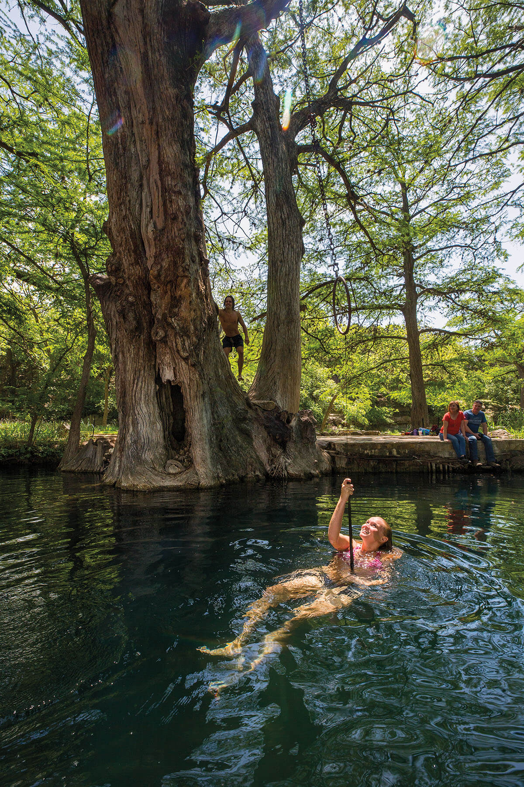
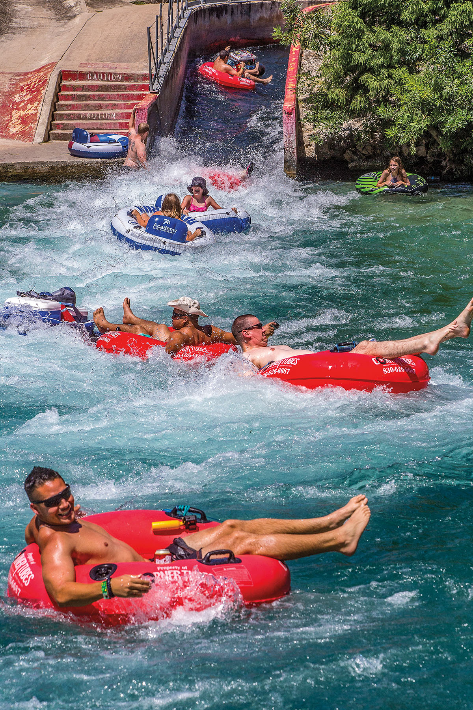
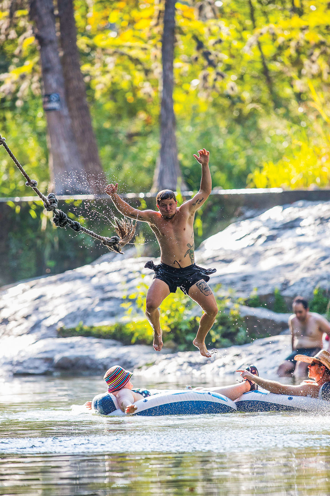

<PageDescription>

Travel along Interstate 35 for some of the best swimming in the state, plus daring rope swings

</PageDescription>

**By Joe Nick Patoski**

<Row>
<Column colSm={12} colMd={4} colLg={8}>

The 107-mile stretch of Interstate 35 between Georgetown and San Antonio will never be mistaken for a scenic highway. But if you time it right and know where to stop along the way, I-35 can be the blue-water highway leading to the sweet relief of some of the coolest spring-fed swimming holes in the southwest United States. Clear, cold, and chlorine-free water awaits only a couple of miles from the highway.

Think of it as swimming-hole hopping. Intrepid swimmers can splash from Georgetown to San Antonio in a single day, or make it more of a mosey, overnighting in San Marcos or New Braunfels.

In **Georgetown**, just five blocks north of the downtown square, you’ll find Blue Hole. This spring-water lagoon on the South Fork of the San Gabriel River is bordered by limestone bluffs. There is plenty of shallow water for the kids to play in and deeper stretches for long-distance lap swimming.

But don’t splish-splash in Georgetown too long. Barton Springs, the crown jewel of **Austin**, is calling, 31 miles south. Located in Zilker Park, southwest of downtown, Barton Springs is open year-round for swimmers. Its constant 68-degree water makes it the best place in the city to cool down during the long summer season. The massive pool spans 3 acres and accommodates more than 800,000 swimmers annually. The interpretative exhibit _Splash! Into the Edwards Aquifer_ at the Beverly S. Sheffield Education Center demonstrates how the springs work.

From there, it’s 30 miles down I-35 to **San Marcos**, home of San Marcos Springs, the second largest freshwater springs complex in Texas. The springs feed the San Marcos River, whose chilly waters are a favorite with the tubing crowd. Rio Vista Park, less than 2 miles downriver, is the town’s most popular gathering spot for tubers, swimmers, floaters, stand-up paddlers, canoers, and kayakers, all of whom wait their turn to slide down the rapids in the middle of the dam.

After filling up on Tex-Mex at Herbert’s Taco Hut around the corner from Rio Vista Park, continue south for 20 miles to **New Braunfels**. There’s no need to joust with the masses at Schlitterbahn or risk scrapes on the city-owned Comal River Tube Chute waterslide. The Landa Park pool (closed until May 2021) is the aquatic attraction less visited. Located near Comal Springs, it’s the largest complex of freshwater springs in Texas. The pool, constructed in the early 1900s, has concrete embankments like Barton Springs and is one of the oldest bathing pools in the state. Amenities include a fountain, rope swing, climbing-rope net, and waterslide. The spring-fed pool is complemented by an adjacent Olympic-size pool with chlorinated water.

The tour ends at historic San Pedro Springs in San Pedro Park, the oldest public park in Texas. Human occupation around the springs, just northwest of downtown **San Antonio**, dates back as far as 12,000 years. Many of the springs had already dried up in the late 19th century as a result of artesian wells being drilled for municipal use, but the San Pedro Pool was built in 1922 and thrived through the 1940s until the springs went completely dry. Heavy rains in the 1990s, an extensive renovation and restoration of the pool, and aggressive conservation efforts have brought the spring-fed pool back to its glory days, attracting summer crowds to its cool waters under the splendid shade of massive cypress trees.

Utilizing Central Texas’ bounty of swimming holes in the summertime is just the natural thing to do.

</Column>

<Column colSm={12} colMd={4} colLg={4}>

<Caption>Rope swing at Blue Hole Regional Park on Cypress Creek. Photo by Erich Schlegel.</Caption>

<AdGroup id={['ad32']}/>

</Column>

</Row>

<Row>

<Column colSm={12} colMd={4} colLg={4}>

<Caption>Floating in New Braunfels’ Prince Solms Park. Photo by Will van Overbeek.</Caption>

</Column>

<Column colSm={12} colMd={4} colLg={4}>
<AdGroup id={['ad24','ad67','ad25']}/>
</Column>

</Row>

<Row>

<Column colSm={12} colMd={6} colLg={8}>

### Six Rope Swings to Enjoy

**By Pam LeBlanc**

We love the free-as-a-breeze feeling that comes when you take a flying leap off a rope swing. That’s why we’ve scoured the state to find some of the best. Before you swing, keep these safety tips in mind: make sure there aren’t any rocks, branches, or other obstacles in the water; check to see if the branch holding the rope is strong enough to support you; untangle the rope from your body for an easy dismount; don’t release too soon or too late; don’t drink and swing; and don’t swing if you can’t swim. 

#### Utopia Park

You’ll have to steel your nerves to get to the highest launch point of the rope swing at this leafy small-town park, established in 1929 on a dammed stretch of the Sabinal River, about 16 miles downstream from Lost Maples State Natural Area. $10 per person day-use fee, free for ages 12 and younger. 

**241 Utopia Park Road, Utopia. 830-966-3643; [utopiapark.org](http://utopiapark.org)**

#### Bandera City Park

A short trot from the town known as the Cowboy Capital of the World flows a stretch of the Medina River so tempting you might jump in wearing your street clothes. Scale the boards nailed to the trunk of a huge bald cypress tree on the opposite bank (technically outside of the park’s boundaries). No entry fee Mon-Fri; $10 per adult weekends and holidays March-October, $5 for military, seniors, and first responders; free for ages 6 and younger. Call to check conditions during drought. 

**1102 Maple St., Bandera. 830-796-3765; [cityofbandera.org](http://cityofbandera.org)**

#### Krause Springs

Wear your river sandals to scale the big tilted slab of rock at this old-timey swimming hole 36 miles west of Austin. From there you can reach the knotted rope swing that will deliver you beneath a fern-covered cliff into a glinting pool. $8 adults, $5 children, free ages 3 and younger. 

**424 County Road 404, Spicewood. 830-693-4181; [krausesprings.net](http://krausesprings.net)**

#### Blue Hole

Pick from two rope swings to launch yourself into the shady emerald pools of Cypress Creek—one for the big kids and adults over deep water, a smaller one for those just metaphorically wetting their toes. $10 adults; $6 youth, seniors, and military. To ensure entry, book ahead. 

**100 Blue Hole Lane, Wimberley. 512-660-9111; [cityofwimberley.com](http://cityofwimberley.com)**

#### “Come and Take It” rope swing: 

Located near the spot where the first shot in the battle for Texas independence was fired, the rope hangs from a thick branch of an old cypress tree on the southern bank of the Guadalupe River, on the west side of the bridge. If you’re already in the water, scramble up the bank to get to the tree, climb a few steps up the trunk, grab on to the rope, and fling yourself over the usually deep pool below. Check currents, which sometimes move swiftly, and consider life vests for those who aren’t strong swimmers. Free. 

**US 183 at the Guadalupe River Bridge outside of Gonzales.**

#### Camp Tonkawa Springs

On the hottest of hot days, a plunge into the aquamarine spring-fed pool here feels a lot like jumping into an alpine lake—or a melted iceberg. And the rope swings? The best one beckons from a tree that leans way out over the pool. Rope swingers used to climb boards nailed to the tree trunk. The boards are gone now, but well-worn notches serve the same purpose. $10 per person, free for ages 5 and younger. Alcohol is banned on designated family days, when admission is $5 per person. Open year-round. 

**4675 County Road 153, Garrison. 936-564-8888; [camptonkawa.com](http://camptonkawa.com)**

</Column>

<Column colSm={12} colMd={2} colLg={4}>

<Caption>Jumping off the rope swing at Krause. Photo by Erich Schlegel.</Caption>

<AdGroup id={['ad28','ad75']}/>

</Column>

</Row>

<Row>
<Column colSm={12} colMd={5} colLg={6}>

</Column>
</Row>