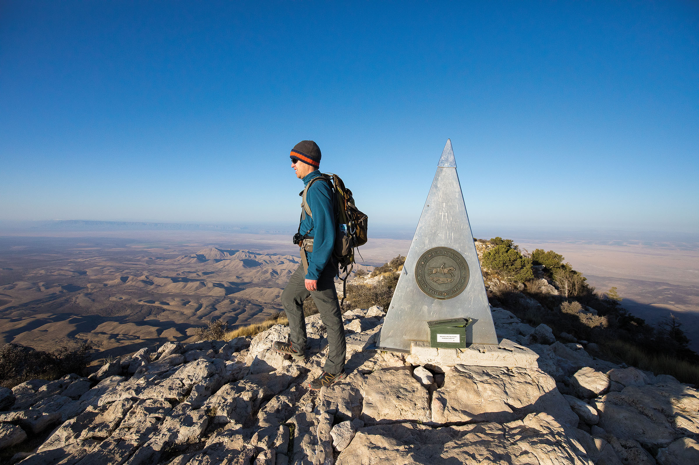
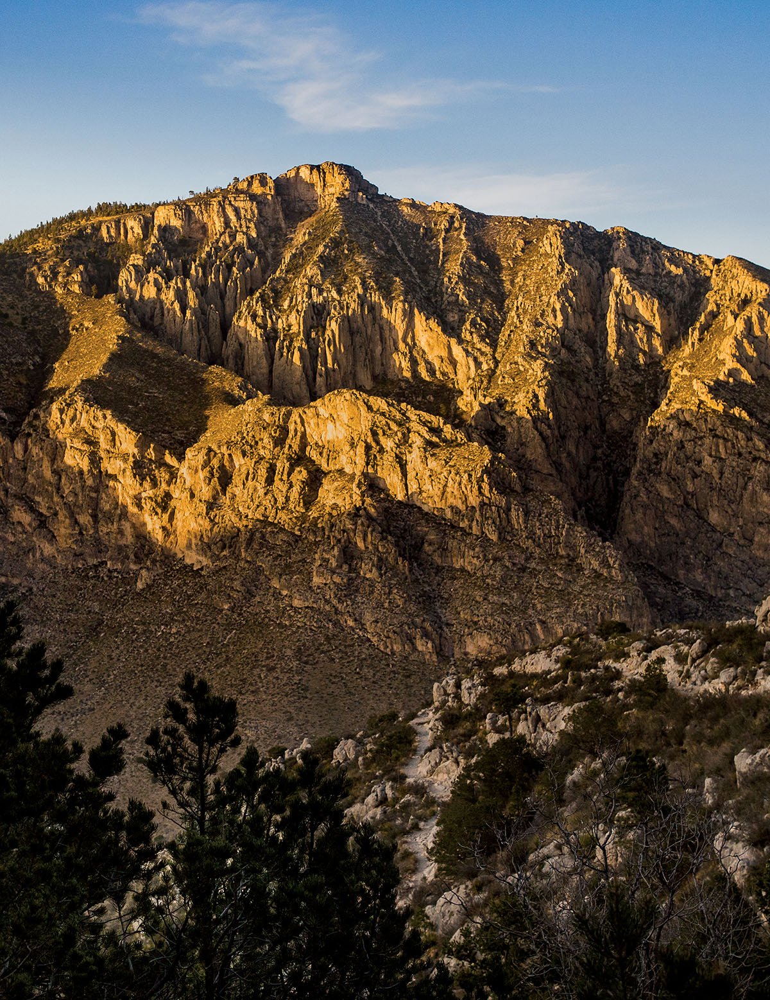
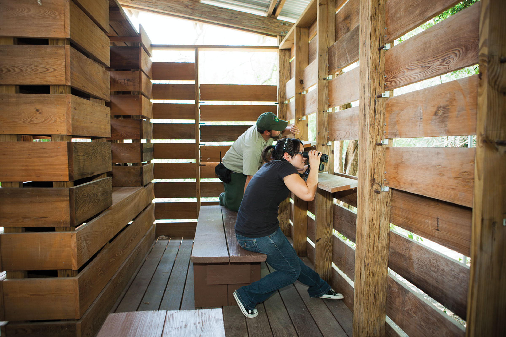

export const Title = () => (
  
    Reaching New Heights
  
);

<PageDescription>

State parks are making the outdoors more accessible

</PageDescription>

**By Julia Jones**

<Caption>The summit of the Guadalupe Peak Trail. Photo by Brandon Jakobeit.</Caption>

<Row>
<Column colSm={12} colMd={4} colLg={6}>

Conquering Guadalupe Peak, the state’s highest mountain, is an impressive feat for any hiker. The trail to the top features steep switchbacks, false summits, and 3,000 feet of elevation gain. For those who reach the peak, the feeling of pride is unmistakable. In July 1982, a group of men in wheelchairs accomplished the task, a show of strength that helped redefine how people with disabilities interact with the outdoors. 

The group began its expedition with six people, all members of Turning POINT (Paraplegics on Independent Nature Trips), a Dallas-based organization that continues to empower people with disabilities to participate in outdoor recreation. The men weren’t doing it just for themselves; they were also raising funds for the West Texas Rehabilitation Center in Abilene. Against the wishes of park officials, who recommended they take a less strenuous route to a less iconic destination, the group opted to spend five days on the 4-mile route leading to Guadalupe Peak.

Challenges plagued them from the outset. One man fell ill before they started, and two others made it up partway but had to turn back due to other complications. That left Donny Rodgers, Joe Moss, and Dave Kiley. Their creative problem-solving was essential to their success; the trio formed makeshift ramps up the trail by rearranging rocks to create a slope. As they reached the final few hundred yards, the trail became steeper, and the men, accompanied by a park ranger, exited their wheelchairs and crawled the remaining distance up to the monument that tops the peak. They made it; they had reached the top of Texas.

Due to the sharp-descending trails, officials deemed it unsafe to make the journey back down. So, after the group spent a night on the mountain, the U.S. Army sent helicopters from Fort Bliss to pick them up. The trio was delivered to the ground for a press conference, where President Ronald Reagan and the Texas and New Mexico governors called to congratulate them.

Today, there are many more opportunities for people in wheelchairs to experience the outdoors without having to complete such a daring endeavor. Sandra Heath, the Americans with Disabilities Act Coordinator for the Texas Parks and Wildlife Department, leads the charge to make Texas’ state and local parks more accessible. She recommends calling ahead to ask about a park’s specific offerings, since they vary by location and could be affected by weather conditions. “If we don’t have something in place, we’ll try to make something happen,” Heath says.

Some of the unique offerings from TPWD are guided hunting trips for people who are blind or visually impaired; guided American Sign Language hikes through parks like Dinosaur Valley State Park; and, in some parks, free use of an all-terrain wheelchair. For more information, visit [TPWD](https://tpwd.texas.gov/state-parks/park-information/accessibility).

</Column>

<Column colSm={12} colMd={4} colLg={6}>

<Caption>The Guadalupe Peak Trail in Guadalupe Mountains National Park. Photo by Brandon Jakobeit.</Caption>

</Column>

</Row>

<Row>
<Column colSm={12} colMd={5} colLg={8}>

<Caption>Bentsen-Rio Grande Valley State Park. Photo by Larry Ditto.</Caption>

### Fishing

Fishing enthusiasts should try out Caddo Lake State Park in far East Texas. The park includes an interpretive trail and a wheelchair-accessible fishing pier. There are also campsites and two cabins that are wheelchair accessible. Two of the piers at Inks Lake State Park can be navigated in a wheelchair, and the 400-foot-long pier at Lake Corpus Christi State Park has a concrete path, with ample lighting and a railing. Brazos Bend State Park near Galveston is also good for fishing and has a wheelchair-accessible trail out to its fishing pier, while cement paths lead to some of the piers at Huntsville State Park and Lake Livingston State Park. For more fishing recommendations, call the park you’re planning to visit.

### Wildlife Viewing

Several parks in the Rio Grande Valley have paved areas and offer views of birds, flora, and fauna not found anywhere else in Texas. Estero Llano Grande State Park has an all-terrain wheelchair for easier access to its sites, but normal wheelchairs can traverse many of its trails, especially to the Indigo Nature Blind. The park is part of the World Birding Center, a collection of nine prime birding areas within the Rio Grande Valley. This also includes Resaca de la Palma State Park, which has accessible trails, tram tours, and a visitor center. Bentsen-Rio Grande Valley State Park’s Hawk Observation Tower has a ramp, and accompanying photo blinds and interpretive trail are ADA certified and wheelchair accessible.

Farther from the Valley, Brazos Bend State Park’s “Habitats and Niches” permanent exhibit offers a look at the area’s famed alligators, and its wheelchair-
accessible half-mile wetland nature trail is dotted with tactile bronze versions of the wetland animals normally seen in the park. Wetland and woodland habitats are on full display from Lake Livingston State Park’s .9-mile boardwalk through the Piney Woods. And those with an interest in bats can visit Kickapoo Cavern State Park from mid-March to October and watch from the accessible viewing platform as up to a million Mexican free-tailed bats emerge from the cavern.

### Camping

Many state and national parks offer camping accommodations and accessible campsites. At Kickapoo Cavern, Lake Corpus Christi, and Inks Lake State Park, a few of the campsites are connected directly to the parking lot and bathrooms via cement pathways. Paved trails from the parking lot to the campsites are also available at Lake Mineral Wells State Park and Trailway, Ray Roberts Lake State Park, Brazos Bend State Park, Huntsville State Park, and other parks.

For those who don’t want to pitch a tent, some parks have cabins, lodges, and shelters. Inks Lake and Lake Corpus Christi have wheelchair-accessible cabins, Abilene State Park has a wheelchair-accessible yurt, and Huntsville State Park has three wheelchair-accessible screened shelters with electrical outlets. Some screened shelters at state parks are not wide enough to be ADA compliant for wheelchairs to enter; it’s always a good idea to check before visiting.

### Hiking

Ray Roberts Lake State Park north of Dallas has a 2.8-mile accessible scenic trail through much of the park, and there are 4.5 miles of additional paved trails that are considered mostly accessible. Lake Mineral Wells State Park & Trailway has a 2-mile stretch of asphalt trail through downtown Mineral Wells, along with 18 miles of crushed limestone that are suitable for wheelchairs. And Government Canyon State Natural Area’s Discovery Trail is made up of packed granite and areas of boardwalk; just park at the visitor center and follow the sidewalk to the trailhead.  

</Column>

<Column colSm={12} colMd={2} colLg={4}>

#### Navigating National Parks

• The Pinery Trail at Guadalupe Mountains National Park leads to historic ruins of an 1800s stagecoach, and the Manzanita Spring Trail leads to the spring through an orchard. Both are paved and less than one mile.

• Big Bend National Park has accessible campsites, nature trails, and programs like nature walks and shows in the amphitheater. 

• A majority of the facilities at Lyndon B. Johnson National Historic Park are wheelchair accessible, and a narrower wheelchair is available upon request for those who want to participate in the Texas White House tour.

• The entire Waco Mammoth facility is negotiable by wheelchair.

• At Padre Island National Seashore, five specialized beach wheelchairs are available for free to use. 

For more information on accessibility at national parks, visit https://nps.gov/aboutus/accessibility.htm. 

#### Other State Parks with Accessible Features

- Bastrop State Park
- Big Spring State Park
- Caprock Canyons State Park
- Cedar Hill State Park
- Choke Canyon State Park
- Eisenhower State Park
- Fairfield Lake State Park
- Falcon State Park
- Fort Parker State Park
- Goliad State Park and Historic Site
- Lake Arrowhead State Park
- Lake Brownwood State Park
- Lake Colorado City State Park
- Lost Maples State Natural Area
- Lyndon B. Johnson State Park
- Martin Creek Lake State Park
- Meridian State Park
- Monahans Sandhills State Park
- Pedernales Falls State Park
- Possum Kingdom State Park
- Sea Rim State Park

</Column>

</Row>

<Row>

<Column colSm={3} colMd={3} colLg={5}>

</Column>

</Row>