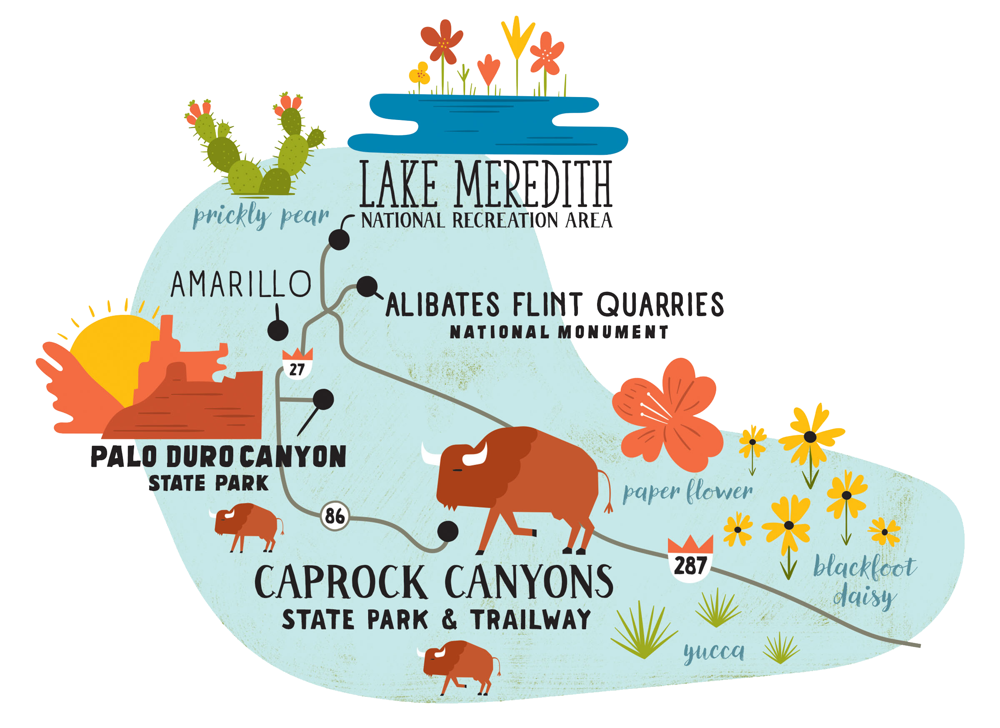
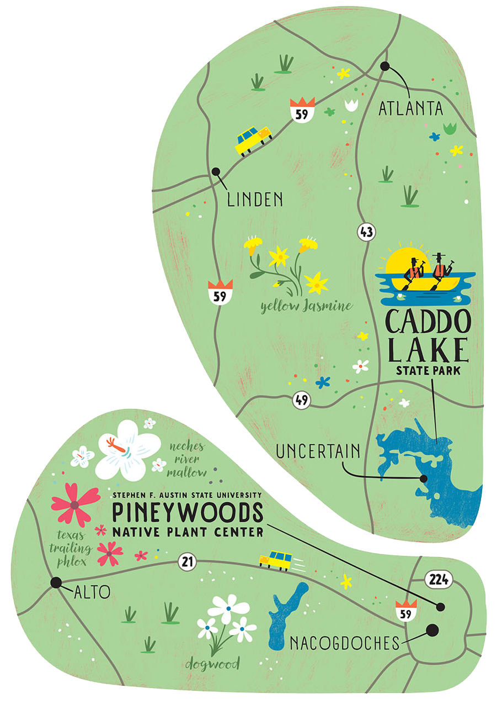
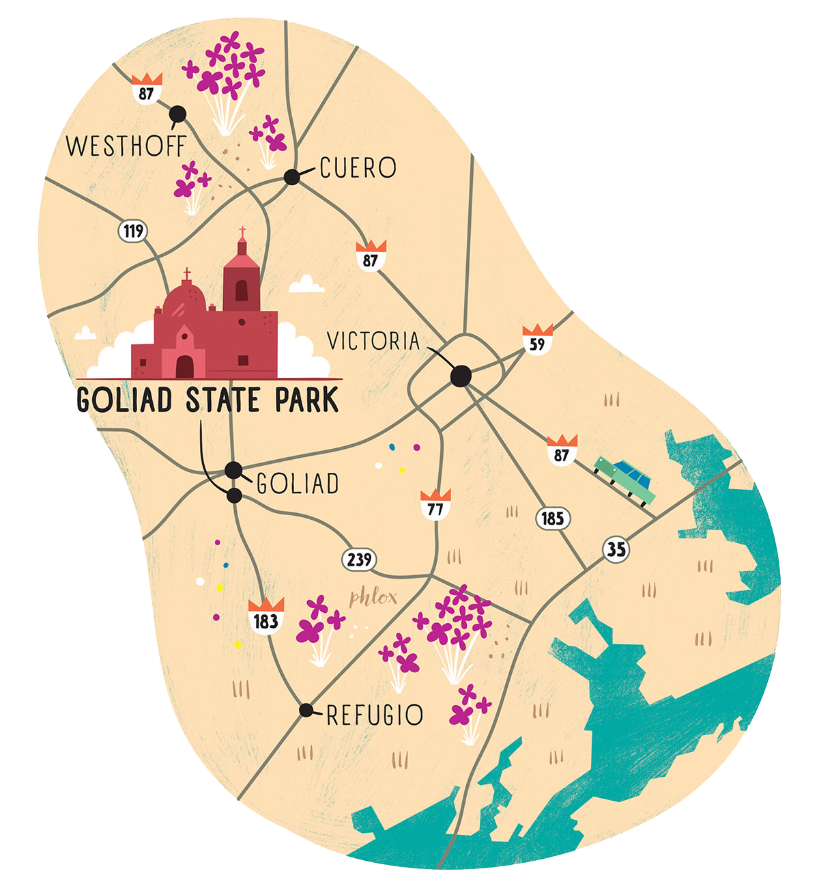

<PageDescription>

Add some color to your spring road trip with these four scenic routes

</PageDescription>

<Row>
<Column colSm={8} colMd={4} colLg={8}>

<Caption>Golden poppies on the Franklin Mountains in El Paso. Photo by Will van Overbeek.</Caption>

**By Melissa Gaskill**

A Texas travel must-do list can cover a lot of ground, literally and figuratively. But one thing appears on them all: spring wildflower drives.

As winter gives way to spring, wildflowers grace thousands of miles of Texas roadside, thanks in large part to government seeding programs and judicious mowing schedules that allow the flowers to reseed.

Highways traverse hillsides abloom with more than 400 species of wildflowers in the Hill Country, prickly poppies in the Panhandle, delicate flowers among the pines in East Texas, and huisache daisies in the South Texas Coastal Plains.

Here we’ve compiled a list of wildflower drives covering four diverse areas of the state, each route with its own collection of beautiful blooms, along with recommendations for interesting diversions when you need a break from driving. Don’t forget to stop and smell the flowers.

</Column>

<Column colSM={8} colMd={4} colLg={4}>
<AdGroup id={['ad81']}/>
<AdGroup id={['ad29']}/>
</Column>
</Row>

<Row>
<Column colSm={8} colMd={4} colLg={6}>

### The Hill Country

#### Fredericksburg, Enchanted Rock, Johnson City areas
 

Landscapes in the heart of the Texas Hill Country include rolling hills, rocky canyons, grasslands, woodlands, and savannas, and each features a vibrant palette of wildflowers.

Lyndon B. Johnson State Park and Historic Site, between Fredericksburg and Johnson City, boasts more than 400 species, including bluebonnets, Indian blankets, and Mexican hats.

The Willow City Loop—a famous route for wildflowers—can be reached by taking State Highway 16 to Farm-to-Market 1323 and following the road as it loops back around to SH 16. The Fredericksburg Trolley’s vintage-style vehicles offer a novel option for wildflower scouting. If you’re looking for a more adventurous outing, book a guided bicycle ride with Texas Bike Tours.

Flowers also abound along SH 16 north from Fredericksburg and on Ranch Road 965 to Enchanted Rock State Natural Area. While the eponymous giant granite dome takes main billing there, a variety of wildflowers also appear, including prickly pear and widow’s tears. Nearly 11 miles of hiking trails welcome chances for up-close sightings.

**[Texas State Parks](https://texasstateparks.org)**

**[Texas Bike Tours](https://texasbiketours.com)**, 512-371-3762

**[Fredericksburg Trolley](https://fbgtours.com)**, 830-998-8986

<AdGroup id={['ad31','ad25']}/>

</Column>

<Column colSm={8} colMd={4} colLg={6}>

<Caption>Illustration by Shaw Nielsen</Caption>

</Column>

</Row>

<Row>
<Column colSm={8} colMd={4} colLg={6}>

### Panhandle

#### Amarillo, Lake Meredith, Palo Duro Canyon, Caprock Canyons area

 

A mostly level plateau at the southern tip of the Great Plains, the Texas Panhandle Plains range in elevation from about 2,000 to 4,500 feet. Spanish explorers dubbed this area the Llano Estacado, Spanish for “staked plains.”

Home to the second-largest canyon in the country, Palo Duro Canyon State Park also contains paperflower, blackfoot daisy, and sand sage wildflowers. See these blooms via 50 miles of hiking and biking trails.

Streams carved the rugged gashes in the Caprock Escarpment that give Caprock Canyons State Park & Trailway its name—and its beauty. A 700-acre prairie near the park headquarters is home to lemon horsemint and white and rose prickly poppies. The Texas State Bison Herd, descendants of animals saved by ranchers Charles and Mary Ann Goodnight in 1878, also roams here.

Tahoka, chocolate, and Engelmann daisies bloom at Lake Meredith National Recreation Area in a series of breaks cut by the Canadian River through the High Plains. When conditions are right, the park’s Plum Creek area bursts into yellow with prairie zinnias and varieties of greenthread.

Alibates Flint Quarries National Monument is a mesa dotted with quarries used by Indigenous peoples for 13,000 years. Its winding, hilly road offers displays of sunflowers, tansy mustard, and prairie clover.

**[Amarillo Convention and Visitors Bureau](http://visitamarillotx.com)**, 800-692-1338

**[Palo Duro Canyon State Park](https://tpwd.texas.gov/state-parks/palo-duro-canyon)**, 806-488-2227

**[Caprock Canyons State Park & Trailway](https://tpwd.texas.gov/state-parks/caprock-canyons)**, 806-455-1492

**[Lake Meredith National Recreation Area](https://nps.gov/lamr)**, 806-857-3151

**[Alibates Flint Quarries National Monument](https://tpwd.texas.gov/state-parks/nps.gov/alfl)**, 806-857-6680

</Column>

<Column colSm={8} colMd={4} colLg={6}>

<Caption>Illustration by Shaw Nielsen</Caption>

</Column>

</Row>

<Row>
<Column colSm={8} colMd={4} colLg={6}>

### East Texas

#### Nacogdoches, Caddo Lake area 

 

While known for its towering pines and hardwood forests, East Texas also contains bottomlands and pockets of diverse ecosystems with unusual assemblages of wildflowers.

Stephen F. Austin State University’s 42-acre Pineywoods Native Plant Center houses a variety of rare and endangered native plants, such as Neches River rose mallow and Texas trailing phlox, and it cultivates blooms in its Lady Bird Johnson Wildflower Demonstration Garden.

Flowers typically blanket the sides of FM 227, and the drive on SH 21 between Alto and Nacogdoches catches dogwoods, redbuds, and yellow jessamine.

US 59 between Atlanta and Linden often sports colorful spiderwort, phlox, and milkweed, and FM 2198 near Uncertain is a good place to see downy phlox, bluebonnets, and Mexican hat.

Paddlers on the water in Caddo Lake State Park may spot bladderwort, fragrant water lily, and, in summer, American lotus.

Hungry? Try Auntie Pasta’s in Nacogdoches, which is famous for its 10-layer lasagna and other traditional Italian dishes and desserts.

**[Nacogdoches Convention and Visitors Bureau](http://visitnacogdoches.org)**, 936-564-7351

**[Caddo Lake State Park](https://tpwd.texas.gov/state-parks/caddo-lake)**, 903-679-3351

**[Auntie Pasta’s](http://auntiepastas.com)**, 936-569-2171

<AdGroup id={['ad65']}/>

</Column>

<Column colSm={8} colMd={4} colLg={6}>

<Caption>Illustration by Shaw Nielsen</Caption>

</Column>

</Row>

<Row>

<Column colSm={6} colMd={4} colLg={8}>

<Caption>Illustration by Shawn Nielsen</Caption>

### South Texas Coastal Plains 
#### Cuero, Goliad, Victoria, Refugio area

 

These coastal plains of grasslands and brush provided the backdrop for many significant events in early Texas history. Today, remnant historic sites create a stage for profusions of wildflowers.

Golden blooms of huisache daisies blanket the roadside along US 183 just past the San Antonio River in front of historic Presidio La Bahia, constructed in 1749 and restored to its 1836 state as a Mexican military compound. Phlox, coreopsis, and rose prickly poppy bloom here as well.

Cheapside Road off US 87 south at Westhoff dazzles with flowers on both sides, and US 87 to Cuero passes fields of rattlesnake flower, lazy daisy, and wild onion.

The Cuero Chamber of Commerce, Agriculture & Visitor Bureau provides a driving guide to the many wildflower-bedecked routes around town. Along US 183 from Cuero to Goliad, hawthorn trees, Texas sensitive pea, and showy evening primrose bloom.

Nearby Goliad State Park, home to a reconstructed circa 1749 Spanish mission, contains a wildflower meadow of bluebonnets, Indian paintbrush, and horsemint.

Overnight guests can have Presidio La Bahia to themselves by booking The Quarters, former lodging for Mexican officers and Catholic priests.

**Cuero Visitors Center**, 210 E. Main St.

**[Cuero Chamber of Commerce, Agriculture & Visitor Bureau](http://cuero.org)**, 361-275-2112

**[Goliad Chamber of Commerce](https://goliadcc.org)**, 361-645-3563

**[Goliad State Park](https://tpwd.texas.gov/state-parks/goliad)**, 361-645-3405

**[Presidio La Bahia](https://presidiolabahia.org/the-quarters)**, 361-645-3752

</Column>

<Column colSm={6} colMd={4} colLg={4}>
<AdGroup id={['ad28']}/>
</Column>

</Row>