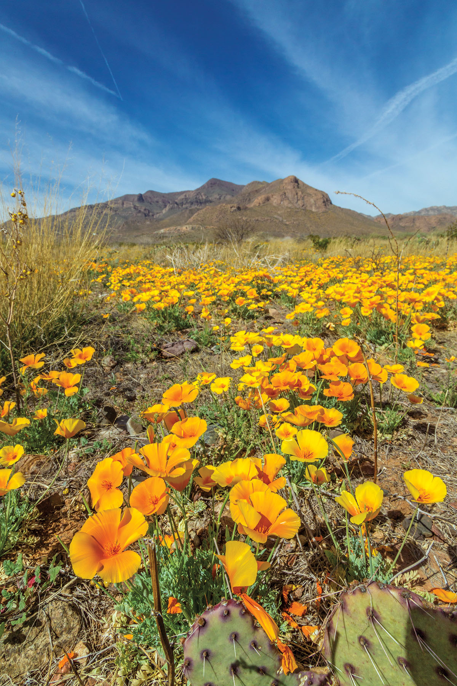
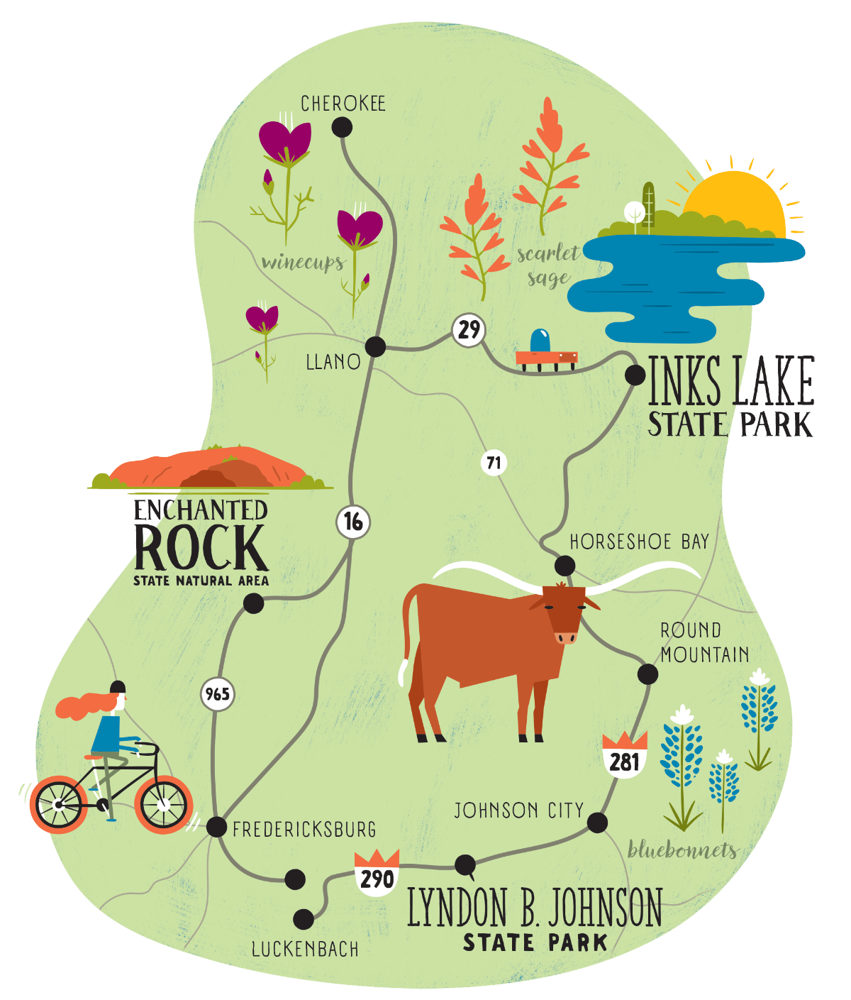
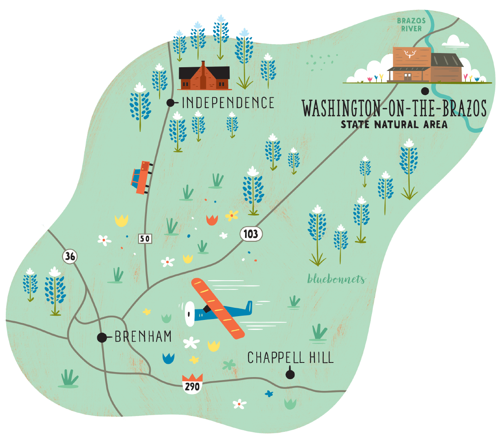
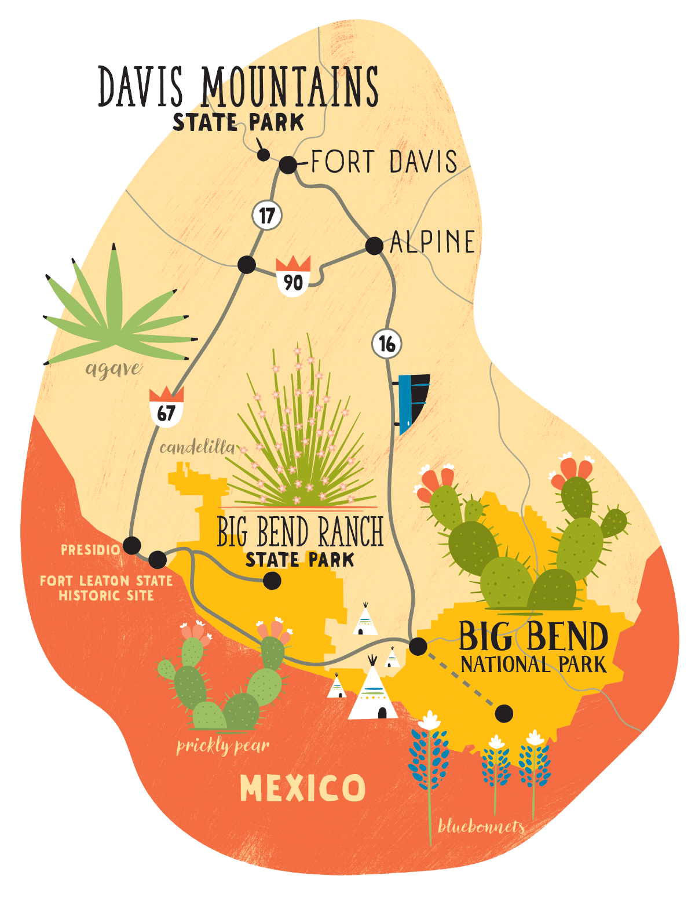
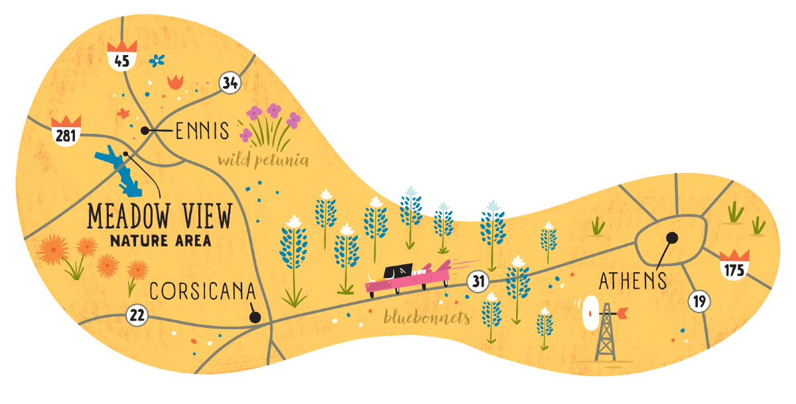

<PageDescription>

Add some color to your spring road trip with these four scenic routes

</PageDescription>

<Row>
<Column colSm={8} colMd={4} colLg={8}>

<Caption>Golden poppies on the Franklin Mountains in El Paso. Photo by Will van Overbeek.</Caption>

**By Melissa Gaskill**

A Texas travel bucket list can cover a lot of ground, literally and figuratively. But one thing appears on them all: spring wildflower drives.

As winter gives way to spring, wildflowers grace thousands of miles of Texas roadside, thanks in large part to government seeding programs and judicious mowing schedules that allow the flowers to reseed.

Highways traverse hillsides abloom with more than 400 species of wildflowers in the Hill Country; blankets of bluebonnets in Washington County; vibrant petunias in the Blackland Prairie; and prickly pear in Big Bend.

Here we’ve compiled a list of wildflower drives covering four diverse areas of the state, each route with its own collection of beautiful blooms, along with recommendations for interesting diversions when you need a break from driving. Don’t forget to stop and smell the flowers.

</Column>

<Column colSM={8} colMd={4} colLg={4}>
<AdGroup id={['ad81']}/>
<AdGroup id={['ad29']}/>
</Column>
</Row>

<Row>
<Column colSm={8} colMd={4} colLg={6}>

### The Hill Country

#### Fredericksburg, Enchanted Rock, Johnson City areas
 

Landscapes in the heart of the Texas Hill Country include rolling hills, rocky canyons, grasslands, woodlands, and savannas, and each sports a vibrant palette of wildflowers.

Lyndon B. Johnson State Park and Historic Site, between Fredericksburg and Johnson City, boasts more than 400 species, including bluebonnets, evening primrose, and scarlet sage.

The Willow City Loop—a famous route for wildflowers—can be reached by taking State Highway 16 to Farm-to-Market 1323 and following the road as it loops back around to SH 16. The Fredericksburg Trolley’s vintage-style vehicles offer a novel option for wildflower scouting. If you’re looking for a more adventurous outing, book a guided bicycle ride with Texas Bike Tours.

Flowers also abound along SH 16 north from Fredericksburg and on RR 965 to Enchanted Rock. While the eponymous giant granite dome takes main billing there, a variety of wildflowers also appear, including prickly pear and widow’s tears. Nearly 11 miles of hiking trails offer chances for up-close and personal sightings.

**[Texas State Parks](https://texasstateparks.org)**

**[Texas Bike Tours](https://texasbiketours.com)**, 512-371-3762

**[Fredericksburg Trolley](https://fbgtours.com)**, 830-998-8986

<AdGroup id={['ad31','ad25']}/>

</Column>

<Column colSm={8} colMd={4} colLg={6}>

<Caption>Illustration by Shaw Nielsen</Caption>

</Column>

</Row>

<Row>
<Column colSm={8} colMd={4} colLg={6}>

### Washington County

#### Blackland Prairie area

 

Washington County, famous for bluebonnets, lies on the edge of the Blackland Prairie, a grassland dominated by diverse perennial and annual grasses growing in some of the richest soil in the world.

Vast swaths of the iconic blue flowers blanket roadsides throughout the county. Routes reliably lined with them include State Highway 105, Farm-to-Market 50 toward Independence, FM 390 from Independence west to Old Baylor Park, and FM 1155’s doglegs between Chappell Hill Historic District and Washington-on-the-Brazos State Historic Site. There, where Texians signed the Texas Declaration of Independence, walking trails wander through fields of flowers.

Other wildflowers frequently spotted in these parts include Indian paintbrush, blue-eyed grass, and blanket flower.

**[Brenham/Washington County](https://visitbrenhamtexas.com)**, 979-337-7580

**[Washington-on-the-Brazos State Historic Site](https://thc.texas.gov)**, 936-878-2214

</Column>

<Column colSm={8} colMd={4} colLg={6}>

<Caption>Illustration by Shaw Nielsen</Caption>

</Column>

</Row>

<Row>
<Column colSm={8} colMd={4} colLg={6}>

### Big Bend and Davis Mountains

#### Big Bend National Park, Fort Davis, Marfa, Alpine areas

 

This southern edge of the vast Trans-Pecos region includes Big Bend National Park, home to iconic Big Bend bluebonnets, which bloom from late winter to early spring and typically grow taller than their cross-state cousins. Wildflowers in the national park scatter along the road west from Panther Junction, with showy cactus flowers dominating mid- to late spring.

The 50 miles of FM 170 west of the park sport Big Bend bluebonnets, sand bells, and yellow desert marigolds. Good viewing spots include the Hoodoos Trailhead and Contrabando multiuse trail, both within Big Bend Ranch State Park, and the Teepee Picnic Area on FM 170.

A 75-mile scenic loop from Fort Davis takes in Davis Mountains State Park and its scarlet bouvardia, silverleaf nightshade, and Apache plume. Also on this loop, the Nature Conservancy’s Davis Mountains Preserve is home to rare plants such as the Livermore sandwort, many-flowered unicorn plant, and fringed paintbrush. Blooms along State Highway 118 from Fort Davis to Alpine include bladderpod, purple sand verbena, and mountain laurel.

Terlingua’s Starlight Theatre, the former movie house for the historic mining company that developed the town, puts prickly pear blooms to good use in its Prickly Pear’ita, a riff on a classic margarita incorporating juice from the cactus fruit.

**[Fort Davis Chamber of Commerce](https://fortdavis.com)**, 432-426-3015

**[Big Bend National Park](https://nps.gov/bibe)**, 432-477-2251

**[Davis Mountains State Park](https://texasstateparks.org)**, 432-426-3337

**[Davis Mountains Preserve](https://nature.org)**, 432-426-2390

**[Big Bend Ranch State Park](https://texasstateparks.org)**, 432-358-4444

**[Starlight Theatre](https://thestarlighttheatre.com)**, 432-371-3400 

<AdGroup id={['ad65']}/>

</Column>

<Column colSm={8} colMd={4} colLg={6}>

<Caption>Illustration by Shaw Nielsen</Caption>

</Column>

</Row>

<Row>

<Column colSm={6} colMd={4} colLg={8}>

### Blackland Prairie
#### Ennis, Athens areas
 

This area of North Texas lies in the heart of the Blackland Prairie, a band of rich grassland arcing from the Red River to San Antonio. Its wildflowers include wild petunia, golden puccoon, and rose vervain.

Find blooms in the Meadow View Nature Area (only open in April), near US 287 in Ennis, and on State Highway 31 from Corsicana to Athens. Other usual suspects include wild indigo, coneflowers, and pink evening primrose, commonly called buttercups.

Throughout April, the Ennis Garden Club monitors 40 miles of marked bluebonnet trails on a stretch deemed the “Official Texas Bluebonnet Trail” by the Texas Legislature in 1997. The flowers typically peak during the second or third week of the month, around the time of the annual Ennis Bluebonnet Trails Festival.

The Ennis Visitor Center provides maps of the wildflower trails, or you can call the center or download an app focusing on bluebonnet trails. Stick around until dark for movies every night at Ennis’ Galaxy Drive-In Theatre.

<Caption>Illustration by Shaw Nielsen</Caption>

**Ennis Welcome Center 201 NW Main St., Ennis**, 972-878-4748

**[Bluebonnet Trails](https://bluebonnettrail.org)**, 972-878-4748

**[Galaxy Drive-In Theatre](https://galaxydriveintheatre.com)**, 972-875-5505

</Column>

<Column colSm={6} colMd={4} colLg={4}>
<AdGroup id={['ad28']}/>
</Column>

</Row>