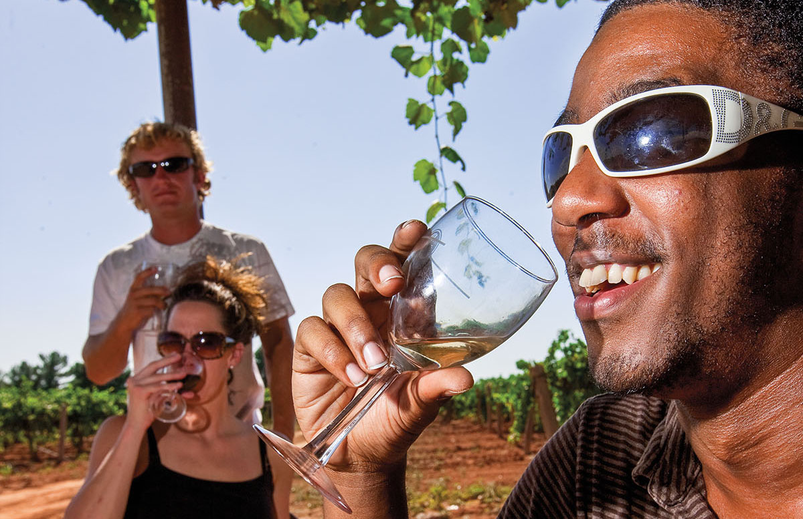

<PageDescription>

Taste, toast, and tour your way across the state’s alcoholic offerings 

</PageDescription>

<Caption>Pheasant Ridge Winery in Lubbock. Photo by J. Griffis Smith.</Caption>

Visiting one of the state’s growing number of wineries, breweries, and distilleries provides a chance to go beyond the bottle and gain a greater appreciation for the drink in your glass. When sitting down to a tasting, you often get a description of what you are drinking and may learn about the people who crafted it. Taking a tour will expand your experience—seeing the equipment behind the scenes garners an understanding of the process that results in these tasty beverages. The businesses listed here offer tours. Always check before you travel as tours may fill up quickly, require reservations, or may only be held on specific days at specific times. Check with the visitor centers of cities you plan to visit for additional opportunities that might not be listed here.

<Row>
<Column colSm={12} colMd={6} colLg={6}>
    <Listing>
        <ListingHed color="orange" title="Big Bend Country"/>
        <ListingItem 
            title="DeadBeach Brewery"
            city="El Paso">
            855-915-2337 
            
<a href="http://deadbeach.com">deadbeach.com</a>

        </ListingItem>
        <ListingItem 
            title="Val Verde Winery"
            city="Del Rio">
            830-775-9714 
            
<a href="http://valverdewinery.com">valverdewinery.com</a>

        </ListingItem>
        <ListingItem 
            title="Zin Valle Vineyards"
            city="Canutillo">
            915-877-4544 
            
<a href="http://zinvalle.com">zinvalle.com</a>

        </ListingItem>
    </Listing>
    <Listing>
        <ListingHed color="lightblue" title="Gulf Coast"/>
        <ListingItem 
            title="BJ Hooker’s Distilleries"
            city="Houston">
            281-209-2007 
            
<a href="http://bjhookersvodka.com">bjhookersvodka.com</a>

        </ListingItem> 
        <ListingItem 
            title="Buffalo Bayou Brewing Co."
            city="Houston">
            713-750-9795 
            
<a href="http://buffbrew.com">buffbrew.com</a>

        </ListingItem>
        <ListingItem 
            title="Eureka Heights Brew Co."
            city="Houston">
            832-953–4677 
            
<a href="http://eurekaheights.com">eurekaheights.com</a>

        </ListingItem>
        <ListingItem 
            title="Gulf Breeze Winery"
            city="Victoria">
            361-550-1086 
            
<a href="http://gulfbreezewinery.com">gulfbreezewinery.com</a>

        </ListingItem>
        <ListingItem 
            title="Haak Vineyards & Winery"
            city="Santa Fe">
            409-925-1401
            
<a href="http://haakwine.com">haakwine.com</a>

        </ListingItem>
        <ListingItem 
            title="Holler Brewing Co."
            city="Houston">
            832-781-0555 
            
<a href="http://hollerbeer.com">hollerbeer.com</a>

        </ListingItem>
        <ListingItem 
            title="Karbach Brewing Company"
            city="Houston">
        713-680-2739 
        
<a href="http://karbachbrewing.com">karbachbrewing.com</a>

        </ListingItem>
        <ListingItem 
            title="Lazy Beach Brewing"
            city="Corpus Christi">
        361-693-5347 
        
<a href="http://lazybeachbrewing.com">lazybeachbrewing.com</a>

        </ListingItem>
        <ListingItem 
            title="No Label Brewing Co."
            city="Katy">
        281-693-7545 
        
<a href="http://nolabelbrew.com">nolabelbrew.co</a>

        </ListingItem>
        <ListingItem 
            title="Railean Distillers"
            city="League City">
        713-545-2742 
        
<a href="http://railean.com">railean.com</a>

        </ListingItem>
        <ListingItem 
            title="Rebel Toad Brewing Co."
            city="Corpus Christi">
        512-221-1267 
        
<a href="http://rebeltoadbrewing.com">rebeltoadbrewing.com</a>

        </ListingItem>
        <ListingItem 
            title="Saint Arnold Brewing Company"
            city="Houston">
        713-686-9494 
        
<a href="http://saintarnold.com">saintarnold.com</a>

        </ListingItem>
        <ListingItem 
            title="Saloon Door Brewing"
            city="Webster">
        281-332-5800
        
<a href="http://saloondoorbrewing.com">saloondoorbrewing.com</a>

        </ListingItem>
        <ListingItem 
            title="Texas South Wind Vineyard & Winery"
        city="Refugio">
        361-526-4662 
        
<a href="http://texassouthwind.com">texassouthwind.com</a>

        </ListingItem>
        <ListingItem 
            title="Wild Horse Distillery"
            city="Kingsville">
        361-522-1222 
        
<a href="http://wildhorsedistillery.com">wildhorsedistillery.com</a>

        </ListingItem>
        <ListingItem 
            title="Whitmeyer's Distilling Co."
            city="Houston">
        713-623-1637
        
<a href="http://whitmeyers.com">whitmeyers.com</a>

        </ListingItem>
        <ListingItem 
            title="Yellow Rose Distilling LLC"
            city="Houston">
        281-886-8757 
        
<a href="http://yellowrosedistilling.com">yellowrosedistilling.com</a>

        </ListingItem>
        <ListingItem 
            title="Yepez Vineyard,"
            city="Baytown">
        281-573-4139 
        
<a href="http://yepezvineyard.com">yepezvineyard.com</a>

        </ListingItem>
    </Listing>

</Column>

<Column colSm={12} colMd={4} colLg={4} offsetLg={2}>

### **Texas Wine and Spirit Trails**

#### **WINE TRAILS**

##### Central Region

[Driftwood Wine Trail](http://driftwoodwinetrail.com)

[Dripping Wine Trail](http://drippingwinetrail.com)

[Fredericksburg Wine Road 290](http://wineroad290.com)

[Stagecoach Wine Trail](http://facebook.com/txstagecoachwinetrail)

[Texas Hill Country Wineries](http://texaswinetrail.com)

[Way Out Wineries](http://wayoutwineries.org)

#### 

##### North Region

[Cross Timbers Wine Trail](http://crosstimberswinetrail.com)

[Grapevine Wine Trail](http://grapevinewinerytrail.com)

[North Texas Wine Country](http://northtexaswine.com)

[Piney Woods Wine Trail](http://pineywoodswinetrail.com)

[Red River Valley Wine Trail](http://redrivervalleywinetrail.com)

####

##### Southeast Region

[Sam Houston Wine Trail](http://samhoustonwinetrail.com)

[Texas Bluebonnet Wine Trail](http://texasbluebonnetwinetrail.com)

[Texas Independence Wine Trail](http://Texasindependencewinetrail.com)

#### **BEER AND SPIRIT TRAILS** 

[Austin Ale Trail](http://atxaletrail.com)

[Hill Country Craft Beer Trail](http://hillcountrycraftbeertrail.com)

[Fort Worth Ale Trail](http://fortworth.com/aletrail)

[Fort Worth Distillery Trail](http://fortworth.com/things-to-do/distillerytrail)

[Texas Whiskey Trail](http://texaswhiskeytrail.com)

### **REMEMBER: DRINK RESPONSIBLY.**

There are consequences to having a drink or two and then getting behind the wheel of a car. These can affect the quality of life—yours and others—as well as your bank account.

TxDOT urges people who have been drinking to use a ride-share app, hail a taxi, take public transit, or designate a sober driver—someone who has not been drinking. Visit [soberrides.org](http://soberrides.org) and enter a current location and an end destination for several options to get home safely. It also is mobile-friendly.

</Column>

</Row>

<Row>
<Column colSm={12} colMd={6} colLg={6}>
   <Listing>
        <ListingHed color="blue" title="Hill Country"/>
        <ListingItem
            title="12 Fox Beer Co."
            city="Dripping Springs">
            512-626-4458 
        
<a href="http://12foxbeer.com">12foxbeer.com</a>

        </ListingItem>
        <ListingItem
            title="(512) Brewing Company"
            city="Austin">
            512-921-1545 
        
<a href="http://512brewing.com">512brewing.com</a>

        </ListingItem>
        <ListingItem
            title="Adelbert’s Brewery"
            city="Austin">
        512-662-1462 
        
<a href="http://adelbertsbeer.com">adelbertsbeer.com</a>

        </ListingItem>
        <ListingItem
            title="Acopon Brewing Co."
            city="Dripping Springs">
        
<a href="http://acoponbrewing.com">acoponbrewing.com</a>

        </ListingItem>
        <ListingItem
            title="Altstadt Brewery"
            city="Fredericksburg">
            830-304-2337 
        
<a href="http://altstadtbeer.com">altstadtbeer.com</a>

        </ListingItem>
        <ListingItem
            title="Andalusia Whiskey"
            city="Blanco">
        830-507-4359
        
<a href="http://andalusiawhiskey.com">andalusiawhiskey.com</a>

        </ListingItem>
        <ListingItem
            title="Augusta Vin Winery and Vineyards"
            city="Fredericksburg">
        830-307-1007 
        
<a href="http://augustavin.com">augustavin.com</a>

        </ListingItem>
        <ListingItem
            title="The Austin Beer Garden Brewing Co."
            city="Austin">
        512-298-2242 
        
<a href="http://theabgb.com">theabgb.com</a>

        </ListingItem>
        <ListingItem
            title="Austin Beerworks"
            city="Austin">
        512-821-2494 
        
<a href="http://austinbeerworks.com">austinbeerworks.com</a>

        </ListingItem>
        <ListingItem
            title="Austin Eastciders"
            city="Austin">
        512-893-7000 
        
<a href="http://austineastciders.com">austineastciders.com</a>

        </ListingItem>
        <ListingItem
            title="The Austin Winery"
            city="Austin">
        512-326-1445 
        
<a href="http://theaustinwinery.com">theaustinwinery.com</a>

        </ListingItem>
        <ListingItem
            title="Banner Distilling Co."
            city="Manor">
        512-815-2326 
        
<a href="http://bannerdistilling.com">bannerdistilling.com</a>

        </ListingItem> 
        <ListingItem
            title="Barons Creek Vineyards"
            city="Fredericksburg">
        830-304-3000 
        
<a href="http://baronscreekvineyards.com">baronscreekvineyards.com</a>

        </ListingItem>
        <ListingItem
            title="Becker Vineyards"
            city="Stonewall">
        830-644-2681 
        
<a href="http://beckervineyards.com">beckervineyards.com</a>

        </ListingItem>
        <ListingItem
            title="Bell Mountain Vineyards"
            city="Fredericksburg">
        830-685-3297 
        
<a href="http://bellmountainwine.com">bellmountainwine.com</a>

        </ListingItem>
        <ListingItem
            title="Bell Springs Winery"
            city="Dripping Springs">
        830-483-9463 
        
<a href="http://bellspringswinery.com">bellspringswinery.com</a>

        </ListingItem>
        <ListingItem
            title="The Bella Vista Ranch"
            city="Wimberley">
        512-847-6514 
        
<a href="http://texasoliveoil.com">texasoliveoil.com</a>

        </ListingItem>
        <ListingItem
            title="Bending Branch Winery"
            city="Comfort">
        830-995-2948 
        
<a href="http://bendingbranchwinery.com">bendingbranchwinery.com</a>

        </ListingItem>
        <ListingItem
            title="Bent Oak Winery"
            city="Cedar Park">
        512-551-1189 
        
<a href="http://bentoakwinery.com">bentoakwinery.com</a>

        </ListingItem>
        <ListingItem
            title="Blue Owl Brewing"
            city="Austin">
        512-593-1262 
        
<a href="http://blueowlbrewing.com">blueowlbrewing.com</a>

        </ListingItem> 
        <ListingItem
            title="Boerne Brewery"
            city="Boerne">
        830-331-8798 
        
<a href="http://boernebrewery.com">boernebrewery.com</a>

        </ListingItem>
        <ListingItem
            title="Crowded Barrel Whiskey Co."
            city="Austin">
        512-850-9622 
        
<a href="http://crowdedbarrelwhiskey.com">crowdedbarrelwhiskey.com</a>

        </ListingItem>
        <ListingItem
            title="Deep Eddy Vodka"
            city="Dripping Springs">
        512-994-3534 
        
<a href="http://deepeddyvodka.com/distillery">deepedddyvodka.com/distillery</a>

        </ListingItem> 
        <ListingItem
            title="Desert Door Texas Sotol"
            city="Driftwood">
        512-829-6129 
        
<a href="http://desertdoor.com">desertdoor.com</a>

        </ListingItem>
        <ListingItem
            title="Dodging Duck Brewhaus"
            city="Boerne">
        830-248-3825 
        
<a href="http://dodgingduck.com">dodgingduck.com</a>

        </ListingItem>
        <ListingItem
            title="Driftwood Estate Winery"
            city="Dripping Springs">
        512-858-9667 
        
<a href="http://driftwood.com">driftwood.com</a>

        </ListingItem>
        <ListingItem
            title="Dripping Springs Distilling"
            city="Dripping Springs">
        512-858-1199 
        
<a href="http://drippingspringsdistilling.com">drippingspringsdistilling.com</a>

        </ListingItem>
        <ListingItem
            title="Duchman Family Winery"
            city="Driftwood">
        512-858-1470 
        
<a href="http://duchmanwinery.com">duchmanwinery.com</a>

        </ListingItem>
        <ListingItem
            title="Fall Creek Vineyards"
            city="Tow">
        325-374-5361
        
<a href="http://fcv.com">fcv.com</a>

        </ListingItem>
        <ListingItem
            title="Fall Creek Vineyards"
            city="Driftwood">
            512-858-4050 
        
<a href="http://fcv.com/driftwood">fcv.com/driftwood</a>

        </ListingItem>
        <ListingItem
            title="Family Business Beer Co."
            city="Dripping Springs">
        512-829-4202 
        
<a href="http://familybusinessbeerco.com">familybusinessbeerco.com</a>

        </ListingItem>
        <ListingItem
            title="Faust Brewing Co."
            city="New Braunfels">
            830-625-7791 
        
<a href="http://faustbrewing.com">faustbrewing.com</a>

        </ListingItem>
        <ListingItem
            title="Fiesta Vineyard and Winery"
            city="Lometa">
        325-628-3434 
        
<a href="http://fiestawinery.com">fiestawinery.com</a>

        </ListingItem>
        <ListingItem
            title="Flat Creek Estate"
            city="Lago Vista">
        512-267-6310 
        
<a href="http://flatcreekestate.com">flatcreekestate.com</a>

        </ListingItem>
        <ListingItem
            title="Frog Pond Distillery"
            city="Dripping Springs">
            512-894-2206 
            
<a href="http://frogponddistillery.com">frogponddistillery.com</a>

        </ListingItem>
        <ListingItem 
            title="Garrison Brothers Distillery"
            city="Hye">
            512-302-0608 
        
<a href="http://garrisonbros.com">garrisonbros.com</a>

        </ListingItem>
        <ListingItem 
            title="Genius Liquids"
            city="Austin">
        512-710-7907 
        
<a href="http://geniusliquids.com">geniusliquids.com</a>

        </ListingItem>
        <ListingItem 
            title="Goodnight Loving Vodka"
            city="Austin">
            512-563-8485
        
<a href="http://goodnightlovingvodka.com">goodnightlovingvodka.com</a>

        </ListingItem>
        <ListingItem 
            title="Grape Creek Vineyards"
            city="Fredericksburg">
        830-644-2710 
        
<a href="http://grapecreek.com">grapecreek.com</a>

        </ListingItem>
        <ListingItem 
            title="Hawk’s Shadow Estate Winery"
            city="Dripping Springs">
        866-551-9463 or 512-587-9085 
        
<a href="http://hawksshadow.com">hawksshadow.com</a>

        </ListingItem>
        <ListingItem 
            title="Hill Country Distillers"
            city="Comfort">
            830-995-2924 
        
<a href="http://hillcountrytxdistillers.com">hillcountrytxdistillers.com</a>

        </ListingItem>
        <ListingItem 
            title="Hilmy Cellars"
            city="Fredericksburg">
            830-644-2482 
        
<a href="http://hilmywine.com">hilmywine.com</a>

        </ListingItem>
        <ListingItem 
            title="Hops and Grain Brewery"
            city="Austin">
            512-914-2467 
        
<a href="http://hopsandgrain.com">hopsandgrain.com</a>

        </ListingItem>
        <ListingItem 
            title="Hye Meadow Winery"
            city="Hye">
        855-493-9463 
        
<a href="http://hyemeadow.com">hyemeadow.com</a>

        </ListingItem>
        <ListingItem 
            title="Independence Brewing Co."
            city="Austin">
            512-707-0099
        
<a href="http://independencebrewing.com">independencebrewing.com</a>

        </ListingItem>
        <ListingItem 
            title="Infamous Brewing Company"
            city="Austin">
        512-487-8786 
        
<a href="http://infamousbrewing.com">infamousbrewing.com</a>

        </ListingItem>
        <ListingItem 
            title="Jester King Brewery"
            city="Austin">
        512-661-8736 
        
<a href="http://jesterkingbrewery.com">jesterkingbrewery.com</a>

        </ListingItem>
        <ListingItem 
            title="Kerrville Hills Winery"
            city="Kerrville">
            830-895-4233 
        
<a href="http://kerrvillehillswinery.com">kerrvillehillswinery.com</a>

        </ListingItem>
        <ListingItem 
            title="Kuhlman Cellars"
            city="Stonewall">
        512-920-2675 
        
<a href="http://kuhlmancellars.com">kuhlmancellars.com</a>

        </ListingItem>
        <ListingItem 
            title="Live Oak Brewing Company"
            city="Austin">
        512-385-2299 
        
<a href="http://liveoakbrewing.com">liveoakbrewing.com</a>

        </ListingItem>
        <ListingItem 
            title="Lost Maples Winery"
            city="Vanderpool">
            830-966-5131 
        
<a href="http://lostmapleswinery.com">lostmapleswinery.com</a>

        </ListingItem>
        <ListingItem 
            title="Messina Hof Hill Country"
            city="Fredericksburg">
        830-990-4653 
        
<a href="http://messinahof.com/mhhillcountry">messinahof.com/mhhillcountry</a>

        </ListingItem>
        <ListingItem 
            title="Milam & Greene Whiskies"
            city="Blanco">
            830-833-3033 
        
<a href="http://milamandgreenewhiskey.com">milamandgreenewhiskey.com</a>

        </ListingItem>
        <ListingItem 
            title="New Braunfels Brewing Company"
            city="New Braunfels">
        830-626-2739 
        
<a href="http://nbbrewing.com">nbbrewing.com</a>

        </ListingItem>
        <ListingItem 
            title="Oskar Blues Brewing"
            city="Austin">
        512-243-7054 
        
<a href="http://oskarblues.com">oskarblues.com</a>

        </ListingItem>
        <ListingItem 
            title="Pedernales Cellars"
            city="Stonewall">
            830-644-2037 
        
<a href="http://pedernalescellars.com">pedernalescellars.com</a>

        </ListingItem>
        <ListingItem 
            title="Perissos Vineyards and Winery"
            city="Burnet">
        512-415-7479 
        
<a href="http://perissosvineyards.com">perissosvinetards.com</a>

        </ListingItem>
        <ListingItem 
            title="Pint & Plow Brewing Co."
            city="Kerrville">
            830-315-7468 
        
<a href="http://pintandplow.com">pintandplow.com</a>

        </ListingItem>
        <ListingItem 
            title="Real Ale Brewing Company"
            city="Blanco">
        830-833-2534 
        
<a href="http://realalebrewing.com">realalebrewing.com</a>

        </ListingItem>
        <ListingItem 
            title="Red Horn Brewing Co."
            city="Cedar Park">
            512-986-7038 
        
<a href="http://redhornbrew.com">redhornbrew.com</a>

        </ListingItem>
        <ListingItem 
            title="Revolution Spirits"
            city="Austin">
        512-358-1203 
        
<a href="http://revolutionspirits.com">revolutionspirits.com</a>

        </ListingItem>
        <ListingItem 
            title="Roughhouse Brewing"
            city="San Marcos">
            512-667-7000 
        
<a href="http://roughhousebrewing.com">roughhousebrewing.com</a>

        </ListingItem>
        <ListingItem 
            title="Rustic Spur Vineyards"
            city="Fredericksburg">
        512-988-1910 
        </ListingItem>
        <ListingItem 
            title="Save the World Brewing Company"
            city="Marble Falls">
        830-637-7654 
        
<a href="http://savetheworldbrewing.com">savetheworldbrewing.com</a>

        </ListingItem>
        <ListingItem 
            title="Slate Mill Wine Collective"
            city="Fredericksburg">
        830-391-8510 
        
<a href="http://slatemillwinecollective.com">slatemillwinecollective.com</a>

        </ListingItem>
        <ListingItem 
            title="Signor Vineyards"
            city="Fredericksburg">
            830-304-7446 
        
<a href="http://signorvineyards.com">signorvineyards.com</a>

        </ListingItem>
        <ListingItem 
            title="Singing Water Vineyards"
            city="Comfort">
            830-995-2146 
        
<a href="http://singingwatervineyards.com">singingwatervineyards.com</a>

        </ListingItem>
        <ListingItem 
            title="Sister Creek Vineyards"
            city="Sisterdale">
            830-324-6704 
        
<a href="http://sistercreekvineyards.com">sistercreekvineyards.com</a>

        </ListingItem>
        <ListingItem 
            title="Solaro Estate Winery"
            city="Dripping Springs">
        832-660-8642 
        
<a href="http://solaroestate.com">solaroestate.com</a>

        </ListingItem>
        <ListingItem 
            title="Spicewood Vineyards"
            city="Spicewood">
            830-693-5328 
        
<a href="http://spicewoodvineyards.com">spicewoodvineyards.com</a>

        </ListingItem>
        <ListingItem 
            title="St. Elmo Brewing Co."
            city="Austin">
        737-300-1965 
        
<a href="http://stelmobrewing.com">stelmobrewing.com</a>

        </ListingItem>
        <ListingItem 
            title="Still Austin Whiskey Co."
            city="Austin">
            512-276-2700 
        
<a href="http://stillaustin.com">stillaustin.com</a>

        </ListingItem>
        <ListingItem 
            title="Stinson Distilling"
            city="Driftwood">
        512-894-2009 
        
<a href="http://stinson.business.site">stinson.business.site</a>

        </ListingItem>
        <ListingItem 
            title="Stone House Vineyard"
            city="Spicewood">
            512-264-9890 
        
<a href="http://stonehousevineyard.com">stonehousevineyard.com</a>

        </ListingItem>
        <ListingItem 
            title="Strange Land Brewery"
            city="Georgetown">
        512-276-2295 
        
<a href="http://strangelandbrewery.com">strangelandbrewery.com</a>

        </ListingItem>
        <ListingItem 
            title="Suds Monkey"
            city="Dripping Springs">
            512-222-3893 
        
<a href="http://sudsmonkeybrew.com">sudsmonkeybrew.com</a>

        </ListingItem>
        <ListingItem 
            title="Texas Legato"
            city="Lampasas">
        512-556-9600 
        
<a href="http://texaslegato.com">texaslegato.com</a>

        </ListingItem>
        <ListingItem 
            title="Texas Sake Company"
            city="Austin">
        512-344-9127 
        
<a href="http://txsake.com">txsake.com</a>

        </ListingItem>
        <ListingItem 
            title="Treaty Oak"
            city="Dripping Springs">
        512-599-0335 
        
<a href="http://treatyoakdistilling.com">treatyoakdistilling.com</a>

        </ListingItem>
        <ListingItem 
            title="Vista Brewing"
            city="Driftwood">
        512-766-1842 
        
<a href="http://vistabrewingtx.com">vistabrewingtx.com</a>

        </ListingItem>
        <ListingItem 
            title="Westcave Cellars"
            city="Round Mountain">
        512-431-1403 
        
<a href="http://westcavecellars.com">westcavecellars.com</a>

        </ListingItem>
        <ListingItem 
            title="Whitestone Brewery"
            city="Cedar Park">
            512-765-4828 
        
<a href="http://whitestonebrewery.com">whitestonebrewery.com</a>

        </ListingItem>
        <ListingItem 
            title="William Chris Vineyards"
            city="Hye">
        830-998-7654 
        
<a href="http://williamchriswines.com">williamchriswines.com</a>

        </ListingItem>
        <ListingItem 
            title="Woodrose Winery"
            city="Stonewall">
            830-644-2539 
        
<a href="http://woodrosewinery.com">woodrosewinery.com</a>

        </ListingItem>
    </Listing>
</Column>

<Column colSm={12} colMd={6} colLg={6}>
   <Listing>
        <ListingHed color="red" title="Panhandle Plains"/>
        <ListingItem
            title="Bar Z Winery"
            city="Canyon">
        806-488-2214 
        
<a href="http://barzwines.com">barzwines.com</a>

        </ListingItem>
        <ListingItem
            title="Christoval Winery"
            city="Christoval">
        325-315-8077 
        
<a href="http://christovalvineyards.com">christovalvineyards.com</a>

        </ListingItem>
        <ListingItem
            title="English Newsom Cellars"
            city="Lubbock">
            806-863-2704 
        
<a href="http://englishnewsom.com">englishnewsom.com</a>

        </ListingItem>
        <ListingItem
            title="Horseshoe Bend Cellars Vineyard & Winery"
            city="Iowa Park">
        940-855-2093 
        
<a href="http://horseshoebendcellars.com">horseshoebendcellars.com</a>

        </ListingItem> 
        <ListingItem
            title="Llano Estacado Winery"
            city="Lubbock">
            806-745-2258 
        
<a href="http://llanowine.com">llanowine.com</a>

        </ListingItem>
        <ListingItem
            title="Long Wooden Spoon Brewing Company"
            city="Amarillo">
        806-553-0397 
        
<a href="http://lwsbrewing.com">lwsbrewing.com</a>

        </ListingItem>
        <ListingItem
            title="McPherson Cellars"
            city="Lubbock">
        806-687-9463 
        
<a href="http://mcphersoncellars.com">mcphersoncellars.com</a>

        </ListingItem>
        <ListingItem
            title="Pheasant Ridge Winery"
            city="Lubbock">
            806-585-6616 
            
<a href="http://pheasantridgewinery.com">pheasantridgewinery.com</a>

        </ListingItem>
        <ListingItem
            title="Pondaseta Brewing Co."
            city="Amarillo">
            806-418-6282 
            
<a href="http://pondaseta.com">pondaseta.com</a>

        </ListingItem>
        <ListingItem
            title="Six Car Pub & Brewery"
            city="Amarillo">
            806-576-3396 
            
<a href="http://sixcarpub.com">sixcarpub.com</a>

        </ListingItem>
    </Listing>
</Column>

</Row>

<Row>

<Column colSm={12} colMd={6} colLg={6}>
    <Listing>
        <ListingHed color="green" title="Piney Woods"/>
        <ListingItem title="B-52 Brewing Co."
            city="Conroe">
        936-447-4677 
        
b52brewing.com

        </ListingItem>
        <ListingItem title="Bartletts Distillery"
            city="Conroe">
        936-873-8000 
        
<a href="http://bartlettsdistillery.com">bartlettsdistillery.com</a>

        </ListingItem>
        <ListingItem title="Briar Creek Vineyards"
            city="Whitehouse">
        903-839-6283 
        
<a href="http://briarcreekvineyards.com">briarcreekvineyards.com</a>

        </ListingItem>
        <ListingItem title="Bruno & George Winery"
            city="Sour Lake">
        409-287-1212 
        
<a href="http://brunoandgeorge.com">brunoandgeorge.com</a>

        </ListingItem>
        <ListingItem title="Copperhead Brewery"
            city="Conroe">
        281-919-6134 
        
<a href="http://copperheadbrewery.com">copperheadbrewery.com</a>

        </ListingItem>
        <ListingItem title="The Distillery at Kiepersol"
            city="Tyler">
        903-894-8995 
        
<a href="http://kiepersol.com/distillery">kiepersol.com/distillery</a>

        </ListingItem>
        <ListingItem title="Enoch’s Stomp Vineyard and Winery"
            city="Harleton">
        903-240-1587 
        
<a href="http://enochsstomp.com">enochsstomp.com</a>

        </ListingItem>
        <ListingItem title="ETX Brewing Co."
            city="Tyler">
        903-630-7720 
        
<a href="http://etxbrew.com">etxbrew.com</a>

        </ListingItem>
        <ListingItem title="Grand Oaks Vineyard and Winery"
            city="Mineola">
        903-569-2801 
        
<a href="http://gowinerymineola.com">gowinerymineola.com</a>

        </ListingItem>
        <ListingItem title="Kiepersol Cellars Vineyards and Winery"
            city="Tyler">
        903-894-8995 
        
<a href="http://kiepersol.com">kiepersol.com</a>

        </ListingItem>
        <ListingItem title="Lone Pint Brewery"
            city="Magnolia">
        281-731-5466 
        
<a href="http://lonepint.com">lonepint.com</a>

        </ListingItem>
        <ListingItem title="Los Pinos Ranch Vineyards"
            city="Pittsburg">
        903-855-1769 
        
<a href="http://lospinosranchvineyards.com">lospinosranchvineyards.com</a>

        </ListingItem>
        <ListingItem title="Maydelle Country Wines"
            city="Rusk">
        903-795-3915 
        
<a href="http://maydellewines.com">maydellewines.com</a>

        </ListingItem>
        <ListingItem title="O’Farrell Country Vineyards"
            city="Atlanta">
        903-846-2054 
        
<a href="http://ofarrellvineyard.com">ofarrellvineyard.com</a>

        </ListingItem>
        <ListingItem title="Red Road Vineyard and Winery"
            city="Naples and Texarkana">
        903-897-9353 
        
<a href="http://redroadvineyard.com">redroadvineyard.com</a>

        </ListingItem>
        <ListingItem title="Southern Star Brewing Co."
            city="Conroe">
        936-441-2739 
        
<a href="http://southernstarbrewing.com">southernstarbrewing.com</a>

        </ListingItem>
        <ListingItem title="True Vine Brewing Co."
            city="Tyler">
        903-600-0124 
        
<a href="http://truevinebrewing.com">truevinebrewing.com</a>

        </ListingItem>
    </Listing>
</Column>

<Column colSm={12} colMd={6} colLg={6}>
    <Listing>
        <ListingHed color="teal" title="Prairies and Lakes"/>
        <ListingItem title="903 Brewers"
        city="Sherman">
        214-243-8090 
        
<a href="http://903brewers.com">903brewers.com</a>

        </ListingItem>
        <ListingItem title="AFT Distillery"
        city="Luling">
        830-875-5019
        
<a href="http://aftdistillery.com">aftdistillery.com</a>

        </ListingItem>
        <ListingItem title="Arché"
        city="Saint Jo">
        214-536-6330 
        
<a href="http://archewines.com">archewines.com</a>

        </ListingItem>
        <ListingItem title="Armadillo Ale Works"
        city="Denton">
        940-580-4446 
        
<a href="http://armadilloaleworks.com">armadilloaleworks.com</a>

        </ListingItem>
        <ListingItem title="Balcones Distilling"
        city="Waco">
        254-755-6003 
        
<a href="http://balconesdistilling.com">balconesdistilling.com</a>

        </ListingItem>
        <ListingItem title="Bare Arms Brewing"
        city="Waco">
        254-759-8480 
        
<a href="http://barearmsbrewing.com">barearmsbrewing.com</a>

        </ListingItem>
        <ListingItem title="Barrow Brewing Company"
        city="Salado">
        254-947-3544 
        
<a href="http://barrowbrewing.com">barrowbrewing.com</a>

        </ListingItem>
        <ListingItem title="Bendt Distillery"
        city="Lewisville">
        214-814-0545 
        
<a href="http://bendtdistillery.com">bendtdistillery.com</a>

        </ListingItem>
        <ListingItem title="Bernhardt Winery"
        city="Plantersville">
        936-894-9829 
        
<a href="http://bernhardtwinery.com">bernhardtwinery.com</a>

        </ListingItem>
        <ListingItem title="Blue Lotus Winery and Texas Mead Works"
        city="Seguin">
        830-379-9463 
        
<a href="http://bluelotuswinery.com">bluelotuswinery.com</a>

        </ListingItem>
        <ListingItem title="Bone Spirits"
        city="Smithville">
        512-237-5000
        
<a href="http://bonespirits.co">bonespirits.com</a>

        </ListingItem>
        <ListingItem title="Brazos Valley Brewing Co."
        city="Brenham">
        979-987-1133 
        
<a href="http://brazosvalleybrewery.com">brazosvalleybrewery.com</a>

        </ListingItem>
        <ListingItem title="Brotherwell Brewing"
        city="Waco">
        254-301-7152
        
<a href="http://brotherwell.com">brotherwell.com</a>

        </ListingItem>
        <ListingItem title="Brennan Vineyards"
        city="Comanche">
        325-356-9100 
        
<a href="http://brennanvineyards.com">brennanvineyards.com</a>

        </ListingItem>
        <ListingItem title="Brushy Creek Vineyards & Winery"
        city="Alvord">
        940-427-4747 
        
<a href="http://brushycreekvineyards.com">brushycreekvineyards.com</a>

        </ListingItem>
        <ListingItem title="Cedar Creek Brewery"
        city="Seven Points">
        903-432-2337 
        
<a href="http://cedarcreekbrewery.com">cedarcreekbrewery.com</a>

        </ListingItem>
        <ListingItem title="Community Beer Company"
        city="Dallas">
        214-751-7921 
        
communitybeer.com

        </ListingItem>
        <ListingItem title="Country Springs Vineyard and Wine Garden"
        city="Lorena">
        254-366-2681 
        
<a href="http://countryspringvineyard.com">countryspringvineyard.com</a>

        </ListingItem>
        <ListingItem title="Dancing Bee Winery"
        city="Rogers">
        254-983-2899 
        
<a href="http://dancingbeewinery.com">dancingbeewinery.com</a>

        </ListingItem>
        <ListingItem title="Deep Ellum Brewing Company"
        city="Dallas">
        214-888-3322 
        
<a href="http://deepellumbrewing.com">deepellumbrewing.com</a>

        </ListingItem>
        <ListingItem title="Delaney Vineyards"
        city="Lamesa">
        817-481-5668 
        
<a href="http://delaneyvineyards.com">delaneyvineyards.com</a>

        </ListingItem>
        <ListingItem title="Denton County Brewing Company"
        city="Denton">
        940-435-0710 
        
<a href="http://dentoncbc.com">dentoncbc.com</a>

        </ListingItem>
        <ListingItem title="Eden Hill Vineyard"
        city="Celina">
        972-382-8634 
        
<a href="http://edenhill.com">edenhill.com</a>

        </ListingItem>
        <ListingItem title="Firestone & Robertson Distillery"
        city="Fort Worth">
        817-709-4008 
        
<a href="http://frdistilling.com">frdistilling.com</a>

        </ListingItem>
        <ListingItem title="Four Corners"
        city="Dallas">
        214-748-2739 
        
<a href="http://fcbrewing.com">fcbrewing.com</a>

        </ListingItem>
        <ListingItem title="Franconia Brewing Company"
        city="McKinney">
        972-542-0705 
        
<a href="http://franconiabrewing.com">franconiabrewing.com</a>

        </ListingItem>
        <ListingItem title="Homestead Vineyard & Winery at Ivanhoe"
        city="Ivanho">
        903-583-4281 
        
<a href="http://homesteadwinery.com">homesteadwinery.com</a>

        </ListingItem>
        <ListingItem title="Hop & Sting Brewing Co."
        city="Grapevine">
        817-488-2337 
        
<a href="http://hopandsting.com">hopandsting.com</a>

        </ListingItem>
        <ListingItem title="Howling Mutt Brewing Company"
        city="Denton">
        940-808-1619 
        
<a href="http://howlingmuttbrewing.com">howlingmuttbrewing.com</a>

        </ListingItem>
        <ListingItem title="Huff Brewery"
        city="Bellville">
        979-270-1365 
        
<a href="http://huffbrewing.com">huffbrewing.com</a>

        </ListingItem>
        <ListingItem title="Intrinsic Smokehouse & Brewery"
        city="Garland">
        972-272-2400 
        
<a href="http://intrinsicbrewing.com">intrinsicbrewing.com</a>

        </ListingItem>
        <ListingItem title="Ironroot Republic Distilling"
        city="Denison">
        903-337-0495 
        
<a href="http://ironrootrepublic.com">ironrootrepublic.com</a>

        </ListingItem>
        <ListingItem title="Ivanhoe Ale Works"
        city="Denison">
        903-464-0030 
        
<a href="http://ivanhoealeworks.com">ivanhoealeworks.com</a>

        </ListingItem>
        <ListingItem title="Lakewood Brewing Company"
        city="Garland">
        972-864-2337 
        
<a href="http://lakewoodbrewing.com">lakewoodbrewing.com</a>

        </ListingItem>
        <ListingItem title="Landon Winery"
        city="Greenville">
        903-454-7878 
        
<a href="http://landonwinery.com">landonwinery.com</a>

        </ListingItem>
        <ListingItem title="Lenoir-Sage Vineyard"
        city="Bells">
        903-821-6773 
        
<a href="http://lenoir-sagevineyards.com">lenoir-sagevineyards.com</a>

        </ListingItem>
        <ListingItem title="Local Goat Distillery"
        city="Granbury">
        817-776-4889 
        
<a href="http://localgoatdistillery.com">localgoatdistillery.com</a>

        </ListingItem>
        <ListingItem title="Lost Oak Winery"
        city="Burleson">
        817-426-6625 
        
<a href="http://lostoakwinery.com">lostoakwinery.com</a>

        </ListingItem>
        <ListingItem title="Martin House Brewing Company"
        city="Fort Worth">
        817-222-0177 
        
<a href="http://martinhousebrewing.com">martinhousebrewing.com</a>

        </ListingItem>
        <ListingItem title="Messina Hof Winery & Resort"
        city="Bryan">
        979-778-9463 
        
<a href="http://messinahof.com">messinahof.com</a>

        </ListingItem>
        <ListingItem title="New Republic Brewing Company"
        city="College Station">
        713-489-4667 
        
<a href="http://newrepublicbrewing.com">newrepublicbrewing.com</a>

        </ListingItem>
        <ListingItem title="Peach Creek Vineyards"
        city="College Station">
        936-825-3669 or 979-571-1232 
        
<a href="http://peachcreekvineyards.com">peachcreekvineyards.com</a>

        </ListingItem>
        <ListingItem
        title="Peticolas Brewing Company"
        city="Dallas">
        214-234-7600 
        
<a href="http://peticolasbrewing.com">peticolasbrewing.com</a>

        </ListingItem>
        <ListingItem title="Pleasant Hill Winery"
            city="Brenham">
        979-830-VINE (8463) 
        
<a href="http://pleasanthillwinery.com">pleasanthillwinery.com</a>

        </ListingItem>
        <ListingItem title="Rahr & Sons Brewing Company"
            city="Fort Worth">
        817-810-9266
        
<a href="http://rahrbrewing.com">rahrbrewing.com</a>

        </ListingItem>
        <ListingItem title="Red Caboose Vineyard and Winery"
            city="Meridian">
        254-435-9911 
        
<a href="http://redcaboosewinery.com">redcaboosewinery.com</a>

        </ListingItem>
        <ListingItem title="Revolver Brewing"
            city="Granbury">
        817-736-8034 
        
<a href="http://revolverbrewing.com">revolverbrewing.com</a>

        </ListingItem>
        <ListingItem title="Rio Brazos Distillery"
            city="College Station">
        979-703-7935
        
<a href="http://boxcarwhiskey.com">boxcarwhiskey.com</a>

        </ListingItem>
        <ListingItem title="Rohan Meadery"
            city="La Grange">
        979-249-5652> 
        
<a href="http://rohanmeadery.com">rohanmeadery.com</a>

        </ListingItem>
        <ListingItem title="Salado Winery Company"
            city="Salado">
        254-947-8011 
        
<a href="http://saladowinery.com">saladowinery.com</a>

        </ListingItem>
        <ListingItem title="San Martiño Winery & Vineyards"
            city="Rockwall">
        972-772-6043 
        
<a href="http://sanmartinowinery.com">sanmartinowinery.com</a>

        </ListingItem>
        <ListingItem title="Southern Roots Brewing Company"
            city="Waco">
        254-732-2309 
        
<a href="http://southernrootsbrewingco.com">southernrootsbrewingco.com</a>

        </ListingItem>
        <ListingItem title="Spoetzl Brewery"
            city="Shiner">
        361-594-385
        
<a href="http://shiner.com">shiner.com</a>

        </ListingItem>
        <ListingItem title="Sugar Ridge Winery"
            city="Ennis">
        979-666-2888 
        
<a href="http://sugarridgewinery.com">sugarridgewinery.com</a>

        </ListingItem>
        <ListingItem title="Sunset Winery"
            city="Burleson">
        817-426-1141
        
<a href="http://sunsetwinery.com">sunsetwinery.com</a>

        </ListingItem>
        <ListingItem title="Tara Vineyard & Winery"
            city="Athens">
        903-675-7023
        
<a href="http://tarawinery.co">tarawinery.com</a>

        </ListingItem>
        <ListingItem title="Thirsty Bro Brewing Co."
            city="Royse City">
        281-841-7246 
        
<a href="http://thirstybrobrewingco.com">thirstybrobrewingco.com</a>

        </ListingItem>
        <ListingItem title="Times Ten Cellars"
            city="Dallas">
        214-824-9463 
        
<a href="http://timestencellars.com">timestencellars.com</a>

        </ListingItem>
        <ListingItem title="Trinity River Distillery"
            city="Fort Worth">
        844-365-7787 
        
<a href="http://trinityriverdistillery.com">trinityriverdistillery.com</a>

        </ListingItem>
        <ListingItem title="Tupps Brewery"
            city="McKinney">
        214-856-7996>
        
<a href="http://tuppsbrewery.com">tuppsbrewery.com</a>

        </ListingItem>
        <ListingItem title="U Bar Wines"
            city="Bellville">
        979-330-5565
        
<a href="http://ubarwines.com">ubarwines.com</a>

        </ListingItem>
        <ListingItem title="Valley Mills Vineyards"
            city="Waco">
        254-744-9203 
        
<a href="http://valleymillsvineyards.com">valleymillsvineyards.com</a>

        </ListingItem>
        <ListingItem title="The Vineyard at Florence"
            city="Florence">
        254-793-3363 
        
<a href="http://thevineyardatflorence.com">thevineyardatflorence.com</a>

        </ListingItem>
        <ListingItem 
            title="Waco Winery Tasting Room & Rooftop Patio"
            city="Waco">
        254-875-2375 
        
<a href="http://wacowinery.com">wacowinery.com</a>

        </ListingItem>
        <ListingItem title="Western Son Distillery"
            city="Pilot Point">
        940-324-0008 
        
<a href="http://westernsondistillery.com">westernsondistillery.com</a>

        </ListingItem>
        <ListingItem title="Windy Winery"
            city="Brenham">
        979-836-3252 
        
<a href="http://windywinery.com">windywinery.com</a>

        </ListingItem>
    </Listing>
</Column>

</Row>

<Row>
<Column colSm={12} colMd={6} colLg={6}>
    <Listing>
        <ListingHed color="purple" title="South Texas Plains"/>
        <ListingItem title="Busted Sandal Brewing Company"
            city="San Antonio">
        210-872-1486 
        
<a href="http://bustedsandalbrewing.com">bustedsandalbrewing.com</a>

        </ListingItem>
        <ListingItem title="Freetail Brewing Co."
            city="San Antonio">
        210-625-6000 
        
<a href="http://freetailbrewing.com">freetailbrewing.com</a>

        </ListingItem>
        <ListingItem title="Goliad Brewing Company"
            city="Goliad">
        832-600-4031 
        
<a href="http://goliadbrewing.com">goliadbrewing.com</a>

        </ListingItem>
        <ListingItem title="Poteet Country Winery"
            city="Poteet">
        830-276-8085 
        
<a href="http://poteetwine.com">poteetwine.com</a>

        </ListingItem>
        <ListingItem title="Ranger Creek Brewing & Distilling"
            city="San Antonio">
        210-775-2099 
        
<a href="http://drinkrangercreek.com">drinkrangercreek.com</a>

        </ListingItem>
        <ListingItem title="Rebecca Creek Distillery LLC"
            city="San Antonio">
        830-714-4581 
        
<a href="http://rebeccacreekdistillery.com">rebeccacreekdistillery.com</a>

        </ListingItem>
    </Listing>
</Column>
</Row>