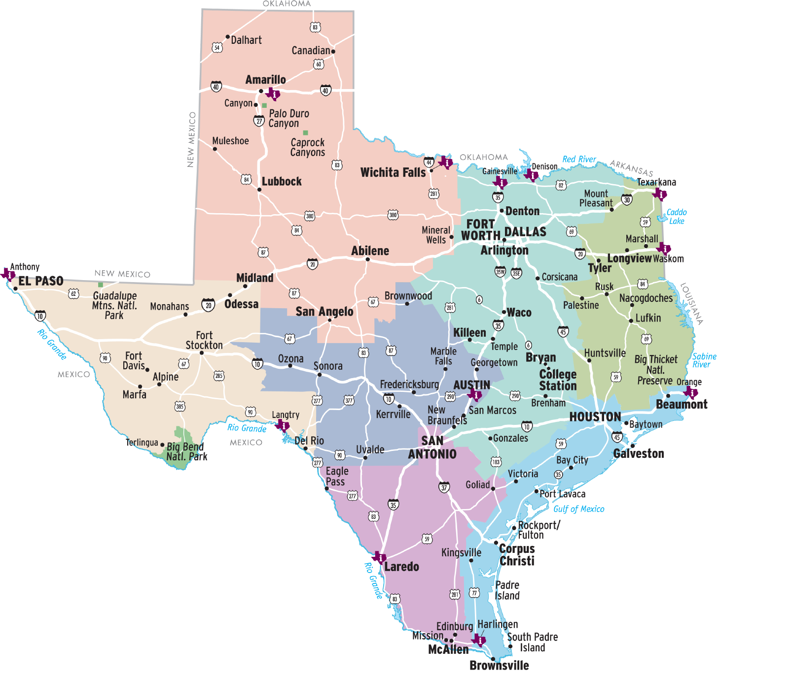
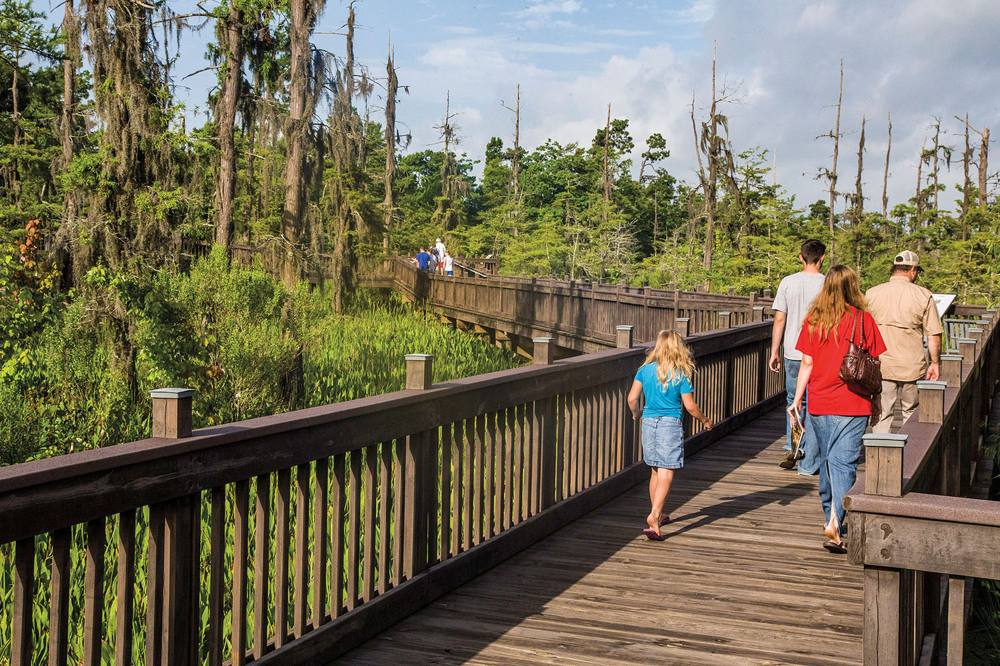
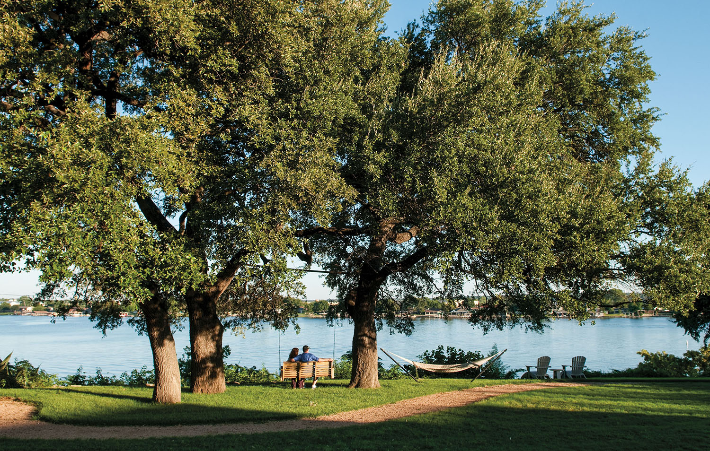

<PageDescription>

</PageDescription>

<Row>
<Column colSm={6} colMd={8} colLg={12}>

    

</Column>
</Row>

<Row>

<Column colSm={6} colMd={4} colLg={6}>

<Accordion>
<AccordionItem title="Travel Information Centers">

The Texas Department of Transportation operates 12 travel information centers for the convenience of the traveling public. See [Travel Information](/travel-information/).

| City               | Location               | Phone Number |
|--------------------|------------------------|--------------|
| Amarillo           | I-40                   | 806-335-1441 |
| Anthony            | I-10                   | 915-886-3468 |
| Austin             | Capitol Visitor Center | 512-463-8586 |
| Denison            | US 69/75               | 903-463-2860 |
| Gainesville        | I-35                   | 940-665-2301 |
| Langtry            | US 90/Loop 25          | 432-291-3340 |
| Laredo             | I-35 at US 83          | 956-417-4728 |
| Orange             | I-10                   | 409-883-9416 |
| Texarkana          | I-30                   | 903-794-2114 |
| Valley (Harlingen) | US 77 at US 83         | 956-428-4477 |
| Waskom             | I-20                   | 903-687-2547 |
| Wichita Falls      | I-44/US 287, Exit 1C   | 940-723-7931 |

</AccordionItem>

</Accordion>

</Column>

<Column colSm={6} colMd={4} colLg={6}>

<Accordion>

<AccordionItem title="Traveling Across Texas">
  These examples of mileage across the state will help determine distances:

| Cities                            | Distance  |
|-----------------------------------|-----------|
| El Paso to Orange                 | 834 miles |
| Amarillo to Brownsville           | 765 miles |
| San Antonio to South Padre Island | 286 miles |
| Fort Worth to San Antonio         | 262 miles |
| Dallas to Houston                 | 238 miles |
| El Paso to Big Bend               | 329 miles |
| Houston to San Antonio            | 197 miles |
| Dallas to Texarkana               | 178 miles |
| Amarillo to Lubbock               | 119 miles |
| Austin to San Antonio             | 79 miles  |
| Dallas to Fort Worth              | 30 miles  |

</AccordionItem>

</Accordion>

</Column>

</Row>

<Row>
    <AdGroup id={['ad02']}/>
</Row>

<Row>
<Column colSm={12} colMd={4} colLg={8}>

<Caption>The Orange Travel Information Center. Photo by Will van Overbeek.</Caption>

#### DRIVETEXAS™

This is the Texas Department of Transportation’s highway conditions information service. Visit [drivetexas.org](https://drivetexas.org) to view an interactive highway map displaying construction areas, closures, weather-related hazards, and other conditions along your route. The website also has options allowing you to see a live traffic feed, view traffic cameras in select regions, and find safety rest areas and Texas Travel Information Centers. The site is both desktop- and mobile-friendly. 

Travelers may also call **800-452-9292** for 24-hour automated information or to speak with a professional travel counselor for high­way conditions, safety information, and expert tourism recommendations from 8 a.m. to 6 p.m. Central time seven days a week.

#### Highway Rest Areas

Texas pioneered the concept of miniature parks along roadways—an idea that has been adopted nationally. Today, safety rest areas with restrooms, picnic areas, and scenic turnouts give travelers a break from driving so they can return to the road refreshed and more alert. Remaining in a rest area for more than 24 hours or erecting any kind of structure is prohibited by law.

#### Speed Limits

Pay careful attention to speed limit signs. In Texas, speed limits can range from 25 mph to 85 mph on numbered highways. Speed limits on some Texas highways especially urban freeways, may be reduced because of their individual operating characteristics. Posted speed limits apply to cars and trucks for both day and night.

#### Toll Roads

Many toll roads are cashless or all-electronic, meaning they do not have staffed booths to take tolls. Some require people to have toll tags, and some may have a Pay by Mail option. If a vehicle without a valid toll tag uses a toll road, a picture is taken of the license plate, and the bill is mailed to the address associated with the plate. The bill may contain an administrative charge in addition to the toll fee. Rental car drivers should check with the rental company regarding the handling of toll fees. On the occasion that a toll plaza is staffed, signs will direct travelers to lanes with the option to stop and pay. Visit [txtag.org](https://txtag.org) to view locations of toll roads and find information on payment forms accepted.

</Column>

<Column colSm={6} colMd={4} colLg={4}>

### Texas Travel Information Centers

The Texas Department of Trans­portation operates 12 travel information centers for the convenience of the traveling public. Professional travel counselors welcome visitors and provide a wealth of information and suggestions to make every Texas trip safe and pleasant. 

Travel counselors supply comprehensive statewide travel publications, plus detailed brochures about points of interest, attractions, and recreational areas. The centers also host safety awareness events and other special events throughout the year.

The centers are open 8 a.m.–5 p.m. daily and 8 a.m.–6 p.m. Memorial Day weekend through Labor Day. 
The Capitol Visitor Center hours are 9 a.m.–5 p.m. Monday through Saturday and noon–5 p.m. Sunday year-round.

All centers are closed on New Year’s Day, Easter Sunday, Thanksgiving Day, Christmas Eve, and Christmas Day.

For 24-hour highway condition information, call **800-452-9292 or visit [drivetexas.org](https://drivetexas.org)**.

</Column>

</Row>

<Row>
<Column colSm={12} colMd={4} colLg={8}>

#### Traffic Signs

More than 500,000 signs across the state mark speed limits, caution areas, stops, and directions. Passing is illegal when there is a continuous yellow stripe on the driver’s side of the center line. Center lines are yellow dashed stripes. White dashed stripes separate dual lanes of traffic in the same direction. Painted or reflective pavement arrows often show approved directions or turns. Arrows pointing toward you or red reflectors indicate you are driving the wrong way on a freeway ramp or one-way street.

#### Auto Safety Belts and Child Seats

All people in a passenger vehicle, regardless of age or seating position, are required to wear a seat belt. Children up to 8 years old, unless taller than 4 feet 9 inches, must ride in child safety seats. Fines may be levied for failure to use safety belts and child safety seats.

</Column>

</Row>

<Row>
<Column colSm={12} colMd={4} colLg={8}>

#### Auto Insurance

A motor vehicle may not be operated in Texas unless a policy of liability insurance is in effect. Evidence of insurance must be furnished when requested by a police officer.

#### Don’t mess with Texas

For more than 35 years, the Don’t mess with Texas® campaign has been reminding motorists to keep our highways litter-free. Don’t mess with Texas is a registered service mark and trademark owned by the Texas Department of Trans­portation. [dontmesswithtexas.org](https://dontmesswithtexas.org)

#### Climate

Texas is a large and diverse state; climate conditions can vary from one end to the other. Its terrain includes arid desert mountains, high plains, limestone hills, rich farmland, grasslands, marshes, and deep forests. The state enjoys generally mild winters, though snow and ice can occur in the Panhandle. The summers are generally hot. In July, the average daytime high statewide is almost 96 degrees. Average annual rainfall varies from less than 10 inches in far West Texas to more than 50 inches in parts of East Texas.

</Column>

<Column colSm={6} colMd={4} colLg={4}>
</Column>

</Row>

<Row>

<Column colSm={12} colMd={4} colLg={8}>

<Caption>Inn on Lake Granbury. Photo by Michael Amador.</Caption>

#### Accommodations

Consider making your stay in Texas even more memorable by selecting from some of the more unique options for lodging.

You can opt for a trailer at El Cosmico in Marfa or stay in the former Pearl Brewhouse at Hotel Emma in San Antonio. If you are planning far enough in advance, consider staying several days at Indian Lodge in Davis Mountains State Park or one of the Roosevelt Stone Cottages at Chisos Mountains Lodge in Big Bend National Park. You might even decide to make your whole vacation into a stay at a dude ranch or nature preserve. Perhaps a few nights of luxury at The Joule in Dallas or The San Luis Resort in Galveston might be preferred.

You can read about other interesting places to stay in Texas Highways magazine, [texashighways.com](https://texashighways.com). Search under Destinations for a curated list of places to stay in the state’s most popular cities and towns. For a guide on camping, visit [texashighways.com/camping](https://texashighways.com/camping).

Additional accommodations are found through [traveltexas.com](https://traveltexas.com/where-to-stay). Scroll down and click on hotels, resorts, and bed-and-breakfasts; campgrounds; or guest ranches. Then enter the name of the city where you plan to stay to find available options. 

You also can call the Texas Travel Information Center travel counselors at 800-452-9292 from 8 a.m. to 6 p.m. Central time daily for suggestions.

#### Passenger Train

Amtrak, the nation’s passenger train service, offers three lines that run through Texas. For information and reservations, call 800-USA-RAIL or visit [amtrak.com](https://amtrak.com).

</Column>
</Row>

<Row>
    <AdGroup id={['ad04','ad17']}/>
</Row>

<Row>
<Column colSm={12} colMd={6} colLg={8}>

#### Bus Lines 

These bus companies have scheduled service to and within the state:

[Greyhound Bus Lines](https://greyhound.com)

[Kerrville Bus Co.](https://coachusa.com/kerrville-bus-company)

[Megabus](https://megabus.com)

[Valley Transit Co.](http://www.valleytransitcompany.com/)

#### Airport Information

[Rick Husband Amarillo International Airport](https://fly-ama.com)

[Austin-Bergstrom International Airport](https://austintexas.gov/airport)

[Corpus Christi International Airport](https://corpuschristiairport.com)

[Dallas/Fort Worth International Airport](https://dfwairport.com)

[Dallas Love Field](https://dallas-lovefield.com)

[El Paso International Airport](https://elpasointernationalairport.com)

[Valley International Airport (Harlingen)](https://flythevalley.com)

[Houston-George Bush Intercontinental Airport](https://fly2houston.com/iah)

[Houston-William P. Hobby Airport](https://fly2houston.com/hou)

[Lubbock Preston Smith International Airport](https://flylbb.com)

[Midland International Air & Space Port](https://flymaf.com)

[San Antonio International Airport](https://sanantonio.gov/sat)

#### Mexico

If you are planning to cross into Mexico during your stay in Texas, consider a stop at a Texas Travel Information Center or a Texas border city’s chamber of commerce or convention and visitors bureau for useful tips. Information for crossing into Mexico can be obtained from a Mexican consulate or by going to visitmexico.com. For information regarding the process to enter or reenter the United States, visit [cbp.gov/travel](https://cbp.gov/travel). 

Before going, learn as much as possible about Mexico and use common sense during the trip. Visit the U.S. Department of State, travel.state.gov, to see any applicable Travel Alerts and Tips for Traveling Abroad.

<InlineNotification kind="warning" className="">

**Warning**: Possession/importation of any type of fire­arm, weapon, or ammunition is a felony in Mexico without advance written authorization from the Mexican Embassy in Washington, D.C., or from a Mexican  Consulate in the United States.

</InlineNotification>

</Column>

<Column colSm={12} colMd={2} colLg={4}>

### More Resources

**Brewster County Tourism Council**
https://visitbigbend.com

**Explore RGV** 
http://explorergv.com.com

**North East Texas Tourism Council**
https://visitnortheasttexas.com

**Red River Valley Tourism Association**
https://redrivervalley.info

**Texas Association of Campground Owners** 
817-426-9395  •  https://rgvpartnership.com

**Texas Association of Campground Owners**   
817-426-9395  •  https://texascampgrounds.com

**Texas Association of Convention & Visitor Bureaus** 
940-999-1002  •  https://tacvb.org

**Texas Bed & Breakfast Association**
979-836-5951  •  https://texasbb.org

**Texas Coastal Bend Regional Tourism Council**   
361-241-7323   • https://txcoastalbend.org

**Texas Hotel & Lodging Association**
800-856-4328  •  https://texaslodging.com

**Texas Travel Alliance** 
512-328-8842  •  https://ttia.org

</Column>

</Row>