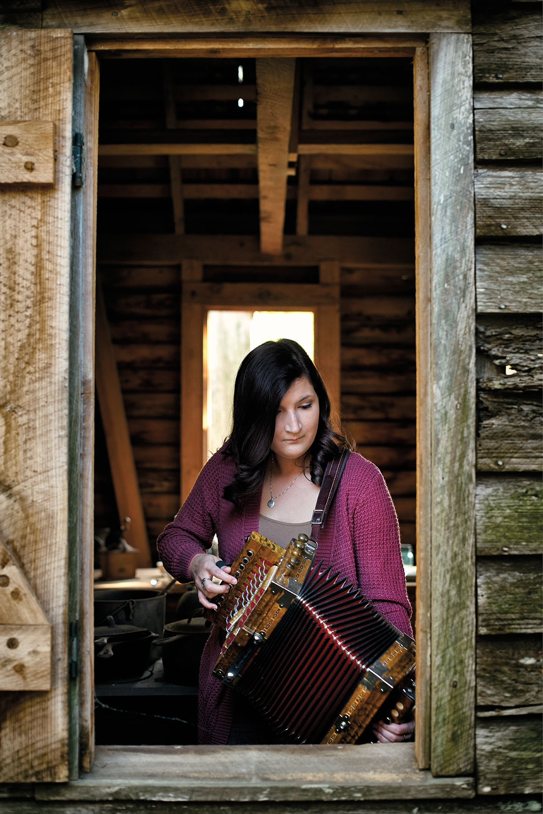
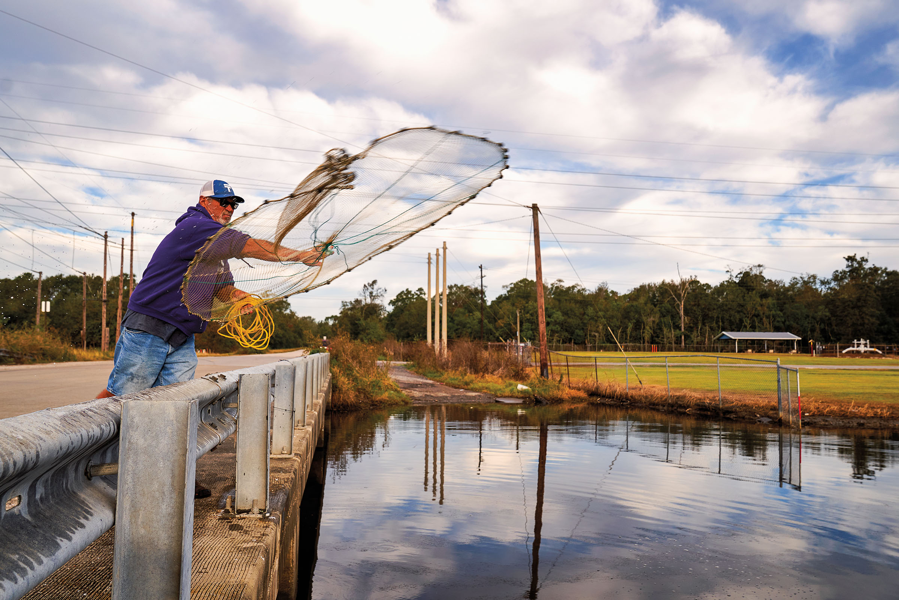
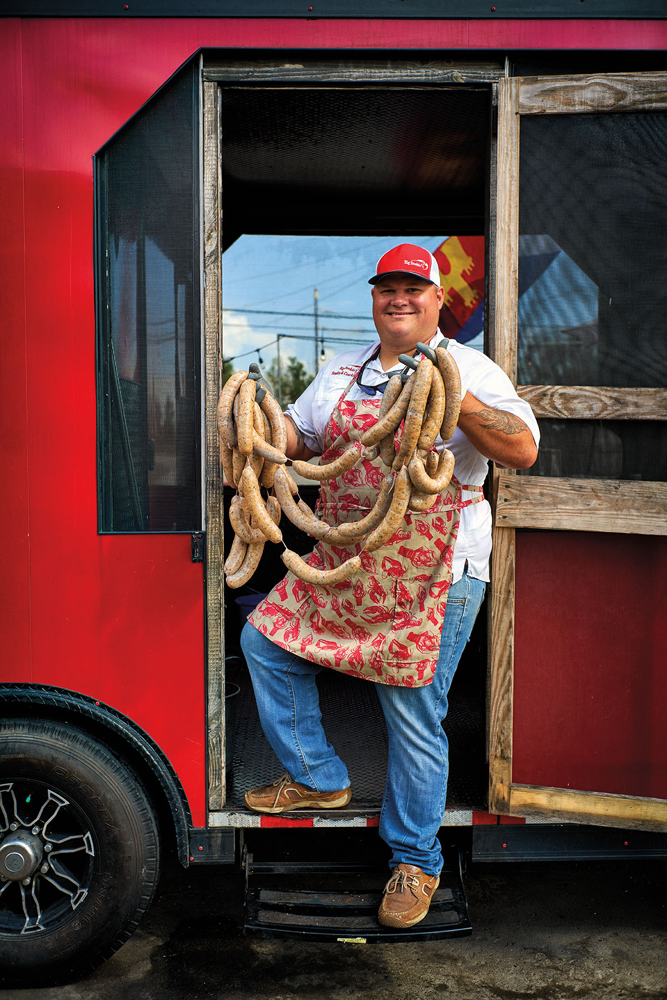

export const Title = () => (
  
    Cajun Culture Flourishes  
    in the Golden Triangle
  
);

<Row>

<Column colSm={12} colMd={4} colLg={8}>

<Caption>Accordionist Bridget D'Lane Roberts. Photo by Dave Shafer</Caption>

<PageDescription>

Drawn west for work, Cajuns brought along their food, music, and _joie de vivre_

</PageDescription>

**By Joe Nick Patoski**

It’s still dark on a muggy August morning in Southeast Texas. But inside the Neches River Wheelhouse, a waterfront bar and restaurant in Port Neches, husband-and-wife duo Dana and Krissy Melancon are bright and chirpy as they settle in front of the microphones of their remote broadcasting studio. On cue, the airwaves crackle with the sound of a train whistle, followed by a loud accordion pushing a peppy rhythm with fiddle and guitar.

Every Sunday morning, _The Cajun Express_ radio show mixes four hours of swamp pop, zydeco, and most of all, Cajun music with community news, dedications, and requests. Loose and familiar, the broadcast serves as a meeting point for Cajuns from across the Golden Triangle, that geographic zone in Texas’ southeast corner defined by Beaumont, Port Arthur, and Orange.

“This show is a responsibility,” Dana Melancon says. “I don’t want to let anybody down. The people listening are willing to share stories and make connections for you. It’s not anything I’m doing. I’m just putting the music out there.”
As many as 375,000 Cajuns call Texas home today, according to the _Texas Almanac_. Most of them are concentrated in Houston and the Golden Triangle, where the population of Orange is more than 30 percent French Cajun. Tracing their roots to southwestern Louisiana, Cajuns have put an indelible stamp on Southeast Texas, just as Southeast Texas has spawned Cajun derivatives, such as TexJoy gumbo file and crawfish boil seasonings, Seaport dark roast coffee, barbecued crab, and a roster of musical standouts.

“I don’t think Southeast Texas Cajuns consider themselves separate, although it’s one of these pride things,” Melancon says, nodding toward the dozens of fans on hand for the live remote broadcast. “In southwest Louisiana, you might get, ‘You’re not really Cajun. You weren’t born here, you’re not living here.’ But it’s tongue-in-cheek teasing.”

As _The Cajun Express_ opens its second hour, daylight reveals a waterfront setting by the Neches River where massive barges and oil tankers rumble past, headed upstream to refineries and the Port of Beaumont, or downstream to Sabine Lake and the Gulf of Mexico. The setting, adjacent to Riverfront Park, might not be confused for Louisiana’s Atchafalaya Basin. But for Golden Triangle Cajuns who show up for the broadcast, it’ll do just fine.

The tale of the Acadians, the French-Canadians who were exiled from Nova Scotia in the 18th century, has 
been much told, most famously by Henry Wadsworth Longfellow in “Evangeline: A Tale of Acadie,” published in 1847. The epic poem recounts love lost during Le Grand Dérangement, when the British kicked French immigrants out of the Maritime Provinces of eastern Canada during the French and Indian War of 1754-63. Roughly 3,000 refugees found their way to southwestern Louisiana—present-day Acadiana.

The Acadians—or Cajuns, as they became known—were an insular bunch, isolated from the rest of the world by swamps and rivers until Louisiana Gov. Huey P. Long’s bridge-building frenzy in the 1930s. Unlike most assimilated American cultures, Cajuns have been able to hold on to their customs, folkways, and, at least in the heart of Cajun country, their French dialect.

The story of the next Cajun diaspora, from southwest Louisiana to Southeast Texas, is less celebrated. The first Cajuns began moving across the Sabine River in the early 19th century, among them the Hébert family who established a farm on Taylor Bayou in Jefferson County in 1842. The 1850 U.S. census documented 600 “Franco-Louisianans” in Southeast Texas. Cajun relocation to Texas grew in the early 1900s with the expansion of the Southern Pacific railroad and then the rapid growth of petroleum and chemical refineries around Port Arthur. Faced with a choice between scraping by as a sharecropper or making a middle-class income at a refinery, many Cajuns headed west to Texas.

</Column>

<Column colSm={6} colMd={4} colLg={4}>

<AdGroup id={['ad36']}/>

</Column>

</Row>

<Caption>Netting bait fish near Groves. Photo by Dave Shafer</Caption>

<Row>

<Column colSm={12} colMd={4} colLg={8}>

**The easiest way to understand** and appreciate a culture that isn’t your own is through its food and music. The Cajuns stand out on both fronts.

Cajun cuisine is everywhere and anywhere in Southeast Texas, from crawfish farms to destination restaurants and boudin joints. The stalwarts of Cajun cuisine are well known: gumbo, étouffée, blackened redfish, and delicacies like boudin (spicy pork and rice sausage) and cracklins (crunchy fried chunks of pork skin, fat, and meat). At the Pine Tree Lodge in La Belle, just outside Beaumont, you can order alligator from the menu while watching their wild cousins in Taylor Bayou from the outside deck. In the Golden Triangle, you’ll find boudin balls alongside hot dogs at the concession stand of a high school football game—and gumbo on the menu of a Mexican restaurant.

Larry Judice is a third-generation Texas Cajun whose father and grandfather operated groceries and meat markets in the Golden Triangle. In 1978, he opened Larry’s French Market, a grocery and deli in Groves, just outside of Port Arthur, serving lunch plates to refinery workers.

“By trade I was a butcher, and we sold lots of seafood,” says Judice, now retired. “We were one of the first to sell crawfish live. We started getting rid of shelves and putting more tables in. Then we put in a dance floor. It just boomed after that.”

Larry’s evolved into a full-blown entertainment venue with an all-you-can-eat Cajun seafood buffet and live bands on weekends. In many respects, Larry’s functions like a community center. “There are so many Cajuns that live around here,” Judice says. “We love the music, the food, friendship, family getting together to have a _fais do-do_—a dance—having a good time.”

Stewart Gordon, manager of Larry’s French Market, insists there’s a method to les bon temps madness: “They eat till they’re stuffed, then they dance it off.”

Indeed, music is perhaps the strongest cultural bond uniting Cajuns in the Golden Triangle, attracting the community for dances and parties.

“I’ve had this music in my heart since I was a little kid,” says Jude Moreau, a Groves bandleader who spent summers as a kid at the family farm near Opelousas, Louisiana, where he experienced rural Cajun life firsthand. Moreau learned to dance and play accordion after being immersed in Cajun music at the old Rodair Club, an influential but now-defunct Cajun institution on the outskirts of Port Arthur.

“I don’t know how to explain this—we’re huggers. OK?” Moreau says, reflecting on Cajun music’s infectious groove. “We love to be up close and personal. So even when we’re dancing a two-step, we’re close to each other, like we’re hugging; it’s the same way when we dance the waltz. What we play makes you want to dance—it moves you, it draws you in.”

Moreau has played stages in Texas and beyond with Ed Poullard, a Creole accordionist from Beaumont. In a workshop behind his home, Poullard repairs, tunes, and builds Cajun accordions from scratch—a craft he learned from Moreau. Pausing from his work on a single-row button accordion, Poullard unpacks the dynamic between Cajuns and Creoles, i.e. Cajuns with African, Caribbean, and/or American Indian ancestry.

Creoles play zydeco music, accordion-driven dance music infused with rhythm and blues and hip-hop elements, which is very different from contemporary Cajun music. But when Poullard, a Creole, and Moreau, a Cajun, play old-style music together, they’re “married,” Poullard says.

“Cajun and Creole are wedded together,” he says. “You can listen to somebody born in the early 1900s, and be they Creole or Cajun or beast, the sound of the accordion is very similar. As the years progressed, Cajun style became more intricate, more note-y, and the Creole style remained simple and pure. That’s it. That’s the only way to explain it.”

While Moreau and Poullard are in their 60s, younger Cajuns from the Golden Triangle are continuing the musical tradition. Donovan Bourque, a gregarious 19-year-old from Beaumont, is among those up-and-comers as the accordionist for the band Cajun Strong.

Bourque works at Big Doobie’s Boudin & Cracklins food truck in Port Arthur, where he sometimes leads multi-hour jams outside the shack. His playing precedes him. “Grown men have texted me asking for accordion tab sheets, if I could write it out for them, or send them a video,” Bourque says with a tinge of incredulity. “I try to help as much as I can because this is something you don’t want to let die.”

</Column>

</Row>

<AdGroup id={['ad15', 'ad27', 'ad31', 'ad34', 'ad21']}/>

<Row>

<Column colSm={12} colMd={4} colLg={8}>

<Caption>Joshua Rodrigues of Big Doobie’s Boudin & Cracklins in Port Arthur. Photo by Dave Shafer</Caption>

**With Cajuns residing in Southeast Texas** for more than a century, their culture is intertwined with the Golden Triangle mainstream, says Tom Neal, director of the Museum of the Gulf Coast in Port Arthur.

“To us, the Cajun people and their culture is our culture,” Neal says. “It’s a standing joke that I hear from time to time that Port Arthur ought to be part of Louisiana. We’ve blended so much that we don’t hardly think about it.”

The museum explores Cajun heritage with artifacts including a vintage pirogue, the type of dugout canoe Cajuns used to navigate bayous and swamps. It also chronicles the history of the discovery of oil at Spindletop and the ensuing development of the Texaco and Gulf Oil refineries in Port Arthur, both magnets for Cajun workers.

Cajun and Creole musicians are also prominent in the museum’s Music Hall of Fame, among them Harry Choates and Clifton Chenier, “the King of Zydeco,” who moved to Port Arthur in 1946 to work in the Gulf Oil Refinery.

The most visible landmark testifying to the Cajun presence in the Golden Triangle is La Maison Beausoleil in Port Neches’ Riverfront Park. The cypress house harkens to the Cajun settler lifestyle. The Broussard family built the house in Louisiana’s Vermilion Parish in 1810, and it was moved to Port Neches to serve as a museum in 1985, says Karen Mills, president of Les Acadiens du Texas, the group that maintains the home. Each year, on the second Sunday of October, La Maison Beausoleil hosts a Cajun French mass. Sweets, gumbo, and boudin sold at the event help fund the house’s upkeep.

“The Broussard family gave the house to us to open as a museum because of all the Cajuns who had moved from Louisiana when the men came to work in the refineries,” Mills explains.

The Museum of the Gulf Coast and La Maison Beausoleil have been part of tour schedules during Port Arthur’s annual Cajun Heritage Festival in April. Events like the Cajun Heritage Festival and Cajun Night at the Texas Rice Festival in Winnie offer visitors the immersive, full-tilt Cajun experience—down to the dance contests and crawfish races.

Gloria Pate, the promoter of the Cajun Heritage Festival, sees Cajun culture’s wide appeal through her work with the festival and her online radio show, which airs on Cajun Sounds Internet Radio.

“I got a message last week from a guy in Dubai,” she says. “It’s worldwide. They love the music. They become enthralled with the music, the energy, our _joie de vivre_. We see it time and time again with hurricanes and plant explosions. People think of the music and they think of the food, but it’s so much more. It’s hard to put into words, other than neighbors helping neighbors.”

Back at the Neches River Wheelhouse, Melancon says he’s noticed a surge of interest in Cajun culture, especially among young musicians like Bourque.

“Back when I was young, it was not cool,” he says. “I’m 61 now, and the Cajun stuff is cool to the younger people. They’re starting bands, getting together to learn Cajun language. It’s riding on their shoulders now. The culture and the feel for the Cajun way of life is as strong as it’s ever been. It’s second nature now, like wanting to learn to cook a gumbo.”

</Column>

<Column colMd={2} colLg={3} offsetMd={1} offsetLg={1}>

<Aside>

#### TEXAS-CAJUN TOUCHPOINTS

 

As Cajun people have crossed the border to southeast Texas from Louisiana, they’ve brought their culture and customs along with them.
 

**The Cajun Express radio show** broadcasts 6-10 a.m. Sundays on Beaumont radio station 105.3 FM and online at freefm.net/cajun-express. On the second Sunday of the month, the Melancons broadcast live from the Neches River Wheelhouse in Port Neches.
 

**Neches River Wheelhouse**, 720 Lee Ave., Port Neches. 409-853-1249;
[nechesriverwheelhouse.com](http://nechesriverwheelhouse.com)
 

**Larry’s French Market**, 3701 Pure Atlantic Road, Groves. 409-962-3381;
[larrysfrenchmarket.com](http://larrysfrenchmarket.com)
 

**Big Doobie’s Boudin & Cracklins**, 6247 W. Port Arthur Road, Port Arthur. 409-548-1335.
[facebook.com/doobiescajunmeats](https://facebook.com/doobiescajunmeats)
 

**Museum of the Gulf Coast**, 700 Procter St., Port Arthur. 409-982-7000;
[museumofthegulfcoast.org](http://museumofthegulfcoast.org)
 

**La Maison Beausoleil**, Riverfront Park, 601 Grigsby Ave., Port Neches. 409-989-9211
 

**The Cajun Heritage Festival** takes place in April at Port Arthur’s Carl A. Parker Multipurpose Center. For updates on this year's event schedule, visit [cajunheritagefest.com](http://cajunheritagefest.com).
 

**Cajun Sounds Internet Radio** streams music 24-7 at [csir.live](http://csir.live) or [tunein.com](tunein.com/radio/cajun-sounds-internet-radio-s214965).

</Aside>
</Column>
</Row>