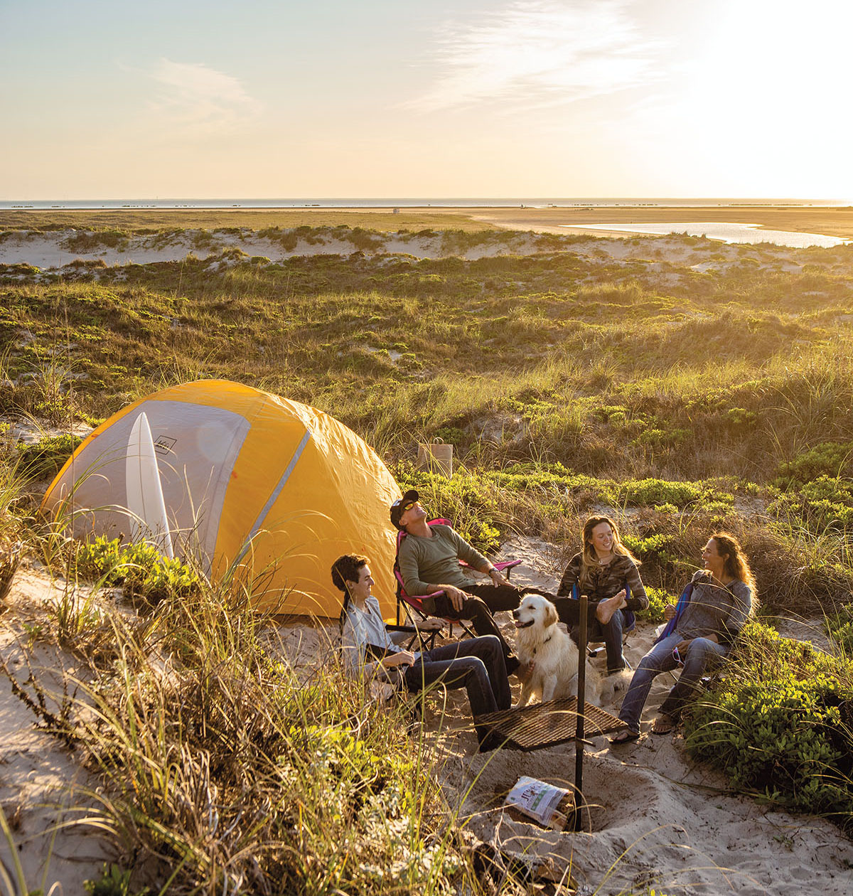
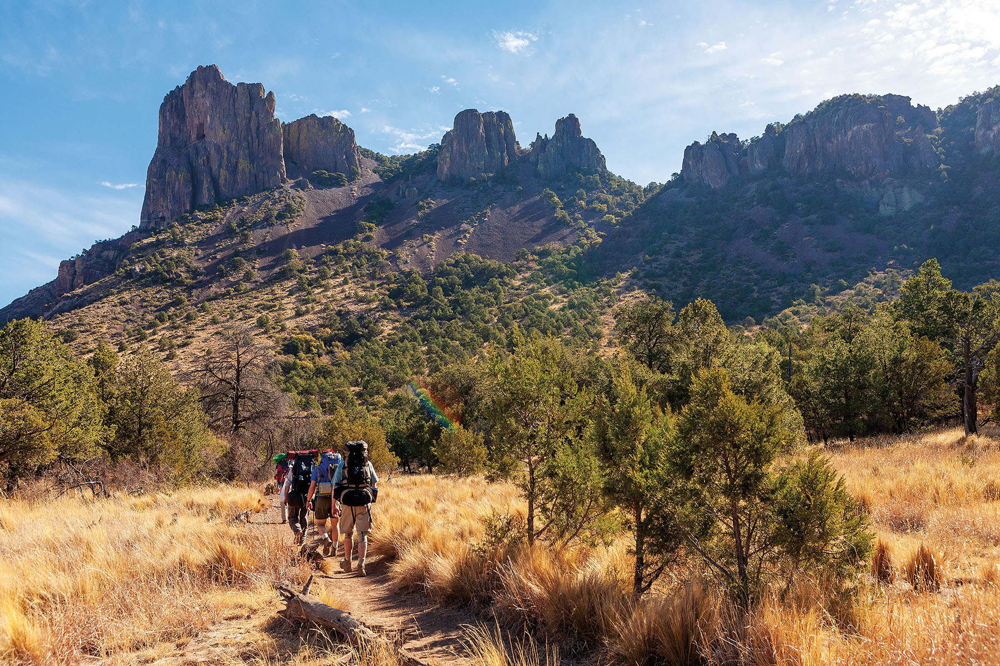

export const Title = () => (
  
    Intro to Campology
  
);

<Row>

<Column colSm={12} colMd={4} colLg={8}>

<Caption>Sand dunes on South Padre Island. Photo by Kenny Braun.</Caption>

<PageDescription>

Tales and tips for making the most of a Texas camping adventure

</PageDescription>

Even before the pandemic swelled interest in outdoor activities as never before, a growing number of Texans were heading to our hills, lakes, beaches, and mountains for adventures alfresco. And for many, the experience isn’t complete without the simple joy of waking up in a campsite, surrounded by the beauty of nature.

Camping has many interpretations. Some people prefer a busy park with electricity and flushing toilets nearby. Others prefer the solitary backcountry, opting for the company of coyotes over humans. Some hardy souls sleep best under the open sky in a sleeping bag or hammock, with nothing to obstruct the stars. Most, however, appreciate at least a tent for shelter, or perhaps even the cozy confines of a camper or motor home.

Here we explore three types of camping adventures: RV camping, tent camping with the whole family, and backpacking. Regardless of your preference, don’t forget to plan ahead. And then, plan ahead again.

</Column>

<Column colSm={6} colMd={4} colLg={4}>

<AdGroup id={['ad36']}/>

</Column>

</Row>

<Row>

<Column colSm={12} colMd={4} colLg={8}>

## RV Camping

The first time I seriously considered buying an RV was in the aftermath of a family tent camping trip to Kerrville-Schreiner Park. Highlights of the weekend included rainstorms, a nauseous 1-year-old, and very little sleep.

My wife and I were accustomed to shrugging off the discomforts of tent camping. But the addition of a baby in diapers presented a new challenge, particularly when it came to sleep. When I found out a second baby was on the way, I knew my tent camping days were numbered.

The first lesson I learned about RVs is you should never attend an RV expo unless you’re OK with the idea that you might leave owning one. On a February day in 2012 at the Dallas RV SuperSale, we marveled at the hundreds of gleaming rigs that filled Dallas Market Hall. Dealers displayed everything from 45-foot motor homes with outdoor TV screens to diminutive campers ingeniously designed for compact living. We gravitated to the A-frame pop-up campers, found one that suited us, and signed on the dotted line.

Over the ensuing 11 years, we’ve towed our 19-foot trailer to every corner of Texas and parts of New Mexico and Colorado, adding up to nearly 200 nights. For the most part, they’ve been restful nights, thanks to the two beds, an air conditioner, and a heater. One of the best things about an RV is that it extends the camping season. We’ve dozed comfortably through a 17-degree December night at Lost Maples State Natural Area and napped on a 105-degree July afternoon at Dinosaur Valley State Park. We weren’t totally alone, of course. State park campgrounds routinely book up months in advance. 

Renting is a good option for campers who are not ready to commit to buying their own RV or just want to try it for a vacation. Renting also offers immediate gratification that isn’t available in the current RV sales market. 

There’s a learning curve to pulling a trailer or driving a motor home—scrapes and dings come with the territory. But that’s just life on the road. Regardless, my family sleeps better in the camper than we do at home. _—Matt Joyce_

## Tent Camping
Camping with kids can be stressful, but connecting your children with nature, and the memories made along the way, are worth it. Despite the inevitable hiccups, you’ll want to do it year after year—and you’ll miss it when your kids are grown.

Simple preparations like checking the weather forecast, carrying a map in case there’s no cellphone service, and storing food in the car to protect it from critters can make a big difference. Plus, it helps get kids in the right mindset.

“Camping connects children to nature and their public lands,” says Lisa Henderson, who works with TPWD’s Texas Outdoor Family, a program that offers camping workshops and equipment rentals. “Camping helps build confidence, communication, and problem-solving skills, and best of all, it creates wonderful memories with family and friends.”

Should things get difficult—an unexpected gully washer, for example—all will not be lost. “We call that Type 2 fun,” Henderson says. “It might not seem enjoyable in the moment, but they become treasured memories in the years 
to come.”

One aspect of preparation is practice. Rehearse pitching a tent in your backyard, and if you have a fire pit, you can practice the rudiments of fire safety. Don’t be shy about assigning chores, such as gathering firewood or prepping meals. 

Such a controlled experiment also offers an opportunity to prepare for a weekend away from screens. As a transition, provide some old-fashioned activities for backseat amusement—Mad Libs, 20 Questions, out-of-state plate-spotting, etc. This goes for parents, too. 

On the surface, camping is all about the activities—swimming, biking, hiking. But mealtimes should be fun, too. Whether it’s hot dogs on a stick, s’mores, or fajitas, food always tastes better when it’s cooked over an open flame. 

My old Houston friend Hans Hansen, now a business professor at Texas Tech University in Lubbock, takes his three daughters camping about twice a year.

“Basically, all the things you’ve been busy protecting your child from for the last few months or years? Now you are going to be not just permitting them, but subjecting your kids to these trials,” he says. “Camping with them is the worst idea I insist on doing every year.” _—John Nova Lomax_

</Column>
</Row>

<Caption>Big Bend National Park. Photo by Kenny Braun</Caption>

<AdGroup id={['ad15', 'ad27', 'ad31', 'ad34', 'ad21']}/>

<Row>

<Column colSm={12} colMd={4} colLg={8}>

## Backpacking

A few weeks ago, I stuffed a change of clothing, food, and a tent into my backpack and drove to Pedernales Falls State Park, near Johnson City.

The campgrounds were booked solid, even midweek, but plenty of primitive walk-in sites were still available. My husband and I reserved a spot online, printed the forms, and checked in at park headquarters, where a park ranger asked me, “You know it’s a 2-mile walk, don’t you?”

Absolutely. The hike was just what I needed—45 minutes of crunching across a gravel path, hauling everything I’d need for the night on my back. I like backpacking because it tests my self-reliance. Even at a busy place like Pedernales Falls, I knew I wouldn’t see many folks in the primitive camping area.

The sun was sinking as my husband and I hiked down a wide and undulating gravel path. We skirted a creekside bluff and cut through groves of oak and juniper trees, where a white-tailed deer dashed away from us.

When we reached the primitive camping area, no one else was around. We unrolled our sleeping bags and lit a camp stove to heat water for our dehydrated meals. As we ate packets of reconstituted pasta and shepherd’s pie, the stars popped out and coyotes yipped.

Texas’ backpacking destinations range from rugged Big Bend National Park to more accessible sites such as Pedernales Falls and Lost Maples State Natural Area. Whatever your preference, you’ll need to prepare ahead of time.

If you don’t want to buy your own gear, outdoor stores rent the basics, including a tent, sleeping bag and pad, and backpack. Load the pack with 30 pounds of books or cans and take a neighborhood stroll. The weight on your shoulders will remind you to bring only what’s absolutely necessary. Remember to pack out everything that you brought in, including toilet paper and other trash.

Ian Atkinson, a product specialist at Gossamer Gear, an Austin-based company that sells lightweight backpacking equipment, says he’s seen a surge of interest in backpacking. “More people are recreating outdoors than ever due to social distancing rules,” he says. “We are incredibly happy to see a bunch of first-time backpackers. We want everyone to be able to reap the benefits of time spent outdoors in nature.”

Atkinson advises rookies to keep both their trips and their gear simple and to buy the backpack last to ensure it fits everything else they’re bringing.
After a chilly night snuggled inside my sleeping bag, I awoke to the chirp of birds. I took a few minutes to stretch out the kinks, heated water for a cup of hot tea, and sat quietly, drinking in the stillness. No news, no computers, no 
distractions. _—Pam LeBlanc_

</Column>
</Row>