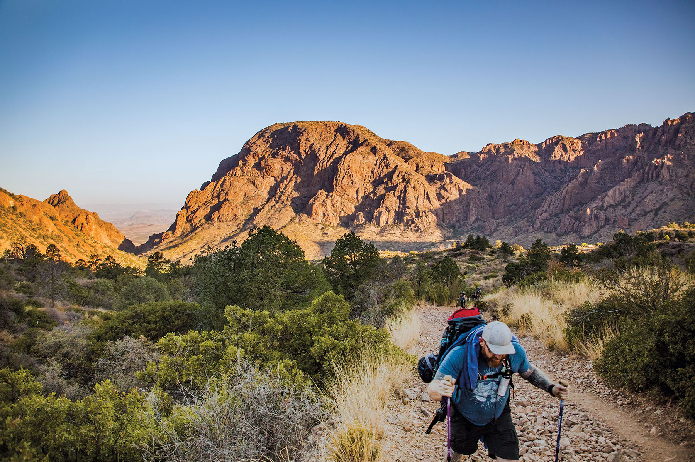
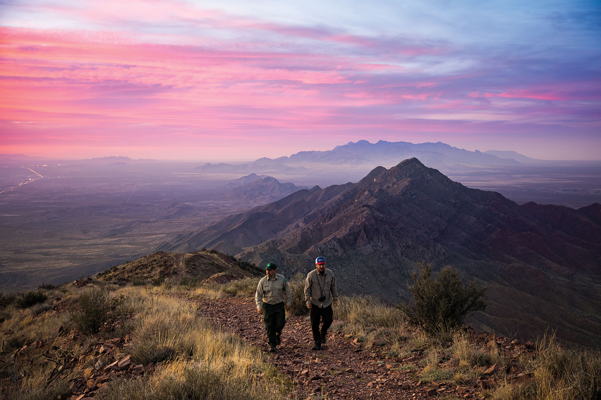

export const Title = () => (
  
    A Quest to Scale  5 Peaks in a Week
  
);

<Caption>Big Bend National Park. Photo by Brandon Jakobeit.</Caption>

<PageDescription>

An epic West Texas road trip brings challenging hikes, awesome views, and lifelong memories

</PageDescription>

**By Matt Joyce**

<Row>

<Column colSm={12} colMd={4} colLg={8}>

A mile or two into my hike to the top of Mount Livermore in the Davis Mountains, I stepped to the side of the trail as two speedsters overtook me on the uphill slope. “I guess that’s where we’re headed,” I said, nodding to a rocky outcrop on the horizon far above. “Nope,” one of them responded. “Baldy Peak is beyond that—you can’t see it yet.”

Ah yes, another false peak. After a week of hiking West Texas trails, my perspective was still acclimating to the vast expanses of mountain wilderness. Even when a goal appeared to be impossibly distant—switchbacks on a far-off hillside like an ant trail; mountain peaks shining like flecks of quartz against marble-blue skies—I’d found a deceptively simple strategy for success: Put one foot in front of the other.

This deliberate approach evolved from a harebrained scheme to hike as many West Texas peaks as possible in one week. Motivated by the arrival of spring and the allure of the mountains, I’d charted a six-day road trip from Austin to summit Guadalupe Peak, North Franklin Peak, Ranger Peak, Emory Peak, and Mount Livermore (capped by Baldy Peak). In between hikes, I aimed to eat well and revel in the spectacular scenery of a Chihuahuan Desert road trip. Anything worth doing is worth overdoing, right?

As the week progressed, however, my frenzied agenda turned into a lesson in slowing down. These mountains had much to teach me, but it wouldn’t come easy.

## Guadalupe Peak

As dawn broke over Guadalupe Mountains National Park, clouds blanketed the desert basin to the south and east like a sea swirling in shades of blue and gray. At least that’s how it looked from the top of 8,751-foot Guadalupe Peak. With _Texas Highways_ Photo Editor Brandon Jakobeit, I’d logged a day of hard driving and spent the night at a trailside campsite to experience sunrise at the highest point in Texas.

With the sun ascending over Hunter Peak to the east, elephantine mountain shadows lumbered across the arid plateaus to the west, and a cascade of ranges brightened toward New Mexico to the north. I signed the mountaintop registry located in a small metal box, bundled myself against the brisk wind, and snapped photos of El Capitan below.

The 1,000-foot limestone face on the range’s southern edge—which the Spanish likened to a captain leading his troops—may be the park’s most distinctive feature. But the formation looks completely different from above, like the bottom of a hoof thrust upward by a subterranean beast kicking through the earth’s crust.

El Capitan and the peaks, canyons, and spires of the Guadalupes are remnants of an ancient reef that formed in a long-ago sea. The fossilized reef later uplifted, and over millions of years, thick layers of marine sediment and salts eroded into surrounding basins that are now hotbeds of energy production.

The Guadalupes hover above the desert floor by some 3,000 feet, resulting in a cooler and wetter climate that supports forests of piñon pine, gray oak, and Douglas fir that have survived since the last ice age. We camped at about 8,100 feet in a grassy meadow shaded by pines and firs. But those trees did little to block the wind gusts, which hummed with a crescendo until smacking the tent. Our visit coincided with relatively calm winds: The day before, gusts reached 56 miles per hour, and a few days later, 77 mph.

Such extreme winds would have made summiting Guadalupe Peak impossible. The trip had started with a stroke of 
good luck.

</Column>

<Column colSm={6} colMd={4} colLg={4}>

<AdGroup id={['ad36']}/>

</Column>

</Row>

<Caption>Franklin Mountains State Park. Photo by Brandon Jakobeit</Caption>

<AdGroup id={['ad15', 'ad27', 'ad31', 'ad34', 'ad21', 'ad29']}/>

<Row>

<Column colSm={12} colMd={4} colLg={8}>

## Franklin Mountains State Park

After leaving the Guadalupe Mountains and driving to El Paso, we started Day 3 of the trip with a morning ride on 
Franklin Mountains State Park’s Wyler Aerial Tramway. The park has since closed the gondola ride to Ranger Peak (elevation 5,632 feet), but a 0.9-mile hike up the Directissimo Trail provides the same close-up look at the range’s bands of orangeish igneous rock and a dazzling overview of El Paso—from sprawling Fort Bliss to the UTEP Sun Bowl, and from the concrete channel of the Rio Grande to the neighborhoods of the Sierra Juarez foothills in Mexico.

Later in the afternoon, we hiked to North Franklin Peak—the highest point in the Franklin Mountains at 7,192 feet—to catch the sunset. Our guide, park Superintendent Cesar Mendez, led us on an 8-mile round trip that partly followed an old dirt road, a remnant of a 1970s effort to develop a mountain resort community.

“The bulldozing of this road created such a conspicuous destruction that it ignited the community in terms of, ‘Hey, we’re going to lose the mountains if we don’t do anything about it,’” Mendez said, recounting the park’s establishment in 1979. “It was a blessing in disguise. Otherwise, development could have creeped up the mountain slowly without anyone noticing until it was too late.”

Most of the trail navigates exposed Chihuahuan Desert hillsides of burnt orange, burgundy, and brown granite and rhyolite rock. We saw Southwestern barrel cactus, a Sonoran Desert species that occurs no farther east than El Paso; the ubiquitous creosote bush, which smells like rainfall when you rub its leaves between your fingers; and prickly pear cactus, the “ultimate desert survivor,” as Mendez called it.

We made it to the top of North Franklin in time to watch the setting sun light the evening’s wispy clouds into brilliant yellow melting across the desert. Mountains on every horizon—including the Sierra Juarez in Mexico and the Organ and Potrillo mountains of New Mexico—faded into darkness as city lights emerged below. On a moonless night, the park’s 40-square-mile block of wilderness looks like a chunk of obsidian crashing through El Paso’s windowpane of twinkling lights.

“Climbing peaks never gets old,” Mendez reflected. “You enjoy the magnificent views, and it makes you feel alive. It’s just something that really boosts not only your body but also your spirit, your mind. You breathe clean air here, and you see how little we are in this world, how little we are in this universe, but how influential we can be also.”

</Column>
</Row>

<Row>

<Column colSm={12} colMd={4} colLg={8}>

## Emory Peak
Fifteen minutes was about all I could stomach at the top of Emory Peak, a craggy ridge towering above Big Bend National Park. At 7,825 feet—the highest point in the Chisos Mountains—my nerves spun at the thought of climbing back down the stack of exposed boulders I had ascended with hands and feet to reach the peak.

But this view merited savoring: the forested Chisos range rolling into the arid Chihuahuan desert; rocky outcrops bulging like sleeping javelinas from the yellow desert floor; the green ribbon of the Rio Grande snaking from a tiny notch in the cliffs of Mesa de Anguilla.

“There is no better viewpoint, day or night,” remarked Raymond Skiles, a Big Bend National Park wildlife biologist who has since retired. “It’s inspirational to see how big all of this is, particularly in a wild state.”

On Day 5 of the trip, we met Skiles at the Chisos Basin and hiked the Pinnacle Trail into a forested refuge. Trees are a highlight of this hike—piñon pine, Chisos hophornbeam, alligator juniper, aspen, and Texas madrones all persist from the wetter and cooler days of the last ice age.

It’s a fragile environment, Skiles said, one that’s strained by the drying and warming of the climate over the past 8,000 years. In 2011, 30 percent of the range’s trees died when a severe freeze coincided with the worst drought 
on record.

But the natural world is resilient. After being killed off by early settlers, black bears made their way back to the Chisos in the mid-1980s, and in 1988, for the first time in decades, a mother bear had a litter of cubs in the park. We didn’t see any of the park’s population of about 30 bears, but we did see the distinctive track of a mountain lion, another elusive predator.

Skiles, a West Texas native, studied Big Bend’s flora and fauna as a park biologist for 31 years. Early in his career, he worked in parks from California to the East Coast, but as the vista from Emory Peak reinforced, he found his calling in the diversity of the Big Bend.

“We’ve got the river and majestic canyons and open areas, and we’ve got the desert and mountains,” he said. “For a biologist, all those come with their own diversity of species and issues and challenges. So, from both a personal appreciation of the park and a career opportunity that is the furthest thing from boring, I’ve just loved every day out here.”

## Mount Livermore

On the trip’s sixth and final day, luck struck again: An overnight cold front dropped temperatures and dispersed a dust storm that had been obscuring the Davis Mountains’ sun for two days. I’d scheduled the entire week around hiking Mount Livermore—the highest summit in the Davis Mountains—on this particular Saturday because it was one of the occasional dates the Nature Conservancy opens its 33,000-acre Davis Mountains Preserve to the public.

After checking in, we drove 30 slow minutes over a rough road to the trailhead, accompanied only by a few wild turkeys, white-tailed deer, and javelina foraging in the crisp morning light. We strapped on our packs and embarked up the trail to reach the base of the mountain’s Baldy Peak, an igneous rock intrusion that rises like a shark’s fin.

I eyed my route and scrambled up the final 150 feet of talus slope and exposed ridge without slowing down—I didn’t want to allow myself a chance to freak out. From the top, I could see the Chisos Mountains down in Big Bend, a U.S. Customs and Border Patrol surveillance blimp floating like a UFO between Marfa and Valentine, and two sparkling domes on Mount Locke about 9 miles away—telescopes of the McDonald Observatory.

Heading downhill, the trail bore signs of wildlife—the distinctive scat of coyotes and ringtail cats—among shards of volcanic rock. I took my time getting to the trailhead, where the car waited for the seven-hour drive back to Austin.
My legs and back were weary from hiking 33 miles in six days, but my mind felt as if I was just getting started. It’s like the adage about raising children—the days can last forever but the years fly by. Hiking methodically up and down these mountains, I had begun to appreciate the imperceptible changes of the landscape over time—sediment gradually eroding to reveal a sheer cliff; lichen growing across bone-dry rock; the sun drifting from one horizon to the other.

Now it was time to speed back home.

I wouldn’t soon forget the rewards of my five-peak week, though—not hurtling from park to park or topping mountains, but the moments of reflection and discovery that emerged from walking for miles as the trail unfolded before me. No peak was impossibly distant, not if hiked step by step.

</Column>

<Column colMd={2} colLg={3} offsetMd={1} offsetLg={1}>

<Aside>

#### FIVE-PEAK WEEK

 

##### TUESDAY

**Guadalupe Peak, Guadalupe Mountains National Park**
915-828-3251, [nps.gov/gumo](https://nps.gov/gumo) 
**Summit:** 8,751 feet 
**Elevation Gain:** 2,906 feet from the Pine Springs trailhead  
**Distance Round Trip:** 8.4 miles  
**Memorable Meal:** A simple post-hike sack lunch with a cold Gatorade in the shade of a piñon pine at the Pine Springs trailhead

 

##### WEDNESDAY

**Ranger Peak, Franklin Mountains State Park**
915-566-6441, [tpwd.texas.gov](https://tpwd.texas.gov/state-parks/franklin-mountains) 
**Summit:** 5,632 feet 
**Elevation Gain:** 940 feet from the Wyler Aerial Tramway parking lot 
**Distance Round Trip:** 1.8 miles
 

**North Franklin Peak, Franklin Mountains State Park**  
**Summit:** 7,192 feet 
**Elevation Gain:** 2,142 feet from the Cottonwood Trail System trailhead 
**Distance Round Trip:** 8 miles 
**Memorable Meal:** In El Paso, the L&J Cafe’s combo enchilada plate with red and green sauces
 

##### FRIDAY
**Emory Peak, Big Bend National Park**
432-477-2251. [nps.gov/bibe](https://nps.gov/bibe)
**Summit:** 7,825 feet 
**Elevation Gain:** 2,424 feet from the Chisos Basin 
**Distance Round Trip:** 10.5 miles 
**Memorable Meal:** In Terlingua, a rib-eye steak at the Starlight Theatre
 

##### SATURDAY
**Mount Livermore, Davis Mountains Preserve**
The preserve opens to the public about seven days per year. The drive to the trailhead requires a high-clearance vehicle.
432-426-2390, [nature.org](https://nature.org)
**Summit:** 8,378 feet 
**Elevation Gain:** 1,800 feet from Madera Canyon Road 
**Distance Round Trip:** 6.2 miles 
**Memorable Meals:** In Fort Davis, breakfast tacos and coffee at the Stone Village Market; a cheeseburger at the Blue Mountain Bar and Grill 
</Aside>

</Column>

</Row>