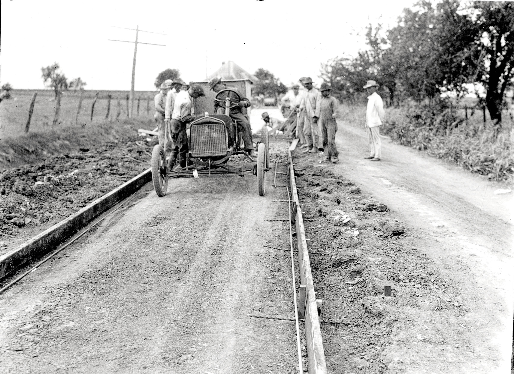
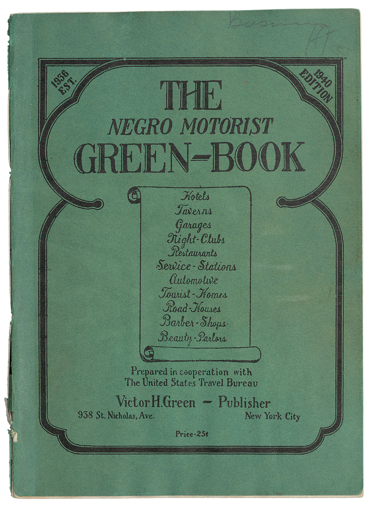
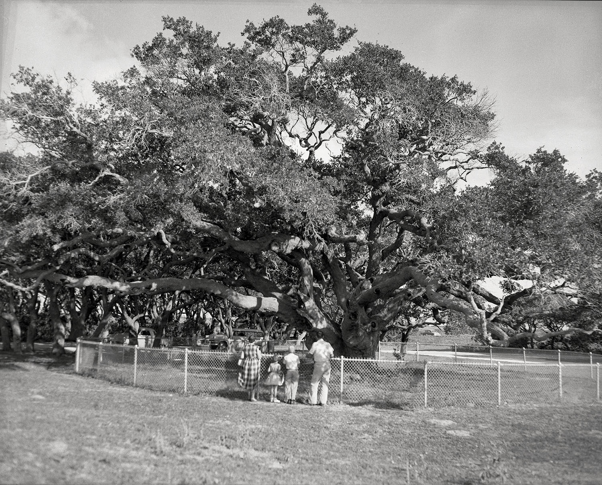
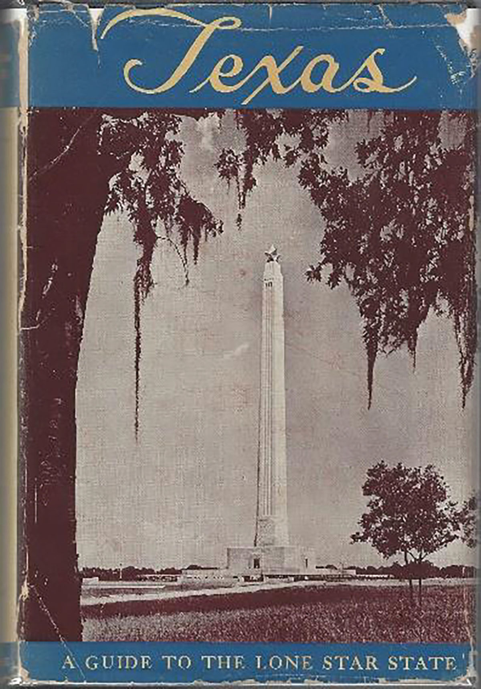

export const Title = () => (
  
   Journey Back in Time
  
);

<PageDescription>

Historical guides once paved the way for epic travel adventures

</PageDescription>

<Row>

<Column colSm={12} colMd={4} colLg={8}>

As the old literary adage put it: The past is a foreign country.

Vintage tourism guides, which first appeared in the early 1910s, can take you back in time to explore a Texas both familiar and exotic. Travel guides are from an era when roads were little more than rutted wagon trails and motor vehicles were a rare but expanding convenience. Various publishers put their spins on the format over the years, from early turn-by-turn manuals all the way up to today’s GPS-based mobile apps.

Guidebooks have a peculiar shelf life—practical at first, then nearly worthless once they become repositories of outdated listings. As decades pass, a stage of permanent interest emerges, this time as a historical document, or in some cases even literature. 

Award-winning Kansas-based travel writer Rolf Potts notes that up-to-the-minute travel guides allow for entertaining armchair journeys, but older guides bring a different dimension. “They add the component of retrospective, so that they can become a palpable kind of vicarious time travel to these places,” he says.

Here we look back at three eras of Texas road guides, from the 1920s and the dawn of the golden age of highway travel following World War II to the tail end of the Jim Crow era, when the Green Book revealed “the good old days” weren’t so idyllic for all Texas travelers. Each of these Texas guides is foreign in some ways and recognizable in others. Society may shift, and whole buildings and entire towns may come and go, but the Texas landscape is eternal.

<Caption>Single-Track Highway construction in Rockwall County, 1923. TxDOT archive photo</Caption>

</Column>

<Column colSm={6} colMd={4} colLg={4}>

<AdGroup id={['ad36']}/>

</Column>

</Row>

<Row>
<Column colSm={12} colMd={4} colLg={8}>

## 1920s Guides

Drivers making their way across West Texas a century ago couldn’t rely on the high-speed convenience of Interstate 10. The _Official Automobile Blue Book_ makes that clear: “Many of the cattle gates are of the swinging type,” the 1923 edition advises, “and by putting the car in low gear and striking the gate with just sufficient force to cause it to swing, passage can be negotiated without leaving the car.”

Automobile travel swelled in the 1920s after Henry Ford invented the Model T and made cars affordable. This emancipated middle-class Americans from railroads, created a new culture of tourism, and inspired a genre of guides. Before highway numbering systems were broadly implemented, the guides of the 1920s offered detailed written instructions for navigating a hodgepodge of wagon-train trails, dirt or gravel rural roads, and wheel-and-spoke networks of urban streets.

Consider the _Blue Book_’s incremental directions from Fort Worth to Abilene through downtown Weatherford: “Jog right and left halfway around courthouse, keeping ahead at bank on far side.” That’s what travelers on US 180 encounter today to circumvent the imposing Parker County Courthouse, which has been around since 1886.

The _Blue Book_ was just one of many guides. Brady’s _Tourist Guide of Texas_ featured a foldout map. Pocket-size _Clason’s Green Guides_ included Texas among the Western states it featured in separate editions. Other guides focused on newly defined highways, sometimes called “named roadways.” One of Texas’ most prominent was the Old Spanish Trail, which roughly followed today’s I-10 across Texas as part of a route from Florida to California.

“The _Old Spanish Trail Guide_ was great because it was advertising,” says Leslie Wolfenden of the Texas Historical Commission. “It was supposed to be travel for fun and not just traveling on how to get from Point A to Point B.”

The guide described such a stop between Comfort and Kerrville: “You have seen odd looking armadillo baskets on sale. See these queer animals alive at the world’s only armadillo farm.” Or consider what awaits much farther west at Balmorhea: “Good fishing at the reservoir, bathing there and at the springs.” Texans today recognize the guide’s reference to Balmorhea State Park’s swimming hole, but they might not remember the Apelt Armadillo Farm, which raised armadillos and made baskets from their shells. The farm closed in 1971.

Yesteryear’s guides also carried useful information about tourist camps. Towns established campgrounds to attract travelers and the dollars they spent on food, gas, and repairs. Pitching a tent at a tourist camp was cheaper and more convenient than hotels, which were typically built near railroad depots.

In the North Texas town of Decatur, the Whistle Stop Cafe is a legacy of the Meridian Highway, which ran by its front door on what is now Business US 287. Plotted from existing roads in the 1910s, the Meridian entered Texas near Wichita Falls and wound south to the Mexican border. Originally known as the Texas Lunchroom, the café was an expansion of a gas station that opened in 1929 and eventually included a tourist camp with native stone cabins.

“I ask a lot of people, ‘Hey, where do you all come from?’” says Vicky Barnes, Whistle Stop’s owner. Many out-of-towners are from Dallas-Fort Worth, but she also serves guests from the Upper Midwest, the northern terminus of 
the Meridian.

Like the Meridian, the Bankhead Highway was originally a cobbled-together network of existing roads, defined by a bewildering number of turns. It traversed Texas from Texarkana to El Paso.

Dan L. Smith of Fort Worth, a retired meteorologist, is a Bankhead historian who knows where sections of the original route still exist and the artifacts that define it. At a westbound rest stop on Interstate 20 near Ranger, for instance, travelers can view an abandoned section of the Bankhead, along with an interior exhibit of a circa-1920s gas station and a Model T truck.

Smith’s reverence for the Bankhead is captured in a spiral-bound book he published in 2013, _Texas Highway No. 1, The Bankhead Highway in Texas_. “The point is there is a lot to be learned from the history of road-building,” he says. “It boils down to the fun of finding out what used to be.” _—John Lumpkin_

</Column>
</Row>

<AdGroup id={['ad15', 'ad27', 'ad31', 'ad34', 'ad21']}/>

<Row>
<Column colSm={12} colMd={4} colLg={8}>

## The Green Book

The 2018 movie _Green Book_ captivated audiences with its depiction of a Black concert pianist and his white driver touring the segregated South of the 1960s. While winning three Academy Awards, the movie also shed new light on its namesake, _The Negro Travelers’ Green Book_, a little-known but influential guide published annually from 1936 to ’66.

Victor Green, a postal service worker from Harlem, created the guide to, as he explained in the 1949 edition, help the African American traveler avoid “difficulties, embarrassments and to make his trips more enjoyable.” Without such information, African Americans might book a hotel room, for instance, only to find upon arrival that they weren’t allowed on the property.

Businesses in over 20 Texas cities advertised in the _Green Book_, including some in Austin, Dallas, Houston, San Antonio, Galveston, Corpus Christi, Amarillo, Atlanta, and Tyler. The _Green Book_ also listed “sundown towns,” which were feared to be dangerous for African American travelers.

Historians have worked in recent years to identify _Green Book_ sites that are still standing. Many of those places are in historically Black neighborhoods. In Houston’s Third Ward, the nonprofit Project Row Houses has been working on restoring Eldorado Ballroom, a fixture of the _Green Book_, as an event venue, in tribute to its past as a Black-owned music and entertainment hall from 1939 to the early 1970s.

In Dallas, Jennifer Anderson, a senior planner in the city’s Office of Historic Preservation, says of the more than 30 Dallas places listed in old editions of the _Green Book_, she’s been able to find only two that are still standing—The Inn of the Dove in Oak Cliff and the Dallas Black Dance Theatre in the Arts District.

The Inn of the Dove, formerly called the Triple A Ranch, is a red brick C-shaped motel in West Dallas with a garage next to each room. It feels like the 1950s. “Nothing has changed,” says Anderson, who hopes to see it preserved. “I begged the owner not to sell it.”

The Dallas Black Dance Theatre occupies the old Moorland YMCA building, set in what was once a thriving African American neighborhood called Short North Dallas. Ann Williams, the founder of the theater, helped organize a $10.3 million fundraising effort to purchase and renovate the building, which opened as a theater in 2008 on Flora Street. In 2014, the street was officially renamed Ann Williams Way in her honor.

Williams grew up in the area and recalls watching in awe as beautiful women came to the YMCA for Ladies Tea. For Williams, the highlight was her senior prom, when she herself dressed up for an event at the YMCA. “It’s a men’s association, and women weren’t allowed unless there was an event,” she says.

African Americans also found _Green Book_ guidance for tourist destinations such as Galveston. Not far from a stretch of segregated beach known as Brown’s Beach, Black entrepreneur Gus Allen catered to African Americans in the 1940s and ’50s with several businesses, including a hotel, café, and dance club. Though Allen’s businesses are gone, Gus Allen Sr. Park on Church Street is named after him.

As Americans increasingly took to the highways in the 1940s, historic Route 66—which cuts across the Texas Panhandle on its path between Chicago and Los Angeles—was a symbol of freedom for travelers. Singer Nat King Cole seared the imagery of the open road into the national imagination with his 1946 hit song “(Get Your Kicks on) Route 66.”

Ironically, African Americans like Cole did not find the same freedom as whites on Route 66 until businesses that catered to them began to grow in communities off the highway and advertise in the _Green Book_. In the 1949 edition, about 20 Amarillo businesses were listed, including the now-demolished Watley and Mayfair hotels.

Though his eponymous guide was a commercial success, Victor Green held out hope it would become obsolete as Jim Crow laws were abolished. “There will be a day sometime in the near future when this guide will not have to be published,” he wrote in the 1949 edition. “It will be a great day for us to suspend this publication for then we can go wherever we please, and without embarrassment.”

Sadly, Green didn’t live to see that day. He died in 1960, four years before President Lyndon B. Johnson signed the Civil Rights Act that outlawed discrimination in public accommodations. _—Sanderia Faye_

</Column>

<Column colSm={12} colMd={3} colLg={4}>

<Caption>Photo courtesy Special Collections, Central Library University of Texas at Arlington</Caption>

</Column>

</Row>

<Row>

<Column colSm={12} colMd={4} colLg={8}>

<Caption>“The Big Tree” in Goose Island State Park. TxDOT archive photo</Caption>

## WPA Guides

Among the many “alphabet soup” agencies President Franklin D. Roosevelt created, the Works Progress Administration was the largest, and within the WPA, thousands of jobless writers found work within the Federal Writers’ Project. Today, one of its best-known and most lasting works is the American Guide Series.

In his foreword for _Texas: A Guide to the Lone Star State_, published in 1940, editor J. Frank Davis wrote of the herculean effort that went into the 718-page work, an illustrated tome with chapters on Texas history, geography, culture, and agriculture. The writing team logged some 15,000 road miles, through all the big cities and hundreds of towns, Davis wrote.

The bulk of the book is given over to a total of 29 trips along the then-skeletal but fast-growing road network, some of which was still dirt. For a feel of WPA travel, I embarked on the guide’s “Tour 22-B,” setting out from Houston on State Highway 35 and driving 200 miles along the “Hug the Coast Highway” to the cotton fields and wind farms just north of Gregory. I encountered history both lost and living, vistas both captivating and fearsome, and resorts both faded and vibrant.

Leaving Houston, the WPA guide promises only “extensive oil developments” to Howard Hughes Airport (now Hobby Airport). Absent from the guide is Pearland, which in the 1930s was little more than an oilfield dotted with beer joints and dance halls. Today it’s Brazoria County’s most teeming metropolis, a suburban city of about 120,000 people.

The trip continued through Alvin, no longer merely a village with “many gardens on shady streets,” and on to the southwest toward “tranquil, weathered” Angleton, which was then known for being in the “midst of the old plantation area of ante bellum [sic] Texas.” Here the guide succumbs to the endemic racism of the era, romanticizing contemporary vestiges of plantation culture: “Many Negroes descended from the slaves of the early colonists till the black land fields of the section, picking huge crops of cotton in normal years.”

By that time, most of the plantations were gone with the wind, although the guide notes many former sites of plantation homes, notably that of Emily Perry, the sister of Stephen F. Austin. Perry’s plantation was called Peach Point, a name that lives on as a subdivision moniker. A few others, including Darrington and Retrieve, have become prison farms.

Twelve miles west of Angleton, the village of East Columbia offers contemporary travelers a chance to see almost exactly what the guide’s writer saw—“a cluster of old residences remaining from the river town of early days of settlement.” It remains so today. One 19th-century house after another line sleepy backstreets on a bluff above the mighty Brazos; today this stretch of the river is the site of a popular kayaking trail.

Farther down the road, Hotel Blessing, in Blessing, and the Luther Hotel, in Palacios, offer the chance to wake up in the Big Band era. While the guide mentions neither by name, a WPA writer wouldn’t blink if he walked into one of them today. Both hotels offer modern conveniences such as Wi-Fi, but their essential character feels a lot like 1940.

Palacios offers the trip’s first glimpse of the sea, and the water remains close thereafter as the highway passes through Point Comfort (home now to the giant Formosa Plastics plant) and the outskirts of Port Lavaca. Here the guide trumpets a then-new development—46,800 acres on Mud Island and St. Joseph Island purchased and set aside by the federal government as the Aransas Migratory Waterfowl Refuge. “This is one of the few places in the United States where the whooping crane is known to winter,” the guide says, a fact that remains true today.

Before crossing Copano Bay to Rockport, I followed the guide to Lamar, site of “The Big Tree.” It truly is a Lone Star marvel: one of Texas’ largest live oaks, survivor of countless droughts and tempests.

At least 1,000 years old, the oak’s gnarled boughs extend 89 feet around from the center of its mighty trunk’s 35-foot circumference. Located in what is now Goose Island State Park, the Big Tree was already a sturdy oak when the earliest Crusades began, and it has towered above all six flags over Texas, not to mention the indigenous Karankawa. Pondering that, the distance between today and the WPA era seems small indeed. _—John Nova Lomax_

</Column>

<Column colSm={12} colMd={3} colLg={4}>

<Caption>TxDOT archive photo</Caption>

</Column>

</Row>