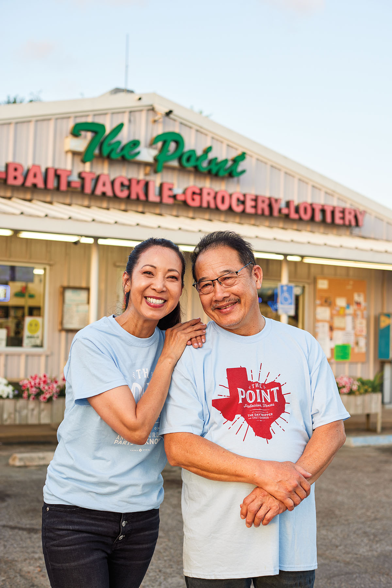
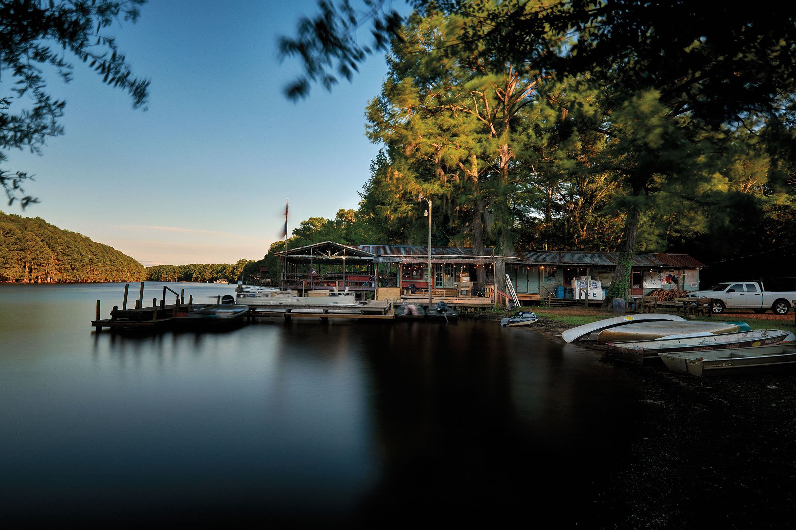

export const Title = () => (
  
    Mom and Pop  Until You Drop
  
);

<Row>

<Column colSm={12} colMd={4} colLg={8}>

<Caption>Yen and Bryan Tran operate The Point in the coastal town of Palacios. Photo by Nathan Lindstrom.</Caption>

<PageDescription>

Find all the goods you need at these independently owned, family-run businesses

</PageDescription>

Small town shops are in the business of making travel convenient. Check out the following sample of mom and pops, and for the complete list of 15 visit: [texashighways.com/momandpop](https://texashighways.com/momandpop).

### Johnson’s Ranch Marina

This time-forgotten swamp shack on the shores of Caddo Lake has stayed in operation for more than a century by providing a little bit of everything to the East Texas fishing village of Uncertain. Customers can charter a fishing excursion or a bayou tour, grab a snack and a six-pack, gas up a boat, buy some bait, cast a fishing line, paddle a canoe or kayak, rent a cabin with a screened porch, or simply catch the local gossip while idling on the wooden benches outside the front door.

Established in 1908, Johnson’s Ranch is the oldest inland marina in Texas—and it looks the part. Spanish moss dangles from the rafters below a rusted metal roof, as the ripples from passing boats lap the pylons that keep the whole enterprise from sinking into the water. Come Fourth of July, there’s no better spot to watch Uncertain’s annual boat parade and fireworks show than from a front-row seat on the covered wooden deck among the bald cypress knees.

But change is inevitable. After a lifetime on Caddo Lake, the store’s friendly proprietor, Billy Carter, died in the spring of 2021. His son, Will Carter, a mud boat aficionado, took charge and brought the marina into the 21st century. He replaced the rotting wooden planks on the docks, cleared the brush overtaking the property, and is leveling the floors. “The old ranch was trying to fall down on us, so every profit we made last year, we put back into this place,” Carter says. “It’s been cleaning up good.” _—Wes Ferguson_

_5131 E. Cypress Drive, Uncertain. 
903-789-3213; [jrmarina.com](http://jrmarina.com). Open: Daily. Essentials: Alcohol, Bait, Food, 
Lottery, Souvenirs._

### Owl Drug
Arriving at this corner store on downtown Coleman’s main drag, one hardly knows where to turn first. The vast collection of Elvis memorabilia functioning as décor commands attention, as does the extensive selection of products, including essential oils, kitchen gear, and gifts. But the drool-worthy aromas wafting from near the soda fountain prove impossible to resist—treats first, then shopping.

Behind the soda fountain counter, a well-seasoned griddle stays busy through breakfast and lunch. The century-old store’s big seller these days is the 1923 Burger, a ground beef patty hand-formed, cooked to order, and topped with smoked bacon, grilled mushrooms, melted havarti cheese, crispy fried onions, and fig jam. Offered until 4:32 p.m. each day (for customers late to the 4:30 p.m. cutoff), the burger is best washed down with an ice cream soda made from scratch.

“We let kids come behind the soda fountain and learn to make drinks the old-fashioned way,” says Cathy Allen, whose family bought the store from its original owner in 1976. “They’re amazed when we tell them Coca-Cola and Dr Pepper were both invented by pharmacists.”

Keeping the drugstore in the family is important to Allen—her parents, Jim and Linda Caldwell, remain involved in the business despite their retirement almost 20 years ago. Jim and Linda are both pharmacists, as were their parents. Allen says customers appreciate the healthy-living items, as well as the gift section. Along with baby gifts and scented candles made in Texas, the store sells kitchenware, clothing, and accessories. But some people just want to gawk at all the Elvis items.

“My dad has always been a huge Elvis fan,” Allen says of the man who would dress up as the late crooner while she was growing up. “We have a life-size Elvis that’s so bad, it’s good. Lots of Instagram photos have been taken with that.” 
_—June Naylor_

_312 S. Commercial St., Coleman. 
325-625-2178; [owldrugrx.com](http://owldrugrx.com). Open: Mon-Sat. Essentials: Food, Pharmacy, Souvenirs, Treats._

</Column>

<Column colSm={6} colMd={4} colLg={4}>

<AdGroup id={['ad36']}/>

</Column>

</Row>

<Caption>Johnson’s Ranch Marina serves the East Texas village of Uncertain. Photo by Dave Shafer</Caption>

<AdGroup id={['ad15', 'ad27', 'ad31', 'ad34', 'ad21', 'ad29']}/>

<Row>

<Column colSm={12} colMd={4} colLg={8}>

### The Point

When in Palacios, get to The Point. The hyphenated words of the red neon sign atop the storefront’s plain aluminum exterior sum up The Point’s identity: Beer-Ice-Bait-Tackle-Grocery-Lottery. What else could the many anglers who populate this bayside town need? Just yards from Tres Palacios Bay, The Point embodies much of the spirit of this little town, population 4,500, known for shrimping and birding. It’s got beer, ice to keep it cold, fishing supplies, and lottery tickets—because, as with fishing, we can always dream of the big one.

A good bit of The Point’s spirit stems from the hard work and positive attitudes of owners Bryan and Yen Tran. After long careers at the nearby Alcoa aluminum plant and in the local education system, respectively, the couple resuscitated the corner store a few years after its former owner, Yen’s brother, died of cancer. A fishing enthusiast, Bryan amped up The Point’s lure and tackle inventory while Yen started cooking her favorite dishes from Vietnam
—pho, banh mi sandwiches, and crispy shrimp wraps. They also brought in a local Mexican American chef to make breakfast tacos and a few Mexican dishes. Their mashup menu melded the cuisine of two cultures, reflecting the core value of the store overall—everyone is welcome here.

“The Point is a gathering place,” Yen says. “I remember there was a man in town who had a mental illness, so everybody was wary of him. But when he came here and would sit down at our tables, other people would come in and sit next to him, and they stopped being afraid. God’s table should be like that—everybody sitting down together.”

Since opening in 2015, Bryan and Yen have worked in The Point’s kitchen cooking their beloved Vietnamese dishes—they’re so good that Anthony Bourdain once sat at the store’s picnic tables to sample every item on the menu. But due to health and staffing setbacks during the pandemic, the Trans paused their kitchen service. Then this past May, they brought on a new chef, Marvin Lee, who cooks up hearty fare including chicken-fried steak, tacos, pancakes, and omelets. Palacios regulars are happy to once again gather over food at The Point, with the hope that pho and banh mi will be back on the menu soon. _—Clayton Maxwell_

_608 First St., Palacios. 361-972-2106; [pointatpalacios.com](http://pointatpalacios.com). Open: Mon-Sat. Essentials: Alcohol, Bait, Food, Lottery, Souvenirs._

### The French Co. Grocer

This indoor-outdoor spot in Marathon may stock organic produce and homemade hummus and sling espresso from a shiny machine, but don’t call it fancy. “We are not this super bougie store that got dropped in an affluent Texas neighborhood,” says Samuel Stavinoha, the store’s owner and a former Rio Grande river guide. “I have months when 13% of my sales are food stamps.”

Stavinoha, who still works his day job as a computer engineer, just believes in access to good produce, something that is hard to come by in remote desert towns. Luckily, the French Grocer is on the delivery route for a Colorado-based organic produce company. “What makes you a real grocery is your ability to hold consistency on produce,” he says. “I didn’t read that anywhere. That’s just a standard I want to hold myself to.”

No newcomer to Marathon, the little store was established by William French as W.M. French General Merchandise, in 1900, and has had various owners and iterations over its long life. In 2019, Stavinoha bought it from Marci Roberts, partner of noted Marathon photographer James H. Evans. Stavinoha’s since transformed it into one of the most popular hangouts in West Texas. Since 2020, he has hosted an annual October birthday tribute for his favorite musician, John Prine, who died of complications from COVID-19 the previous April. Stavinoha and a couple of employees cleared the rubble in the store’s backyard, added some picnic tables, and made a gathering space. They figured a few friends might show up to play some Prine tunes together, but 120 people stopped in. Soon came Friday Burger Nights, where Stavinoha and his chef, Franc Harriss, serve burgers in the backyard with homemade potato chips they cook up in an outdoor fryer. Sometimes guests come to play music and sing karaoke. They’ve sold out of burgers roughly half of the Friday nights this year; 80 burgers served in a town of about 350 people equals high per capita burger eating.

Also known for its ready-to-eat foods like the roast beef sandwich, the French Grocer has expanded into catering, with Stavinoha even hauling his espresso machine out to weddings on a ranch in Hunt and an ecolodge in Taos, New Mexico.

Fueling all Stavinoha’s efforts are the conversations and music making the French Grocer stirs up. “If you are really honest, and I am from time to time, you realize that community is the whole reason to do this,” he says. “If not, it would be like a zombie—it might have arms and legs, but it wouldn’t have a soul.” 
_—Clayton Maxwell_

_206 Ave. D, Marathon. 432-386-4522; [frenchcogrocer.com](http://frenchcogrocer.com). Open: Daily. 
Essentials: Alcohol, Camping Supplies, Food, Souvenirs, Treats._

</Column>

</Row>