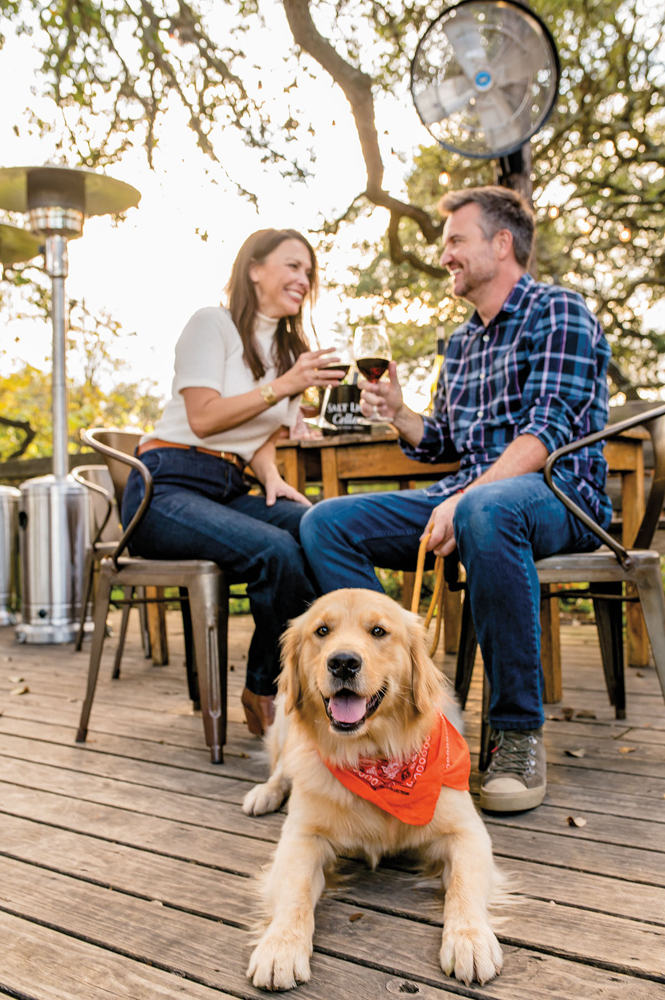

export const Title = () => (
  
   Texas Pet-ventures
  
);

<Row>

<Column colSm={12} colMd={4} colLg={8}>

<Caption>The Salt Lick BBQ. Photo by Tiffany Hofeldt.</Caption>

<PageDescription>

More destinations and diversions are opening their doors to pets. Now animals can ride shotgun on your next trip

</PageDescription>

**By Melissa Gaskill, Ruvani de Silva, Anna Daugherty, and Luz Moreno**

More than 6 million Texas households have a furry (or scaly, or feathered, or gilled) friend to call their own. Many owners wonder how to care for their pet while traveling. Boarding can cost a small fortune, and they may be wary of leaving their animal with a stranger. Whether by car, camper van, or plane, people are increasingly opting to take their pets on the road. This guide—though not comprehensive—features curated recommendations for pet owners seeking fun getaways across the state. From far West Texas to the Piney Woods, each region offers travelers a tailored stay, no matter their species.

## Central Texas

#### STAY

Bunk with your pet in a cabin at the Lower Colorado River Authority’s Black Rock Park on Lake Buchanan, where pets can swim, go out on a kayak or canoe, or snooze at a campsite. Campsites start at $25, while cabins start at $75. [lcra.org/parks](https://lcra.org/parks)

#### PLAY

The historic Central Texas dance hall in Luckenbach is a great spot to catch country music legends with your pup in tow, as long as you keep it on a leash. 
[luckenbachtexas.com](https://luckenbachtexas.com)

#### HIKE

Hike through a variety of landscapes, then pitch a tent and stargaze at remote parks like Hill Country State Natural Area, rated 4 out of 9 on the Bortles dark sky scale. 
[tpwd.texas.gov](https://tpwd.texas.gov)

#### EAT

A fenced-in dog park on the side of Dog and Pony Grill in Boerne allows pups to stretch their legs while their owners enjoy a drink, food, and live music. Leashed dogs can also sit on the restaurant’s covered patio. 
[dogandponygrill.com](https://dogandponygrill.com)

#### SIP

In Fredericksburg, many tasting rooms, including mainstay Becker Vineyards, welcome dogs outside and provide water bowls. [beckervineyards.com](https://beckervineyards.com)

## West Texas

#### PLAY 

Five miles outside Marathon, pets can enjoy a dip in Post Park’s spring-fed pond, which is stocked with fish. Be vigilant for wildlife. [marathontexas.com](https://marathontexas.com)

#### HIKE 

Fort Davis National Historic Site’s spacious grounds invite visitors to hike, picnic, and witness historic reenactments. Pets are not allowed in buildings. 
[nps.gov/foda](https://nps.gov/foda)

#### STAY
El Cosmico in Marfa offers tent campsites with access to a bathhouse, an outdoor kitchen, and a dining area. $20/person/night, additional $10 pet fee/night.
[elcosmico.com](https://elcosmico.com)

#### EAT 
Leashed pets are welcome at the Planet Marfa outdoor bar, open every day, year-round. The site features a large rooftop deck and full-size teepee. [planetmarfa.com](https://planetmarfa.com)
 
#### SIP 
Sample from a complimentary wine tasting fresh from the source at Zin Valle Vineyards, just 15 miles outside El Paso. Leashed dogs are welcome on the grounds, and they even have a namesake Man’s Best Friend merlot. [zinvalle.com](https://zinvalle.com)

</Column>

<Column colSm={6} colMd={4} colLg={4}>

<AdGroup id={['ad36']}/>

</Column>

</Row>

<AdGroup id={['ad15', 'ad27', 'ad31', 'ad34', 'ad21']}/>

<Row>
<Column colSm={12} colMd={4} colLg={8}>

## Panhandle

#### PLAY 

Leashed dogs can roam the 4 acres of Amarillo’s Botanical Gardens while their owners learn about native Texan and exotic plants in a beautiful landscape. [amarillobotanicalgardens.org](https://amarillobotanicalgardens.org)

#### HIKE 

The 64 miles of Caprock Canyons Trailway lure hikers, bikers, and horseback riders, and pets can hike or ride along in a bike trailer. Multiple access points allow for shorter outings. Camp anywhere along the trailway inside park boundaries. [tpwd.texas.gov](https://tpwd.texas.gov/state-parks/caprock-canyons)

#### STAY 
Lubbock’s Woodrow House Bed & Breakfast is a stylish boutique hotel with individually themed rooms. Rooms start at $130/night. Pet accommodations must be requested in advance and cost $30 per pet per day. [woodrowhouse.com](https://woodrowhouse.com)

#### EAT 

At Amarillo’s Old West-themed Big Texan Steak Ranch, you can attempt to eat a 72-ounce steak with your well-behaved dog or cat on hand, as long as you sit in the outside beer garden. [bigtexan.com](https://bigtexan.com)

#### SIP

With beers that reference life in West Texas (like the Five Hour Drive ale), Tall City Brewing in Midland pours more than 16 brews in its taproom. Dogs are welcome on the large, covered patio. Food trucks rotate throughout the week, ranging from wings to pizza to hot dogs. 
[tallcitybrewing.com](https://tallcitybrewing.com)

</Column>

</Row>

<Caption>Monahans Sandhills State Park. Photo by Kenny Braun</Caption>

<Row>
<Column colSm={12} colMd={4} colLg={8}>

## North Texas

#### PLAY 

At Cooper Lake State Park, pets ride along on kayaks, relax on fishing piers, and swim in the lake outside designated swim areas (on leashes). Pets are welcome at scheduled events such as geocaching, and the park has dog-friendly guided hikes that occasionally include animals from the local shelter. [tpwd.texas.gov](https://tpwd.texas.gov/state-parks/cooper-lake)

#### HIKE 

The hike-and-bike trail at Cedar Hill State Park southwest of Dallas has three options for a hike with your pet—3, 8, and 12 miles in length—winding through woods, up hills, and along the shore of Joe Pool Lake, which has lighted fishing jetties. [tpwd.texas.gov](https://tpwd.texas.gov/state-parks/cedar-hill)

#### STAY 

A boutique hotel in downtown Fort Worth, The Harper offers standard rooms from $179/night. There’s no extra charge or weight limit for pets, and pet amenities include plush beds, food and water bowls, a concierge list of nearby pet-friendly restaurants and parks, and a designated director of pet relations. 
[theharperfortworth.com](https://theharperfortworth.com)

#### SIP 

Celestial Beerworks in Dallas welcomes pets of all kinds, both indoors and out, at its bright taproom. The brewery provides dogs with treats made from leftover grains. [celestialbeerworks.com](https://celestialbeerworks.com)

#### EAT 

The Shacks Dining and Dog Park in The Colony, a Dallas suburb, is a dog-friendly venue with a choice of six restaurants around a 1-acre off-leash dog park. [shacksaustinranch.com](https://shacksaustinranch.com)

## East Texas

#### PLAY

Explore the Village Creek Paddling Trail, made up of 21 miles within the Big Thicket National Preserve, past sandy beaches and beneath towering pines. Multiple access points allow for shorter jaunts. [tpwd.texas.gov](https://tpwd.texas.gov/fishboat/boat/paddlingtrails/inland/village_creek/)

#### HIKE 

At Huntsville State Park, leashed pets are welcome on 20 miles of trails. Canoe and kayak rentals and a fishing pier are available for use, although pets are not allowed in the lake. Check online for occasional hike-with-your-pet and local shelter animal events. [tpwd.texas.gov](https://tpwd.texas.gov/state-parks/huntsville)

#### STAY

Davy Crockett National Forest Ratcliff Lake Recreation Area campground has picnic tables, water, and restrooms with showers. The 20-mile Four C National Recreation Trail starts at the campground. Electric sites are $20/day, and nonelectric sites are $15/day. [fs.usda.gov](https://www.fs.usda.gov/recarea/texas/recarea/?recid=30224)

#### EAT 

Situated in downtown Texarkana, Hopkins Ice House welcomes locals and visitors as well as their animal companions. Dogs are welcome to join their owners on the patio. [hopkinsicehouse.com](https://hopkinsicehouse.com)

#### SIP

The first craft brewery in Tyler, True Vine Brewing serves 16 craft beers on tap, as well as a selection of wines and nonalcoholic drinks. Both locations of the brewery are kid- and pet-friendly. Refuel with a pizza from guest restaurant Sola Bread Company and stay for the live music. [truevinebrewing.com](https://truevinebrewing.com)

## South Texas & Gulf Coast

#### PLAY

The South Padre Island Sealife Nature Center welcomes dogs, cats, potbellied pigs, parrots, and even gerbils on its six-person boat for dolphin tours in the Laguna Madre. [spinaturecenter.com](https://spinaturecenter.com)

#### HIKE 

Leashed pets are allowed on hiking and paddling trails, in fishing areas, and on beaches in Galveston Island State Park, but not inside park buildings. [tpwd.texas.gov](https://tpwd.texas.gov/state-parks/galveston-island)

#### STAY

Padre Island National Seashore welcomes leashed pets in all camping areas and on its 60 miles of beach, but not in park buildings. Rinse-off showers are available near Malaquite Pavilion. [nps.gov/pais](https://nps.gov/pais)

#### EAT

A stroll through Houston’s Montrose neighborhood takes you past pup-filled patios where visitors can enjoy a casual brunch or cocktails in the company of their four-legged companions at venues like the Empire Café. [­empirecafe.com](http://empirecafe.com)

#### SIP 

Paying homage to owner Nathan Bitz’s 26 years as a Navy pilot, Aerodrome Distilling in Corpus Christi features an aviation-themed tasting room that offers water bowls for furry guests.
[aerodistilling.com](https://aerodistilling.com)

</Column>
</Row>