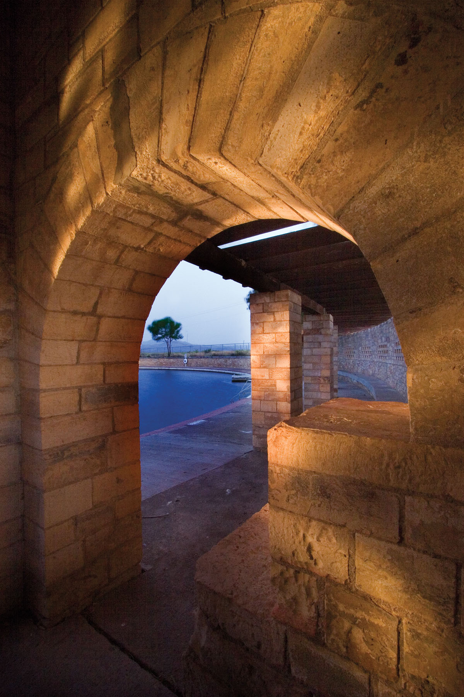
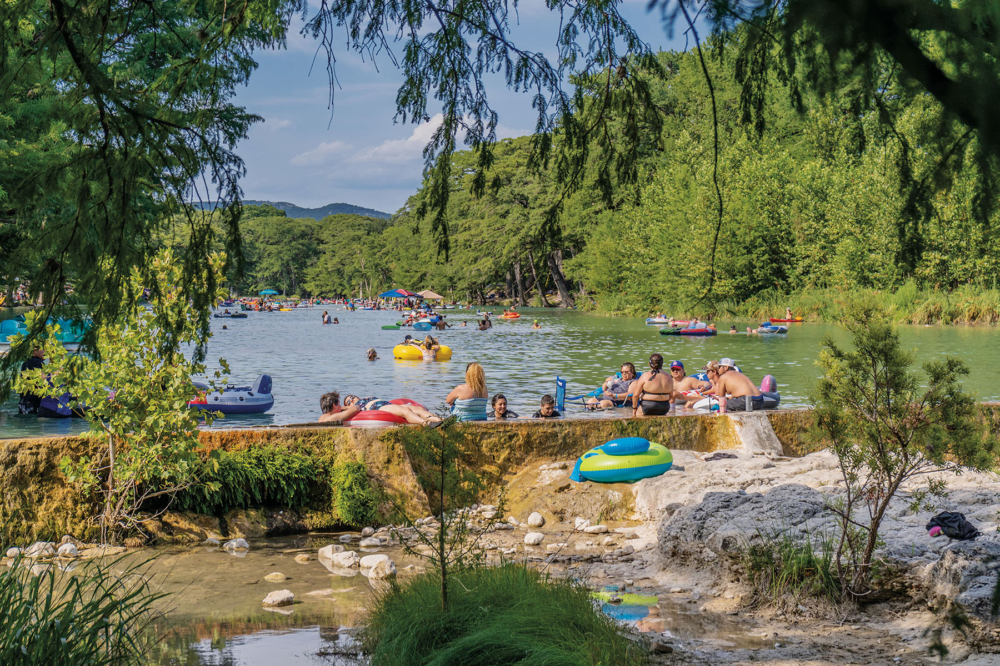
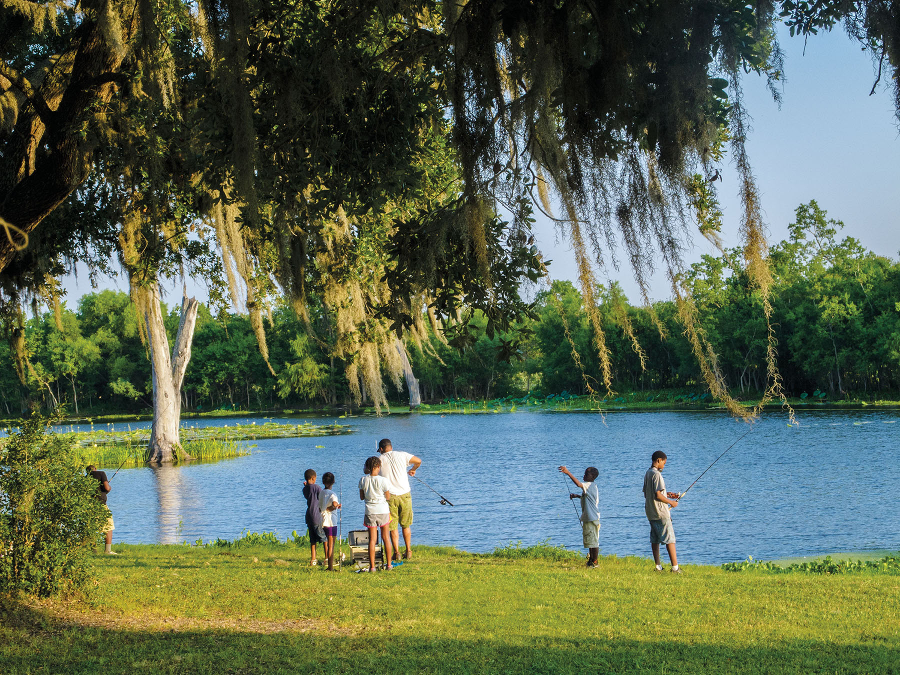

export const Title = () => (
  
    100 Years of Texas State Parks
  
);

<PageDescription>

The crown jewels of Texas road trips started as an unfunded wish list before the Great Depression

</PageDescription>

**By Louie Bond**

<Row>
<Column colSm={6} colMd={4} colLg={8}>

<Caption>Balmorhea State Park was built in the 1930s by the Civilian Conservation Corps. Photo by J. Griffis Smith.</Caption>

It’s only natural to think of a Texas state park as your next getaway. After all, state parks are naturally lovely, naturally inexpensive, and naturally enjoyable for all ages and abilities.

Ever since Texans started traveling by car, they’ve been visiting state parks to explore nature and unplug from the daily grind. And whether you’re a newbie or an outdoors-lover who’s visited parks across the state, 2023 is an opportune time to make your way to one of Texas’ 89 state parks and historic sites.

This year marks the 100th birthday of the State Parks Board, which was charged with developing a plan to secure donated land to set aside as parks. To honor the centennial, the Texas Parks and Wildlife Department is holding a series of public events, including the grand opening of the first new state park in more than 20 years—Palo Pinto Mountains State Park in Palo Pinto and Stephens counties—and a slew of special community events at state parks and historic sites.

“The variety of Texas’ landscapes is unmatched. From the mountains of West Texas to the Gulf shores, the state parks system celebrates and preserves the natural and cultural treasures that make Texas such a special place,” says Rodney Franklin, state parks director. “You might say that the 630,000-plus acres that make up the state parks system are nearly as diverse as the people of Texas.” 

### Female Trailblazers

A century ago, the federal government, especially during the Teddy Roosevelt administration, ramped up its national parks program to preserve America’s natural jewels. Yellowstone and Yosemite were the first two national parks established, followed by other now-familiar wild sanctuaries and historic sites. They were (and still are) the road-trip destinations of a lifetime.

No Texas sites were on the early list of national parks as Texas had kept the rights to all public land when it became a state. But Texans had already been working for many years to preserve historical landmarks. The Daughters of the Republic of Texas led the effort to save historic battlegrounds such as San Jacinto, Gonzales, Fannin, and the Alamo, as well as the place where the Texas Declaration of Independence was signed, Washington-on-the-Brazos.

In 1923, Gov. Pat Neff convinced the Texas Legislature to create a six-member State Parks Board, citing the need for overnight camping spots for the rising number of car travelers. Noting the groundwork laid by women’s groups, Neff appointed three women to the first board—Phebe Kerrick Warner of Claude, Mrs. W.C. Martin of Dallas, and Katie Owens Welder of Victoria.

Inspired by the governor’s mother, Isabella Neff, the Neff family led the way by donating acreage on the Leon River near Moody for what would become Mother Neff State Park in 1937. Mother Neff is sometimes called the first state park despite the earlier establishment of several historical parks. Another 23 sites were donated in that first decade but languished from a lack of funding to develop the necessary roads and lodging for visitors. 

### CCC to the Golden Age

A much-needed boost for Texas state parks came from another Roosevelt in the 1930s. Under President Franklin Roosevelt, the federal government formed the Civilian Conservation Corps in 1933 to help the country’s unemployed rise from the Great Depression. The program organized young men into companies and dispersed them to parks across the country. The CCC built pavilions, bridges, trails, dams, refectories, lodges, cabins, and picnic areas in a natural style utilizing local wood and stone. The result was aesthetically pleasing and structurally sound facilities, and the men emerged from the CCC era in 1942 as skilled craftsmen. 

<Caption>Garner State Park. Photo by Will van Overbeek</Caption>

Much of the CCC work in Texas can be enjoyed today at parks like Palmetto, Bastrop, and Davis Mountains, among others. One of the most iconic CCC structures is Garner State Park’s pavilion, where nightly dances are held in the summer.

Following World War II, a severe drought in the 1950s, and various damaging hurricanes, state parks struggled in the early 1960s. In 1963, Gov. John Connally merged the State Parks Board with the Game & Fish Commission for a new Texas Parks and Wildlife Department. The new arrangement created tax revenue for the parks while bond issues generated funds to build and improve state parks. 

Pedernales Falls, Mustang Island, Galveston Island, McKinney Falls, and Lost Maples are some of the state parks that opened in the 1970s, a time some call the “Golden Age” of Texas state parks because of the number of new parks that were established. By decade’s end, 130 state parks beckoned Texans to come and “forget the anxiety and strife and vexation of life’s daily grind,” as Gov. Neff once said of their purpose.

The parks’ popularity grew in the ensuing decades as increasing numbers of well-equipped adventurers headed to parks as destinations, not just stopovers on the way to somewhere else. In 1993, a state sporting goods sales tax ensured funding for parks that were in danger of being “loved to death.” Those funds were later statutorily dedicated, providing money for improvements at state parks across the state. 

Over the span of those ensuing years much has changed in Texas, but not the “we’ll do it our way” independent spirit of those early pioneers who set in motion a system that has grown and developed to become one of the most extensive in the United States. 

Over the past few years, Texas state parks have become more relevant than ever as the stress and isolation of the pandemic have increased state park visitations, Franklin noted. According to the Parks and Wildlife Department, attendance at state parks increased about 17% from 2019—before the COVID-19 pandemic—to an average of more than 814,000 visits per month in late 2021 and early 2022.

“The challenges of the last few years have led many people to explore the outdoors in new and adventurous ways,” he says. “Nature heals, and it connects people. That’s what state parks are all about, connecting people to nature and connecting people to one another.”

</Column>

<Column colSm={6} colMd={4} colLg={4}>

<AdGroup id={['ad36']}/>

</Column>

</Row>

<Row>
<Column colSm={6} colMd={4} colLg={8}>

<Caption>Brazos Bend State Park. Photo by Kevin Stillman</Caption>

## Plan Your Perfect State Park Outing

The first step of any successful state park trip is selecting a destination that suits your tastes. [The Texas State Parks website](https://texasstateparks.org) is home to numerous resources, including a “State Parks for Beginners” page and a Texas State Parks Guide for inspiration and information. There’s a Spanish version, too.

**Start with these questions:**
1.  Do you want to find a place close to home or venture to a new region?
2.  Do you crave a site close to the water?
3.  Are you seeking isolation or don’t mind neighbors nearby?
4.  What are your accessibility requirements?
5.  Do you plan to stay overnight? Cabin, tent, or Recreational Vehicle?
6.  What activities sound like fun?

Now take your answers to the “Find a Park” page on [texasstateparks.org](https://texasstateparks.org) or the official [Texas State Park app](https://tpwd.texas.gov/state-parks/app/) and use the filters to find parks that match your interests. You’ll learn a lot more about these choices on the parks’ individual web pages and social media accounts. Check out videos on the Texas State Parks and Historic Sites YouTube page to tour parks and pick up some tips.

Some outgoing Texans like the convivial atmosphere of a popular park in the summer. Kids from neighboring campsites gather for outdoor fun while the adults make new friends of their own. Other visitors seek a different experience, with the silence of isolation allowing them to view wildlife and relax with their own thoughts.

The first step is to create realistic expectations. You can be sure that many Texans are planning to head to the most popular destinations at certain times: spring break, summer vacation, and most weekends when the weather’s nice. 

Which state parks are most popular with visitors and, therefore, usually crowded? The latest numbers, which have dramatically increased in the past few years, show that more than a half-million visitors have come to Garner State Park in the past year. Right behind is the far more remote—but worth the drive—Palo Duro Canyon. Close to the Dallas-Fort Worth area, Lake Ray Roberts’ three units combined pulled in even larger numbers. Enchanted Rock, Cedar Hill, Brazos Bend, and McKinney Falls all draw more than 300,000 visitors a year.

If you’re looking to avoid crowds, you might want to drive to a remote park or visit on a weekday. For example, Enchanted Rock on a Wednesday in December may provide you with an experience you don’t have to share with many others. You’ll find fewer visitors during the off season, and the weather can be lovely on a winter day. Hidden gem parks also abound.

Even if you just want to pop into a state park for a picnic, it’s wise to make a reservation at texasstateparks.org/reservations. If you don’t, you may find yourself at the gate (or in a long line) unable to get inside. Always remember to cancel your reservation if you can’t make it so someone else can have a chance at your spot. 

Consider purchasing a State Parks Pass or one of several special passes for qualified youth groups, seniors, and the medically disabled.

Did you know that some challenge-loving Texans set a goal of visiting every state park? While neither the first nor the last, [Dale Blasingame brought along his dog Lucy to accomplish it himself](https://texashighways.com/travel-news/atta-girl-lucy-the-bark-ranger-completes-quest-to-visit-all-95-texas-state-parks/) in just over a year in 2015, and they’ve inspired others to do the same. “It’s changed everything in my life, and I don’t just throw those kinds of phrases around,” says Blasingame, an assistant professor at Texas State University.

Sometimes first-timers worry about what happens once you get to the park. Fortunately, state parks offer all kinds of assistance. Find event calendars on the parks’ websites.

“Our park rangers are excited to welcome you and answer your questions,” says Ky Harkey, who leads state park interpretation. “They also lead family-friendly programs where you can learn about the park or practice outdoor skills.”

There are plenty of ways to pass the time in state parks: strolling down paths, spotting cool plants and animals, learning to fish or paddle, building a campfire, gazing at stars, swimming, taking photos and videos, playing games, and riding bikes.

Bring food that’s easy to prepare (it tastes better outdoors!) and a relaxed attitude. Nature will take care of the rest.

</Column>
</Row>