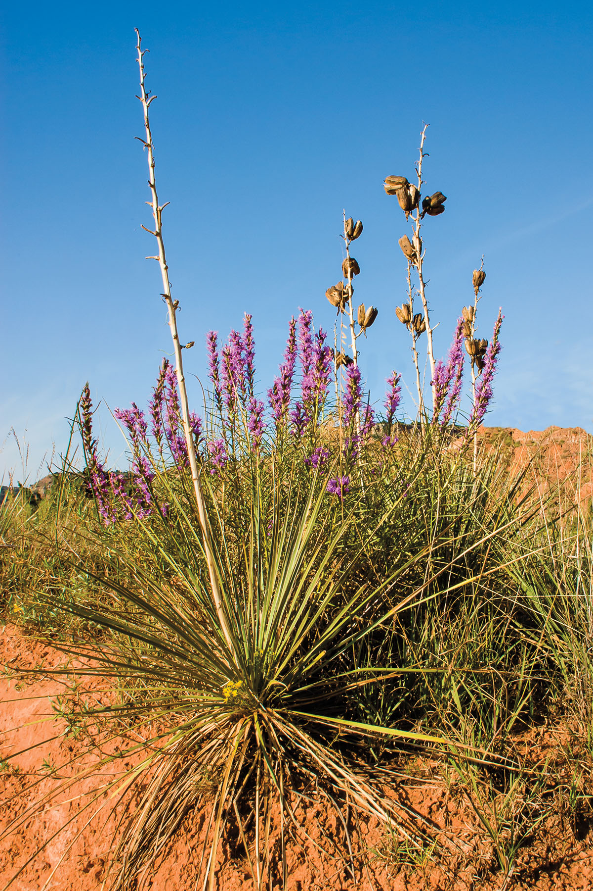
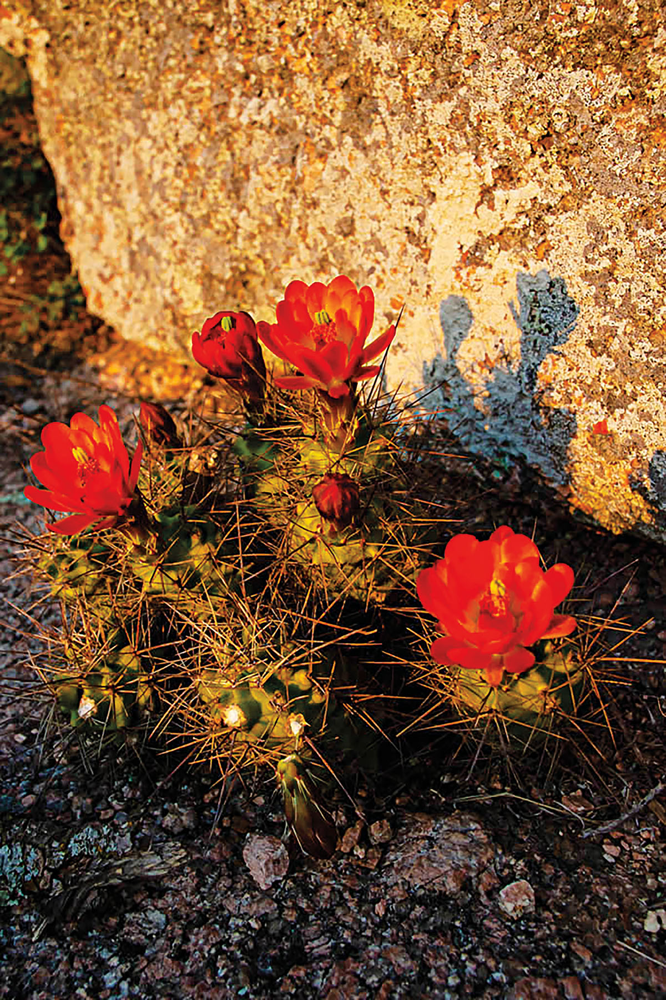
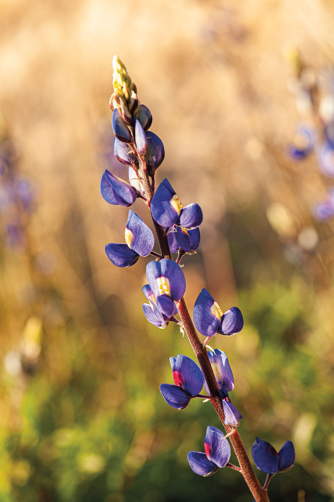
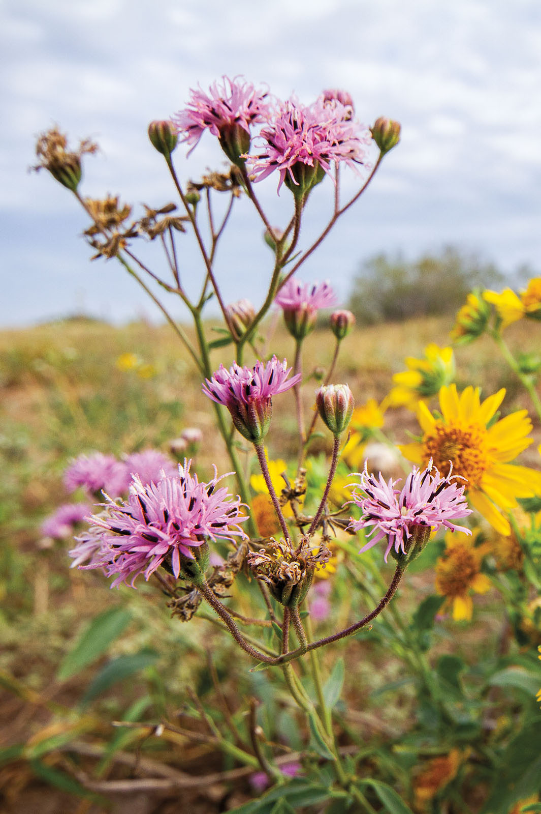

export const Title = () => (
  
    Wildflower Fields Forever
  
);

<Row>

<Column colSm={12} colMd={4} colLg={8}>

<Caption>Gayfeather. Photo by Larry Ditto.</Caption>

<PageDescription>

Texas’ varied landscapes and climate yield blooms all year long

</PageDescription>

**By Joe Nick Patoski**

March may be the issue _Texas Highways_ magazine annually celebrates wildflowers, but one month is hardly enough to revel in these opulent blooms. Luckily, wildflowers can be found nearly year-round across the state, provided you know where and when to look. Blooms are already popping in early January in the Rio Grande Valley and the Big Bend, while up in the Panhandle, wildflowers put on their show of colors from April to late fall. In the southern half of the state, wildflowers can bloom year-round.

In the Chihuahuan Desert, wildflowers aren’t so much seasonal as opportunistic, waiting for rain to sprout. Mexican tulip poppies typically peak in February, and their only U.S. population blossoms in Mesa de Anguila and the valley between the mesa and the Rio Grande in Big Bend National Park.

In Texas, wildflower season is far more than just a spring affair. The early arrivers, late bloomers, and unsung species may not get the love their better-known cousins do, but each is just as memorable.

## Winter
Winter is hardly winter along Texas’ southern reaches and on the coast. Tropical sage, Anacahuita, Turk’s-cap lily, primrose, prickly pear, Spanish dagger, and sweet-scented huisache begin blooming in January and February. 

John Brush, an urban ecologist at the Quinta Mazatlan World Birding Center in McAllen, cites a project he started in 2019 using iNaturalist, a crowdsourced species-identification app. “It is continually being updated with more data points as the community adds more observations,” Brush says. “The data is sorted by month, showing what species have been documented, and is ordered by most observations to the fewest observations.” The project confirms significant wildflower blooms in the Rio Grande Valley every single month of the year.

In Central Texas, four-nerve daisies—perhaps the only year-round blooms in the region—are both the earliest- and latest-flowering species, says Joe Marcus, a program coordinator at the Lady Bird Johnson Wildflower Center, part of the University of Texas at Austin.

Out west, the typically larger Big Bend bluebonnets pop up in early January, and following wet summers, the spindly ocotillo sprouts its flaming red tips by mid-February.

“My favorite early bloom is the Mexican tulip poppy,” says Michael Eason, author of _Wildflowers of Texas_. “It’s found in a remote corner of Big Bend National Park and is the only naturally occurring population in the U.S. It’s very reminiscent of the Mexican poppy. There will be these big blooms in February, especially close to the river, with tens of thousands of flowers. That canyon turns golden. You can see it on Google Earth.”

## Spring

In mid-April, bluebonnets, firewheels, Indian paintbrush, and spider lilies peak in the central and eastern parts of the state. Iris, violet, orchid, coralbean, endangered Texas trailing phlox, and carnivorous pitcher plant flower in the densely forested wetlands of the Big Thicket. Up in the Panhandle, wildflower season is just beginning and remains in full force well into June.

Kris Erickson has been documenting wildflowers in photographs for about 30 years on the ranch she shares with her husband, John Erickson. “God’s wonders never cease to bring joy and awe to the ones who see,” says Kris, who authored _Panhandle Beauty_. Her favorites: “The rich fuchsia colors of the wine cups and cholla cactus, the delicate white bell-shaped blossoms on the yucca stalks, the sparkling friendliness of the Indian blankets.”

Other Panhandle-High Plains standouts include violet snapdragons, yuccas, royal-blue thistles, black-eyed Susans, sunflowers, beebalms (aka horsemint), prickly pears, and poisonous lockweeds, whose purple blooms are often the first show of color up north.

Of beebalm, Seth Hamby, former head gardener for the Chihuahuan Desert Nature Center in Fort Davis, says, “the Chihuahuan Desert has more bee species than anywhere else on Earth.” He cites cowpen daisy, Mexican poppy, chocolate flower, four-nerve daisy, and groundsel among the bee-attracting blooms in the low desert, arroyos, slopes, and 
sky islands.

April through May is prime time for the Guadalupe Mountains violet in McKittrick Canyon, a feature of Guadalupe Mountains National Park. Park staff members are cooperating with researchers who are studying the little-known violet, whose late spring-early summer blooms are only found within the national park.

Around the time spring wildflowers begin to dot the top of Texas, way down south in northwestern Hidalgo County, on Camille Rich’s El Mesteño Ranch and Arboretum, the Manfreda maculosa—a cactus-like succulent—shows off its cream-colored tubular flowers. The latter provides sustenance to a globally endangered butterfly named the Manfreda Giant-Skipper.

</Column>

<Column colSm={6} colMd={4} colLg={4}>

<AdGroup id={['ad36']}/>

</Column>

</Row>

<Row>

<Column colSm={12} colMd={6} colLg={4}>

<Caption>Claret cup cactus. Photo by Larry Ditto</Caption>

</Column>

<Column colSm={12} colMd={6} colLg={4}>

<Caption>Big Bend bluebonnet. Photo by Theresa DiMenno</Caption>

</Column>

<Column colSm={12} colMd={6} colLg={4}>

<Caption>Texas Palafox. Photo by Seth Patterson</Caption>

</Column>

</Row>

<AdGroup id={['ad15', 'ad27', 'ad31', 'ad34', 'ad21', 'ad29']}/>

<Row>

<Column colSm={12} colMd={4} colLg={8}>

## Summer

Found almost everywhere in Texas, yellow composites—commonly called DYCs—don’t start their big show until May. Many are still in bloom when summer solstice rolls around, provided sufficient rain has fallen.

Prickly pear, gayfeather, beebalm, and cardinal flower all bloom in the Texas summer heat. Mountain pinks provide a surprising contrast to the browning landscape along the rocky roadsides of Central and West Texas. The long-stemmed Brazos rain lily typically appears a couple days after precipitation throughout the summer and sometimes into October, then usually disappears in a couple days.

Summer at Guadalupe Mountains National Park means continual wildflower blooms—if spring and summer rains come, park biologist Mike Medrano says. “Some of the vegetation around GMNP is opportunistic. The season doesn’t matter. It’s going to bloom when there’s water,” he explains. “I’ve seen ocotillo in full bloom in December. There was stuff blooming last September, like species of asters, because of the summer monsoon rain, that I’d never seen before.”

Medrano notes McKittrick Canyon and the Bowl Trail are particularly good spots to view wildflowers. “But there are also a number of gypsum-loving plant species found on the gypsum dunes of the Salt Basin on the west side of the park that are not generally found elsewhere in Texas,” he says.
 
## Fall

Maxmilian sunflowers signal the end of summer and beginning of fall across much of Texas. Fall is also the season 
for Leavenworth’s eryngo—conically-
clustered tiny flowers with blue anthers that bloom from the Trans-Pecos region to North Central Texas. The purple-
hued plant is frequently showcased in gardens at the Wildflower Center.

Found statewide, various species of false foxglove start showing in midsummer and peak in autumn. Different varieties of autumnal marigolds are similar summer-fall bloomers in the eastern half of the state, while Siam weed and wild leadwort make year-end appearances in the Rio Grande Valley.

Four years ago, on a brisk November day within eyeshot of the San Jacinto Monument east of Houston, I observed 
a bluebonnet in full bloom. Last year, lantana turned on its psychedelic easel of tiny colorful flowers during an 
unseasonably warm December in the Hill Country, while out west the Big Bend bluebonnets were doing their thing early. Down south, phlox and Turk’s-cap were popping. Eyes wide open, I could clearly see that every month is wildflower month in Texas.

</Column>
</Row>